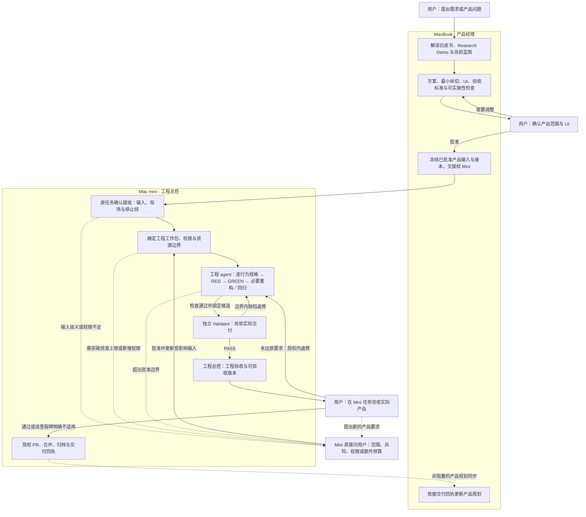
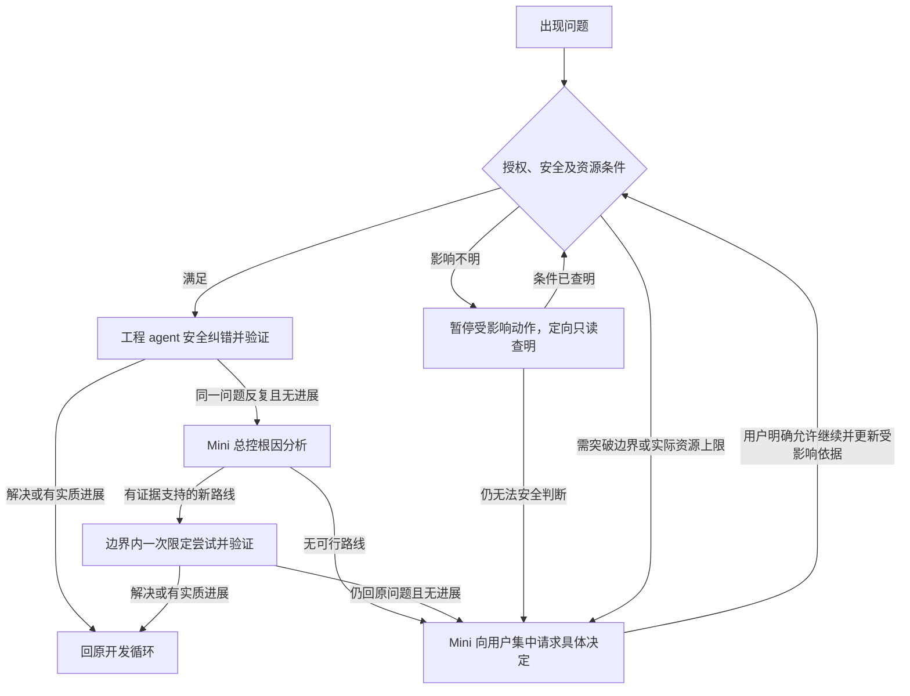

# JuanerAI 高效工程流程改造方案 v0.8

状态：**用户已批准 v0.8 并授权实施及本次 Git 交付与合并；规则／角色已本地落地，Mini 采用未确认**。日期：2026-09-26。发布身份以本次 PR 的实际合并提交及交付回执为准，不能从本文状态推定已发布。

本版在 v0.7 上补清逐行为 SDD＋TDD、Validator 的验收优先与阻塞标准、面向产品验收的进展止损，并统一开发主 agent／子 agent 为 GPT-6 Astra high。权威入口、相关规则、旧角色及模板按用户批准对齐。本文保留说明性方案和流程图，唯一执行政策仍是 product-change-execution-policy.md；本次 Git 授权只覆盖流程调整，不授予 Mini 当前产品的恢复、Git 交付、数据、Provider 或主机权限。

改造依据是 JuanerAI 自身的实际卡点。dev-flow 只作效率对照，不复制其 skill、hook 或状态机，不引入第二套管理框架。

## 1. 核心结构：授权一个结果，而不是授权下一步

**全链路：用户需求 → MacBook 产品准备 → 用户产品／UI 确认 → Mini 接收 → 工程 agent 连续开发 → 独立 Validator → 工程验收与约定的用户验收 → 授权交付。**

Spec、测试、实现和验证是要完成的工作，不是四个必须串行交接的代理阶段。取消强制 Spec → Test → Worker → Validator，取消普遍前置的 Spec Gate、TDD_READY 派发审批；因果 RED、真实验证和必要的事前风险检查仍保留。

| 角色 | 职责 |
|---|---|
| MacBook 产品经理 | 产品目标、蓝图、范围、UI、业务语义、验收标准和禁止事项；维护产品规划 |
| Mac mini 工程总控 | 将批准输入交成一个可验收工作包，明确权限和预算；处置重大问题、维护唯一工程状态、组织授权交付；不逐步审批普通技术动作 |
| 工程 agent | 在授权边界内完成技术设计、必要规格记录、测试、代码、调试和集成；对完整工程结果负责 |
| 独立 Validator | 使用独立只读上下文核验固定交付候选；检查产品行为、代码、测试有效性和证据，不参与该候选编写 |
| 用户 | 产品与重大边界决定、额外预算、权限、残余风险及约定的产品验收 |

本地角色已扩展 juaner_worker 承担工程 agent 职责，保留 juaner_validator。Spec／Test 不再默认派发；只有具体问题需要专项协助时才按限定任务使用，不自动携带旧流程的整套 Gate。参与产物编写的专项 agent 不担任该候选的最终 Validator。磁盘修改不代表已打开的 Mini 会话加载了新定义。

总控和工程 agent 的边界是“任务授权与重大决策 / 连续工程执行”，不是两人轮流审批同一份差异。模型或职责名称不赋予额外权限。

## 2. 工作包固定什么，工程侧可以自行调整什么

一个工作包覆盖一个可演示或可独立验证的结果，可以跨 Store、Application、Profile 和 UI；不按文件或单条命令切许可。复杂 Change 可拆包，但任务身份、总范围、失败历史和实际资源消耗不重置。

沿用现有任务说明，接入时明确四件事：

- 要交付的行为、已有产品／UI 批准、验收依据和非目标；
- 允许的模块／目录写集、禁止项、重要兼容承诺和安全边界；
- 可用工具链、限定验证入口与参数范围、证据位置及 Git 权限；
- 已有费用／资源上限、当前停止线和下一项允许动作；不为普通纠错另设次数额度。

模块内正常文件增改可以随实现确定；越出写集由总控在已有授权内判断，超出用户边界再询问用户。命令授权限定作用与范围，不等于任意 shell 或主机权限。

### 三类事项，三种处理

| 事项 | 处理方式 |
|---|---|
| 产品承诺与授权边界：业务含义、UI 行为、范围、架构原则、数据／Provider／费用／主机权限 | 已批准内容保持约束；歧义、扩展或改变由 Mini 直接请用户决定 |
| 重要工程契约：公开 API、持久数据含义、版本兼容、权限判断及不可逆副作用 | 改动前由总控明确影响和必要检查；越界则请用户决定；仅审受影响问题，不重启整个流程 |
| 内部设计与执行细节：私有接口、局部类型、测试夹具、普通诊断参数、运行编号和日志目录 | 边界内由工程 agent 连续调整，更新相关代码、测试和必要设计记录；不另申请 Spec 修订或角色额度 |

判断依据是语义及实际影响，不是文件名、技术词或是否跨文件。调用现有数据库接口不等于修改持久化契约，内部参数协调不自动变成架构决策。影响不明时先定向只读调查；不能用“内部调整”掩盖真实边界变化。

Spec 用来明确承诺和必要设计，不是每次修改的许可证。工程 agent 可以演进内部方案，但不能把产品规格或验收断言改成适合错误实现的版本。已有适用 UI Contract 直接复用；新增或实质改变可见行为仍取得相应用户批准，不为未变的内部调整重做原型。

## 3. MacBook → Mac mini 端到端流程

下图是用户批准的全链路，不表示当前 Change 已到达任何节点。已有有效产品批准、检查和证据直接承接，不为采用新流程而重走；普通技术问题留在 Mini 开发循环。



图中回路均受已批准资源边界和停止条件约束，不按普通纠错次数续批。工程 agent 的自测失败直接在授权内修正，无进展止损见第 5 节。Validator 未通过不能进入正常交付；用户明确接受风险时单独记录具体豁免及未验证项，不能记成 Validator PASS。图按“需要产品验收后再合并”的常见情形展示；PR 准备、产品验收、合并和发布的具体顺序沿用任务明确授权。Git 合并不等于已经部署或正式发布。

### MacBook：把产品讲清楚，交接后不接管工程

MacBook 依据当前批准蓝图理解用户目标，形成最小可交付范围、可点击 UI、业务语义、验收要求和禁止事项。Research Demo 只作已批准的行为／交互参考，不默认成为生产代码；白皮书或蓝图变更仍遵循既有版本采纳与用户批准边界。

新建或实质修订产品方案时，完成已有的独立只读可实施性检查：接收者是否必须猜测产品行为、缺少必要输入或无法验证结果。检查只补产品缺口，内部类型、文件路径、命令和环境留给 Mini；已有有效检查不重复。该产品准备检查不是重新引入 Spec／Test 工程流水线。用户确认范围和 UI 后才冻结本次产品输入；材料有实质变更时只重新确认受影响部分。

### 两端交接：同一份产品输入，不搬整段聊天

在现有产品方案／交接记录中给 Mini 以下内容，不另造一套交接文档体系：

- 任务／Change 身份，产品材料及 UI 的精确版本、位置和用户批准依据；
- 目标、范围、业务语义、正常与失败行为、验收标准、非目标和禁止事项；
- Demo 等参考材料的适用边界，以及从 Demo 转为生产实现仍需完成的内容；
- 已有数据、安全、预算、操作和 Git 授权，尚未作出的决定及既有停止线。

产品正式材料按已有 Git 授权发布，引用准确提交和路径；UI／外部证据也必须让 Mini 实际可读。用户手动转发一次接管说明即可，不要求自动消息系统。收到消息或 fetch 到分支不等于接收确认，更不移交原工程分支所有权。

Mini 在原任务只读核对产品输入、当前代码与证据、分支所有权及未提交现场，回读“接收了什么、哪些停止线保留、还有什么决定、下一步允许做什么”。然后由 Mini 确认可行性并决定工程设计、工作包、路径、环境和验证计划；预算或权限不足时直接向用户集中询问。MacBook 不预先替 Mini 固定这些工程细节，也不再审批接入后的普通技术调整。

### 产品变更与最终交付：用户直连 Mini

开发中发现产品歧义、额外范围或验收标准需要改变，Mini 在原任务直接请用户决定，记录决定并更新受影响产品／UI 依据；必要的用户 UI 确认和蓝图版本批准不能跳过。只有用户主动要求产品讨论协助时才请 MacBook 参与，不以“等待 MacBook 裁定”为默认返回路径。

Mini 完成工程验收后，向用户提供实际可运行／演示版本、验收入口、结果与未验证项。未达原要求的缺陷回工程 agent 修复并重新验证；用户新增要求先明确范围、预算和验收依据，不能偷换原有通过标准。

在所需验收与 Git 权限满足后，Mini 组织交付、集成、归档和回执。MacBook 据此更新产品规划，工程状态仍由 Mini 单写；产品规划同步不构成工程交付的额外签字。完成本次交付后停止，不自动开启下一 Change。

### Mini：连续开发

工程 agent 在同包内保留上下文，完成设计、写测试、实现、调试和必要文档更新，不为一个参数、一轮失败或一条命令重新派发。尽早打通批准环境中的最薄真实运行入口，运行相关类型检查与集成验证；不能等各层分别完成后才首次启动产品。

每个行为按同一内部循环执行：选定验收点 → 在现有 Change 中明确最小规格（输入输出、成功／失败、禁止副作用及必要合同）→ 写测试并运行得到有效 RED → 最小实现达到 GREEN → 必要重构，再进入下个行为。规格先于受影响实现，测试先于对应代码；不是先写完整套规格／测试再跨角色交接，也不是实现完成后补规格和测试。该顺序不新增阶段审批。

行为新增或缺陷修复仍做有效 RED → GREEN：失败必须来自目标行为，环境、定位器和导入错误不算 RED。一个前置缺失阻断后续断言时如实说明覆盖边界，最终验证必须实际执行全部应验断言。纯重构用修改前后 GREEN 及必要等价性证据；文档改动不伪造 RED。

测试与代码由同一工程 agent 维护，测试修改和删除完整呈现在差异中。断言应来源于批准的行为，保留负面、失败及禁止副作用场景；不能通过删用例、放宽断言或绕过真实入口获得通过。

### 针对风险增加检查，不恢复四代理流水线

涉及数据迁移时明确兼容、备份及回滚；涉及权限时验证绕过与失败路径；涉及公开接口时验证相关消费者。已批准的工作也应在相关危险操作前完成必要验证，不能把不可逆风险留到最终审核才发现。

总控只有在存在明确问题时安排专项设计／测试审查，说明“要查什么风险，什么结果足以继续”。需要独立判断时使用未参与相关产物编写的角色；结论只约束受影响工作，问题解决后回到同一开发循环。专项检查不自动增加全套文档、全包重审或逐步放行。新发现的范围、风险或权限变化仍按第 2 节处理。

## 4. Validator 如何守住质量

Validator 接收批准的目标、验收标准、适用契约、完整候选差异和验证证据，不以实现者的解释替代事实。候选包括本次已提交、暂存、未暂存及新增内容；既有修改重叠时先明确归属，不把整份文件排除审核。

同一次审核先读批准的验收要求和必要合同，形成自己的关键正反例及失败场景，再看作者的实现、测试和解释；独立运行关键真实业务及失败路径。这个阅读顺序不新增文档或 Gate，用于降低测试与实现共同误解需求的风险。

集中核验：

- 真实用户路径是否达到批准行为；适用 UI、正反例、失败和副作用是否覆盖；
- 代码、公共／持久契约及架构边界是否正确，是否包含未授权范围；
- 测试是否真的能发现错误，修改／删除是否损失覆盖；必要时用可逆故障注入检查敏感性；
- 关键检查可否独立复现，其余批量证据是否对应实际候选；缺失项如实标为未验证。

类型／构建、相关回归、安全检查按实际影响执行；只做语法检查不能冒充类型或行为验证。测试资产用途、覆盖继承和临时诊断材料在同一次审核中核对，不另立普遍的退休审批 Gate。大规模覆盖迁移须说明影响并补足验证。

阻塞项必须指出验收失败、具体工程缺陷、违反已批准的架构／安全／权限／合同边界，或无法支撑必要结论的实质证据缺口，并给出依据、影响及复验条件。格式、偏好的实现方式和非必要文档整理若不造成这些影响，仅作建议；真正缺失的权限和证据不能被归为格式问题。输入足够时一次返回全部实质问题。返修由工程 agent 连续完成，再以新候选交独立只读上下文复验受影响及连带风险；重大变化扩大核验，不能复用失效 PASS。独立性不要求跨机器，角色不可用也不能静默变成作者自审。

总控核对阻塞项、候选一致性、权限及验收义务后形成工程结论，不再重复完整源码审查。用户产品验收、工程验收、Git 合并和发布状态分别披露。

## 5. 有进展继续，无进展止损

默认授权覆盖完成批准结果所需的设计、测试、实现、调试、回归和审核返修。取消普通角色返回、返修及验证命令的次数续批，也不改成另一套总次数额度。次数可作为 Mini 内部诊断的提示，不能单独成为用户审批理由；没有次数上限，不要求先补一个才能开工。

费用、算力、执行时间等用户明确设置的资源上限仍是硬边界，平台实际用量限制也不能绕过。未设置量化上限不授权新增付费资源、真实 Provider 或其他外部操作；继续使用已有工具和获准使用方式。旧冻结任务的限制依第 8 节明确替换后才退出。



实质进展必须由现有执行证据支持：有效排除了根因假设、缩小了失败条件、打通了实际运行路径或通过了原有验收点。仅增加文件、改写规范、重复日志、降低断言，或换角色、编号、会话，不算进展。失败范围扩大、原问题反复回归，也不能仅凭新增测试数量宣称收敛。

诊断进展还必须逐步缩小当前工作包的验收阻碍，或形成可执行、可验证的修复路径。持续增加观察和知识，却无法逼近这两个结果，也属于不收敛，不能无限累积成继续执行的理由。Mini 在已有工作回报中判断，不另设逐轮报告或审批。

发现同一问题反复且没有新证据，工程 agent 停止盲目尝试，Mini 总控利用既有失败记录分析根因。若形成有证据支持的边界内新路线，说明要验证的假设和结束条件，自行组织一次限定尝试；这不是可反复重发的次数额度。若没有可行路线，或该尝试仍回到原问题且无进展，停止受影响工作并向用户提出范围、方案、必要资源或风险的具体选项，不只申请“再给几次”。

用户停止、未知副作用、未授予权限和实际资源上限优先约束相关动作，有进展也不能越过。超时先核清进程与副作用，只有已确认安全可重复的操作才能重试。保留失败历史和实际消耗，不通过拆包、改名、换角色或跨会话清零。

以上判断使用现有测试、执行结果和必要的根因说明，不新建计数器、预算表、精确工时平台或逐轮进展审批；普通纠错不要求每轮向用户证明进展。

## 6. 最少材料、固定配置

沿用现有 OpenSpec 位置：任务说明记录目标及边界，必要设计记录重要决定，verification 记录交付结论及证据引用；对外行为变化更新规范基线。简单工作不强制生成完整 proposal、design、test-plan、traceability 套件或空章节，不建立平行 PRD 和状态库。

Mini 总控继续是 .juanerai/project-control/status.json 的唯一写入者。只在结果、阶段、阻塞和用户决定变化时更新；任务、验证材料与看板各存自己的信息，不复制多份阶段长日志。历史失败、UNKNOWN 和未关闭的产品／安全义务保留。

验证记录使用现有持久证据根，保留必要命令、环境、输入身份、完整输出及退出结果，敏感信息不进入证据。新运行生成唯一非覆盖标识，不把目录编号枚举进规格。哈希由工具从实际输入生成，不手工抄录；记录错误与源码漂移分开判断。旧记录保留，新记录不冒充旧证据的追溯修复。无需为普通源码浏览留完整命令档案，也不建设新的证据运行平台。

| 执行角色 | 固定模型 | 固定思考强度 |
|---|---|---|
| MacBook 产品经理／Mini 工程总控主 agent | GPT-6 Astra（gpt-6-astra） | high |
| 工程 agent、Validator | GPT-6 Astra（gpt-6-astra） | high |
| 可选 Spec／Test 及其他获准协助子 agent | GPT-6 Astra（gpt-6-astra） | high |

整个开发流程统一使用这一组模型与思考强度，不设升级、降级、备用模型或模型例外审批。难题通过诊断、任务切分或同配置专项协助处理。接入或配置改变时确认实际会话及角色已加载目标配置，不把磁盘修改当成生效证明；模型不可用或加载不符时如实报告具体阻碍，不静默换模型。该决定只调整开发 agent，不修改产品 Runtime／Provider 模型。

同包实现上下文复用，最终 Validator 使用独立上下文。并行只用于独立调查或写集不重叠且边界明确的工作，保留三个并发子 agent 的上限；单包默认两个执行角色，不为填满并发而派发。AGENTS 保留硬边界与入口，专项 skills 按需读取。

hooks 不是落地前提；必要时只提供有限的确定性检查或提示，不增加 AI 审批、不解除暂停、不自行扩额。保留分支单端所有权、Git 保护和原有改动；不重启旧 Host Loop，不建设调度、消息或恢复框架。

## 7. 六个实际场景：流程改造的验收标准

以下场景用于检验规则及其实际执行，不是已经完成的产品测试，也不是每次纠错前要填写的新审批表。共同原则是：**获准完成一个结果，就包含在原写集、权限和实际资源边界内纠错并复验的权限。普通失败本身不撤销这份权限。** 第 5 节的无进展止损和真实停止线仍适用。

| 情形与前提 | 谁直接处理、如何继续 | 仍须保留的质量／安全检查 |
|---|---|---|
| 已用完预先列出的日志目录编号，验证本身仍获准 | 工程 agent 在原证据根生成唯一非覆盖目录，继续验证；编号不是运行额度 | 保留旧记录，核对本次输入、输出和退出结果；不以改名扩额 |
| SHA 记录错误，已证实源文件未漂移 | 工程 agent 用工具重新生成正确记录，必要时重跑受影响验证 | 保留错误记录；新哈希不能为身份未证实的旧输出追溯背书；若实际漂移，查清后重新验证 |
| 测试夹具沿用旧接口，当前接口及行为已有依据 | 工程 agent 对齐夹具并复验，不重新申请 Test 额度 | 保持验收断言与负面覆盖，不能把未经批准的实现当作正确依据 |
| 私有接口参数需要协调，产品承诺及重要兼容契约不变 | 工程 agent 同步代码、测试及必要设计记录，继续同包开发 | 验证受影响调用方；真正涉及公开／持久契约时按第 2 节处理 |
| 类型不匹配或失败前错误激活 Application，修复目标是恢复已批准行为 | 工程 agent 直接修复工程缺陷，完成适用 RED → GREEN、负面验证及回归 | 不放宽规格和断言；交付候选仍交独立 Validator 核验 |
| 未授权真实数据删除、超出已批准兼容边界的公开契约破坏或用户承诺变化 | 停止相关动作，Mini 直接向用户集中提出决定请求 | 说明具体影响、选项及所需权限；批准后只更新受影响依据并完成必要检查 |

**验收判据：前五类在上述前提成立时，应由工程 agent 修正、验证后直接继续，新增用户审批次数为零。** 不需要 MacBook 技术签字，也不把用户审批改名为 Mini 总控逐动作放行；不重新派 Spec／Test、不申请补充包、不重启全套 Gate。需要总控按第 5 节分析根因时，是在剩余授权内组织解决问题，不自动转成用户审批。独立交付验证照常进行。

只有出现具体的产品／授权边界变化、权限或实际资源不足、需用户接受的残余风险、定向调查仍无法安全判断的影响，或第 5 节诊断和限定尝试后仍无可行进展，才集中请求用户决定。请求说明“什么事实阻碍继续、有哪些选项、需要什么决定”；“命令报错”“修改了测试”“记录不一致”本身不是升级理由。未改变验收含义的纠错可在现有验证记录中归并说明，不为每个错误生成审批材料。

若前五类因旧角色权限、模板、单次额度或编号约束仍绕回审批，判定流程改造未达标；采用时从现行入口一次移除冲突要求，而不是逐次签发豁免。第六类被直接放行，同样判定未达标。保留真实安全停止不算提效失败。

额度机制也按结果验收：边界内仍有实质进展，却只因返修／验证次数耗尽停下来续批，判定未达标；反复失败无新证据，却靠宣称“还有进展”或重置编号无限继续，同样未达标。

试点只使用现有记录观察：到可验收结果的时间、用户介入及原因、实质返工、验收失败和交付后缺陷。用户等待能区分时另说明。没有基线或观察不足时，不声称提速比例或质量等价；流程走读不能代替一次实际交付验证。

## 8. 一次替换旧要求，保全当前任务

本版是规则调整的说明性方案，以 [product-change-execution-policy.md](../../governance/product-change-execution-policy.md) 为唯一执行政策入口。本地规则已对齐 AGENTS、Orchestration、现有状态机／工作流、测试／完成标准、角色配置和必要模板；采用时同时读取这些入口，不能仅转发本文而继续使用旧角色定义。

| 需要明确退出的默认要求 | 新规则中的对应保障 |
|---|---|
| 强制 Spec／Test／Worker／Validator 四角色串行；高风险自动恢复全套 | 一个工程 agent ＋ 独立 Validator，具体风险作专项检查 |
| 普遍 Spec Gate、逐轮 TDD_READY 与内部细节改动重过整套 Gate | 接入时目标和授权明确；开发内有效 RED、受影响验证及必要事前风险检查 |
| Worker 不得修测试、内部设计和工程文档 | 扩展工程角色批准写集，固定产品承诺，独立检查测试防弱化 |
| 逐角色／逐命令／总返修次数续批及封闭证据编号 | 进展证据、Mini 内部诊断与无进展止损、实际资源上限、唯一非覆盖运行标识 |
| 强度触发额外审查、独立退休 Gate、多处同步长阶段记录 | 固定配置、一次综合审核、单一工程状态与证据引用 |

发布前做一次聚焦独立只读审查，检查越权漏洞、角色自审和旧入口残留；明确实际试点、剩余预算与所需 Git 授权。只修改有冲突的现行入口，不重写全部历史文档或工具系统。

对 Mini 原任务作一次明确接入：保留原 Change、任务、分支所有权、WIP、有效产品批准和证据；一次说明哪些旧次数／角色限制由本次用户批准的进展止损规则替代，哪些实际资源上限、用户停止及未决事项仍有效，不逐次为普通返修续额。历史失败和消耗保留，不追认越界。方案已批准，沿用原文件名保留引用；批准不等于已经向 Mini 发布并接收，也不自动解除原任务停止线。

Mini 在安全边界确认规则版本、实际角色能力、保留现场、被替代条款、仍适用的资源限制和下一项允许动作后才算采用；接收本身不等于恢复产品执行。必要事项由 Mini 直接问用户，不经 MacBook 技术签字。不得新建或迁移执行任务。

本轮交付包括三处补清、两张流程图、规则／角色／必要模板对齐及下方接入说明。用户已授权仅本次流程改动的提交、推送、PR 和验证后 squash 合并；实际结果见该 PR 与交付回执。不自动跨设备发送、取得采用回执或恢复产品执行。静态文档检查不能证明实际提速或质量等价。

### 可直接转交 Mini 原任务的接入 prompt

以下说明只在本次流程 PR 合并后转交；使用交付回执中的真实规则提交，不用分支名或本文版本号代替 SHA。

```text
用户已批准 JuanerAI 连续工程流程 v0.8，全部开发主 agent／子 agent 固定 GPT-6 Astra high，无升降级。本次先在当前原任务接收新规则，不恢复产品执行。

1. 只读核对当前任务、设备、仓库、分支、HEAD、工作树、最新回执、实际停止点、已消耗资源和证据。历史接管记录指向 Change xanthil-desktop-membership-repurchase-decision-case、PKG-XANTHIL-DESKTOP-001、原任务 01a0b45a-13ad-7b92-a2b4-cdde980558e1；这些是定位线索，不是当前在线事实。保留现有任务、分支所有权、代码、未提交现场、有效产品批准、失败和 UNKNOWN，不新建或迁移任务。

2. 从本次 Git 交付回执核对已合并规则 SHA／tree。安全 fetch 后可用 git show <规则SHA>:<路径> 读取；不要切换、重置、整支合并或覆盖当前脏工作树。读取唯一执行政策 docs/governance/product-change-execution-policy.md，以及 AGENTS.md、Orchestration.md、.ai-coding/workflow.md、docs/governance/agent-model-routing.md、.codex/config.toml 和四个角色 TOML；相关模板按政策引用读取。本方案第 8 节是替换清单，不是第二政策入口。

3. 一次确认旧四角色串行、普遍 Spec Gate／TDD_READY 派发审批、独立退休 Gate、普通返修次数续批和模型路由由 v0.8 替换。工程 agent 在结果工作包内连续完成必要规格、因果 RED、GREEN、回归和修正；最终 Validator 保持独立只读、验收优先。普通编号、SHA 记录、旧夹具和内部参数修正不回审批。产品／UI、重要兼容、安全、权限、真实费用／资源上限及用户停止仍有效，历史消耗不清零。

4. 只读对照 c01b68b639156344b2257e45a69892268c17693f 中的 B2 Command Context 001 补充。保留适用的命令上下文边界、原始／派生证据身份、H-B2-LOAD 及缺失／不匹配上下文的预启动控制、F1-F4／TSX 断言、B1 回归和真实 UI 验收；不整支并入。旧 round 1/2 消耗保持历史事实；旧普通次数限制按本次规则一次替换，不自动批准尚未接收的补充、不追认越界或解除真实停止线。

5. 确认实际会话与角色已加载新职责和 gpt-6-astra / high，不能以磁盘文件或工具名称推定。若仍加载旧角色，报告最小的仅规则／配置接入办法及所需权限，在当前任务安全边界解决；不得启动产品角色作为探针，也不得借此重启 Host Loop。缺少具体写入或重载权限时直接问本任务用户，不回 MacBook 审批。

6. 返回一份简短回执：规则 SHA／tree、任务／仓库／分支／HEAD／工作树、真实停止点和证据位置、替换的旧限制、保留的产品与资源边界、实际加载结果、下一项允许动作。仅实际接收完成后记 FLOW_V0_8_ADOPTED / EXECUTION_STOP_RETAINED；加载或证据未确认则记 ADOPTION_UNCONFIRMED 并给出具体缺口。未执行产品测试／实现／依赖安装／Provider／真实数据／Git 产品交付或旧 WIP 状态修改。

接收后集中列出仍需用户决定的恢复、实际资源、缺失权限或风险问题。用户在本 Mini 原任务直接决定；本次流程 PR 的 Git 授权不转授当前产品 Change。收到恢复授权后再沿用原验收目标进行试点，用现有记录观察真实交付时间、介入原因和缺陷，不新建指标平台，也不先声称效率或质量已实测达标。
```
