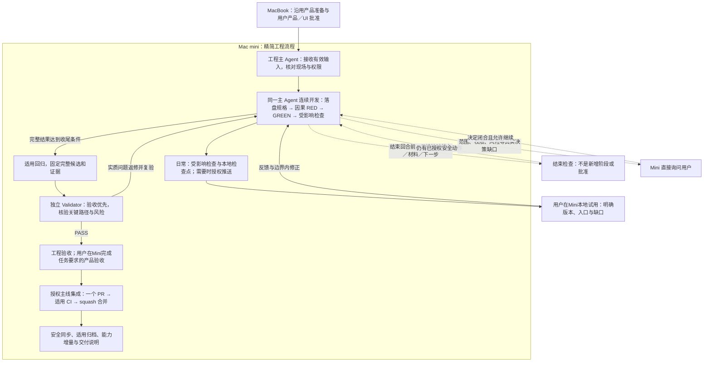

# JuanerAI 开发流程 v0.9：Mac mini 精简工程规则

日期：2026-10-05。版本：**v0.9**，升级 v0.8 及其后续有效提效修订。状态：**用户已批准双角色／SDD+TDD／结束检查修订；本地检查完成并已授权 Git 发布。发布身份以实际 Git 回执为准，Mini 采用尚未确认。**

用户确认的后续修订：**试用及必要的正式用户验收直接在 Mac mini 上进行，取消默认向 MacBook 分发／更新验收副本。** v0.9 首版发布提交为 `9b8a5f540a4b09477a57aa1a99f1776b3b9264e7`；本修订发布身份以实际 Git 回执为准。

本文保存本轮已确认的版本定义与流程图，不是第二份执行政策。唯一执行政策仍为 [product-change-execution-policy.md](../../governance/product-change-execution-policy.md)。历史 v0.8 定稿与运行记录保留；本版本不追认历史结果。规则文件固化不等于运行会话已加载或已恢复执行，采用条件见第 10 节。

## 1. 适用范围与核心取舍

**MacBook 产品流程不变；Mini 默认由一个工程主 Agent 连续开发，一个独立 Validator 在正式交付节点审查。日常轻量提交与试用，正式 Change 集中完成一次主线集成。**

- 沿用已批准蓝图、产品输入、适用 UI Contract／用户 UI Gate、正式 Change 及结果大小的工作包；Mini 不重新走一套产品评估、PRD 或需求访谈。
- 减少的是重复上下文、强制角色交接、逐动作审批和重复验证，不是隐瞒失败、改写验收口径或取消安全检查。
- 借鉴连续推进的组织方式，不复制 dev-flow 的 skill、hook、状态机或固定重试计数；不安装新工具，不恢复旧 Host Loop。
- 不改变在研合同、业务代码或产品范围；不恢复已撤回的“真实＋模拟＋人工六步预览”提案，不自动开启下一 Change。

| 保留 | 精简或取消默认要求 |
|---|---|
| MacBook 的产品准备、必要独立可实施性审查、用户产品／UI 决定 | Mini 重做已批准且仍适用的产品准备 |
| 必要工程规格、SDD／TDD、受影响回归、真实证据 | Spec → Test → Worker 的串行交接及逐阶段批准 |
| 最终候选的独立验证与必要用户验收 | 工程总控与 Worker 日常往返、普通纠正后重复完整审查 |
| 主线 PR、适用 CI、仓库保护和授权边界 | 每个内部子任务单独 PR、日常反复完整 CI／打包／归档 |
| 既有能力覆盖、工程状态和证据位置 | 新台账、重复规格、逐命令汇报和普通返修次数续批 |

## 2. 全流程图

图中的日常试用不是正式完成。返修只重验受影响及连带风险，不因一次失败重走 MacBook 产品流程；候选变化不得沿用失效 PASS。用户验收、PR 准备、合并的具体先后服从任务原有约定；任何动作不得早于其必需条件。图中“一次主线集成”指一个集中收尾节点，不代表失败后不再检查或 CI 只能运行一次。

## 3. Agent 与模型

| 角色 | 固定模型／思考强度 | 职责 |
|---|---|---|
| Mini 工程主 Agent | `gpt-6.1-sol`／`medium` | 直接负责 intake、规格／设计、任务拆分、测试、实现、调试、集成、唯一工程状态、工程验收和授权 Git 交付 |
| 独立 Validator | `gpt-6.1-sol`／`high` | 在独立只读上下文核验完整候选，不编写或修复被审候选，不代替用户验收 |

“两个 Agent”是 Mini 仅有的两种工程职责，不要求两者持续并行运行。工程主 Agent 直接完成规格、测试、实现与修正；同一结果由同一工程上下文持续负责。

不再保留 Worker／Spec／Test 或通用工程协助入口；删除三个当前角色配置，历史记录不改。主 Agent 固定 Sol／medium，最终独立 Validator 固定 Sol／high；不增设自动升降级或模型审批流程。候选作者不能担任其最终 Validator。

**MacBook 的模型、思考强度和产品流程不变。** 以上只调整 Mini 开发角色，不修改产品 Runtime／Provider 的模型选择；配置落地不得通过改共享默认而顺带改变 MacBook。

使用当前任务原生主 Agent 与原生独立子 Agent。`codex exec`／`codex exec resume` 替代工程角色仍是低优先级例外，须用户对具体任务、原因、范围及终点显式同意；一般开发授权、历史使用或原生角色不可用均不等于同意。普通终端测试与构建不是角色替代。配置不可用时报告具体缺口，不静默换模型、扩大 sandbox 或以作者自审替代独立验证。

## 4. Mini 如何连续开发

### 接收一次，按变化补齐

读取精确版本的批准产品／UI 输入、当前任务与分支、未提交现场、验收标准、有效证据、失败／UNKNOWN、资源权限和停止线。复用有效决定，只处理缺失、失效或实质变化；不复制全部产品聊天，不省略约束或相关失败。

Mini 自行确定工程方案和必要拆分。私有接口、夹具、命令参数、路径和普通环境错误在授权内自行纠正；重要公开／兼容、持久化、权限及不可逆副作用契约变化，仍须先明确影响和验证办法。需要改变产品、架构或安全上界时直接询问用户，不以等待 MacBook 技术签字为默认路径。

### SDD／TDD 是内部循环，不是审批链

每个行为在现有 Change 中写清必要输入输出、成功／失败、禁止副作用和验收依据，然后运行能因缺失行为失败的测试，最小实现达到 GREEN，再做必要重构和相关回归。新增行为和缺陷修复保留有效 RED；环境、导入或旧夹具错误不能冒充 RED。纯重构采用修改前后 GREEN／等价性证据；文档改动不伪造 RED。

规格可随授权内工程设计演进，但不能把已批准需求或断言改成适合错误实现的版本。保留关键反例、真实入口、接口与数据流／状态约定；修改测试资产时在既有验证记录中说明覆盖继承，不另加退休审批。

日常尽早启动真实入口并验证受影响主流程，避免最后才拼接。主 Agent 不为每个普通技术选择、角色返回或失败命令请求继续，也不每轮生成完整交接包；在可试用结果、真实阻塞或重要决定变化时报告简短增量。

### 失败要收敛，不靠额度续批

普通纠错无需次数续批；实际费用、时间、算力、数据／Provider／主机权限及用户暂停仍是硬边界。同一问题重复且无验收进展时，利用已有失败记录定位根因；有证据的新路线才作限定尝试，没有路线或仍回到原问题则集中请求具体决定，不无限重试、换角色清零或只申请“再给几次”。

用户暂停时核实相关 Agent 和任务进程已停，并保存已有记录中的返回点；中断父会话不等于子进程停止。采用新规则也不自动解除暂停。

### 结束回合检查，不加新阶段

普通测试通过、检查点、文档补齐或试用就绪只是进度，不结束“持续交付完整结果”的指令。结束前核对既有状态、tasks／verification、真实证据和下一允许动作；有下一项已授权安全动作就继续，不等用户重复喊启动。只在目标达成、真正需要用户决定、显式停止或真实执行／安全／资源边界结束，并说明具体影响和返回点。

只读命令及有界原生 hook 的触发、真实暂停优先、单次防循环、当前 session＋turn 绑定与信任要求，统一由[唯一执行政策的 End-of-turn Check](../../governance/product-change-execution-policy.md#end-of-turn-check)规定。钩子不审批、不跑产品、不写第二状态库；文件存在不代表已启用，也不能证明规格／RED 真实有效。没有自动 hook 时主 Agent 仍执行结束检查，不把这个工具当成新的阻塞 Gate。

## 5. 日常试用与正式完成分开

| 节奏 | 必要动作 | 不代表什么 |
|---|---|---|
| 日常迭代 | 启动／类型等受影响检查、目标测试、受影响主流程；提前验证将被暴露的安全与正确性风险 | 不要求每次全量回归、独立审查、PR 或打包 |
| 已获准内部试用 | 固定可识别版本和环境，满足当前路径安全／正确性条件；给出入口、步骤、适用范围与缺口 | 不等待整个 S1；不冒充 Change 完成、通用能力完成或正式发布 |
| 正式 Change／完整结果收尾 | 适用回归、完整候选、独立验证、工程验收、任务要求的用户验收、授权主线集成与归档 | 不把本 Change 的必需检查留到阶段末却提前报完成 |
| 阶段整体验收 | 跨 Change 集成、真实场景和关键边界，核验累计能力是否达到目标 | 不能用各 Change 的 PASS 简单相加代替整体证据 |

当前批准路径中的浏览器＋同机服务可用于试用；Desktop 壳层、打包、安装／分发专属检查暂缓，非每次迭代打 DMG。共享业务、连接与跨站防护、文件／凭据权限、计算与证据、保存和停止／恢复仍须验证。不按文件名含 `desktop` 删除检查，不用浏览器通过关闭历史 E2 或其他未关闭缺口。

### Mac mini 本地试用与用户验收

**Mini 工程主 Agent 提供本机浏览器＋同机后端入口，用户直接在 Mac mini 试用并完成必要的正式产品验收。** 复用已有批准环境、资料根与本机凭据；取消默认跨设备分发和更新验收副本。日常本地试用不以推送、PR、主线合并或重新 clone 为前提，标明提交及相关未提交差异即可；正式交付仍遵守其验收和 Git 条件。

1. **按实际变化刷新或重启。** 兼容当前后端、服务按请求读取的前端静态资源变化，刷新页面即可；后端代码、启动装配、工具链或配置加载变化，确认受影响的进行中任务及未保存操作后，在已批准更新窗口用产品受控停止／启动方式重启。未知状态先定向核对；启动命令复用旧进程不算更新。
2. **在 Mini 读回实际入口与候选。** 核对页面／服务运行版本、当前本地地址和受影响启动／主流程结果，复用未失效证据；磁盘 HEAD 不能代替运行版本。更新中保持试用／验收候选可识别。保全本机项目、配置和凭据；新增安装、迁移、主机、数据或 Provider 操作沿用既有权限边界。
3. **给出步骤并记录用户结论。** 在已有交付／验收记录中关联候选、反馈与必要的正式用户验收结果；普通修正仍在同一工程上下文推进。日常试用反馈与正式产品验收分别记录，按本节表格判断完成条件。

每次交付在现有回复／handoff 中给出四项：**版本**（提交、相关未提交差异及实际运行版本）；**入口**（Mini 当前本地地址、必要启动／停止方式）；**本次变化与操作步骤**；**验证结果与缺口**。不新增试用台账或 Gate。代码回退不等于数据回滚，兼容性或数据影响不明时不自动回退。

本地试用不默认等待全量 CI、独立审查或主线合并，按当前路径的安全／正确性条件执行。已知检查失败涉及第 6 节底线时阻断相关试用；正式 Change 的独立验证、用户验收及 required CI 仍在正式收尾完成。

### 正式收尾的独立验证

独立 Validator 接收批准输入、验收与契约、完整候选及证据入口，不继承作者的推理历史。候选包括本次已提交、暂存、未暂存和新增内容；与原有改动重叠时明确归属，不能把整份原有脏文件排除审核。先从批准验收条件形成关键正反例，再看实现与作者证据；独立核验关键真实路径、失败及禁止副作用。对匹配候选、输入、环境且未失效的批量证据可复用，不机械重复全部命令。测试通过不能证明漏测的业务语义正确，审查通过也不能代替适用 CI。

## 6. 哪些问题可以后修

普通布局、非误导性文案、非关键边界缺陷和代码整理，可在既有记录写明影响、绕行及返回点后继续不受影响的开发／获准试用。

以下问题阻断受影响路径：数据丢失，凭据／私有资料泄漏，未经批准的外部操作，关键计算或证据错误，预算或停止失效，误导性成功状态，以及承诺的主流程不通。影响指标含义、授权理解或真假结果判断的文案不是普通小问题。安全独立的工作可以继续；不能把全部项目一起锁死，也不能把风险推迟到最终审查才管。

已知低风险问题必须在试用或交付时披露。若它导致本次正式验收条件不满足，须修复、明确不适用或取得用户对具体残余风险的接受；不得因“低风险”自动宣称满足标准。风险豁免不记作 Validator PASS。

## 7. 轻量 Git 日常路径与正式集成

### 日常：本地检查 → 检查点 → 工作分支推送

- 保留 `work/mac-mini/<slug>` 单端所有权；在已有授权内显式暂存并提交完整、可解释的增量，需要备份或交付时推送该分支。不为每个文件、修正或内部子任务开 PR。
- 试用版本可以来自工作分支，不必每次先合并 `main`。清楚标出它是开发版本以及实际 commit／未提交差异，未验收不叫正式完成。
- 用户本地试用与正式产品验收按第 5 节在 Mini 进行；提供实际运行版本与入口。本地可试用、GitHub 推送和正式验收结果分别记录。

### 正式收尾：一个 Change → 一个主线集成节点

完整结果达到交付条件后，在明确 Git 权限内集中准备一个 PR，复核完整差异、独立验证及适用 CI，再 squash 合并 `main`，沿用 [Git 工作流](../../governance/git-development-workflow.md)的安全同步与适用归档。不得直接推 `main`、跳过 required CI 或绕过仓库保护；无权限时直接向用户申请。保持结果大小的 Change，不把整个蓝图积累为一个巨型 PR。

PR 更新或主线变化使证据失效时，只补相关检查；必要时 CI 会再次运行。“一次主线集成”不是“只准查一次”。合并前必须确认所有适用的强制条件满足，不能因平台允许点击 Merge 就推定工程条件已满足。

本地核对基线 `d308de72aa683580e5692f183f7d5414666effa9` 的 [CI](../../../.github/workflows/ci.yml)仅由面向 `main` 的 PR 触发：未开 PR 的工作分支备份推送不会触发该工作流；已开 PR 后的更新仍触发。此次先利用已有触发方式及 docs／配置影响分流，不修改 CI 行为或放宽产品回归。今后以实际适用工作流及仓库规则为准，项目要求的 CI 与 GitHub 是否强制拦截须分别核实。

## 8. 文档、证据与能力地图

复用已有位置，不新增 `.flow`、工程看板或文档流水线：

| 材料 | 保存与维护方式 |
|---|---|
| 产品方案、UI Contract／原型、用户批准 | 保留 MacBook 已发布产品包及精确引用；Mini 不再生成同义 PRD |
| 工程规格／必要设计、任务与验证结论 | 非简单行为 Change 保留 proposal／批准输入引用、`specs/<capability>/spec.md`、`tasks.md`、`verification.md`；必要设计落 `design.md`。复用等价既有文件，不造同义或空白套件；聊天不能替代规格 |
| 代码、永久测试、正式验收结论 | 正常工作分支，按其生命周期提交与集成；未提交副本不能声称已完成 Git 保存 |
| 原始日志、冻结输入、完整输出和退出结果 | 继续已批准的设备本地持久证据根；记录位置、身份与可访问性，保留历史失败和 UNKNOWN |
| 当前工程状态与下一步 | 既有 `.juanerai/project-control/` 与 verification／handoff；工程主 Agent 是唯一状态写入者，Validator 只回传证据；结束检查只读 |
| 蓝图能力覆盖 | 每个 Change 更新[累计清单](../capability-coverage/register.md)、[最新全图](../capability-coverage/latest.md)并保存快照；正文报增量、缺口和证据，阶段验收或用户要求时展示完整六＋二 |

能力状态必须区分规划、代码存在、链路接通和目标范围验收；不把单场景推广成通用能力完成。沿用既有能力完成条件及跨 Change 证据，不用 Change 数量或平均百分比表达整体完成度。

报告只需说明：推进的验收点、真实结果／失败／未验证项、可试用入口、下一步或阻塞，以及证据链接。原始日志留在证据根，不在主 Agent 和 Validator 对话中重复搬运；不逐命令写看板。

## 9. 预期收益与保留的风险

实际结构变化是：省去总控与 Worker 的默认往返；同一上下文连续实现；独立审查与主线集成集中收尾；已有效的批准和验证证据复用。SDD／TDD、安全前置检查和最终独立性不变。

日常反馈会较晚发现部分跨模块回归，集中集成也可能遇到主线冲突。通过早期真实路径、受影响测试、有界工作包和正式收尾回归控制这些风险，不能仅以最终审查替代日常质量。

这是效率设计，不是“已证明更快／质量不下降”的运行结论。后续在原有复盘中观察同类已验收结果的交付时间、用户干预、返工／复发及必要时全链路 token；无数据就写未知，不新增测速 Gate 或指标平台。

## 10. 落地与采用边界

v0.9 首版从 `d308de72aa683580e5692f183f7d5414666effa9` 升级并发布为 `9b8a5f540a4b09477a57aa1a99f1776b3b9264e7`。此前修订仅改变试用／用户验收位置。本次再落实双角色、规格材料和有界结束检查；业务代码、共享默认模型、CI 触发及质量条件不变。规则目标态仍需 Mini 在原任务确认采用。

本候选一次性对齐确有冲突的既有入口，而不是增加一套框架：

1. 唯一执行政策的职责、连续工程与原生执行条款；[AGENTS.md](../../../AGENTS.md)、[Orchestration.md](../../../Orchestration.md)及状态机／DoD／模板中确有冲突的引用。改为主 Agent 直接工程执行，不恢复 Spec Gate／TDD_READY。
2. [模型路由](../../governance/agent-model-routing.md)与当前工程角色 TOML：删除 Worker／Spec／Test，只保留 Validator Sol／high。共享主配置和 MacBook 默认值原样保留；Mini 主会话在接收时通过原生会话设置选择 Sol／medium，并读回确认。配置检查器按文件校验两端边界，保留 sandbox／并发检查及负例；不新增 profile 或启动器。
3. Git 规则及实际使用的提交 skill 中确有冲突的引用：日常备份推送与正式 PR 分开；第 5 节 Mini 本地试用及用户验收环节纳入唯一执行政策，Git 推送不作为本地试用前提。复用现有 CI 与同步工具。

本次修订已获用户明确授权提交、推送、创建 PR 及检查通过后的合并。规则本身不授予业务开发、外部操作、消息发送或未来 Git 权限。形成实际发布提交后，由用户将下述说明附上发布 SHA 转交 Mini；本轮不发送或切换远端任务。

> 在原任务安全边界读取本次实际发布 SHA 的唯一执行政策 v0.9、模型路由及本版本定义。保留原 Change、分支、未提交现场、有效批准／证据、失败／UNKNOWN、资源消耗及停止线。核对原生主会话 Sol／medium、独立 Validator Sol／high；不再调用 Worker／Spec／Test 或通用工程协助者。只读核对不足以证明加载时，不启动产品探针。MacBook 主配置不变。接收主 Agent 连续开发、完整落盘 SDD/TDD 材料、结束检查、轻量日常 Git、正式 Change 集中独立审查及 required CI；用户直接在 Mini 试用和必要正式验收，提供可识别版本、入口、步骤与缺口。本地试用不以 push／PR／merge 为前提。检查工具只读；核对宿主支持并通过正常控件审阅信任 hooks，不绕过信任，不以文件存在宣称自动检查启用。UserPromptSubmit 只提供当前回合标识，主 Agent 确认当前工程授权后才绑定既有状态；未启用自动 hook 不阻断已授权安全工程。返回实际规则／加载／hook 状态、保留现场、缺口和下一允许动作。未解除原有停止线不恢复执行；不新建任务、自动切基线、覆盖现场或增加主机／数据／Provider／Git 权限。

**方向确认、规则集成、Git 发布、接收采用、恢复执行分别记录。** 在研任务不因发布被强迫换基线；未收到实际加载与接收确认，不声称已采用。不能只改磁盘文件就宣布生效，也不为验证角色加载启动产品探针或迁移任务。显式暂停、权限不足与未满足的安全条件仍需各自解除。
