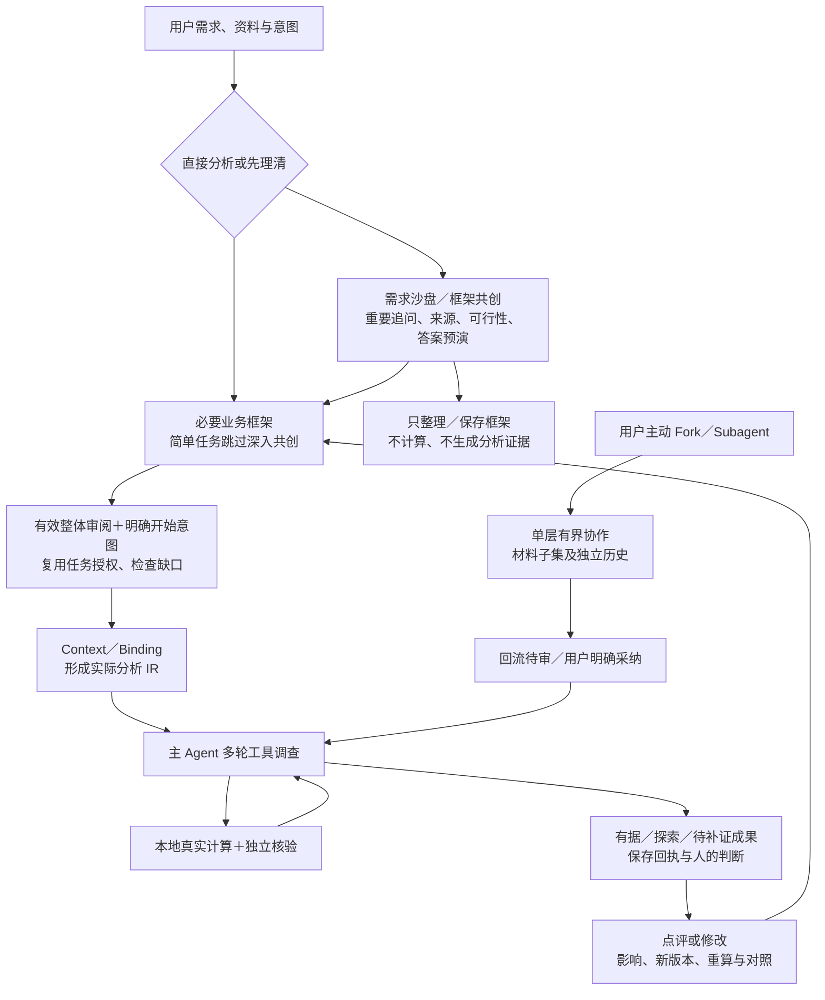
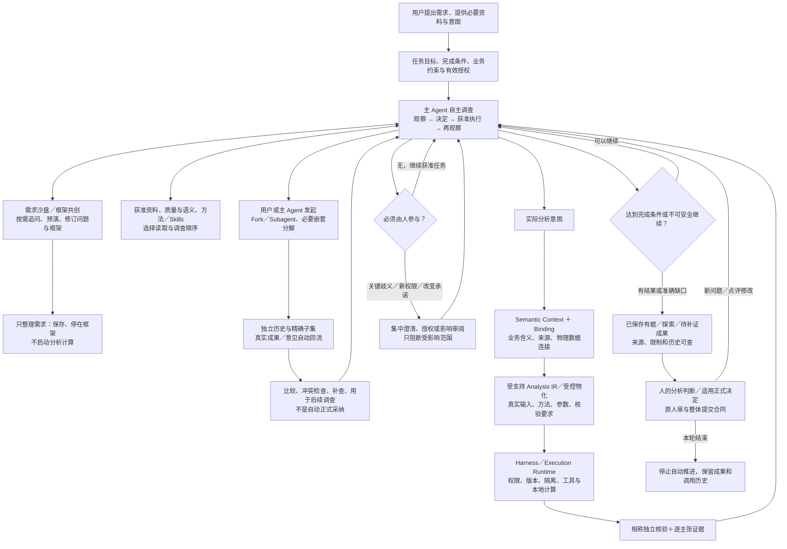

# Change005 v1.2 → v1.3 · 同一数据分析需求的流程对比

2026-10-09。用户已接受的流程设计在此显式保留需求沙盘；不是生产调度图或实现回执。完整行为以[产品输入](product-input-v1.3.md)为准。

## 1. v1.2 最新批准流程，而非 Change001 的旧流程

v1.2 已支持真实多轮工具、动态 IR、开放分析、需求共创及按需检查；差别不在“是否有 Agent”，而在协作发起／消费及自主路线如何被充分释放。下图箭头是关系，不要求每题逐节点操作。



v1.2 的“只整理”“预演不是事实”“无变化不重跑”“刷新／重启不自动执行”“整体正式人审”均继续有效。严谨后台机制本来就不应机械转成逐次确认；v1.3 不伪造旧版全为固定脚本。

## 2. v1.3：目标驱动的调查中枢，沙盘双向保留



Semantic Context 贯穿理解、规划及解释，不是生成 IR 后才追加。上图展开的三角支路只用于说明真实计算的约束；阅读／追问／解释不用各写 IR。模型路线不是每次都按上述支路重新走固定审批。

## 3. 用户看到什么，而不是管理什么

```text
同一 Xanthil 工作台
左：项目／任务／协作历史    中：自然对话、当前调查、可展开成果    右：按需检查
                                                      口径｜方案｜资料｜证据｜执行

需求沙盘／框架共创  ↔  Agent 自主调查
                    ↓ 后台自然形成且实际消费
               业务含义 → 分析逻辑 → 受控执行 → 可信成果

六阶段／五个关键时刻：理解、检查、修改、接管窗口；不是内部固定调度器。
```

| 改变 | 用户可感知结果 | 不能被误解为 |
| --- | --- | --- |
| 目标驱动调查 | 不用盯着每个步骤，看到实际在查什么及为何转向 | 无权限／无事实约束的任意自治 |
| 沙盘随调查更新 | 复杂任务可共创，简单任务直接推进，只整理仍有清楚出口 | 取消沙盘或每任务必须做长问卷 |
| 自主协作与自动消费 | 无需逐次派发、逐个回流先点采纳，仍能查看与停止 | 自动替人记录决定或认定多个 Agent 共识是真相 |
| 计算链可检查 | 方法／参数真正影响执行，重要来源及核验可查 | 只展示 IR／过程图，后台仍跑固定脚本 |
| 有意义的参与 | 改含义／承诺、需要权限、正式判断时才问 | 取消首次执行意图、数据授权、人审或独立核验 |

根任务和所有后代共同受停止、失效权限、迟到隔离、持久计量和显式恢复约束；关页与显式停止不同，服务重启不自动续跑。返回成果、用于调查、通过核验、人的正式效果是不同状态。本图不声明 SDK 升级、生产实现或体验验收已完成。
