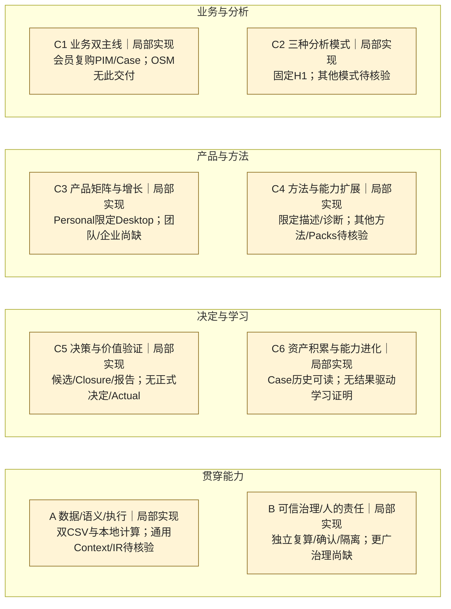

# Change001 — 蓝图覆盖交付快照（回溯重建）

创建：2026-10-01。以当前 Blueprint v3.0 的稳定能力目录回看001的交付，不声称001当时使用v3，也不改写历史验收。早于001的完整能力状态未知。

目标：会员复购可信分析的Personal/macOS arm64纵切。用户验收：2026-09-27；集成：PR43，`9626e78fa79f9af6b2676a8589da87d99088d722`。候选与CI身份、历史狭义处置分别见 [E-001](../evidence.md#e-001)。本快照绑定**其首次发布Git版本中**的 [能力定义清单](../register.md) 和 [证据索引](../evidence.md)；下表保存001时点范围，不能用清单后来的状态回填本图。

## 完整六＋二图

含义沿用[同版本状态图例](../latest.md#全景图)；家族是范围判断而非算术汇总。001未影响的OSM、其他模式、Team/Enterprise、其余DAME/Packs、结果闭环仍展示，旧资产不能因未核验被认定不存在。

## 本次交付变化

| 能力ID | 之前 | 001交付后的范围／状态 | 距目标的缺口 |
|---|---|---|---|
| C1-01/03、C2-01 | 待核验：未有可重建的前序完整基线 | 会员复购澄清／固定H1、Case身份、保存／重开／修订；宽目标局部实现 | 其他问题与模式、Case行动／结果链 |
| C3-01 | 前序产品整体状态待核验 | 原生Personal工作台及此纵切获验收；局部实现 | 其他可见能力、多场景持续使用、价值证据 |
| C4-01/02、A-01/04、B-01 | 旧方法／执行资产状态待核验 | 双CSV、期间口径、确定性指标／分组贡献、SQL+Python独立复算与不足路线；局部实现 | 其他方法／数据资格／运行范围 |
| C5-01/09、C6-01、A-05、B-02/03 | 前序同范围状态待核验 | 候选比较／Closure、不可变报告、历史及人工确认；局部实现 | 正式Decision/Expected、跨资产复用、Actual、评价、学习与对应治理 |
| C5-08 | 不能反推此前不存在辅助代码 | 三个一次性辅助流程有有限证据，尚无§6.2多轮Case Assistant目标；局部实现 | Case-bound多轮工具、精确授权、正式草案采用 |

## 证据入口与限制

[E-001](../evidence.md#e-001) 链接规格、实现、测试、verification、独立／用户验收及合并身份。实际原生正常路径使用synthetic Project、真实SQLite/DuckDB/Python；本次没有重跑，原始文件在Mini。001本身不证明真实Provider调用或模型质量。Main RED／截图的历史狭义处置、失败和UNKNOWN保留，不追认全通过。

没有证据支持整个PIM、DAME、IR或端到端DecisionLoop完成。后续建议为补正式决定与预期等当时尚缺环节；此回溯快照不重新发起或批准任何Change。
