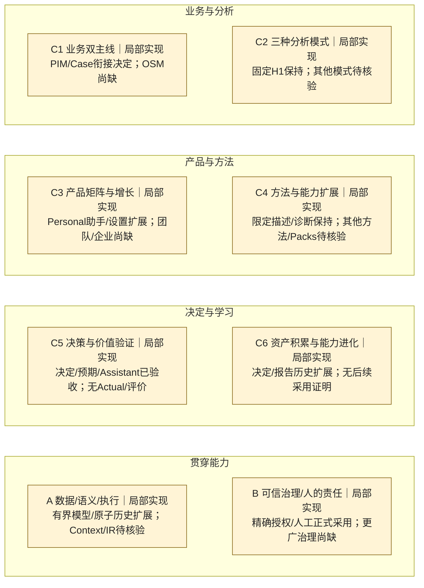

# Change002 — 蓝图覆盖交付快照（回溯重建）

创建：2026-10-01。以Blueprint v3.0能力目录整理001＋002累计交付；不是当时原始报告，不改历史批准范围。

目标：Case Assistant、人工Decision Record／Expected Outcome与单Xiaomi Provider设置。用户验收关闭candidate010／DMG011；PR46集成 `fbd72e1bc7d54d516a1303322f8dda42b4cff98c`。完整身份见 [E-002](../evidence.md#e-002)。对比 [001快照](change-001-retrospective.md)。本快照绑定**其首次发布Git版本中**的 [能力定义](../register.md) 与 [证据索引](../evidence.md)，以下保存截至002的状态。

## 完整六＋二图

状态含义见[同版本图例](../latest.md#全景图)。全家族保留；宽目标仍局部实现不表示002没有产品进展。

## 本次变化与能力级验收

| 能力ID | 001之后 | 002之后 | 剩余缺口 |
|---|---|---|---|
| C5-08 | 三个单次辅助；局部实现 | **§6.2限定Case Assistant目标范围已验收**：有效会员复购Case、有界只读多轮／工具、人工草案审阅与采用、单Provider设置 | 不含其他业务场景／任意工具、多Provider或Fork/Subagent；扩展须另验收 |
| C5-01/02 | 候选/Closure已验收；无正式Decision/Expected | 正式选择／不行动／暂缓、理由责任与事前预期、修订；宽目标局部实现 | 其他决定场景、合格Actual、评价及跨结果不可倒写证明 |
| C1-03、C3-01、C5-09、C6-01 | Case、原生分析、基础报告／历史；局部实现 | 同Case后续Quick Assistant、决定/预期报告版本及本机设置接通；仍局部实现 | 完整Personal闭环、其他表达任务、跨资产复用与团队能力 |
| A-04/05、B-02/03 | 本地运行与确认、来源历史；局部实现 | 精确模型授权／只读工具、原子正式记录、Keychain设置及生命周期；仍局部实现 | 父子任务边界、结果／学习／企业场景的对应机制 |
| C5-03/04 | 001无已验收协作范围 | **仍为Preview，非已实现**；按v3目录看后续规划范围 | 独立窗口、实际任务、授权、回流／采纳和完整正反路径 |

C5-08 的目标验收依赖跨001/002链路：001有效Completed Case/Finding/Closure/report → 002 source-bound Assistant → 人工草案编辑／拒绝／确认 → 原子决定、Expected和新报告／历史。采用002固定候选的独立评估、原生／持久化检查和用户产品验收，不是因“两个Change合并”而推断。适用边界仅上述已批准Personal场景。

## 证据入口与未验证项

[E-002](../evidence.md#e-002) 链接代码、六类测试入口、最终独立验证、工程验收、用户验收与完成记录。2238 PASS／1 gated real-model SKIP来自归档记录，本次未重跑。历史真实Provider成功只复用于未变分支；最终candidate010没有新实际模型调用，混合失败与UNKNOWN保留。合成host生命周期检查不可冒称全部普通shipping行为已重新实测。

C2、C4及其它无业务增量家族保持001的证据范围。002没有Future Actual／结果评价／学习采用；完整DecisionLoop仍未完成。结果回访是保留返回点，后续003选择及批准另有记录，不由本快照授予权限。
