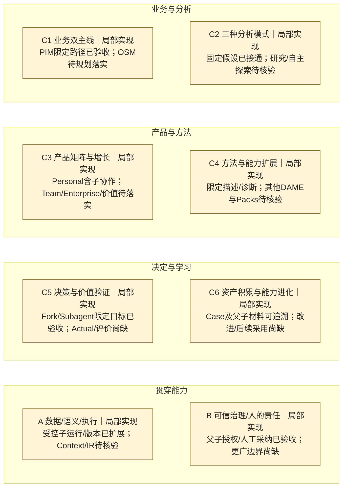

# Change003 — 蓝图能力覆盖完成快照

更新日：2026-10-01；Blueprint v3.0。对比[原003在研快照](change-003-in-progress-2026-10-01.md)，该历史文件保持不变。本文按正式完成记录回填，不重演产品验收。

固定依据：GitHub `2bb18d7356289781a87a672dc3f7b9bd40341d87`（PR52完成回执），功能集成 `2cad5cd11480e8221ac2b1a554562a70bdc7a16b`（PR51）。[E-003](../evidence.md#e-003)链接固定版本的行为规格、实现／测试入口、工程／用户验收及Git回执。本快照的能力定义见**其首次发布Git版本中**的[累计清单](../register.md)；下面独立保留本时点覆盖范围。本地工作树仍是`5a8fe7b…`加未提交能力追踪文档，未同步003产品代码。

## 完整六＋二图

状态含义与[同版本图例](../latest.md#全景图)一致，布局不变；局部实现是家族范围判断，不是平均分。移除原003在研蓝框；C5家族仍缺结果环节，不能随两个子项通过变成全量验收。

## 本次变化与剩余缺口

| 能力 | 之前 | 现在及实际交付 | 剩余边界 |
|---|---|---|---|
| C5-03 Fork | 实现中；002版仅Preview | **目标范围已验收**：从合格根Case选择保存分叉点／材料，独立窗口与授权执行，人工回传精确结果、审阅和MODEL-only采纳 | 无该批准目标内未闭合必需项；不含递归／多人协作、实际Provider质量或安装发布 |
| C5-04 有界Subagent | 实现中；002版仅Preview | **目标范围已验收**：单层、单任务、顺序准入、独立授权；完整持久化成功结果一次自动返回待审，失败不冒充成功 | 无该批准目标内未闭合必需项；无后台自主／多级并发／自动正式写入或父模型继续 |
| C1-01/03、C3-01 | 限定分析、Case与根Assistant；局部实现 | 父子分支调查／委托检查和原生工作台协作已增加；仍局部实现 | OSM、多问题／多模式、全流程结果和可持续使用 |
| C6-01、A-05 | 同Case历史与精确引用；局部实现 | 父子材料、结果ID/version/hash、漂移拒绝和显式复用已增加；仍局部实现 | 跨资产／跨Case学习，Actual/Evaluation贯通与更广重放条件 |
| A-04、B-01～03 | 限定运行、授权、证据与人工确认；局部实现 | 单层顺序准入、停止／关闭恢复、精确授权、回流待审／人工采纳已增加；仍局部实现 | 模型质量、其他方法／任务形态、团队／企业／行动／学习治理 |
| C2、C4、A-02/03及其他未受影响项 | 原状态及证据范围 | **保持不变**；不因003通过升级 | 研究／探索、DAME更多方法、Packs、Context/IR等仍待各自核验／交付 |

## 能力级验收链与证据限制

- 累计真实路径：001有效Case/Finding/Closure/report＋002根Case Assistant → 003独立子窗口／保存材料／单独授权 → 已完成结果 → Fork人工回流或Subagent成功自动回流 → 父人工审阅／MODEL采纳。后续父模型调用仍需选择材料和新授权，正式Decision/Outcome/报告仍走原人工流程。
- 正反边界按已接受规格核对：精确来源／版本、默认不选材料、共享模型准入、源与正式基线漂移、停止／迟到、关闭／重开中断、提交原子性／幂等重试，以及禁止递归和正式业务写入。批准的sidecar100→101兼容及显式关闭合同保留，不授予降级恢复权限。
- 固定组合为candidate003 manifest `04eb3655b40b6674ae65e58e944a24cafbdaee9e7d9bccb3d5a37debbce08911`＋supplement002 manifest `140ef5e45d61fde9d3b6cc1e20e298ccfad214ee374b4255e5168e998a72da8d`；独立review004 PASS、F1–F6关闭。归档记录的默认离线canonical为2305 PASS／0 FAIL／1真实模型门控SKIP，含native73/73；不是本轮重跑。
- 用户“验收通过”记录在2026-10-01 14:23:12（Asia/Shanghai），固定工程包与隔离合成Project；未配置真实模型。不得推断用户逐项手工步骤、真实Provider调用或模型质量。
- PR51于15:09:38、PR52于15:19:54（Asia/Shanghai）合并，正式规格与验收档案已集成。hosted CI与本地native是不同证据；旧CI失败、历史候选失败及U2原因UNKNOWN保持，不覆写为从未失败。
- 原始工件归Mini既有证据根；本机只读正式发布记录和任务回执，未重跑／复制原始日志，未新增Provider／业务数据访问或安装发布验收。

完整DecisionLoop仍缺行动、合格Actual、评价、受治理改进、下一Case显式采用与效果证据；本次不授权下一Change，也不修改未受影响能力。本覆盖文档仍是本地审阅候选，发布与Mini采用另需确认。
