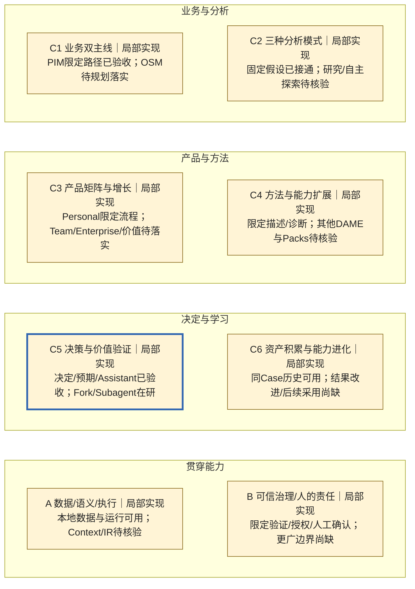

# Change003 — 蓝图覆盖在研快照（非交付）

采集：2026-10-01，约12:43 Asia/Shanghai读取原Mini任务摘要。当前集成基准 `5a8fe7b38ebdb1c2a8d49dcb5bdc5fa9d4bc3041` 已包含Blueprint v3与003批准产品输入；**不是003工程完成提交**。任务 `01a0f481-89c1-7702-9597-62cae040f1a5` active；完整原始日志、工作分支／WIP候选SHA与最终验收未在本轮核验。

[E-003：产品包与冻结回执摘要](../evidence.md#e-003) · [同发布Git版本的能力定义](../register.md) · [已交付002快照](change-002-retrospective.md)。这是一次时间截面的回读，不持续监控，也不派发或改变003任务。

## 完整六＋二图

状态含义见[同版本图例](../latest.md#全景图)；蓝框只标在研重点。与002相比，各宽目标的**已交付范围未因这次在研回执而增加**。

## 本次状态变化与预计覆盖

| 能力ID | 之前 | 观察到的现在 | 预计完成后才可计入的增量 |
|---|---|---|---|
| C5-03 Fork | 已交付版Preview；003批准规划 | **规划中→实现中**，非验收 | 用户选择持久化分叉点、独立子窗口与材料、人工精确回流／审阅／采纳 |
| C5-04 Subagent | 已交付版Preview；003批准规划 | **规划中→实现中**，非验收 | 单层单任务／顺序执行／独立授权；完整持久化成功结果只回流一次待审，失败不成功 |
| C1-03、C3-01、C6-01、A-04/05、B-01～03 | 001/002限定范围局部实现 | 保持局部实现，既有验收保留 | 父子Case材料关系、运行／关闭恢复、版本漂移、权限及审阅责任在同一真实路径中接通 |
| C2、C4、C5-05～07、C6-02～04及Team/Enterprise | 未由003交付 | 状态与已验收范围不变 | 003不交付新方法、Actual、评价、学习闭环或多人／企业治理 |

## 完成前仍缺什么

- Mini报告旧格式关闭的8项定向检查通过，随后报告77/77定向回归通过；回执同时说明还需完整离线回归、固定新候选与后续核验。这些是**接收方汇报，不是本轮原始日志复核或003验收**。
- 要更新C5-03/04为目标范围已验收，仍须绑定完整固定集成候选，验证从已接受根Case进入两条真实父子路径及回流／采纳；含精确版本、独立授权、source/decision漂移、停止胜出、迟到、不重跑的幂等返回、关闭／重开中断和禁止正式写入等边界。
- 需要独立验证、工程验收及批准产品输入要求的用户验收记录；实际Provider调用仅在已有明确授权及其具体证据范围内计入，不能为补图新增调用。
- 已存在的失败、UNKNOWN与旧候选不重置。最终完成时**另追加完成快照**并更新最新清单／图，不把本快照覆写成PASS。

证据不足不要求中断有效产品工作；缺口处理继续在003原任务和授权范围内，由Mini工程总控组织。本快照不恢复、暂停或扩展任何执行权限。
