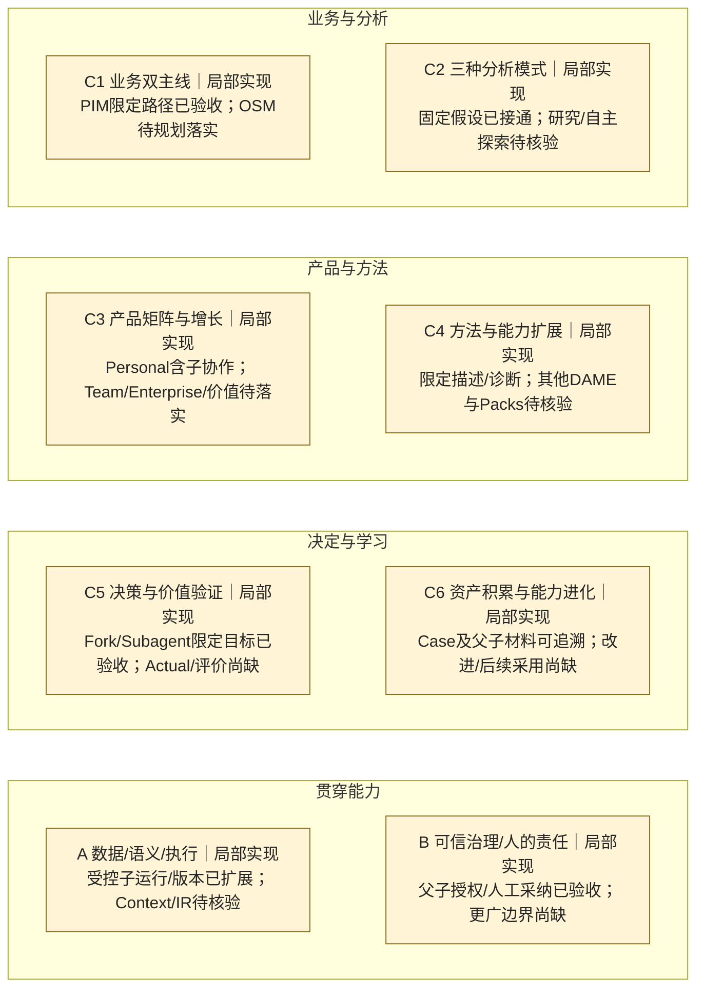

# JuanerAI 蓝图能力覆盖图 — Change004 工程交付快照

**固定候选 corrected-offline-005；E1 PASS，E2由用户豁免后置；真人体验未完成。Git结果由同提交交付记录及后续实际回执证明。**

**规划对齐：Blueprint v4.1｜已验收基线：2026-10-01 Change003｜工程交付补充：2026-10-02 Change004（E2豁免）｜40项能力，六条主线＋两项贯穿能力。**

Change001的会员复购分析、Change002的Case Assistant／决定／预期，以及**Change003的单层Fork／有界Subagent协作均已按各自限定范围验收并交付**。本轮已读回003工程／用户验收及PR51/52合并记录。**产品已具备可用纵切，但尚未达到蓝图的完整DecisionLoop。**

[累计清单：全部能力、目标和完成条件](../register.md) · [证据、固定版本及限制](../evidence.md) · [维护规则](../../../governance/product-change-execution-policy.md#blueprint-capability-coverage)

## 本次规划增量（不提升实现或验收状态）

当前路线、P1 预期能力增量和全部稳定 ID 的映射见[清单 v4.1 规划段](../register.md#v41-规划映射与下一阶段增量非实现状态)。P1 将核心体验与 Analysis Core 协同补齐；后续数据／语义按实际任务或回访阻塞扩展，有足够来源即可进入反馈，再到受治理改进／下一 Case 采用。三类 P1 验收共同通过后才讨论有界试用，权限另定。

以下图表和“Change003交付”段保持原固定工程证据；该规划段没有新产品交付或接受；Change004在研刷新见下一节。规划中的 IR 真实消费、未完成任务推进及整体人审不能提前填成已完成。图中广义 Context／IR 的“待核验”是原工程快照；已知 Desktop 固定链缺口见清单规划段，不声称全库／其他设备已经穷尽核验。

## Change004 工程交付（2026-10-02，E2用户豁免）

用户已要求交付，并明确 E2 后续再修。**固定 P1 A/B 实现获得附 E2 豁免的工程接受**：未完成任务推进、可执行分析计划、点评／必要重算、保存恢复和三种人审结果已接通；E1 独立持久化158项全部通过，布局补验4项通过。Git实际结果见[交付记录](../../../../openspec/changes/archive/2026-10-02-xanthil-ai-led-member-analysis/git-delivery.md)。

**E2 仍为待修复项**：原生构建成功，Electron 启动失败，沙箱拒绝桌面服务访问；原生交互及完整包验证尚缺。真人体验由用户后续完成，没有新能力目标被提升为完整验收。详见 [E-004-DELIVERY](../evidence.md#e-004-delivery) 及[累计清单](../register.md#change004-工程交付2026-10-02e2用户豁免)。

六＋二全图和40项能力保持完整，001～003接受范围保留。早期在研、review001、离线复核及隔离验证快照均保留；[本次工程交付快照](change-004-delivery-with-e2-waiver-2026-10-02.md)绑定固定候选、用户豁免、未验证部分及同提交累计清单。

## 全景图

固定布局：前三行 C1–C6，末行 A/B。框内状态是家族的**覆盖范围判断**，不是对子项求平均；同为“局部实现”，其已验收内容与缺口可以很不同。所有家族保持展示，未知子项不隐藏。

状态文字为准：未启动＝已核对边界内尚未启动；规划中＝有路线／方案；实现中＝有在研事实；局部实现＝只有部分范围获证据支持；目标范围已验收＝该条目明确目标满足其完成条件；待核验＝证据不足。历史图的蓝色边框只标在研重点；003完成后移除，家族仍用原来的局部实现含义。

| 家族／能力入口 | 当前可确认的范围 | 未覆盖或待核验的关键环节 |
|---|---|---|
| [C1 业务双主线](../register.md#c1--业务双主线) | 会员复购PIM、Case保存／重开、决定衔接及分支／委托检查 | OSM经营闭环、多问题调查、行动／结果全过程 |
| [C2 三种分析模式](../register.md#c2--三种分析模式) | 固定H1、真实计算与独立复算 | 其他假设；Deep Research／自主探索的生产证据 |
| [C3 产品矩阵与增长](../register.md#c3--产品矩阵与增长) | Personal原生限定流程、单Provider设置及独立Fork/Subagent窗口 | 多场景持续使用、Team、Enterprise、真实价值／留存 |
| [C4 方法与能力扩展](../register.md#c4--方法与能力扩展) | 限定描述／分组诊断 | 因果、预测、探索、优化及Domain/Model Pack真实消费待核验 |
| [C5 决策与价值验证](../register.md#c5--决策与价值验证) | 候选→人工决定／Expected、历史报告；**C5-03/04 Fork/Subagent及C5-08 Assistant限定目标已验收** | 行动／Actual／评价、完整Report Studio尚缺 |
| [C6 资产与进化](../register.md#c6--资产积累与能力进化) | 同Case历史及父子精确结果引用、显式材料复用 | 跨资产复用；合格评价→改进版本→下一Case采用→效果 |
| [A 数据／语义／执行](../register.md#a--数据语义与执行) | 双CSV、本地计算、有界模型调用；新增单层顺序子运行、关闭恢复与精确结果版本 | Context/Binding、IR生产消费待核验；其他数据／结果链；003实际Provider未验收 |
| [B 治理／人的责任](../register.md#b--可信治理与人的责任) | 独立证据、父子精确授权、回流待审及人工MODEL采纳；原正式确认保留 | 团队／企业／学习治理；有限域行动尚未授权 |

## 本次变化：Change003交付

本次根据003的固定工程／用户验收及集成证据更新状态，不是文档修改本身创造了交付。001/002范围保持；[原003在研快照](change-003-in-progress-2026-10-01.md)不覆写。[003完成快照](change-003-completed-2026-10-01.md)保存本次增量和完整图。

| Change | 能力变化 | 当前判定与剩余缺口 |
|---|---|---|
| 001 已交付 | C1-01/03、C2-01、C3-01、C4-01/02、C5-01/09、C6-01、A-01/04/05、B-01～03获得会员复购限定路径证据 | 宽目标仍局部实现；不含正式决定、Actual和学习闭环；[回溯快照](change-001-retrospective.md) |
| 002 已交付 | C5-01/02/09、C1-03、C3-01、C6-01、A-04/05、B-02/03在已有范围上扩展；**C5-08限定目标获验收** | 002当时Fork/Subagent仅Preview；正式预期不等于Actual/评价；[回溯快照](change-002-retrospective.md) |
| **003 已交付** | **C5-03/04：实现中→目标范围已验收**；C1-01/03、C3-01、C6-01、A-04/05、B-01～03扩大已验收子范围、保持局部实现 | 根Case→独立子窗口→受控任务→精确回流→人工MODEL采纳已闭合；不新增正式业务写入、Actual／评价／学习；[完成快照](change-003-completed-2026-10-01.md) |

在该 Change003 工程证据快照采集时，未识别新的在研Change；这不否认后来正在准备的 P1 产品包，也不是今日 Mini WIP 断言；不自动启动后续项。003离线canonical记录为2305 PASS／0 FAIL／1真实模型门控SKIP，含native73/73；独立与用户验收已记录。**实际Provider／模型质量、安装或发布不在此完成结论内**，本轮未重跑产品测试或复制Mini原始日志。

## 能力级结论与下一步建议

- **可以说**：会员复购Personal场景的分析→候选→人工决定／事前预期、Case Assistant及单层Fork/Subagent协作已有归档验收。**不能说**：全部PIM、DAME、IR或DecisionLoop已经完成。
- 完整Loop仍缺实际行动／合格Actual／评价、受治理改进版本、下一Case显式采用与效果证据。沿蓝图返回点讨论后续，不由本图自动选新Change。
- 对既有Context／IR／Packs优先补核验现存生产消费和验收证据；这是核验建议，不重开已完成003或自动扩大实现。
- 最新图的固定版本与证据边界见 [索引](../evidence.md)。003结论依据GitHub `2bb18d7…`；回填时本地为`5a8fe7b…`，通过只读远端记录核验。此处是采集时点，不是发布后工作树HEAD声明，也不是Mini实时看板。

## 快照目录

| 快照 | 性质 | 证据时点 |
|---|---|---|
| [Change001](change-001-retrospective.md) | 2026-10-01回溯重建，不是当时原始汇报 | 001最终验收及PR43集成 |
| [Change002](change-002-retrospective.md) | 2026-10-01回溯重建，不是当时原始汇报 | candidate010/DMG011验收及PR46集成 |
| [Change003在研](change-003-in-progress-2026-10-01.md) | **非交付快照** | 2026-10-01读取到的原任务回执；无最终固定候选 |
| [Change003完成](change-003-completed-2026-10-01.md) | 按已发布验收和Git回执更新 | candidate003＋supplement002，PR51/52集成归档；原在研快照保留 |

今后每次Change完成，按唯一政策增量更新清单、总图并追加完成快照；含“无业务能力增量”的Change也保留全图。快照中的同提交清单／证据链接在该快照发布的Git版本中读取，后来修正另追加，不覆盖已发布快照。
