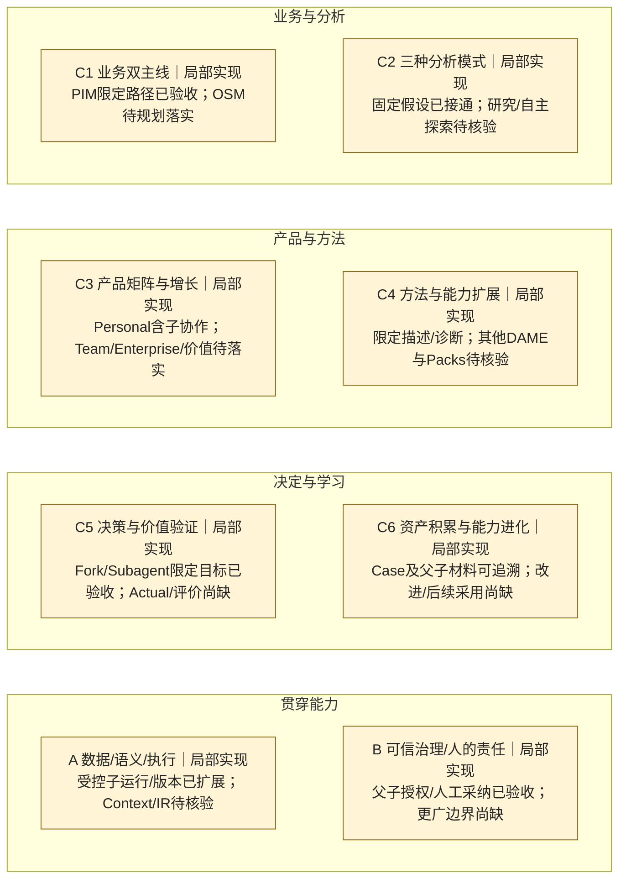

# CI reliability and feedback — 无业务能力增量快照

2026-10-03，MacBook。本次仅维护 CI、测试及开发规则，不改变产品实现或
001–004 的验收范围；不消除 Change004 的 E2 豁免及原生体验未验证项。
工程验证与交付结果见[本次验证记录](../../../../openspec/changes/ci-reliability-and-feedback/verification.md)。

本快照绑定同一 Git 提交中的[40 项能力清单](../register.md)与
[业务证据索引](../evidence.md)，业务事实沿用 `d0b6f2a933cbf21b913fdd2751761705e0fa5016`
基线。全部能力的状态、已验收范围与缺口均不变；CI 提效不是业务能力验收。

本次变化：无业务能力状态迁移。剩余业务缺口及下一步优先级仍由现有蓝图
与用户决定；本工程维护不自动启动产品 Change。
