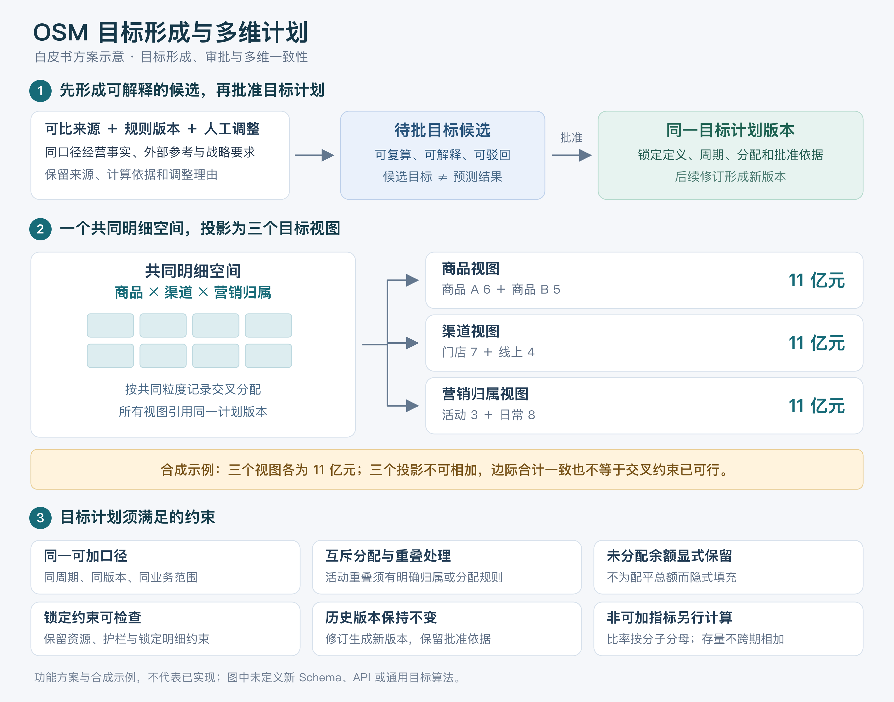
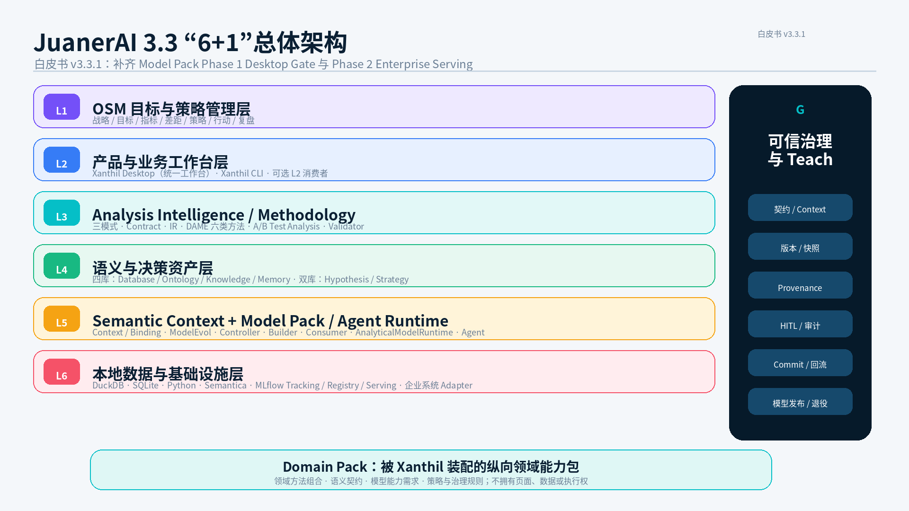
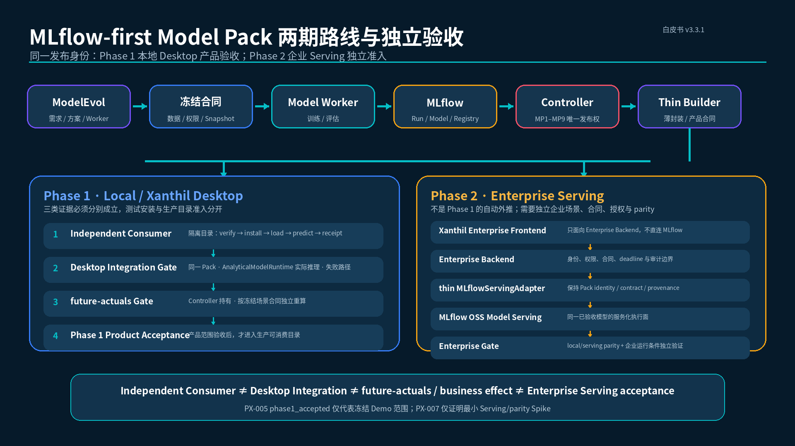
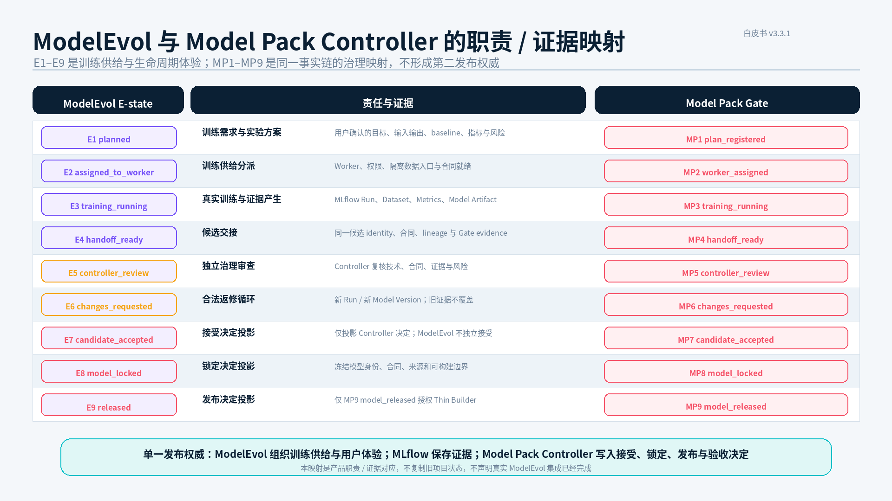
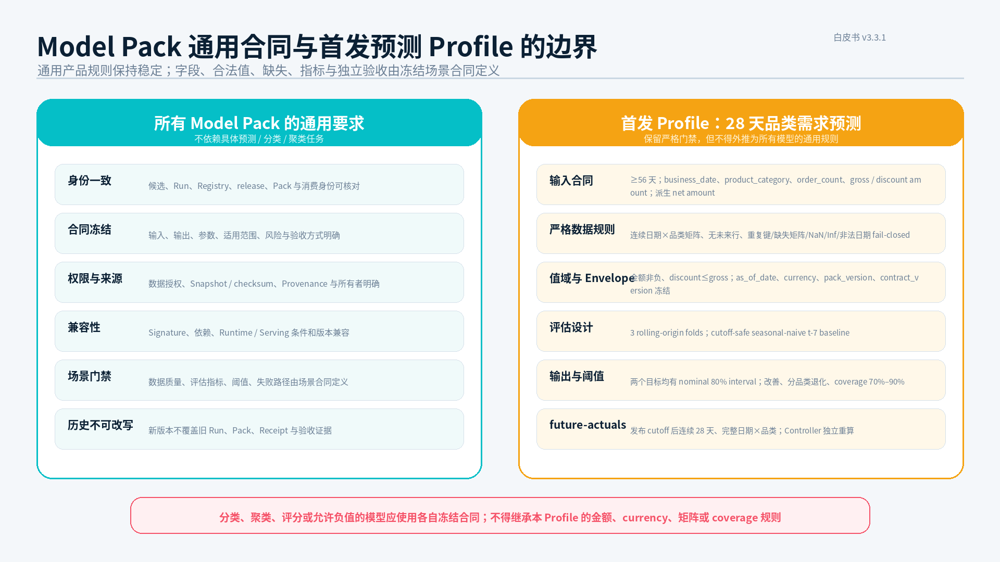
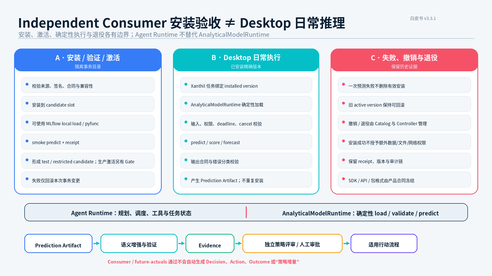
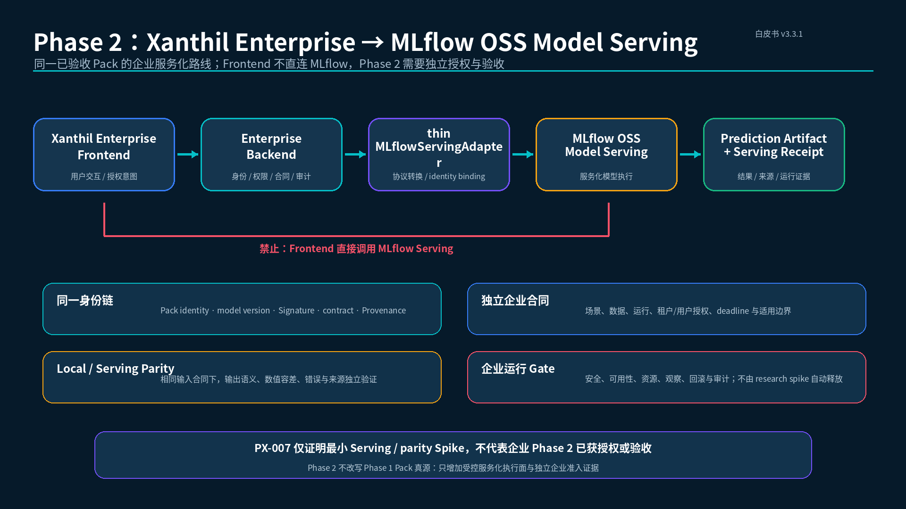
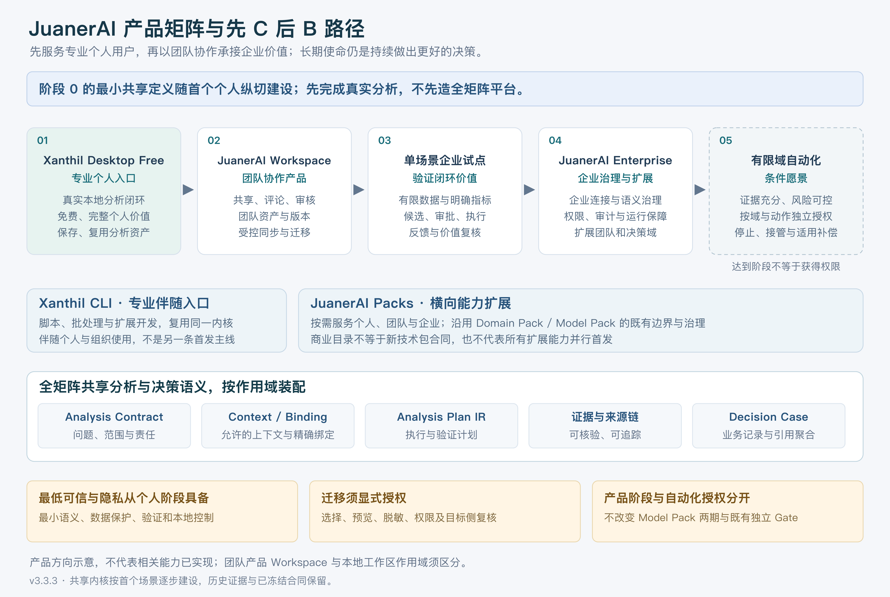

# JuanerAI 白皮书 v3.3.3：从个人可信分析到企业经营与决策闭环

> **白皮书 v3.3.3 · 产品矩阵与先 C 后 B 战略版**

## 面向运营、商品、营销、供应链、专业分析与经营管理者的目标管理、分析验证、策略优化、执行落地与组织学习白皮书

**产品基线：** JuanerAI v3.3  
**白皮书版本：** v3.3.3  
**版本承接：** v3.3.2（保留 OSM 零售融合及此前 Model Pack / Context 边界，新增产品矩阵与开发优先顺序）  
**修订日期：** 2026 年 9 月 17 日  
**基线快照：** v3.3 原文与源文件保留，不覆盖  
**文档性质：** 产品定义与推荐架构  
**定位：** 多年数据分析实践、企业经营管理思想与 AI Agent 工程体系的统一总结

> **实现状态与授权边界**  
> 本白皮书描述 JuanerAI 的产品定义、逻辑边界与推荐架构。v3.3.3 按用户要求采用“先 C 后 B”的产品矩阵与推进顺序，承接 v3.3.2 的 OSM 零售融合及此前 Model Pack 两期、语义上下文和证据治理边界。战略顺序在本版本生效；正式在研计划、冻结合同及任务仍须在合适检查点显式采用，不由主稿更新自动替换。文档定义不代表能力已经实现，不构成新 Demo、真实数据/用户试用、外部调用、部署或 Handoff 授权；完成事实以独立实现、验证、验收和发布证据为准。

> **v3.3 主版本主题**  
> v3.3 在 v3.2 语义上下文运行架构基础上完成三项能力收敛：第一，将 DAME 正式定义为六类数据分析方法体系及其版本化 Method Asset 注册与编译机制；第二，只建设 **A/B Test Analysis**，即对已经产生的实验分组、曝光与结果数据进行统计评估和证据治理，暂不建设在线分流、SDK、流量路由与实时实验平台；第三，将 Model Pack 统一为 **MLflow-backed、Controller-governed、Builder-packaged、Consumer-verified** 的模型能力生命周期。

> **v3.3.1 Model Pack 一致性修订主题**  
> 本修订在不改变 DAME、A/B Test Analysis、OSM、Domain Pack 和 Semantic Context Runtime 主线的前提下，补回 Phase 1 的 Xanthil Desktop 实际集成 Gate，补回 Phase 2 Enterprise Serving 路线；把首发 28 天品类需求预测的字段、值域、时间矩阵、rolling-origin、区间 coverage 和 future-actuals 规则限定为该冻结场景合同；明确 ModelEvol、MLflow、Model Pack Controller、Thin Builder、Independent Consumer、AnalyticalModelRuntime 与 Agent Runtime 的职责；并将 2026-08-29 与 2026-08-31 两次 PX-005 历史证据快照分开列示。

> **research R2 外部证据采集修订主题**  
> 本维护修订依据 PX-2026-044 的用户产品决定，将深度研究的外部证据链明确为混合架构：确定性网络采集、原始快照与清洗在前，LLM 只对高价值、非结构化或规则低置信内容承担可替换的智能抽取；大规模规则稳定数据不默认经过 LLM。该定义不改写 PX-2026-044 已冻结的首个无 LLM Demo，也不声称真实采集或模型抽取已经通过验证。

> **v3.3.2 OSM 零售目标管理融合主题**  
> 用户于 2026-09-16 批准在既有 OSM 八模块内补充有依据的目标候选、多维目标计划与一致性、策略贡献及结果/驱动/护栏指标。通用 OSM 领域规则与零售领域能力分开，复用 DAME、Semantic Context Runtime、Domain Pack 和受控 Commit/Teach；目标候选、预测、执行结果与经验证效果分别记录。零售权重仅为有来源的参考模板，数值合同与包装粒度仍待具体场景确认；保留统一 Desktop、原会员案例、Model Pack 两期路线和历史冻结范围。[融合记录](OSM_RETAIL_INTEGRATION_CHANGE_2026-09-16.md)保存采用范围、来源和剩余验证问题。

> 该融合最初登记为 research R3，随后按用户指定定版为 v3.3.2；其内容由本版承接，旧版本及指纹保留。

> **v3.3.3 产品矩阵与先 C 后 B 主题**  
> 用户于2026-09-17明确将最新产品矩阵融入白皮书，并指定版本为v3.3.3。当前产品建设与市场验证主线是：**Xanthil Desktop Free 的个人真实价值 → JuanerAI Workspace 团队协作 → 单场景企业试点 → JuanerAI Enterprise → 有条件的有限域自动化**。CLI 是专业伴随入口，Packs 是横向能力扩展；二者不构成先于个人价值的独立平台工程。第25章替代旧CLI先行路线，说明共享核心、免费/付费、阶段门槛及正式开发采用边界；[融合与影响记录](PRODUCT_MATRIX_INTEGRATION_2026-09-17.md)保存来源、差异和研究关联。

> **核心定义**  
> JuanerAI 帮助数据驱动决策者持续做出更好的决策。它以本地优先、语义与证据约束的个人分析和决策副驾驶为入口，逐步形成团队共享能力与目标牵引的企业经营决策闭环。
>
> 用户可以从一个真实业务问题开始，无需先部署企业系统或补齐OSM目标；在团队和企业场景中，系统进一步连接经营目标、差距、策略、受控行动与结果反馈。完整企业经营系统是长期方向，不是首个市场入口的建设前提。

> **用户定义**  
> 在 JuanerAI 中，“数据分析师”不是狭义岗位，而是一种能力身份。凡是使用数据理解业务、形成判断、制定策略并推动行动的人——运营、商品、营销、供应链、产品、门店、财务、专业分析和经营管理者——都是 JuanerAI 所服务的数据驱动决策者。

> **统一产品边界**  
> Xanthil Desktop 是 JuanerAI 面向用户的统一数据分析工作台；DAME 是通用分析方法真源，采用六类方法体系；A/B Test Analysis 是 DAME 的因果与实验方法，不等于实验平台；Domain Pack 是被工作台选择和装配的领域能力包；Model Pack 以 MLflow Model、Signature、依赖、Run / Registry 证据和本地加载 / Serving 能力为基础，通过 ModelEvol 组织训练供给、Model Pack Controller 完成最终接受与发布、Thin Builder 增加必要产品合同、Independent Consumer 与 Desktop / Enterprise Gate 分别验收，最终供 Xanthil 本地或企业执行面调用；四库是企业共享认知底座，双库是经过验证的决策资产；Semantic Context Runtime 负责按当前任务解析与绑定这些能力和资产。

---

# 执行摘要

**v3.3.3 的建设顺序是先服务专业个人用户，再承接团队和企业。** 此处C端是数据分析师、运营、商品、营销、供应链、财务等个人专业用户，不是泛娱乐消费市场。Xanthil Desktop Free 提供完整、可信的本地个人分析价值；JuanerAI Workspace 承接共享、审核与团队决策记忆；Enterprise 在已验证的具体场景上增加企业连接、治理、执行与反馈。CLI和Packs共享既有内核，不另起一套平台。免费获客能否形成留存、团队付费与企业转化，仍须以真实使用数据验证，不能由Demo数量或下载量推定。

多年的数据分析工作让我逐渐认识到，企业真正缺少的从来不是更多报表，也不仅是一个能够用自然语言回答问题的 AI。

企业真正稀缺的是一套能够持续运行的经营机制：它既要让组织明确“要到哪里”，又要持续回答“现在差多少”“为什么存在差距”“下一步应该采取什么策略”“策略是否真正执行”“最终是否创造了经营价值”。

JuanerAI 3.0 通过 OSM 补上目标与战略执行控制层；JuanerAI 3.1 统一 Xanthil Desktop、Domain Pack、四库、双库与企业 Ontology 的产品边界；JuanerAI 3.2 通过 Semantic Context Runtime 补齐四库、双库、Domain Pack 与本地执行的动态协作。JuanerAI 3.3 在此基础上进一步补齐“专业分析方法如何成为正式资产”“已有实验数据如何形成可信因果证据”“训练完成的模型如何经治理成为 Xanthil 可调用能力”三项关键链路。

没有这一接缝，Xanthil Desktop 或 Analysis Core 容易直接依赖 DuckDB、Semantica 或其他存储 API，四库也容易被误解为四个并列检索工具。加入 Semantic Context Runtime 后，分析方法、企业认知资产和具体技术实现被清晰分离：

```text
用户 / OSM Gap
        ↓
Xanthil Desktop：项目、会话、任务与用户确认
        ↓
草拟 Analysis Contract + 可选 Domain Pack 精确版本
        ↓
Context Request
        ↓
Semantic Context Runtime（Xanthil Context Bridge）
Context Resolve → Context Bundle → Semantic Binding
        ↓
Analysis Core 完成 Analysis Contract / Analysis Plan IR
        ↓
Agent Runtime / Local Code Runtime 执行 SQL、Python、模型与研究
        ↓
Semantic Enrichment + Provenance + Validator
        ↓
Xanthil Desktop 展示证据、结论、策略与审批
        ↓
Context Commit Gate：按资产类型受控回流
```

其中：

- **Xanthil Desktop** 负责项目、会话、任务、Analysis Contract、Analysis Plan IR、执行、证据、结果、审批和 Teach 的统一入口；
- **Domain Pack** 没有独立工作台或专属业务页面；安装只代表可发现、可推荐和可选择，只有用户确认精确版本并绑定任务后，相关领域声明才进入 Contract、Context Request 与 IR；
- **Semantic Context Runtime** 按任务从 Ontology、Knowledge、Memory、Database Catalog 及双库中解析所需上下文，形成带版本与来源的 Context Bundle，并负责语义到物理数据、物理结果到业务语义的双向绑定；
- **四库** 保存企业持续演化的事实、共同语义、知识和记忆，是多个工作台、多个 Domain Pack 和多个分析任务共享的认知底座；
- **双库** 独立于四库，保存经过验证的原因与经过真实经营结果检验的策略；
- **Semantica** 可以作为 Ontology、Knowledge、Memory、Context Graph、Provenance 等能力的工程实现组件，但不等于四库，也不拥有企业语义定义权；
- **DuckDB / Python** 等承担本地事实计算，它们通过 Data Port 的 Adapter 被调用，而不是被 Analysis Core 直接耦合；
- **DAME** 将通用方法沉淀为六类 Method Asset，由 Method Router 选择并编译进 Analysis Plan IR；
- **A/B Test Analysis** 只分析已经产生的实验数据，提供样本、SRM、功效、显著性、置信区间、护栏和业务价值判断，不承担在线分流与曝光采集；
- **ModelEvol** 组织训练需求、方案、Worker 分派、训练尝试和返修体验；训练原始行进入隔离数据入口，Agent 默认只使用 schema、画像、质量、权限和 checksum 摘要；ModelEvol 不拥有最终产品发布权；
- **MLflow** 记录 Experiment、Run、Dataset、LoggedModel、Signature、依赖与 Registry Version，并提供原始模型的本地加载和 OSS Serving 能力；JuanerAI 采用薄封装，不重建第二套 Tracking / Registry；
- **Model Pack Controller** 是候选接受、锁定、产品发布及后续验收的唯一治理权威；Thin Builder 只增加 MLflow 未负责的产品合同、准入、Provenance 和完整性信息；
- **Phase 1** 将 Independent Consumer 安装验收、Xanthil Desktop 通过独立 AnalyticalModelRuntime 的实际集成验收、Controller-held future-actuals 和最终产品验收作为不同证据；
- **Phase 2** 由 Xanthil Enterprise Frontend 经 Enterprise Backend 与 thin MLflowServingAdapter 调用 MLflow OSS Model Serving；Frontend 不直连 MLflow，企业场景、授权、运行合同及 local / serving parity 需要独立验收；
- **Runtime** 执行已经完成上下文解析、方法选择、语义绑定和门禁确认的计划；Agent Runtime 负责规划与调度，AnalyticalModelRuntime 负责已安装精确 Model Pack 的确定性加载、输入输出校验和推理，二者不拥有领域方法、企业语义或业务决策权；
- **Context Commit Gate 与 Teach** 共同约束回流：一次性结果不会自动成为企业知识，长期资产变更必须经过类型识别、所有权检查、验证和发布治理。

JuanerAI 3.3 的核心公式是：

> **JuanerAI 3.3 = OSM + Xanthil Desktop + DAME 六类方法体系 + A/B Test Analysis + Domain Packs + MLflow-first Model Pack System + Semantic Context Runtime + 四库 + 双库 + Agent Runtime + 可信治理与 Teach**

它的核心结构可以归纳为：

- 一个使命：提高企业决策质量与经营结果；
- 一个统一工作台：Xanthil Desktop；
- 一条产品价值路径：个人 Desktop Free → 团队 Workspace → 单场景企业试点 → Enterprise；CLI和Packs横向支撑，共享内核；
- 两类入口：目标差距驱动、问题与探索驱动；
- 三种分析模式：自主探索、假设先行、深度研究；
- 六类数据分析方法：描述监测、诊断分解、因果实验、预测评分、探索细分、决策优化；
- 一项首发实验能力：A/B Test Analysis，仅处理已产生实验数据；
- 三条持续循环：目标管理循环、决策行动循环、能力进化循环；
- 四类共享认知资产：Database、Ontology、Knowledge、Memory；
- 两类经过验证的决策资产：Hypothesis Library、Strategy Library；
- 一类领域能力装配单元：Domain Pack；
- 一套 MLflow-first Model Pack 两期生命周期：ModelEvol 训练供给、Model Worker、MLflow 证据、Controller、Thin Builder、Independent Consumer、Desktop Integration、future-actuals，以及独立的 Enterprise Serving / parity 路线；
- 一个语义上下文运行时：Context Resolve、Context Bundle、Semantic Binding、Enrichment、Commit Gate 与 Provenance；
- 一套目标与经营对象模型：Strategy Intent、Objective、Measure、Driver、Gap、Strategy、Action、Outcome；
- 一套 Analysis Contract、Analysis Plan IR、上下文快照与资产绑定清单；
- 一条六级可信裁判链；
- 一套 Teach 测试驱动进化机制；
- 一个本地优先、Contract 稳定且 Adapter 可替换的模型与 Agent 执行底座。


> **JuanerAI 3.3 的根本使命**  
> 不是让企业生成更多分析报告，也不是让用户理解四种存储技术，而是让所有使用数据做决策的人在同一个 Xanthil Desktop 中，围绕共同目标调用可治理的领域能力，由语义上下文运行时把企业事实、语义、知识、记忆与决策资产组合成可执行、可验证、可重放的分析语境，持续发现差距、验证原因、优化策略、推动执行，并从真实结果中学习。

# 第一篇：为什么需要 JuanerAI 3.3

## 第一章 数据分析不是一个岗位，而是一种企业能力

传统组织通常把“数据分析师”理解为一个专职岗位。这种定义过于狭窄，也无法覆盖企业真实发生的数据工作。

在企业日常经营中，大量分析活动由业务岗位完成：

| 角色 | 典型分析活动 | 典型决策 |
|---|---|---|
| 运营 | 活动复盘、用户分层、留存与转化分析 | 运营节奏、人群触达、权益设计 |
| 商品 | 商品结构、售罄、折扣、库存与连带分析 | 选品、定价、折扣、配货与清货 |
| 营销 | 渠道效果、人群洞察、投放 ROI、品牌增长 | 预算分配、渠道选择、创意与人群策略 |
| 供应链 | 需求预测、库存周转、补货、调拨与履约分析 | 采购、补货、产能和履约安排 |
| 产品 | 用户行为、漏斗、留存、功能效果分析 | 产品优先级、体验优化、功能迭代 |
| 门店与区域 | 门店经营、客群、坪效、货品和人员分析 | 门店策略、货品调整、区域资源配置 |
| 财务 | 收入、利润、成本、预算与偏差分析 | 预算控制、成本优化、资源配置 |
| 专业分析 | SQL、Python、统计、实验、模型与归因 | 方法设计、复杂诊断、模型决策支持 |
| 经营管理 | 目标达成、业务组合、风险和资源效率分析 | 战略选择、资源配置、组织协同 |

这些角色的工具熟练度不同，但都在经历相同的经营链路：

> 目标理解 → 观察结果 → 发现差距 → 形成解释 → 评估证据 → 选择策略 → 推动执行 → 检查结果

因此，JuanerAI 对“数据分析者”的定义不是组织岗位定义，而是能力定义：

> **只要一个人需要用数据发现问题、验证判断、制定策略并评估结果，他就是广义数据分析者。**

这项定义直接决定产品设计：

1. 不以 SQL 或 Python 能力作为使用门槛；
2. 不为了易用性而降低专业分析标准；
3. 所有角色通过 Xanthil Desktop 共享同一个 Analysis Core、OSM 对象体系与可信治理标准；
4. 不同角色只在交互深度、权限、解释方式和审批责任上存在差异；
5. 专业分析人员在 Xanthil Desktop 高级模式或 Xanthil CLI 中使用代码、模型、方法与验证治理能力；
6. 业务人员始终在 Xanthil Desktop 中，通过目标、业务对象、指标、假设、证据和策略视图参与分析；
7. 管理者在 Xanthil Desktop 的目标与决策视图中审查目标、证据、资源、风险、方案和经营结果。


---

## 第二章 企业经营与数据分析长期存在的七个断点

### 2.1 战略目标与日常经营断开

企业通常有年度战略、部门目标、KPI 或 OKR，但这些目标很难与日常数据、分析任务、具体策略和执行动作持续连接。

目标常常停留在文档、会议或绩效系统中；数据分析则以临时需求方式发生。结果是：

- 不知道哪些分析最值得优先做；
- 指标变红以后只做解释，没有形成行动；
- 部门目标之间存在冲突却无法显式识别；
- 目标调整缺少数据与证据支持；
- 经营复盘只能描述结果，无法复盘假设和策略。

### 2.2 数据与业务语义断开

同一个“会员”“销售额”“复购率”“有效门店”或“活动转化”，在不同系统、部门和人员之间可能存在不同定义。数据可以被查询，但查询结果未必代表同一个业务事实。

### 2.3 业务问题与分析方法断开

业务人员提出“为什么复购下降”“哪些商品需要清货”“哪个渠道值得增加预算”，传统工具通常直接进入取数或报表环节。

但不同问题需要不同方法：有的问题应先提出假设，有的问题需要外部研究，有的问题没有明确框架，应先自主探索。问题没有被正确分类，计算越快，可能只是更快地得到错误答案。

### 2.4 分析结论与证据责任断开

很多分析报告给出了结论，却没有清晰回答：

- 使用了哪些数据；
- 指标口径是什么；
- 有哪些支持证据；
- 哪些证据可能推翻结论；
- 是否存在替代解释；
- 结论适用于什么范围；
- 当前是确认、否定，还是证据不足。

### 2.5 分析结果与业务行动断开

传统分析常以报告或会议结束。即使提出建议，也可能没有形成明确的执行对象、责任人、资源、时间、成本、权限和验收标准。

### 2.6 业务执行与经营结果断开

策略是否被采用、执行是否到位、结果是否有增量、成本是否合理，往往没有重新回到分析系统。企业无法区分：

- 原因判断错误；
- 策略选择错误；
- 执行不到位；
- 外部环境变化；
- 目标或观察周期本身不合理。

### 2.7 个人经验与组织能力断开

最有价值的经营经验通常存在于人的头脑中：

- 哪类异常值得优先关注；
- 某种目标差距通常有哪些原因；
- 哪些指标容易误读；
- 什么证据足以支持结论；
- 哪些策略在什么条件下有效；
- 哪些失败已经发生过，不应再次发生。

当这些经验没有被结构化、验证和版本化，它们就会随人员流动而消失。

> **JuanerAI 3.3 的所有模块，本质上都是对这七个断点的制度化回答。**

---

## 第三章 传统 BI、AI 问数与 JuanerAI 3.3

传统 BI、AI 问数和 JuanerAI 不是同一层级的替代关系，而是解决三个不同层级的问题。

| 维度 | 传统 BI | AI 问数 | JuanerAI 3.3 |
|---|---|---|---|
| 核心对象 | 指标、报表、看板 | 自然语言问题、对话、SQL | 目标、差距、Analysis IR、决策资产 |
| 主要能力 | 展示与监控 | 降低查询门槛、加快回答 | 管理目标，诊断差距，形成策略并跟踪结果 |
| 典型输出 | 图表和看板 | 答案、SQL、图表 | 证据化结论、策略组合、行动与效果 |
| 工作终点 | 看见发生了什么 | 完成一次问答 | 经营结果回流并进入下一轮优化 |
| 长期沉淀 | 数据资产和报表资产 | 会话记录 | 目标、假设、策略、效果与方法资产 |
| 可信方式 | 固定口径和报表审核 | 模型回答与 SQL 可见 | 六级裁判、证据链、重放、HITL 和 Teach |
| 用户范围 | 管理者和业务查看者 | 查询数据的人 | 所有围绕目标使用数据做决策的人 |


三者可以被概括为：

> **传统 BI 让数据可见，AI 问数让查询更快，JuanerAI 让组织围绕目标持续做出更好的决策。**

JuanerAI 不需要替代企业已有 BI。它可以把 BI 的指标和看板作为“观察层”，在指标出现差距时，继续向下连接原因分析、策略和执行。

---

## 第四章 JuanerAI 3.3 的定位、边界与版本演进

### 4.1 一句话定义

> **JuanerAI 是帮助数据驱动决策者持续做出更好决策的智能决策系统，以个人可信分析为入口，逐步连接团队与企业的目标、策略和执行。**

它把专业数据分析方法、企业经营目标、一线业务经验、统一业务语义、本地计算、AI Agent、证据治理和策略反馈连接为一套完整系统；以 Xanthil Desktop 作为统一用户工作台，以 Domain Pack 作为领域能力装配方式，以 Semantic Context Runtime 作为 Analysis Core 与共享认知资产、决策资产及本地执行之间的稳定接缝。

### 4.2 JuanerAI 不是什么

JuanerAI 不是：

- 数据仓库或 BI 的替代品；
- 传统目标管理软件增加一个 AI 聊天框；
- 只管理 OKR、KPI 或绩效考核的系统；
- 一次性自然语言问数工具；
- 只服务专职数据分析师的专业软件；
- 为商品、会员、库存、营销分别复制一套工作台的产品集合；
- 把 Domain Pack 当成页面、应用或第二套数据与语义底座的插件系统；
- 让 Xanthil Core 直接依赖 DuckDB、Semantica 或某个特定存储框架的单体应用；
- 把四库当成四个无差别并列检索源，或把 Context Bundle 当成第五个长期资产库；
- 让所有分析结果自动写入 Memory、Knowledge 或 Ontology 的无门禁学习系统；
- 让大模型自由访问企业数据的通用 Agent；
- 只有算法训练和模型注册的 MLOps 平台；
- 自动取代人类管理责任的无人决策系统。

### 4.3 版本演进

| 版本 | 核心定位 | 解决的主要问题 |
|---|---|---|
| JuanerAI 1.0 | AI 数据分析助手 | 帮助个人更快取数、分析和表达 |
| JuanerAI 2.0 | 数据分析与决策操作系统 | 把问题、分析、证据、策略、执行和学习连接起来 |
| JuanerAI 3.0 | 目标驱动的企业经营与决策操作系统 | 通过 OSM 从战略目标出发管理差距、策略、行动和经营结果 |
| JuanerAI 3.1 | 统一工作台与领域能力装配架构 | 统一 Xanthil Desktop、Domain Pack、四库双库、企业 Ontology、Semantica、版本快照与 Teach 回流边界 |
| JuanerAI 3.2 | 语义上下文运行与四库协同架构 | 通过 Semantic Context Runtime 把上下文解析、语义绑定、本地执行、证据增强、来源追踪和受控回流连接成稳定运行链 |
| **JuanerAI 3.3** | **方法、实验分析与模型能力治理架构** | **正式建立 DAME 六类方法体系、A/B Test Analysis 边界，以及 MLflow-backed Model Pack 从训练证据到 Xanthil 消费的完整生命周期** |

**白皮书 v3.3.1（MP-ALIGN-01）不是新的产品主版本。** 上游交付保留 JuanerAI 3.3 产品基线，修复 Model Pack 在 Phase 1 Desktop Gate、Phase 2 Enterprise Serving、通用合同 / 首发 Profile、ModelEvol / Controller 权威、Consumer / Desktop Runtime 和 MLflow-first 薄封装方面的文档一致性；research R2 记录 PX-2026-044 已确认的外部证据混合采集边界，R3 融合已批准的 OSM 零售目标管理增强，均保留产品主版本和原有实施授权边界。

**白皮书 v3.3.2** 于2026-09-16承接 research R3，纳入 OSM 目标形成、多维计划一致性、策略贡献承接与零售参考案例。

**白皮书 v3.3.3 为当前版本。** 用户于2026-09-17指定采用“先 C 后 B”的产品矩阵和推进顺序。第25章的个人→团队→企业路线替代旧版CLI先行及OSM早于团队的阶段安排；产品架构仍复用JuanerAI 3.3的共享能力，Model Pack两期和正式冻结合同不因商业阶段名称而迁移。研究侧战略已更新，正式侧仍待合适检查点显式采用。

v3.3 是产品定义和推荐架构的进一步收敛，不等于所述能力已经全部完成开发或正式发布。

### 4.4 二十二项设计原则

1. **Objective Driven**：分析优先服务明确目标、差距和决策用途；
2. **Unified Workbench**：用户面向分析任务的统一工作台是 Xanthil Desktop；
3. **Analysis First**：先定义问题、证据要求与方法，再选择工具与模型；
4. **Domain Capability as Pack**：领域能力通过 Domain Pack 装配，不硬编码进 Xanthil Core；
5. **Shared Cognitive Foundation**：四库是企业共享认知底座，不被单个 Pack 或工作台复制；
6. **Single Semantic Truth**：企业 Ontology 是共同语义真源，Pack 只提供领域本体模块或语义契约；
7. **Context Before Execution**：正式执行前必须把当前任务需要的事实目录、语义、知识、记忆和决策资产解析成可审查的 Context Bundle；
8. **Stable Contracts, Replaceable Adapters**：Xanthil Core 只依赖 JuanerAI 定义的稳定 Contract 与 Port，不直接依赖 DuckDB、Semantica、MLflow 或其他供应方 API；
9. **Bidirectional Semantic Binding**：系统既要把业务概念解析为表、字段、公式、Join 和 Filter，也要把物理结果还原为业务对象、指标和证据含义；
10. **Role-Specific Authority**：Database、Ontology、Knowledge、Memory 与双库各有不同的事实权威和写入责任，不能互相替代；
11. **Decision Oriented**：报告和预测是中间产物，独立策略评审、人工审批、行动与经营结果才构成决策闭环；
12. **Local First**：原始数据与主要计算默认留在本地或企业受控环境；
13. **Evidence First**：关键结论必须具有支持证据、反证、来源与适用边界；
14. **Explicit Binding & Replay**：任务明确绑定能力包、Context Bundle、语义映射和资产快照，历史任务不可被新版本静默改写；
15. **Governed Commit**：一次性分析结果不得自动升级为长期知识、企业语义或领域能力，所有持久化回流必须经过 Context Commit Gate 与相应治理；
16. **Method as Versioned Asset**：分析方法必须具有身份、版本、前提、步骤、证据角色、实现适配和验证门禁；
17. **Analysis, Not Experiment Platform**：v3.3 的 A/B 能力只评估已有实验数据，不建设在线分流、SDK、流量路由或实时曝光平台；
18. **MLflow-first Thin Wrapping**：优先引用或封装原始 MLflow Model，复用 Signature、依赖、精确版本、本地加载和 OSS Serving；JuanerAI 只增加 MLflow 未负责的产品合同、治理、准入、Provenance 与离线完整性信息；
19. **Single Model Release Authority**：ModelEvol 组织训练供给和生命周期体验，MLflow 保存证据，Model Pack Controller 独占候选接受、锁定、产品发布和验收决定；
20. **Separate Install, Activate & Execute**：Independent Consumer 的隔离安装验收、Desktop 安装激活和 AnalyticalModelRuntime 日常推理相互区分；失败只回滚本次事务，不删除既有有效安装或历史证据；
21. **Independent Phase Gates**：Independent Consumer、Desktop 实际集成、future-actuals / 业务效果、生产目录准入和 Enterprise Serving 是不同证据，不得互相替代；
22. **Human Governed & Feedback Driven**：目标设定、高责任结论、高风险动作、模型发布和长期资产变更保留人类责任，并让真实结果进入下一轮学习。

# 第二篇：OSM——JuanerAI 3.3 的目标与经营控制中枢

## 第五章 OSM 的正式定义

JuanerAI OSM 的全称为：

> **Objective & Strategy Management System，目标与策略管理系统。**

它的使命是：

> **将企业战略转化为可衡量的经营目标，将目标差距转化为分析任务，将分析结论转化为策略与行动，并根据真实经营结果持续调整目标、策略与认知。**

OSM 不是一个附属看板，也不是 Xanthil Desktop 内部的一项普通分析功能。它是 JuanerAI 顶层的目标与经营领域；其目标、风险、策略和复盘视图可以由 Xanthil Desktop 统一呈现，但 OSM 仍然拥有目标与经营管理对象。它负责告诉分析、模型和 Agent：

- 企业为什么要分析；
- 当前最重要的目标是什么；
- 哪些目标存在风险；
- 当前差距有多大；
- 哪些问题应该优先被分析；
- 策略之间如何做资源与风险取舍；
- 行动是否完成；
- 结果是否真正贡献目标。

### 5.1 OSM 与其他管理工具的关系

| 管理机制 | 主要解决的问题 | 在 JuanerAI OSM 中的作用 |
|---|---|---|
| OKR | 目标表达、对齐和周期管理 | 可作为目标模板与对齐机制 |
| KPI | 经营结果量化 | 作为目标衡量、跟踪和预警指标 |
| BSC | 将战略转化为多维目标和指标 | 用于战略地图和目标体系设计 |
| OGSM | Objective、Goals、Strategies、Measures 的连接 | 用于目标、策略与衡量的结构化表达 |
| PDCA | 计划、执行、检查、改进 | 作为经营闭环的基本运行节奏 |
| OODA | 动态环境中的观察、判断、决策和行动 | 支撑高频经营调整 |
| 项目管理 | 任务、进度、依赖和资源 | 承接策略的执行落地 |
| JuanerAI OSM | 目标到分析、策略、行动、结果和学习 | 连接并增强上述机制 |

OSM 不需要取代企业现有的 OKR、预算、项目管理或绩效系统。它应通过 Adapter 接入这些系统，并补上它们普遍缺少的“差距诊断—证据判断—策略优化—结果学习”能力。

### 5.2 通用 OSM 领域与零售目标规划能力

OSM 吸收“目标—策略—度量”（Objective–Strategy–Measure）的管理表达方法，其正式产品全称仍为 **Objective & Strategy Management System**。零售目标管理增强把“如何提出目标、如何使多个业务视图一致、如何用策略承接增长要求”补入原有八模块。

| 责任主体 | 拥有的能力 | 协作边界 |
|---|---|---|
| OSM 通用领域 | 目标候选、目标计划及切片、约束、策略组合、指标绑定、批准、版本、行动与复盘 | 负责领域完整性和一致性规则；不取得企业语义、通用方法或模型发布权威 |
| 零售目标规划领域能力 | 三情参考规则、商品/渠道/营销维度、适用条件、策略与指标模板、失败样例 | 按 Domain Pack 规范声明与绑定；独立 Pack 或现有 Pack 子能力的交付粒度另行确定 |
| Analysis Core / DAME | 通用分解、预测、优化与效果评估的方法选择和验证要求 | 经 Contract、Context 和 IR 使用；简单领域汇总检查无需强制建立分析任务 |
| Semantic Context Runtime / 执行 Runtime | 解析共享资产、语义绑定、物化及执行、来源与证据增强 | 需要模型时沿已批准 Model Pack 路线消费精确身份，不由 OSM 越过模型 Gate |
| Xanthil Desktop / G 治理平面 | 统一交互、审查、批准，以及跨资产的可信治理与 Teach | “OSM Workbench”仅指 Desktop 中的 OSM 视图，不新增独立工作台或总控权威 |

零售是领域参考，不成为 JuanerAI 唯一行业；它不替换会员增长参考 Pack、既有首发分析场景或 Model Pack 两期路线。规则、页面和逻辑能力不预先等同于独立服务、固定数据库或新的基础平台。

---

## 第六章 OSM 八大核心模块


### 6.1 目标制定中心

将战略意图转化为正式、可计算的目标对象。每个目标至少包含：

- 目标名称与说明；
- 目标类型与层级；
- 目标周期；
- 基线值、目标值和容忍区间；
- 关联指标和计算口径；
- 责任人、协同组织和审批人；
- 资源约束、风险边界与决策期限；
- 当前状态与版本。

#### 6.1.1 有依据的目标候选

目标形成过程应可复算、可解释、可拒绝：

```text
可比经营事实 / 外部信息 / 战略要求
→ 来源与适用性核对
→ 精确版本的规则或方法生成候选
→ 资源、风险、口径与一致性检查
→ 有理由和责任人的人工调整
→ 批准后形成正式目标及目标计划版本
```

每个候选保存来源及时间范围、指标与 Binding、规则/方法版本、参数、计算过程、调整前后值、调整理由、约束检查和审批记录。输入、规则或约束发生实质变化时重新评审，不沿用旧批准覆盖新结果；历史目标与形成依据保持可追溯。

三情（企业自身经营、行业/市场、竞争信息）是零售参考输入，不是所有目标的必选来源。来源需核对统计期间、经营范围、单位、税费/退货及可比性；缺数、过期或口径冲突应显式列出，不能静默补值、重新分配权重或按正常状态呈现。

目标候选表达管理意图，不等于 Forecast。未经合格方法支持的目标范围只表示情景或管理区间，不能称统计置信区间。参考权重、达成率修正与上下限的来源及待定计算口径见附录 K；未定义的算法不能直接进入正式计算。

### 6.2 目标拆解与对齐中心

目标不应只是孤立指标，而应形成目标树和贡献关系：

```text
公司目标：提升年度利润
├─ 收入增长
│  ├─ 新客增长
│  ├─ 会员复购
│  └─ 客单价提升
├─ 毛利改善
│  ├─ 正价销售占比
│  ├─ 折扣控制
│  └─ 商品结构优化
└─ 经营效率
   ├─ 库存周转
   ├─ 门店坪效
   └─ 营销投入产出
```

系统需要显式记录：

- 上下级目标；
- 贡献关系和权重；
- 必要条件与依赖；
- 目标冲突；
- 协同部门；
- 资源竞争；
- 领先指标和滞后指标。

#### 6.2.1 同一目标计划的多维拆解与一致性

目标树之外，同一目标可按商品、渠道、营销、时间和组织形成多维计划。**各视图引用同一版本化目标计划及共同明细空间，而非维护三套独立的正式目标。** Target Cube 是该计划的逻辑多维视图，本定义不冻结存储结构或求解器。



一致性规则至少明确：

- 同一指标语义及聚合规则、目标/方案版本、统计周期、组织边界与量纲；
- 共同明细粒度、上下层关系、互斥且完备的分区，以及未分配/未知余额；
- 商品多标签、活动重叠和跨渠道归属的分配方式，区分展示标签与可加分配维度；
- 锁定切片、资源与护栏约束、舍入尾差及冲突处理；
- 修订理由、批准和新版本，保留旧计划与快照。

同一可加指标的互斥完备切片可以加总；商品、渠道、营销三个全量投影视图不能彼此再相加。复购率、毛利率等比率需按分子/分母聚合，库存等存量不能沿时间任意求和。三个视图总额相同只证明边际汇总相同，不能证明交叉分配或锁定约束可行。

部门提交的不同总额应保留为待协调草案。冲突或不可满足约束要显示原因、影响和待决事项；调整生成新候选，批准后形成新版本，不静默归一或修改历史。这里的“咬合”指同一计划中业务维度、目标分配和约束的一致性。

### 6.3 指标与经营驱动树

目标不能只绑定一组 KPI，而应建立：

> **目标 → 结果指标 → 驱动指标 → 可干预因素 → 业务动作**

例如销售额目标可以拆解为：

```text
销售额
├─ 客流量
│  ├─ 拉新人数
│  ├─ 到店率
│  └─ 活动覆盖率
├─ 转化率
│  ├─ 商品匹配度
│  ├─ 导购触达
│  └─ 缺货率
├─ 客单价
│  ├─ 件单价
│  └─ 连带率
└─ 复购频次
   ├─ 会员活跃
   ├─ 新品供给
   └─ 运营触达
```

驱动树不是静态公式。每条驱动关系都应记录来源、证据强度、适用场景和可被证伪的条件。

#### 6.3.1 指标角色与权威分工

| 指标角色 | 回答的问题 | 判断边界 |
|---|---|---|
| 结果型指标（Outcome Metric） | 目标达成到什么程度 | 是 Measure 在当前目标中的角色，不等于行动后的 Outcome 结果对象 |
| 驱动型指标（Driver Metric） | 哪些过程或因素可能解释变化 | 改善提供诊断线索，不自动证明策略增量或因果关系 |
| 护栏型指标（Guardrail Metric） | 是否损害不可接受的经营边界 | 缺失不能视为正常，越界不能因主指标增长而被忽略 |

同一指标在不同目标下可承担不同角色。目标/策略应声明角色及适用性，缺失项记录理由；是否三类全部必填，由具体领域场景合同规定，不编造指标以满足统一表单。

指标定义、公式、粒度与语义版本引用企业 Ontology/指标权威；物理来源与计算映射引用 Semantic Binding；OSM 保存具体目标或策略的周期、基线、目标值、阈值与责任绑定。Metric Contract 可以汇集这些引用，但不再创建一套独立可改的指标真源。

### 6.4 目标跟踪与预测中心

目标页面不仅展示红黄绿灯，还应同时展示：

- 目标值、实际值、完成率；
- 时间进度；
- 预测完成值；
- 当前差距和差距趋势；
- 风险等级；
- 主要驱动变化；
- 当前策略与行动状态；
- 责任人与下一次复盘时间。

系统要回答的不是“为什么变红”这一句话，而是：

> **差距由什么驱动，应该优先做什么，谁来做，做完以后是否有效。**

目标值、实际值与预测值分别保存来源、周期和版本。实际进度与同期已批准进度目标比较；期末预测与同一终点目标比较；全年目标减历史基线是规划增长要求，不能冒充实时进度差距或策略增量。预测需保留方法和数据身份；不可用时明确显示未计算/不可用。数据或口径变化产生新快照，旧快照保留，缺数不报正常。

### 6.5 差距识别与分析触发引擎

OSM 持续识别：

- 绝对差距；
- 时间进度差距；
- 预测差距；
- 同比与环比差距；
- 结构差距；
- 部门、区域、人群、商品和渠道差距；
- 策略执行差距；
- 资源投入差距。

当数据有效、口径可比且差距达到已批准规则的触发条件时，OSM 生成 Gap Event，并在既有授权内创建分析请求与草拟 Analysis Contract：

```text
Objective
→ Metric Snapshot
→ Gap Event
→ 分析请求 / 草拟 Analysis Contract
→ Domain Pack 精确绑定（如适用）与 Context Resolve
→ Context Bundle + Semantic Binding Manifest
→ 完善并确认 Analysis Contract
→ Analysis Plan IR
→ 三模式路由
```

重复刷新遵守幂等规则，不重复生成同一触发任务。差距类型、正负方向、阈值、数据/预测窗口和重算规则由具体合同声明；自动生成请求不等于批准执行、批准策略或修改目标。完整编译和执行职责见第十一章。

### 6.6 策略生成与组合优化中心

差距分析完成后，系统不只输出一条建议，而应形成策略候选组合，并比较：

- 预期目标贡献；
- 证据强度；
- 成本与资源；
- 生效周期；
- 风险与副作用；
- 策略依赖和冲突；
- 历史执行效果；
- 不同情景下的结果。

策略库因此从“建议文档库”升级为：

> **可计算、可比较、可优化的经营策略资产库。**

#### 6.6.1 从增长要求到策略预期贡献

策略候选的预期贡献应关联同一目标与计划版本，声明业务范围、基准情景、窗口、资源、护栏、证据和不确定性。规划中分别列示历史基线、无新增策略时的预期、当前预测已包含的动作、新策略贡献及尚未承接差额。

策略可能作用于同一客户、商品和订单，贡献须按显式重叠/交互规则处理，不能简单相加或为凑齐目标而填数；合成去重规则不等于真实因果识别。允许保留未承接差额、不可满足约束和未知项。计划批准只是采纳假设，策略进入已验证资产仍须执行、观察与合格效果证据。

### 6.7 行动执行管理中心

策略需要继续编译为：

```text
Strategy
→ Initiative
→ Project / Workflow
→ Action Item
→ Execution Evidence
```

每项行动至少包括：

- 负责人和执行组织；
- 执行对象；
- 时间、资源与依赖；
- 完成标准；
- 风险与审批门禁；
- 对应目标和预期贡献；
- 验收证据；
- 当前状态。

JuanerAI 可以执行受控的数字化动作，也可以把任务同步到现有项目管理、营销、供应链或业务系统。它不应在早期重复建设完整的项目管理套件。

行动批准、任务接收、执行回执、独立确认和结果观察分别保存身份与证据。任务完成或收到回执不自动关闭 Gap，也不证明目标已实现；需要按策略窗口检查 Outcome 和 Review。

### 6.8 经营复盘与目标调整中心

复盘不只是看目标是否完成，还需要判断：

- 目标是否合理；
- 拆解和驱动关系是否正确；
- 原因假设是否成立；
- 策略是否被完整执行；
- 策略是否产生增量效果；
- 外部环境是否发生变化；
- 是否出现副作用；
- 目标、资源、策略或方法是否需要调整。

复盘同时对照目标形成依据、分配版本、预期贡献、执行证据和实际观察。区分“执行不到位”“策略无效”“目标或假设需调整”和“尚不能判断”；观察窗口未成熟、数据不足、护栏越界或没有增量依据时，不能只因结果上涨而宣称有效。继续、调整或停止的决定保留责任、理由及证据；目标调整生成经批准的新版本。

复盘结论先经 Context Commit Gate 按资产类型与 Owner 路由：新事实和效果候选面向 Database，语义修正面向企业 Ontology，文档与方法材料面向 Knowledge，任务反馈面向 Memory；只有已验证原因和真实结果验证过的行动才可分别进入假设库与策略库。可复用领域规则经 Teach、回归、影响检查和批准后形成新 Domain Pack 版本。权重校准或一次业务反馈不会自动覆盖目标、旧规则或历史任务。

---

## 第七章 从目标到结果的完整对象链

JuanerAI 3.3 的核心对象从“问题—假设—证据—结论”扩展为：

```text
Strategy Intent 战略意图
        ↓
Objective 目标
        ↓
Measure 指标
        ↓
Driver 驱动因素
        ↓
Gap 差距
        ↓
Hypothesis 原因假设
        ↓
Evidence 证据
        ↓
Finding 结论
        ↓
Strategy 策略
        ↓
Initiative 计划
        ↓
Action 行动
        ↓
Outcome 结果
        ↓
Learning 学习
```

这套对象链构成 JuanerAI 的 **Decision & Management Graph（决策与经营图谱）**。

### 7.1 自上而下的目标传导链

```text
企业战略
→ 公司目标
→ 部门与业务目标
→ 指标与驱动
→ 策略
→ 计划
→ 任务与行动
```

它回答：企业要到哪里，以及如何把方向传递到日常经营。

### 7.2 自下而上的证据反馈链

```text
业务结果
→ 执行证据
→ 指标变化
→ 策略效果
→ 原因验证
→ 目标贡献
→ 战略复盘
```

它回答：实际发生了什么，原来的目标、判断和策略是否正确。

### 7.3 两类任务入口

加入 OSM 后，JuanerAI 仍然保留两类入口：

1. **目标差距驱动**：由 OSM 发现风险，自动触发分析；
2. **问题与探索驱动**：用户主动提出非目标型问题，或通过自主探索发现新机会。

探索发现的重要机会可以反向转化为新目标；目标差距也可以进入自主探索。这使系统既不会被既定目标束缚，也不会让分析脱离经营方向。

### 7.4 目标形成与计划的语义补充

目标候选承接战略意图与依据；批准后关联正式 Objective 和版本化目标计划。计划切片描述特定业务维度的目标分配；策略预期贡献描述策略对同一计划的承接假设，并与后续 Action、Outcome、Review 连接。

“OSM Control Graph”是既有 Decision & Management Graph 中目标、计划、约束、策略与反馈的控制视图，不另建图谱真源，也不替代 Analysis Plan IR。附录 A 补充这些语义关系；对象表名、字段、API 和状态枚举须在具体实施合同中确定。

---

## 第八章 JuanerAI 中植入的核心管理思想

JuanerAI 3.3 并不是简单把管理理论贴在产品界面上，而是把多种经典思想编译为正式对象、状态、门禁和反馈机制。

| 管理思想 | JuanerAI 中的产品化机制 |
|---|---|
| PDCA | 目标与计划、策略执行、效果检查、目标/策略调整 |
| OODA | 观察指标、基于 Ontology 定向、形成决策、快速行动与再观察 |
| 科学方法 | 假设—证据—证伪与四种结论状态 |
| 循证管理 | 来源、口径、数据、方法、反证和适用边界 |
| 双环学习 | 不仅调整行动，也修正目标、指标、假设、规则和方法 |
| 系统思维 | 通过 Ontology 识别跨部门影响、目标冲突和局部最优 |
| 控制论 | 目标值、实际值、偏差、控制动作、反馈和模型更新 |
| 全面质量管理 | 六级裁判将质量内建到目标、数据、计算、证据和结果全过程 |
| 学习型组织 | 四库、双库、失败记忆，以及经测试发布的新 Domain Pack 版本 |
| 人机共治 | AI 扩大分析和执行能力，人类保留目标、价值判断和最终责任 |

> **一句话概括：PDCA 管闭环，OODA 管速度，科学方法管判断，双环学习管进化，Ontology 管全局，治理体系管责任。**

---

# 第三篇：JuanerAI 的分析智能与决策方法论

## 第九章 三种原创分析模式

JuanerAI 将分析分为三种知识生产机制。三者不是简单的按钮，而是具有不同输入、监督和验证要求的运行模式。

| 模式 | 起点 | 框架 | 监督 | 网络 | 核心产物 |
|---|---|---|---|---|---|
| 自主探索 | 数据、机会或未知问题空间 | 无预设框架 | 弱监督或无监督 | 可选 | 候选发现、异常、规律与候选假设 |
| 假设先行 | 明确原因假设 | 有框架 | 有监督 | 默认不联网 | 经内部数据验证的判断 |
| 深度研究 | 明确研究问题 | 有框架 | 可弱监督 | 可联网 | 具有外部来源、时间和反证的研究结论 |


### 9.1 自主探索：负责发现

自主探索适用于“我们还不知道应该问什么”的场景。系统围绕业务对象、指标、时间、渠道、商品、人群和门店进行组合分析，寻找异常、结构变化、分群差异、趋势拐点和新问题。

治理原则是：

> **自主探索只能产生 Candidate Finding，不能直接产生高责任决策结论。**

重要发现必须进入假设先行或深度研究完成验证。

### 9.2 假设先行：负责验证

假设先行适用于已经存在业务解释或原因判断的场景。系统明确假设适用对象、时间范围、支持证据、反证条件、替代解释和证据充分性标准。

最终状态为：

- **Confirmed**：当前证据支持假设；
- **Rejected**：当前证据否定假设；
- **Inconclusive**：证据不足，不能确认也不能否定。

### 9.3 深度研究：负责扩展证据

深度研究在内部数据之外引入行业、市场、政策、论文和竞争信息。联网不等于可信，所有外部事实必须保留来源、发布时间、适用地区、引用位置、可靠性和冲突判断。

外部证据采集采用**混合架构**：普通 HTTP、公开 API、RSS 或必要时的受控浏览器负责取得原始内容，原始字节与内容哈希先形成不可变 Source Snapshot；确定性正文清洗、OCR、表格解析和规则抽取优先处理稳定结构，只有高价值非结构化材料、规则低置信内容或需要摘要、情绪、实体和关系候选时，才路由给可替换的 LLM Extractor。高频、大规模、结构稳定的价格、库存、SKU 或纯文本采集不默认调用 LLM。

LLM Extractor 的输出始终是候选派生物，而不是来源真相。每项输出必须绑定 Source Snapshot、原文片段或页码 / 位置、模型、Prompt、Schema、Extractor 版本和运行身份；数字、日期、单位与币种应由确定性代码复核，模型允许拒答或标记无法提取。外部内容一律视为不可信数据，不能改变采集计划、调用工具、获得凭证或绕过来源权限；Schema 合法也不等于内容真实。候选只有经过来源、质量、冲突和 Context Commit Gate 后，才能进入适用的 Evidence、Knowledge Candidate 或 Data Candidate。

### 9.4 三种模式与 OSM 的协作

```text
目标差距
   ↓
已有原因假设？── 是 → 假设先行
   │
   否
   ↓
需要先发现驱动？── 是 → 自主探索
   │
   ↓
内部证据不足或受外部环境影响？── 是 → 深度研究
   ↓
形成可验证结论与策略候选
```

### 9.5 DAME：六类数据分析方法体系

DAME（Data Analysis Method Engine，数据分析方法引擎）是 JuanerAI 的通用分析方法真源。三种分析模式决定知识生产方式，DAME 六类方法决定当前任务采用什么分析技术、满足什么前提、产生什么证据以及不能得出什么结论。


| 方法族 | 核心问题 | 代表方法 | 主要产物 |
|---|---|---|---|
| **M1 描述与监测** | 发生了什么、变化在哪里 | 对比、趋势、结构、分布、交叉、漏斗、基础 Cohort | 指标现状、变化、结构与异常线索 |
| **M2 诊断与分解** | 为什么发生、由哪些部分贡献 | 杜邦/指标树、贡献分解、相关分析、异常诊断、回归解释、路径分析 | 候选驱动、贡献与替代解释 |
| **M3 因果与实验** | 是否由某因素或行动造成 | 假设检验、A/B Test Analysis、准实验、增量评估、因果影响 | 因果证据、效应量与不确定性 |
| **M4 预测与评分** | 接下来可能发生什么 | 回归预测、时间序列、分类评分、生存分析、风险预警 | 预测值、概率、区间与风险评分 |
| **M5 探索与细分** | 还有哪些未知结构、人群或路径 | 聚类、RFM、关联规则、用户路径、生命周期、队列、多维搜索 | Candidate Finding、分群和候选假设 |
| **M6 决策与优化** | 在约束下下一步怎么做 | 情景模拟、敏感性分析、策略组合、资源分配、约束优化、Uplift | 策略候选、资源方案和行动计划 |

前台可以用“看现状、找原因、验因果、看未来、找机会、做决策”帮助业务用户理解；后台 Method Registry 必须使用严格方法身份和版本管理。

### 9.6 Method Asset：方法不是一条知识说明

每一种方法都应被发布为版本化 Method Asset，至少包括：

- method identity、version、owner 和生命周期；
- 分析目的、可回答问题和不可回答问题；
- 输入对象、指标、字段、数据量和时间要求；
- 统计假设、适用条件、禁用条件和风险；
- 参数、步骤、方法组合依赖与输出契约；
- Evidence Plan 中承担支持、反证或探索的角色；
- SQL、Python、Model Pack 等一种或多种实现适配；
- 数据、计算、统计和业务验证门禁；
- 正确样例、失败样例、边界案例和回归测试。

只有名称和用途说明的条目属于 Knowledge；能够被选择、编译、执行、验证和重放的版本化对象，才属于 DAME Method Asset。

### 9.7 通用方法、领域方法与模型能力

DAME、Domain Pack 与 Model Pack 的稳定边界是：

> **DAME 定义怎么分析；Domain Pack 定义在特定领域中如何选择、组合、约束和解释这些方法；Model Pack 提供某个方法步骤需要的可执行模型能力。**

大量描述、诊断和标准统计方法可以直接由 SQL / Python 实现，不需要 Model Pack。只有需要独立管理训练工件、模型版本、推理接口、漂移、校准或运行环境时，才应进入 Model Pack 生命周期。

---

## 第十章 假设—证据—证伪：可信判断的最小单元

传统分析容易出现“先有结论，再寻找支持数据”的倾向。JuanerAI 把反证能力内置到系统。

### 10.1 循证三段论

每个高责任判断至少包含：

1. **假设**：对业务现象或目标差距的可检验解释；
2. **支持证据**：提高假设可信度的数据和事实；
3. **证伪证据**：能够否定假设或支持替代解释的数据和事实。

### 10.2 为什么反证比更多支持证据更重要

反证迫使系统回答：

- 结论在什么情况下不成立；
- 是否存在更简单的解释；
- 关系是否只是共同变化；
- 时间顺序是否支持因果方向；
- 样本是否具有代表性；
- 策略是否会伤害其他目标。

### 10.3 四种状态

- **Candidate**：值得验证，但尚未承担决策责任；
- **Confirmed**：证据支持；
- **Rejected**：证据否定；
- **Inconclusive**：证据不足。

显式表达“不确定”比输出一个完整但虚假的答案更有价值。

### 10.4 A/B Test Analysis：对既有实验数据进行可信评估

A/B Test Analysis 属于 DAME 的 M3“因果与实验”方法族。v3.3 的目标是分析已经由外部产品、营销、门店或业务系统产生的实验数据，而不是建设在线实验基础设施。


输入可以来自 CSV、Parquet、企业数据库或外部实验系统导出，至少应尽可能包含：实验 identity、随机化/分组单元、variant、assignment、exposure、时间、主指标、护栏指标和结果。JuanerAI 依次完成：

1. **设计元数据重建与确认**：假设、实验单元、处理版本、OEC、护栏、MDE、alpha、power、周期和停止规则；
2. **数据健康检查**：键唯一性、分组稳定性、assignment 与 exposure 区分、样本比率偏差（SRM）、缺失、污染、观察窗成熟度和数据泄漏；
3. **统计评估**：描述统计、绝对/相对提升、置信区间、两比例检验、t 检验、Bootstrap、多重检验、功效与业务显著性；在合同允许且数据具备条件时使用 CUPED、聚类稳健标准误或预定义序贯规则；
4. **决策与证据输出**：区分 Ship、Reject、Continue、Rollback、Inconclusive、Redesign 与 Invalid，并将证据回流到假设库、策略库和 OSM。

A/B Test Analysis 坚持：不显著不等于无效果；P 值必须与效应量、置信区间、MDE、护栏、成本和业务价值共同解释；探索性切片不得冒充预注册主结论。

### 10.5 v3.3 明确不建设 A/B Test Platform

本版本不建设：

- Experiment Router、在线一致性分桶和 Layer；
- Client / Server SDK、Feature Flag 和网关分流；
- 实时曝光采集、Ramp-up 和自动熔断；
- 多实验流量冲突管理和在线 Holdout 服务；
- 面向全公司的实验配置中心与运行中台。

因此，JuanerAI 可以对外部产生的实验数据进行标准化分析和治理，但不能声称已经完成用户分流、实验上线或实时过程控制。未来若建设 ExperimentOps，应复用现有 Analysis Contract、DAME、Validator、OSM、双库和治理平面，而不是改写 v3.3 的 A/B Test Analysis。

---

## 第十一章 Analysis Contract、Context Bundle 与 Analysis Plan IR

自然语言适合表达意图，但不适合直接成为高责任分析和经营任务的执行契约。JuanerAI 3.3 在原有 Analysis Contract 与 Analysis Plan IR 之间正式引入任务级语义上下文解析机制。

三者各自承担不同责任：

- **Analysis Contract** 说明为什么分析、服务什么决策、范围与责任边界是什么；
- **Context Bundle** 说明当前任务允许使用哪些事实目录、语义、知识、记忆和决策资产，它们来自哪里、是什么版本；
- **Analysis Plan IR** 说明在上述契约和上下文约束下，分析如何执行、验证和交付。

Domain Pack 是声明式领域能力输入。用户可以在 Xanthil Desktop 中确认其精确版本，但 Pack 不直接访问四库，也不直接执行任务；它把 Context Requirements、问题树、方法、工作流和治理规则提供给 Analysis Core 与 Semantic Context Runtime。

JuanerAI 3.3 的编译链是：

```text
目标差距 / 自然语言业务问题
        ↓
Xanthil Desktop 形成草拟 Analysis Contract
        ↓
发现、推荐并由用户确认 Domain Pack 精确版本（如适用）
        ↓
生成 Context Request：本任务需要什么上下文
        ↓
Semantic Context Runtime 执行 Context Resolve
        ↓
形成 Context Bundle + Semantic Binding Manifest
        ↓
Analysis Core 完成 Analysis Contract / Analysis Plan IR
        ↓
Semantic Context Runtime 将 IR 物化为本地查询、代码、模型与研究执行计划
        ↓
Agent Runtime / Local Code Runtime 执行
        ↓
Semantic Enrichment + Provenance + Validator
```


### 11.1 Analysis Contract

Analysis Contract 主要回答：

- 关联哪个 Objective 和 Gap；
- 这次分析要支持什么决策；
- 分析对象、时间、范围和边界是什么；
- 使用哪些指标和业务语义；
- 是否选择 Domain Pack，选择哪个精确版本及理由；
- 需要从四库与双库解析哪些类型的上下文；
- 哪些信息只允许读取、哪些结果可以提出持久化候选；
- 哪些口径需要确认；
- 结论需要达到什么证据标准；
- 决策期限、资源约束和风险是什么；
- 哪些环节必须由人确认。

Analysis Contract 可以先形成草案，再根据 Context Resolve 的结果补全资产身份、适用边界、缺失项和门禁，最终由用户或责任人确认。

### 11.2 Context Request 与 Context Bundle

**Context Request** 是 Analysis Core 向 Semantic Context Runtime 提出的任务级上下文需求。它描述“需要什么”，而不写死“由哪个数据库 API 获取”。典型内容包括：

- Objective、Gap、用户问题和决策期限；
- Domain Pack identity、version 和 Context Requirements；
- 需要解析的 Entity、Metric、Relation、Rule 和 Action；
- 所需 Knowledge 主题、证据等级与时间范围；
- 所需 Memory 范围、历史任务和活动假设；
- 可用数据目录、允许访问的事实范围和权限；
- 可引用的假设库、策略库资产状态；
- 重放模式下的历史快照引用。

**Context Bundle** 是 Context Resolve 的任务级输出，不是第五个库，也不是所有四库内容的复制。它只包含本次任务需要且经过权限、版本和适用性检查的引用、摘要与绑定：

| Context Bundle 模块 | 内容 |
|---|---|
| Identity & Scope | 任务、用户、组织、目标、差距、领域和时间边界 |
| Ontology Context | 已解析的对象、指标、关系、事件、规则、权限和动作引用 |
| Knowledge Context | 指标定义、业务制度、分析方法、研究材料和证据快照 |
| Memory Context | 当前任务状态、历史任务、用户偏好、反馈、失败记录和活动假设 |
| Data Catalog Context | 可用表、字段、数据集、快照、敏感级别和访问边界，不复制原始数据 |
| Decision Asset Context | 可引用的假设库和策略库资产版本、状态与适用边界 |
| Version & Provenance | 来源、版本、时间、内容指纹、解析路径和授权记录 |
| Commit Policy | 哪些输出只能保留在任务中，哪些可以提出长期资产变更候选 |

### 11.3 Analysis Plan IR

| IR 模块 | 内容 |
|---|---|
| Objective Context | 目标、责任人、周期、目标值、约束和决策期限 |
| Gap Context | 当前值、预测值、差距类型、风险与触发规则 |
| Problem Contract | 业务问题、决策用途、预期影响 |
| Domain Capability Context | Domain Pack identity、version、内容指纹、适用条件和 Context Requirements |
| Context Bundle Reference | Context Bundle identity、版本、内容指纹和解析状态 |
| Entity Scope | 会员、商品、门店、渠道、活动等对象 |
| Metric Spec | 指标、口径、粒度、时间窗和过滤条件 |
| Semantic Binding Manifest | Entity→Table、Attribute→Column、Metric→Calculation、Relation→Join、Rule→Filter 等精确绑定 |
| Data Dependencies | Database 事实、数据集和数据快照引用 |
| Knowledge & Memory Context | Knowledge 证据快照与 Memory/context 快照 |
| Hypothesis Set | 候选原因、优先级、适用条件和假设库版本引用 |
| Evidence Plan | 支持证据、反证、充分性与交叉验证 |
| Method Asset Binding | DAME method identity、version、适用条件、参数、证据角色和验证门禁 |
| Method Plan | 六类方法的选择、组合、顺序、依赖和失败回退 |
| Model Capability Binding | 如方法需要模型，绑定 Model Pack / Model Instance identity、version、Signature、合同与状态 |
| Execution Plan | SQL、Python、Model Pack、工具和任务依赖 |
| Validation Gates | 目标、上下文、语义、数据、计算、证据与结论门禁 |
| Human Gates | 需要人工确认、映射、接管、提交或审批的位置 |
| Output Contract | 表格、图表、结论、策略、置信状态 |
| Asset Binding Manifest | Domain Pack、Context Bundle、四库、双库与相关模型的精确绑定清单 |
| Provenance Graph Reference | 从问题到上下文、IR、代码、数据、证据和结论的来源链引用 |
| Context Commit Policy | 分析结果可以提出哪些资产变更候选及其审批规则 |
| Decision Interface | 结论如何转化为策略、计划、任务与动作 |

### 11.4 版本、快照与可重放

一次正式分析任务至少应绑定：

- Domain Pack identity、version 和完整内容指纹；
- Context Request 与 Context Bundle identity、version 和内容指纹；
- 企业 Ontology 版本或语义快照；
- Semantic Binding Registry 的任务级映射快照；
- Database 数据快照或可验证的数据指纹；
- Knowledge 版本或证据快照；
- Memory/context 快照；
- 本次使用的假设库与策略库资产版本；
- DAME Method Asset identity、version、参数和实现版本；
- 如使用模型，MLflow Run、LoggedModel、Registry Version、Model Pack Artifact、Consumer Receipt 与适用验收状态；
- 代码、模型、参数、运行环境和 Provenance Graph。

四库可以持续演化，Domain Pack、绑定规则和 Adapter 也可以发布新版本，但历史任务保留原始绑定。新版本默认只影响明确采用它的新任务，不得静默改写历史 Contract、Context Bundle、Analysis Plan IR、证据链或结论。

只有原始 Pack、上下文快照、语义映射、数据、代码与环境仍然可解析时，系统才可以声明“精确重放”；否则必须标记为近似复现或无法重放，不能使用当前最新上下文替换历史上下文而不作说明。

### 11.5 三个对象不能混为一体

- Analysis Contract 不是 Context Bundle：前者是业务与分析责任契约，后者是任务级上下文快照；
- Context Bundle 不是 Analysis Plan IR：前者提供可用语境与资产引用，后者组织执行与验证逻辑；
- Semantic Binding Manifest 不是企业 Ontology：前者说明当前版本的业务概念如何落到物理数据，后者定义企业共同语义。

这项区分使方法论、语义资产、任务上下文和技术执行可以独立演进。

### 11.6 为什么 Analysis IR 仍然是核心执行对象

Semantic Context Runtime 不取代 Analysis IR。它负责为 IR 提供可解析上下文、物理绑定和证据来源；Analysis IR 仍然是任务的执行与验证契约，使分析和决策：

- 可预览；
- 可编辑；
- 可审批；
- 可执行；
- 可暂停和恢复；
- 可重放；
- 可比较；
- 可测试；
- 可审计；
- 可被 Teach 修复。

传统 AI 问数的核心对象是对话；JuanerAI 的核心对象是 Objective、Gap、Analysis Contract、Context Bundle、Analysis Plan IR、资产绑定清单与经过验证的决策资产。

## 第十二章 四库、双库与三条循环


### 12.1 四库：企业共享认知底座

JuanerAI 的四库是四类企业共享认知资产，而不是四个必须独立采购的数据库产品，也不是某个 Domain Pack 的私有内容。它们由多个工作台、多个 Domain Pack 和多个分析任务共同使用，并在治理下持续演化。

| 四库 | 核心问题 | 逻辑职责 | 典型内容 |
|---|---|---|---|
| **Database** | 发生了什么？ | 保存可计算、可复算的业务事实和状态 | 事实、交易、行为、库存、渠道、门店、目标快照、指标结果、派生数据和执行结果 |
| **Ontology** | 这些事实是什么意思？ | 作为企业共同语义真源，定义业务世界如何被一致理解 | 对象、属性、关系、指标、事件、规则、权限和动作 |
| **Knowledge** | 企业已经明确知道什么？ | 保存可以被检索、引用和验证的显性知识 | 企业文档、制度、指标说明、方法、行业知识、研究结论和案例 |
| **Memory** | 当前任务和过去经历过什么？ | 保存任务、用户与过程的连续上下文 | 历史任务、当前状态、分析上下文、用户偏好、反馈、失败记录和长期经验 |

四库不是无差别并列的信息源：

- Database 对任务绑定时间点的业务事实负责，但不负责解释业务语义；
- Ontology 对对象身份、指标意义和关系约束负责，但不负责存放全部事实结果；
- Knowledge 对来源明确的制度、方法和研究材料负责，但不应替代实时任务状态；
- Memory 对“谁在做什么、做到哪里、过去如何处理”负责，但不能因为被记住就自动成为企业真理。

### 12.2 四库联动：围绕同一任务协作，而不是四次并列检索

一次分析不应简单地把同一个问题分别发送给四库，再把四份结果拼接起来。JuanerAI 3.3 通过 Semantic Context Runtime，依据当前任务的 Objective、Gap、Domain Pack、权限、证据要求和重放模式，动态决定需要解析哪些资产、按什么顺序解析、如何处理冲突，并形成一个任务级 Context Bundle。

一个典型参考链是：

```text
Memory：恢复当前任务、历史结论、活动假设与用户约束
        ↓
Ontology：解析会员、商品、门店、指标、关系和动作的统一含义
        ↓
Knowledge：注入指标定义、业务规则、分析方法和研究材料
        ↓
Database / Data Catalog：确认可用事实、数据范围与快照
        ↓
Analysis Core：形成或完善 Analysis Contract / Analysis Plan IR
        ↓
Local Code Runtime：执行 SQL、Python、模型或受控研究
        ↓
Ontology：把物理结果重新解释为业务对象、指标和关系
        ↓
Knowledge + Memory：结合制度、方法和历史上下文形成可理解证据
        ↓
结论、假设、策略与行动候选
```

这是一条**参考协作顺序**，不是每个任务都必须固定同步调用四库。简单的通用 SQL 任务可能只需要 Data Catalog 与少量 Ontology；历史任务重放可能优先恢复已冻结的 Context Bundle；深度研究则会增加 Knowledge 与外部证据解析。系统应按最小充分上下文原则组装，而不是把全部企业知识放入模型上下文。


### 12.3 Context Bundle：任务级上下文快照，不是第五个库

Context Bundle 是一次任务所需四库与双库资产的受控组合。它包含引用、摘要、解析结果、权限、版本和来源，不拥有这些资产本身，也不成为新的长期真源。

其价值在于：

- 把“当前分析到底使用了哪些企业认知”显式化；
- 避免模型把 Memory 中的旧判断当成 Database 事实；
- 避免把 Knowledge 文档中的一般规则误当成本企业当前状态；
- 避免同名指标、实体和字段在不同任务中被隐式解释；
- 为 Analysis IR、证据包、审计和历史重放提供稳定输入。

### 12.4 来源权威、冲突与时间

四库内容可能不一致。例如 Knowledge 文档仍使用旧复购口径，Ontology 已发布新指标定义，Memory 又保留某次任务的临时约定。Semantic Context Runtime 不应静默选择其中任何一个，而应：

1. 识别资产类型和所有者；
2. 检查生效时间、版本、适用范围与任务快照；
3. 按企业 Ontology、正式制度与任务 Contract 的治理规则判断优先级；
4. 将无法自动解决的冲突进入人工门禁；
5. 在 Provenance 中保留冲突、选择理由和被排除来源。

“最新”不总等于“正确”。历史任务重放必须优先使用当时绑定的版本；新任务则应使用经确认的当前版本。

### 12.5 Semantica 的定位

Semantica 是 Ontology、Knowledge、Memory、Context Graph，以及 Provenance、Temporal、Conflict Detection 等能力可能采用的工程框架或实现组件之一。

在 v3.3 中，它更适合被理解为 Semantic Context Runtime 下游的一个或多个 **Adapter 候选**：可以承接上下文图谱、语义查询、来源追踪或冲突检测，但不等于 Semantic Context Runtime，更不等于四库。

Database 可以由 DuckDB、SQLite、企业数据库或其他数据技术承载；Ontology、Knowledge 与 Memory 也可以采用不同组件实现。无论底层组件如何变化，四类共享认知资产及其责任边界、JuanerAI 的 Context Contract 与 Port 都保持稳定。

### 12.6 双库：经过验证的决策资产

假设库与策略库属于“双库”，独立于四库。四库提供事实、语义、知识和上下文；双库保存经过验证、可以承担决策责任的原因与行动经验。

#### 假设库 Hypothesis Library

假设库回答：

> **一个目标差距或业务现象，可能由什么原因造成？**

每个假设记录业务对象、驱动引用、原因陈述、支持证据、反证条件、替代解释、验证结果、适用范围、来源和版本。

生命周期：

> Candidate → Validated → Core → Deprecated

#### 策略库 Strategy Library

策略库回答：

> **在特定原因、目标和业务条件下，应采取什么行动？**

策略可以抽象为：

> **Cause × Context → Strategy**

Objective 可以作为策略应用的目标上下文，但不能替代 Cause 与 Context 的验证。每个策略记录预期贡献、适用前提、目标对象、具体动作、资源要求、风险、历史执行结果、增量效果和不适用边界。

生命周期：

> Candidate → Proven → Core → Deprecated

### 12.7 四库、双库与 Domain Pack 的边界

> **四库是共享认知底座，双库是经过验证的决策资产，Domain Pack 是领域能力与上下文需求的版本化声明；Semantic Context Runtime 负责在当前任务中解析、绑定和组合这些内容。**

Domain Pack 声明：

- 需要哪些企业对象、指标、关系、知识、历史上下文、假设和策略资产；
- 对版本、完整性、权限、适用条件和映射有什么要求；
- 应使用哪些问题树、假设模板、分析方法、工作流、模型适配、策略模板、评估集和治理规则；
- 这些内容如何形成 Context Requirements，并最终进入 Analysis Contract、Context Bundle、Analysis Plan IR、证据链和验证流程。

Domain Pack 不直接调用四库 API，不打包真实交易、真实库存、企业文档全文、用户历史任务或运行态记忆。它可以携带可移植、可版本化、可测试的领域定义、模板、方法和规则，也可以携带对共享资产的依赖声明；实际企业资产由 Semantic Context Runtime 通过稳定 Port 解析。

### 12.8 三条循环

#### 目标管理循环

> 目标制定 → 跟踪预测 → 差距识别 → 经营复盘 → 目标调整

#### 决策行动循环

> 差距 → 上下文解析 → 假设 → 证据 → 结论 → 策略 → 行动 → 结果

#### 能力进化循环

> Teach / 反馈 → 失败复现 → Commit 候选 → 回归验证 → 人工审核 → 资产更新或新版本发布

三条循环分别管理方向、经营行动和系统能力；资产回流时必须遵守四库、双库、Analysis Core 与 Domain Pack 的所有权边界。

# 第四篇：JuanerAI 3.3 平台总体架构

## 第十三章 “6+1”总体架构



JuanerAI 3.3 保留“6+1”总体架构。v3.3 不新增第七层，而是在现有 L5 Runtime 中正式划分 **Semantic Context Runtime** 与 **Model / Agent Harness Runtime** 两类责任，并通过稳定 Contract、Port 与 Adapter 连接 L3、L4 和 L6。

### L1 OSM 目标与策略管理层

负责战略地图、目标树、指标与驱动树、责任、资源、跟踪预测、差距、策略组合、行动和经营复盘。

OSM 拥有目标和经营管理对象，但不拥有分析方法、上下文解析、数据计算和 Agent 执行实现。其用户视图可以由 Xanthil Desktop 统一呈现。

### L2 产品与业务工作台层

- **Xanthil Desktop**：JuanerAI 面向用户的统一数据分析工作台和默认图形化入口；
- **Xanthil CLI**：面向专业分析者的伴随入口，与 Desktop 共享项目、契约、Context、IR、证据和治理规则；
- **JuanerAI Workspace**：面向团队的协作产品，承接共享、审核、版本与团队决策记忆；可由统一工作台呈现团队作用域，不复制分析内核；
- **JuanerAI Enterprise**：面向企业的连接、身份、语义治理、受控执行和运行交付形态，组合既有各层能力，不是新增架构层；
- **PLS 或未来其他 L2 业务工作台**：如果继续存在，属于 Domain Pack、Analysis Core 与 Semantic Context Runtime 的消费者，不属于 Domain Pack 本身，也不得复制四库、双库或 Runtime。

Xanthil Desktop 负责统一交互，以及项目、会话、任务、Analysis Contract、Context Bundle 审查、Analysis Plan IR、执行、证据、结果、审批和 Teach 入口。商品、会员、库存、营销等领域能力不应硬编码进 Xanthil Core，也不应分别复制一套工作台。

产品矩阵按用户价值、协作和治理范围分层，6+1架构按技术职责分层，两者不是一一对应的发版阶段。个人版从首个任务起具备必要的方法、指标语义、Context/Binding、验证与数据保护；可以使用本地最小实现，不要求先部署完整企业Ontology、四库服务或IAM平台。DAME和Semantic Context Runtime不是Enterprise专属功能。

### L3 Analysis Intelligence / Methodology Layer

承载共享的 Analysis Core：

- 三种分析模式；
- 模式路由；
- Analysis Contract；
- Analysis Plan IR；
- 假设、证据、证伪与结论状态；
- Planner、Validator、Librarian 和 Action Planner；
- DAME 六类方法体系、Method Registry、Method Router、Method Asset 与分析工作流；
- A/B Test Analysis 等高责任方法及其专用数据、统计和治理门禁。

L3 定义分析“为什么做、做什么、如何判断”，但不直接调用 DuckDB 或 Semantica API，也不自行决定四库的物理访问方式。

### L4 语义与决策资产层

包括两类不同性质的资产：

- **四库共享认知底座**：Database、Ontology、Knowledge、Memory；
- **双库决策资产**：Hypothesis Library、Strategy Library。

同时承载 Decision & Management Graph，以及目标、指标、假设、策略与结果的版本、时间、来源和冲突治理。L4 是资产所有权所在层，不等于它们的动态组装运行时。

### L5 Semantic Context、Model & Agent Harness Runtime

L5 包含两个相互协作但职责分离的 Runtime：

#### Semantic Context Runtime

负责：

- Context Request 与 Context Resolve；
- 任务级 Context Bundle；
- Semantic Binding Registry；
- IR 到物理执行计划的语义物化；
- 结果的 Semantic Enrichment；
- Provenance / Evidence Chain；
- Context Commit Gate 与资产回流路由。

它不拥有企业语义资产，不取代 Analysis Core，也不执行全部 SQL / Python 任务；它负责让“方法、上下文和执行”准确连接。

#### Model Pack、ModelEvol、AnalyticalModelRuntime 与 Agent Harness Runtime

负责：

- **ModelEvol** 组织训练供给：需求与方案、Worker 分派、训练尝试、返修循环和生命周期可视化；
- **MLflow Adapter** 记录 Experiment、Run、Dataset、LoggedModel、Signature、依赖、Registry Version 和 lineage，并连接原始 MLflow Model 的本地加载与 OSS Serving；
- **Model Pack Controller** 管理 MP1–MP9 的候选接受、锁定和发布，以及 Builder、Consumer、Desktop、future-actuals 与 Phase Gate 的独立验收；
- **Thin Builder** 从已发布候选形成符合冻结产品合同的交付物，但不重新发明模型格式；
- **Independent Consumer** 在隔离事务中完成安装验收；**AnalyticalModelRuntime** 对已经安装和激活的精确版本执行确定性 load / validate / predict；
- **Enterprise Backend + thin MLflowServingAdapter** 在 Phase 2 中连接同一 Pack 身份与 MLflow OSS Model Serving；
- pi-agent 或其他可替换 Agent Runtime、Supervisor、Worker、Task Bus、持久化 Python / IPython Kernel、Code Mode、Tool Registry、Gate、Sandbox、Context Compaction、检查点、重试与恢复。

ModelEvol、Agent Runtime 和 AnalyticalModelRuntime 是不同责任：ModelEvol 组织训练供给，Agent Runtime 负责规划与调度，AnalyticalModelRuntime 负责确定性模型执行；最终产品发布与验收权属于 Model Pack Controller。

### L6 本地数据与基础设施层

包括：

- DuckDB、SQLite、Python；
- FAISS 或其他本地向量索引；
- Semantica 或其他语义 / 上下文工程组件；
- MLflow Tracking / Model Registry / OSS Model Serving 及其 Backend、Artifact Store 与 Serving Adapter；
- 本地文件、企业数据库和对象存储；
- 模型、搜索与外部业务系统 Adapter；
- 个人本机、局域网和企业私有部署。

这些组件只能通过 L5 定义的 Port / Adapter 边界接入。它们是推荐实现方向，不构成生产数据库选型、正式接口或部署承诺。

### G 可信治理与 Teach 控制平面

治理贯穿全部层：

- 契约、Context 与资产绑定；
- 六级裁判；
- 数据、语义、知识、记忆、证据和决策来源；
- 权限和审计；
- HITL；
- Context Commit Gate；
- Teach 候选变更；
- 版本发布、冻结和回滚。

### Domain Pack：纵向领域能力装配

Domain Pack 不是“第七层”，也不是工作台。它是被 Xanthil Desktop、Xanthil CLI 或未来其他 L2 消费者装配和调用的版本化领域能力包。

Pack 纵向提供 L3 所需的领域方法、问题树和工作流，声明 L4 所需的语义与资产要求，以及 L5 所需的模型适配和治理门禁。它不直接访问四库：Pack 的 Context Requirements 由 Semantic Context Runtime 解析，并写入 Context Bundle、Analysis Contract 与 Analysis Plan IR。

### 13.1 二十条架构底线

1. OSM 不拥有分析方法；
2. Xanthil Desktop 是统一工作台，但不拥有企业目标和共享资产；
3. 商品、会员、库存、营销等领域逻辑不硬编码进 Xanthil Core；
4. Domain Pack 没有独立页面或工作台，也不复制运行态企业数据；
5. 四库是共享认知底座，双库是独立的决策资产；
6. 企业 Ontology 是共同语义真源，Pack 的 Business Ontology 只能作为领域模块或语义契约；
7. Semantic Context Runtime 是任务级接缝，不是第五个库，也不成为第二套语义真源；
8. Xanthil Core 与 Analysis Core 不直接依赖 DuckDB、Semantica、MLflow 或其他具体组件 API；
9. Semantic Binding Registry 负责语义与物理实现的版本化映射，但不得改变企业 Ontology 的业务定义；
10. Agent Runtime 不拥有领域方法、上下文选择权、模型发布权和业务决策权；
11. 分析结果不得绕过 Context Commit Gate 自动写入长期资产；
12. 不同模块通过稳定身份、Contract、Port、版本、快照和审计记录连接，不得静默覆盖彼此资产；
13. DAME 是通用方法真源，Domain Pack 不复制通用方法，只发布领域组合、约束和解释；
14. A/B Test Analysis 不包含流量分配、SDK、在线曝光或自动发布能力；
15. ModelEvol 组织训练供给和 E1–E9 生命周期体验，但 E7–E9 只能投影 Model Pack Controller 的接受、锁定和发布决定；
16. MLflow 是模型、证据与注册底座，Thin Builder 优先复用原始 MLflow Model、Signature、依赖、本地加载和 Serving 能力；
17. Independent Consumer 安装验收不等于 Xanthil Desktop 实际集成验收；Desktop 日常推理不应每次重新安装 Pack；
18. AnalyticalModelRuntime 执行已安装精确版本的确定性模型调用，Agent Runtime 只负责编排和任务状态；
19. Phase 1 本地产品验收与 Phase 2 Enterprise Serving 是两条独立准入路线，均保持同一 Pack 身份、合同与 Provenance；
20. Prediction Artifact 经语义增强与验证形成 Evidence，仍需独立策略评审或人工审批才能进入适用行动流程。

## 第十四章 三大核心系统与语义上下文运行时如何协同

### 14.1 OSM：目标与策略管理系统

回答：

> 我们要到哪里？现在差多少？哪些目标最需要关注？应该采取什么策略？

OSM 拥有 Objective、Measure、Driver、Gap、Strategy Portfolio、Action 和 Review 等目标与经营对象。OSM 相关视图可以通过 Xanthil Desktop 呈现，但其领域责任不被工作台吸收。

目标候选、目标计划/切片与策略贡献遵循5.2和第六章的职责：领域一致性检查由 OSM 管理，通用分析方法复用 DAME，资产解析与执行沿既有 Contract → Context → IR 链。零售规则不成为新的分析引擎或模型发布方。

### 14.2 Xanthil Desktop：统一数据分析工作台

回答：

> 用户在哪里提出问题、组织项目、审查上下文与计划、查看证据、批准结果并发起 Teach？

Xanthil Desktop 统一承载：

- 项目、会话和任务；
- 目标差距或问题入口；
- Analysis Contract、Context Bundle 和 Analysis Plan IR 的可视化审查；
- 已安装 Domain Pack 的发现、推荐、版本确认和任务绑定；
- 执行状态、证据、结果和审批；
- Provenance、重放状态、Teach 与资产回流入口。

Xanthil Desktop 在未安装任何 Domain Pack 时，仍然具备通用取数、SQL/Python、探索分析、Contract/IR 和证据验证能力。不同领域的标准化专业能力来自用户明确绑定的 Domain Pack，但所有任务——无论是否使用 Pack——都可以通过 Semantic Context Runtime 获得企业级语义、知识、记忆和数据目录上下文。

### 14.3 Semantic Context Runtime：方法、资产与执行之间的稳定接缝

回答：

> 当前任务需要哪些企业上下文？业务概念怎样落到真实数据？执行结果怎样恢复为业务证据？结果应该回到哪类资产？

Semantic Context Runtime 的正式逻辑名称为 **Semantic Context Runtime**，工程别名可使用 **Xanthil Context Bridge**。后者只表示其位于 Xanthil / Analysis Core 与底层能力之间，不代表另一个独立产品。

它负责：

- 根据草拟 Contract、Domain Pack Context Requirements 和权限生成 Context Request；
- 从四库、双库和数据目录解析最小充分上下文；
- 输出可审查、可冻结的 Context Bundle；
- 维护任务级 Semantic Binding Manifest；
- 协助把 Analysis Plan IR 物化为本地 SQL、Python、模型或研究执行计划；
- 把物理结果重新映射为业务对象、指标、关系和证据；
- 构建从问题到结论的 Provenance Graph；
- 通过 Context Commit Gate 路由持久化候选。

### 14.4 DAME 与 Model Pack：方法选择和模型执行的分界

DAME 根据 Analysis Contract 和 Context Bundle 选择六类方法并形成 Method Plan。若方法可以由 SQL、Python 或确定性统计函数完成，Runtime 直接执行对应 Method Implementation；若方法需要独立模型生命周期，Method Plan 生成 Model Capability Requirement，由 Model Pack System 解析精确的已发布模型身份及其本地或企业执行方式。

```text
DAME Method Asset
        ↓ 选择与组合
Domain Pack 领域约束（可选）
        ↓
Method Plan
        ↓ 是否需要独立模型生命周期
   否 ─────→ SQL / Python Method Implementation
   是 ─────→ Model Capability Requirement
                    ↓
             Released Model Pack identity
                 ↙             ↘
Phase 1: Installed Pack     Phase 2: Serving Projection
AnalyticalModelRuntime      Enterprise Backend → MLflowServingAdapter
```

Model Pack 不是第七类分析方法，也不是 Domain Pack。它是六类方法在需要训练、拟合、预测、评分或优化时可以调用的模型执行能力。同一发布身份可以经过不同产品 Gate 投影为本地 Installed Model Pack 或企业 Serving 能力，但两条路线不能共享尚未完成的验收结论。

### 14.5 Agent Runtime：执行与协同系统

回答：

> 如何执行已经解析的分析计划、调用工具、管理状态、推动受控动作并收集结果证据？

Agent Runtime 接收已经完成上下文解析、领域绑定和语义物化的计划。它负责执行，不负责决定企业语义、领域方法、Context Bundle 内容、假设是否成立或策略是否获批。

### 14.6 Domain Pack：领域能力与 Context Requirements 的声明单元

Domain Pack 不是第四个工作台或第四套基础平台，也不是一个会主动接管任务的应用。它针对特定领域提供或声明：

- 领域语义与 Business Ontology 模块；
- 指标、问题树、假设模板、方法和工作流；
- 模型适配、策略模板、评估集和治理规则；
- 对四库、双库资产的版本、权限、完整性、适用性和映射要求；
- 供 Semantic Context Runtime 解析的 Context Requirements。

“调用 Pack”准确地说，是 Xanthil Desktop 与 Analysis Core 读取用户确认版本中的领域资产和上下文需求，由 Semantic Context Runtime 将其与企业共享资产显式绑定，再编译为当前任务的 Contract、Context Bundle 与 IR。Pack 不直接调用 DuckDB 或 Semantica，也不接管任务控制权。

统一协作链为：

```text
OSM 形成目标与 Gap，或用户直接提出问题
        ↓
用户在 Xanthil Desktop 发起任务
        ↓
Xanthil 推荐已安装 Pack（如适用），用户确认精确版本
        ↓
草拟 Analysis Contract + Context Request
        ↓
Semantic Context Runtime 解析四库、双库与数据目录
        ↓
Context Bundle + Semantic Binding Manifest + 缺失/冲突清单
        ↓
Analysis Core 完成 Analysis Contract / Analysis Plan IR
        ↓
Semantic Context Runtime 物化执行计划
        ↓
Agent / Local Code Runtime 执行，Validator 裁判
        ↓
Semantic Enrichment + Provenance
        ↓
Xanthil Desktop 展示证据、结论和策略
        ↓
结果回到 OSM；Context Commit Gate / Teach 按资产归属回流
```

对于未安装或未绑定 Pack 的任务，Xanthil 仍可执行通用或人工定制分析；Semantic Context Runtime 仍然负责企业语义、上下文与物理数据之间的受控连接。

## 第十五章 Ontology、Semantic Binding 与决策经营图谱

### 15.1 企业 Ontology：共同语义真源

四库中的 Ontology 是企业共享的语义底座和共同语义真源。它定义 Strategy Intent、Objective、Measure、Driver、Organization、会员、商品、门店、渠道、活动、Gap、Hypothesis、Evidence、Strategy、Action、Outcome 等对象，以及相关属性、关系、事件、规则、权限和动作。

Ontology 不直接替代 Database，也不直接执行经营动作。它回答“企业如何定义这些事物”，使目标、数据、知识、模型、Agent 与业务系统能够在同一语义下协同。因此，企业 Ontology 应被定位为：

> **JuanerAI Business Operating System 的语义控制层。**

### 15.2 Semantic Binding Registry：语义真源的物理实现映射

企业 Ontology 与 Semantic Binding Registry 不应混为一体：

- **企业 Ontology** 定义“会员、复购率、门店归属、有效订单”分别意味着什么；
- **Semantic Binding Registry** 定义在某个数据环境和版本中，这些概念由哪些表、字段、计算、Join、Filter、代码或模型实现。

典型绑定包括：

```text
Entity → Table / Dataset
Attribute → Column / Expression
Metric → Calculation / Query Template
Relation → Join / Graph Edge Resolution
Business Rule → Filter / Constraint
Semantic Dimension → Physical Field / Mapping Table
Action → Tool / Workflow Capability
```

Binding Registry 由 Semantic Context Runtime 在任务中解析和冻结。它可以随数据源、字段和计算实现变化，但不能静默改变 Ontology 中的业务意义。指标实现发生变化时，应同时保留语义版本、绑定版本、生效时间和迁移说明。

OSM 的指标合同汇集上述语义与物理映射引用，再附具体目标的周期、基线、目标值、护栏阈值与 Owner。多个目标共用指标定义时，不复制或独立改写其公式；目标、绑定和语义各自修订并保留明确关联。

### 15.3 Domain Pack 中的 Business Ontology

Domain Pack 中的 Business Ontology 是该能力包提供或要求的**领域本体模块 / 语义契约**，不是第二套企业 Ontology，也不是 Pack 私有的企业语义真源。

它可以：

- 声明所需对象、属性、关系、指标、事件、规则和动作；
- 提供带命名空间和版本的参考领域模块；
- 说明字段、指标和业务关系需要满足的语义约束；
- 为问题树、方法、模型、策略和验证规则提供领域语义接口。

### 15.4 两级映射与显式失败

Pack 被任务绑定后，语义解析至少经过两级：

```text
Pack Business Ontology / 语义契约
        ↓ 显式映射与兼容性检查
企业 Ontology：统一对象、指标和关系身份
        ↓ 物理绑定与版本检查
Semantic Binding Registry：表、字段、计算、Join、Filter
```

安装阶段可以完成候选映射和兼容性预检，但不会自动改变企业语义。任务绑定阶段必须完成精确映射、权限检查、Ontology 快照和 Binding 快照绑定。

Pack 不得静默覆盖企业已有语义，不得绕开企业 Ontology 自行建立同名对象或指标，也不得在语义或物理绑定失败时默认回退到模糊名称匹配。无法解析时，任务必须明确失败或进入人工映射门禁。

### 15.5 双向语义增强

语义绑定不只是“把业务问题翻译成 SQL”。执行后的物理结果还必须反向增强：

- 将会员 ID、SKU、店号、渠道代码解析为业务对象；
- 将物理列恢复为经确认的指标、维度和口径；
- 将异常值、分群和模型结果连接到对应实体、时间和规则；
- 将证据与其数据快照、方法和假设状态连接；
- 将无法解析的结果显式标记，而不是用自然语言猜测其业务含义。

因此，Semantic Context Runtime 建立的是：

> **Business Semantics → Physical Execution → Business Evidence**

的双向桥梁。

### 15.6 决策与经营图谱

典型关系包括：

```text
Objective HAS_MEASURE Measure
Objective DECOMPOSED_INTO Objective
Measure DRIVEN_BY Driver
Objective HAS_GAP Gap
Gap EXPLAINED_BY Hypothesis
Hypothesis SUPPORTED_BY Evidence
Hypothesis ADDRESSED_BY Strategy
Strategy IMPLEMENTED_AS Initiative
Initiative CONTAINS Action
Action PRODUCES Outcome
Outcome CONTRIBUTES_TO Objective
Review UPDATES Objective / Strategy / Hypothesis
DomainPack REQUIRES OntologyModule
OntologyModule MAPS_TO EnterpriseOntologySnapshot
SemanticConcept BINDS_TO PhysicalDataAsset
Evidence DERIVED_FROM DataSnapshot / KnowledgeSource / Method
```

Semantica 可以作为实现这些语义、上下文图谱、来源、时间和冲突检测能力的工程组件之一，但企业 Ontology 的产品责任、Binding Contract 和语义真源地位不由某个具体框架决定。

## 第十六章 Semantic Context Runtime 与 Local Code Analysis Mode

### 16.1 正式定位

Semantic Context Runtime 是 JuanerAI 3.3 新增的正式逻辑能力，工程别名为 **Xanthil Context Bridge**。它位于 Xanthil Desktop / Analysis Core 与四库、双库、本地数据和具体工程组件之间：

```text
Xanthil Desktop / Analysis Core / Analysis Plan IR
        ↓
Semantic Context Runtime
        ↓ 稳定 Contract 与 Port
Data Port · Ontology Port · Knowledge Port · Memory Port · Decision Asset Port
        ↓ 可替换 Adapter
DuckDB · SQLite · 企业数据库 · Semantica · 文件 / 向量 / 图谱组件
```

它不是：

- 新的用户工作台；
- 新的第五库；
- 企业 Ontology 的替代品；
- Domain Pack 的执行器；
- Agent Runtime 的另一套任务调度器；
- 对 DuckDB 或 Semantica 功能的重复实现。

它是一个**语义上下文接缝与运行时协调层**：让 Analysis Core 只依赖 JuanerAI 自己定义的稳定能力契约，而不直接耦合具体数据、语义或记忆框架。

### 16.2 Context Resolve：在正式执行前组装最小充分上下文

Context Resolve 根据草拟 Analysis Contract、Domain Pack Context Requirements、用户权限、任务模式和历史重放要求，从共享资产中解析本次任务真正需要的内容。

解析结果至少包括：

- 当前 Objective、Gap、用户、组织和决策期限；
- 已确认的 Domain Pack 身份与版本；
- 企业 Ontology 中可解析的对象、指标、关系、规则、权限和动作；
- Knowledge 中适用的定义、制度、方法、研究材料和证据；
- Memory 中当前任务状态、历史发现、偏好、反馈和活动假设；
- Database Catalog 中可用的数据集、表、字段、快照和访问边界；
- 双库中可引用的假设与策略资产；
- 缺失项、冲突项、过期项和需人工确认项。

Context Resolve 的目标不是“收集越多越好”，而是构建**最小充分、来源明确、版本确定、权限合规**的任务语境。

### 16.3 Context Bundle：可审查、可冻结、可重放的任务上下文

Context Bundle 是 Context Resolve 的输出。它可以被 Xanthil Desktop 以不同深度展示：业务用户看到关键口径、适用范围和缺失风险；专业分析者可以进一步审查对象映射、数据目录、证据来源、资产版本和权限边界。

Context Bundle 必须具有：

- identity 与内容指纹；
- 生成时间与适用时间；
- 资产来源、所有者与版本；
- 授权范围；
- 解析成功、缺失、冲突与人工确认状态；
- 与 Domain Pack、Contract、IR 和历史任务的关联；
- Commit Policy 与重放等级。

Context Bundle 保存的是受控引用、摘要和解析结果，不复制全部原始数据和企业知识。

### 16.4 Semantic Binding Registry：从业务语言到物理数据

Semantic Binding Registry 解决业务概念与技术实现之间的落差：

| 业务语义 | 物理绑定示例 |
|---|---|
| 核心会员 | member 表 + tier / value_score 条件 |
| 90 天复购率 | 订单事实 + 会员身份 + 时间窗 + 去重与退货规则 |
| 会员归属门店 | member_store_relation + 生效时间 |
| 新品匹配度 | 商品属性、会员偏好与模型能力的组合 |
| 渠道迁移 | 跨渠道身份映射、事件时间与排除规则 |

Registry 不只保存字段别名，而应表达：对象身份、指标计算、关系 Join、规则 Filter、时间有效性、权限、版本和来源。任务执行时使用的是冻结的 Binding Manifest，而不是运行时临时猜测。

### 16.5 Analysis IR 到本地执行计划

Analysis Core 负责确定问题、方法、假设、证据和验证逻辑；Semantic Context Runtime 负责在不改变方法论意图的前提下，把 IR 中的语义引用物化为可执行计划：

```text
Analysis Plan IR
  ├─ Entity / Metric / Relation / Rule 引用
  ├─ Method 与 Evidence Plan
  └─ Domain Pack 工作流约束
        ↓
Semantic Binding + Data Capability Resolve
        ↓
DuckDB Query Plan / SQL
Python · Polars · Pandas 执行计划
Model Invocation Plan
Research / Knowledge Retrieval Plan
Validation Plan
```

物化后的计划交给 Agent Runtime 或 Local Code Runtime 执行。Semantic Context Runtime 不自行替代 Planner，也不拥有分析结论；它确保执行对象与企业语义一致。

### 16.6 Semantic Enrichment：从物理结果回到业务证据

执行结果通常包含 ID、代码、数值、向量、模型分数或中间数据集。Semantic Enrichment 将这些结果重新连接到：

- 企业业务对象和指标；
- 时间、组织、渠道、商品、人群和门店范围；
- 使用的业务规则和排除条件；
- 对应假设及支持 / 反证角色；
- 数据快照、代码、方法和模型；
- 可理解的业务含义和适用边界。

未经语义增强的结果可以作为技术中间产物，但不能直接成为高责任经营结论。

### 16.7 Provenance：把“为什么得到这个结论”变成可追踪链

JuanerAI 需要记录的不只是数据 lineage，还包括完整决策来源链：

```text
业务问题 / Objective / Gap
        ↓
Domain Pack 与 Context Requirements
        ↓
Ontology 概念与 Semantic Binding
        ↓
Knowledge 规则 / Memory 上下文
        ↓
Analysis Contract / Analysis Plan IR
        ↓
SQL / Python / 模型 / 研究步骤
        ↓
Database 快照与外部证据
        ↓
Evidence
        ↓
Finding / Hypothesis Status
        ↓
Strategy / Action / Outcome
```

Provenance Graph 应保留每个节点的身份、版本、时间、来源、转换、责任人和验证状态。它支持六级裁判、审计、Teach、双库沉淀和历史重放。

### 16.8 Context Commit Gate：一次性结果不能自动成为长期知识

分析完成后，系统首先产生**持久化候选**，再由 Context Commit Gate 根据资产类型、所有权、证据等级、权限和审批规则决定去向：

| 结果类型 | 候选回流位置 | 关键门禁 |
|---|---|---|
| 新业务事实、派生数据和效果结果 | Database / Derived Dataset | 数据质量、快照、口径与可复算 |
| 对象、指标、关系、规则的语义修正 | 企业 Ontology Candidate | 语义 Owner、兼容性、影响分析与版本发布 |
| 新文档、方法说明、研究材料 | Knowledge Candidate | 来源、有效期、适用范围与内容审核 |
| 历史任务、偏好、反馈、失败记录 | Memory | 隐私、保留期限、任务归属与可见范围 |
| 经证据验证的原因 | Hypothesis Library | 反证完成、状态、适用边界与审核 |
| 经真实结果验证的行动 | Strategy Library | 执行证据、增量效果、副作用与适用条件 |
| 可跨企业或场景复用的领域方法、模板、工作流、评估集和治理规则 | Domain Pack 候选版本 | 失败复现、回归测试、影响评估、签名与发布治理 |

必须坚持：

- Memory ≠ Knowledge；
- Analysis Result ≠ Ontology；
- 模型生成内容 ≠ 已验证企业事实；
- 一次任务中的临时约定 ≠ 企业长期语义；
- Teach 不得直接原地修改已发布 Domain Pack。

### 16.9 稳定 Port 与可替换 Adapter

Semantic Context Runtime 对上提供逻辑能力，而不是暴露具体组件 API。推荐的能力边界包括：

- **Context Resolve**：根据 Context Request 形成 Context Bundle；
- **Semantic Resolve / Binding**：解析概念并形成任务级 Binding Manifest；
- **Execution Materialization**：把 IR 语义引用转换为可执行计划；
- **Evidence Enrichment**：把执行结果还原为业务证据；
- **Commit Proposal**：生成分类后的资产回流候选；
- **Provenance Trace**：追踪上下文、执行、证据和决策链。

底层可以分别由 DuckDB Adapter、企业数据库 Adapter、Semantica Adapter、文件 / 向量检索 Adapter 或其他组件实现。更换 Adapter 不应要求重写 Analysis Core、Domain Pack 或历史 Contract。

上述名称是推荐的逻辑能力边界，不构成正式 API、Schema、插件协议或生产实现承诺。

### 16.10 Local Code Analysis Mode：原始数据留在本地

JuanerAI 的本地优先原则不是要求所有大模型都在本地运行，而是要求：

> **原始数据与主要计算默认留在本地或企业受控环境，LLM 负责理解与生成计划，本地代码负责真实计算。**

典型流程：

1. Xanthil Desktop 接收目标、问题和用户约束；
2. 用户确认 Domain Pack 精确版本（如适用）；
3. Semantic Context Runtime 形成 Context Bundle 和 Semantic Binding Manifest；
4. Analysis Core 生成并确认 Analysis Contract 与 Analysis Plan IR；
5. Semantic Context Runtime 将 IR 物化为本地 SQL、Python、模型或知识检索计划；
6. DuckDB、SQLite、Python、模型或企业数据库 Adapter 在本地执行；
7. 本地裁判检查数据、语义、代码和结果；
8. 大型中间结果保留在本地，通过引用、统计摘要和证据节点进入模型上下文；
9. Semantic Enrichment 恢复业务含义，Provenance 连接完整来源；
10. 最终结论绑定 Pack、Context Bundle、四库双库快照、数据、代码、参数、模型和验证状态；
11. Context Commit Gate 决定哪些结果仅保留在任务中，哪些可以成为长期资产候选。

本地优先同时提供：

- 数据安全与隐私；
- 大数据计算性能；
- Token 与模型成本控制；
- 可重放、可审计和可迁移。

### 16.11 当前实现状态边界

本章描述的是 JuanerAI 3.3 的产品定义和推荐逻辑架构。是否已经存在独立 Semantic Context Runtime 模块、具体 Port、Adapter、Binding Registry 或 Provenance Graph，应以实际代码、测试和版本清单为准；白皮书不把推荐架构描述为已完成实现。

## 第十七章 Agent Harness：把已解析的分析计划转化为可信执行

Agent Harness 负责把 Gap Event 和已经完成上下文解析、语义绑定的 Analysis Plan IR 转化为真实运行过程，包括：

- 指标自动刷新和目标风险检测；
- 任务分解与 Agent 调度；
- SQL、Python、模型和研究执行；
- 上下文压缩和运行状态管理；
- 权限与沙箱；
- 大结果处理；
- 失败重试与检查点；
- 人类门禁；
- 行动任务创建；
- 结果证据收集；
- 运行轨迹、Binding、Provenance 与审计。

### 17.1 事件链

```text
ObjectiveCreated
→ MetricUpdated
→ GapDetected / AnalysisRequested
→ DomainPackSelected（可选）
→ ContextRequested
→ ContextResolved
→ AnalysisContractConfirmed
→ AnalysisIRCompiled
→ SemanticBindingResolved
→ ExecutionPlanMaterialized
→ ExecutionStarted
→ EvidenceEnriched
→ CauseConfirmed / Inconclusive / Rejected
→ StrategyProposed
→ StrategyApproved
→ ActionAssigned
→ ActionCompleted
→ OutcomeMeasured
→ ContextCommitProposed
→ AssetCommitApproved / Rejected
→ ReviewTriggered
```

这是一条逻辑事件链，不规定正式事件 Schema、消息中间件或部署方式。

### 17.2 四类责任必须解耦

| 责任 | 归属 | 不应承担的职责 |
|---|---|---|
| 分析方法、假设、证据标准和 IR | Analysis Core / Domain Pack | 不直接调用具体存储 API |
| 企业事实、语义、知识、记忆与决策资产 | 四库、双库及其 Owner | 不负责调度 Agent |
| Context Resolve、语义绑定、增强、来源与 Commit 路由 | Semantic Context Runtime | 不定义企业目标，不替代分析方法，不成为长期资产真源 |
| 任务调度、工具调用、代码和模型执行 | Agent / Local Code Runtime | 不自行选择企业语义、长期知识或策略结论 |

### 17.3 方法论、上下文与 Runtime 解耦

三模式、目标规则、指标定义、假设验证和策略适用条件属于 Analysis Core 与领域能力；Domain Pack 以声明和可版本化资产提供领域约束；Semantic Context Runtime 负责把这些语义要求与企业资产和物理数据连接；pi-agent、Python Kernel、Code Mode 和 Sandbox 属于可替换执行 Runtime。

Agent Runtime 不自行从四库和双库中选择“看起来合适”的内容，也不直接把结果写成长期资产。它只执行已经通过 Contract、Context Resolve、语义绑定、版本冻结和门禁的计划，并把结果交给 Semantic Enrichment、Validator 与 Context Commit Gate。

未来替换模型、Agent 框架、数据库、Semantica 或部署方式时，JuanerAI 的目标、分析方法、Context Contract、企业语义和决策资产不应被重写。

## 第十八章 Domain Pack 与 MLflow-first Model Pack 两期路线

### 18.1 Domain Pack 的正式定位

Domain Pack 是被 Xanthil Desktop 装配和调用的、面向特定行业或业务场景的版本化领域能力装配单元。

它本身没有独立工作台或专属业务页面。用户始终在 Xanthil Desktop 中创建项目、提出问题、审查 Contract、Context Bundle 与 IR、查看执行证据与结果、完成审批并发起 Teach。Domain Pack 通过为工作台提供领域语义、指标、问题树、假设、方法、工作流、模型适配、策略、评估和治理规则，使通用分析工作台获得特定业务领域的标准化专业能力。

商品、会员、库存、营销等领域能力不应硬编码进 Xanthil Core，也不应各自复制一套工作台。如果未来存在 PLS 或其他 L2 业务工作台，它们也是 Domain Pack、Analysis Core 与 Semantic Context Runtime 的消费者，而不是 Domain Pack 自身的一部分。

### 18.2 未安装、已安装与已绑定：三个不同状态

> **安装只代表“可用”，不代表自动调用。**

| 状态 | Xanthil Desktop 能做什么 | Semantic Context Runtime 的行为 | 明确边界 |
|---|---|---|---|
| **Pack 未安装** | 执行通用取数、SQL/Python、探索分析、Contract / IR 和证据验证 | 根据通用问题与企业上下文生成 Context Request，不加载该 Pack 的领域声明 | 可以人工分析会员复购等问题，但不能声称具备标准化、版本治理的对应领域能力 |
| **Pack 已安装、未绑定任务** | 发现并推荐该 Pack，展示语义、指标、问题树、假设、方法、工作流和适用边界 | 只读取可公开的能力元数据用于推荐，不把 Pack Context Requirements 应用于任务 | 不自动应用，不改变现有任务，不把 Pack 内容静默写入 Contract、Context Bundle 或 IR |
| **Pack 已由用户确认并绑定任务** | 将精确 identity、version 和内容指纹写入草拟 Contract | 将 Pack 的 Context Requirements 与企业四库、双库及数据目录显式解析，形成 Context Bundle 与 Binding Manifest | 只有此状态才形成当前任务的正式领域能力绑定；Runtime 仍只执行 IR，不执行 Pack 本身 |


### 18.3 “调用 Pack”的准确含义

```text
用户在 Xanthil Desktop 提出问题
        ↓
Xanthil 推荐已安装 Pack
        ↓
用户确认精确版本
        ↓
Analysis Core 读取 Workflow、Question Tree、Hypothesis Templates、
Method Registry、治理规则和 Context Requirements
        ↓
Semantic Context Runtime 解析企业 Ontology、Knowledge、Memory、
Data Catalog、假设库与策略库
        ↓
形成 Context Bundle + Semantic Binding Manifest + Provenance Seed
        ↓
编译当前任务的 Analysis Contract / Analysis Plan IR
        ↓
Agent / Local Code Runtime 执行 SQL / Python / 模型
        ↓
Semantic Enrichment + Validator
        ↓
Xanthil 展示证据、结论和策略
```

不是：跳转到 Pack 页面、启动独立 Pack 应用、Pack 直接访问四库、Pack 直接调用 DuckDB / Semantica、把任务控制权交给 Pack，或在安装后让所有分析自动套用 Pack。

Domain Pack 的核心价值不是“让 Xanthil 从不能分析变成能分析”，而是：

> **让一次性的人工分析，变成可复用、可验证、可治理、可升级，并能在不同企业上下文中被显式解析的组织级领域分析能力。**

### 18.4 Domain Pack 的两类内容

Domain Pack 中必须区分两类内容：

| 类型 | 含义 | 典型内容 |
|---|---|---|
| **能力发布资产** | 可以随 Pack 一起携带、测试、签名和版本化发布的可移植领域能力 | 领域本体模块 / 语义契约、目标与驱动模板、问题树、假设模板、分析方法、工作流、模型适配、策略与行动模板、评估集、治理规则 |
| **Context Requirements / 依赖与绑定声明** | Pack 对当前企业上下文提出的需求，不代表这些资产被复制进 Pack | 所需对象、指标、关系、知识、历史上下文、数据事实类型、假设与策略资产，以及版本、完整性、权限、适用条件和映射要求 |

能力发布资产是“这个领域能力包带来了什么”；Context Requirements 是“这个能力包要在当前企业正确运行，Semantic Context Runtime 必须解析什么”。

### 18.5 Domain Pack 与四库、双库的关系

> **四库是共享认知底座，双库是经过验证的决策资产，Domain Pack 只声明领域能力和上下文要求；Semantic Context Runtime 才负责在当前任务中解析、绑定和组合。**

Domain Pack 不直接持有四库和双库的访问实现，也不打包：

- 真实交易和真实库存；
- 企业文档全文；
- 用户历史任务；
- 运行态 Memory；
- 企业 Ontology 全量实例；
- 当前企业的假设库和策略库全量内容。

这使同一个 Pack 可以在不同企业被映射到不同物理数据环境，同时仍然保留相同领域方法、评估和治理语义。

### 18.6 Business Ontology、企业 Ontology 与物理绑定

Domain Pack 可以提供带命名空间和版本的 Business Ontology 模块，也可以只声明所需语义契约。任务绑定时必须依次完成：

1. Pack 领域概念映射到企业 Ontology；
2. 兼容性、权限和适用性检查；
3. 企业 Ontology 快照冻结；
4. Semantic Binding Registry 将企业概念解析为表、字段、计算、Join 和 Filter；
5. Binding Manifest 写入 Context Bundle 与 IR。

任何一级无法解析，都应明确失败或进入人工映射门禁，不得默认回退。

### 18.7 从 Domain Pack 到 Contract、Context 与 IR

推荐的逻辑过程是：

```text
Xanthil Desktop 接收用户问题或 OSM Gap
        ↓
发现并推荐已安装 Domain Pack
        ↓
用户确认 Domain Pack identity / exact version
        ↓
Analysis Core 形成草拟 Contract 与 Context Request
        ↓
Semantic Context Runtime 读取能力发布资产与 Context Requirements
        ↓
解析企业 Ontology、四库、双库和 Data Catalog
        ↓
完成权限、完整性、适用性、冲突和兼容性检查
        ↓
生成 Context Bundle / Asset Binding Manifest / Semantic Binding Manifest
        ↓
Analysis Core 完成 Analysis Contract / Analysis Plan IR
        ↓
Runtime 执行，Semantic Enrichment 与 Validator 裁判
```

这使 Domain Pack 成为领域能力的编译输入和上下文需求声明，而不是直接拥有执行权、资产选择权或数据写权限的黑盒插件。

### 18.8 版本、快照与历史任务

每次分析至少保存：

- Domain Pack identity、version 和完整内容指纹；
- Context Request 与 Context Bundle identity、version 和内容指纹；
- 企业 Ontology 版本或快照；
- Semantic Binding Manifest；
- Database 数据快照；
- Knowledge 版本或证据快照；
- Memory/context 快照；
- 相关假设库、策略库资产版本；
- Provenance Graph 与 Commit 结果。

四库可以持续变化，Domain Pack、Binding 规则和 Adapter 也可以发布新版本，但已执行任务保留原始绑定。新版本默认只影响明确采用它的新任务，不得静默改写历史分析。

### 18.9 领域能力示例

以服饰零售为例，可以逐步发布：

- 会员增长与复购 Domain Pack；
- 商品经营 Domain Pack；
- 库存、分货与补货 Domain Pack；
- 渠道 ROI Domain Pack；
- 门店经营 Domain Pack；
- 消费者洞察 Domain Pack；
- 流失预警 Domain Pack；
- 需求预测和定价 Domain Pack。

这些 Pack 共享 Xanthil Desktop、Analysis Core、Semantic Context Runtime、四库、双库和 Agent Runtime，不各自复制工作台与认知底座。

#### 18.9.1 零售目标规划领域能力

零售目标规划可以声明三情来源要求、可版本化目标规则、商品/渠道/营销维度、指标角色、分配与冲突条件、策略贡献模板及回归样例。附录 K 给出合成案例，附录 C 说明其与现有能力清单的关系。

独立发布 Pack 或作为既有 Pack 的子能力尚待场景与复用验证，不据此定义嵌套包标准。它遵循未安装/已安装/已绑定区分、用户确认精确版本、Context Requirements、Owner 治理和历史不变规则；不随包分发企业年度目标、运行数据或整库资产。零售目标规划是新增参考能力，不替换会员增长参考 Pack 或承诺首发顺序。

#### 18.9.2 JuanerAI Packs：商业目录与技术归属

JuanerAI Packs 是面向个人、团队和企业的能力扩展目录。目录中的名称说明购买或采用何种能力，不据此新增六套包格式、发布权威或运行内核。

| 商业类别 | 对应能力及既有归属 | 必须保留的边界 |
|---|---|---|
| Domain Pack | 领域语义、规则、模板、方法选择及 Context Requirements | 继续执行18.1–18.9的装配、绑定与版本规则，不随包发布客户运行数据 |
| Model Pack | MLflow-backed 的版本化模型能力 | 继续执行18.10–18.22及附录I/J；算法、普通方法或行业模板不因此都成为Model Pack |
| Strategy Pack | 策略模板、适用条件、分析与复盘方法 | 可由Domain Pack等现有资产承载；模板不等于已验证策略，采用后仍需场景证据和行动审批 |
| Connector Pack | 数据或服务连接能力及相应Port/Adapter | 客户凭证、租户权限和数据绑定留在授权作用域；安装连接器不等于获得数据访问权 |
| Governance Pack | 审批、审计、合规检查与组织治理配置 | 策略配置不得自行提升权限，不能替代组织授权或声称已获得外部认证 |
| OSM Pack | 目标规划、策略贡献、跟踪及复盘的场景能力 | 沿用OSM领域和Domain Pack边界；独立包装或作为子能力仍待场景验证，不把客户目标计划打入包 |

Skill/Package 可承载指令、工作流或代码实现，需按实际内容接受审查；名称不授予执行权限。尚未冻结的商品粒度、许可证、计费、依赖分发和新包格式，在相应产品计划中另行定义，不能用商业分类绕过既有Owner与发布Gate。

### 18.10 Model Pack 的正式定位

> **Model Pack 是 JuanerAI 中以原始 MLflow Model 及其训练、注册和合同证据为基础，由 ModelEvol 组织训练供给、Model Pack Controller 决定接受与发布、Thin Builder 增加必要产品合同、Independent Consumer 与产品运行 Gate 分别验收，并可供 Xanthil 本地或企业执行面调用的版本化模型能力。**

更精炼地说：

> **ModelEvol 组织训练，Model Worker 执行训练，MLflow 记录与注册，Controller 决定发布，Builder 做薄交付，Consumer 验安装，Desktop / Enterprise Gate 验产品运行，Xanthil 使用。**

Model Pack 不等于分析方法、Domain Pack、MLflow Registry Version、算法名称或单个权重文件。需要区分：

| 对象 | 回答的问题 | 典型形态 |
|---|---|---|
| **Method Asset** | 应该怎样分析 | 时间序列预测、分类评分、聚类、A/B Test Analysis |
| **Domain Pack** | 在这个业务领域中如何组合和约束方法 | 会员流失、商品需求、库存补货领域语义与流程 |
| **Model Capability Requirement** | 当前方法需要什么模型能力 | 概率输出、多目标预测、区间或校准要求 |
| **MLflow Model Candidate / Model Instance** | 哪次具体训练结果正在被评估 | Experiment、Run、LoggedModel、Registry Version、Signature |
| **Released Model Identity** | Controller 接受、锁定并发布了哪个精确候选 | Candidate、合同、Run / Registry lineage、release decision |
| **Model Pack Artifact** | 已发布模型如何按产品合同交付 | 原始 MLflow Model 引用或封装、产品合同、Provenance、完整性信息 |
| **Installed Model Pack** | Phase 1 Desktop 实际安装和激活哪个版本 | 通过安装 Gate 的精确 Pack 与本地运行依赖 |
| **Serving Projection** | Phase 2 企业后端调用哪个服务化版本 | 同一 Pack identity 对应的 MLflow OSS Serving endpoint 与 parity 证据 |

### 18.11 MLflow-first 的薄封装原则

JuanerAI 不重新开发 Experiment Tracking、Model Registry 或一套与 MLflow 竞争的模型格式。Model Pack 的第一原则是：

> **优先引用或封装原始 MLflow Model，最大限度复用其 Signature、input example、依赖、模型 flavor / pyfunc、本地加载和 OSS Model Serving 能力；只增加 MLflow 未负责的 JuanerAI 产品合同、治理、准入、离线完整性、权限和业务适用信息。**

MLflow 负责记录或提供：

- Experiment、Run、训练参数和指标；
- Dataset / Snapshot 引用、数据摘要与 checksum；
- Model Artifact、LoggedModel、Source Run lineage；
- Model Signature、params-aware input example 与依赖环境；
- Registered Model 与 Registry Version；
- 本地模型加载与 MLflow OSS Model Serving 能力；
- 返修前后候选和不可覆盖的实验历史。

JuanerAI Model Pack 层增加：

- 业务目标、冻结场景合同与非目标；
- Controller 接受、锁定、发布和验收决定；
- Pack identity、合同版本、适用范围、权限与限制；
- 完整性信息、Provenance、来源和 Consumer / Desktop / Serving Receipt；
- 测试安装、受限验证、生产目录准入、撤销与退役状态；
- local / serving parity、future-actuals 和产品 Gate。

以下边界必须明确：

1. **离线推理不依赖正在运行的 MLflow Tracking Server / Registry**，是指消费时不需要实时向 Tracking / Registry 查询发布真相；不等于 Consumer 或 AnalyticalModelRuntime 不得安装、导入或使用 MLflow 库。
2. PX-005 当前 Consumer 实际通过 `mlflow.pyfunc.load_model` 加载模型；这与 MLflow-first 原则一致。
3. PX-008 使用的极端离线 ZIP、manifest 和 adapter 条件属于研究验证约束，用于证明身份、完整性和隔离边界，不冻结为全部产品形态的唯一 Pack 标准。
4. Thin Builder 可以在冻结产品合同允许的范围内引用、复制或封装 MLflow Model，但不得无必要地把原始模型重写为第二套私有格式。
5. 正式 SDK、API、Archive 结构、依赖交付方式和包格式由后续产品合同冻结，本白皮书不预先规定。

MLflow 原生 UI 是工程人员按需进入的证据详情页，不是普通用户必须经过的第二套产品流程。

### 18.12 统一 Model Pack 工作区与两期路线

不再要求用户分别操作训练页、MLflow 页、Model Pack 页和 Consumer 页。统一工作区把训练供给、证据、治理、交付和消费状态组织成一条连续产品链，但必须把不同验收证据分开呈现：

```text
Agent / ModelEvol 需求沟通
→ 数据检查与训练方案确认
→ Model Worker 训练
→ MLflow 记录与注册
→ Agent 解释
→ Model Pack Controller 决策（MP1–MP9）
→ Thin Builder
→ Released Model Pack identity / Artifact

Phase 1 · Local / Xanthil Desktop
→ Independent Consumer 隔离安装验收
→ Xanthil Desktop 安装同一 Pack
→ AnalyticalModelRuntime 实际推理与失败路径验收
→ Controller-held future-actuals / 场景效果 Gate
→ Phase 1 产品验收
→ 生产可消费目录准入

Phase 2 · Enterprise Serving
→ Xanthil Enterprise Frontend
→ Enterprise Backend
→ thin MLflowServingAdapter
→ MLflow OSS Model Serving
→ local / serving parity + 企业场景 / 合同 / 授权 / 运行 Gate
→ 企业 Serving 准入
```



工作区至少呈现：当前阶段与完成状态、Agent 对话、冻结方案、数据检查、训练尝试、MLflow 证据摘要、Controller 决定、Pack 构建状态、Independent Consumer 状态、Desktop Integration Gate、future-actuals / 场景 Gate、Phase 1 / Phase 2 准入状态、完整身份链、事件时间线和失败关闭原因。

必须区分：

- **测试安装 / research-only / shadow / restricted validation**：可以用于受限验收，不自动进入生产可消费目录；
- **Phase 1 产品准入**：需要 Independent Consumer、Desktop 实际集成和场景效果三类证据；
- **Phase 2 企业准入**：需要独立企业场景、数据与运行合同、用户授权、local / serving parity 和企业运行条件；
- **MLflow 原生 UI**：工程详情入口，不是普通用户的第二套产品工作流。

### 18.13 ModelEvol、Model Worker、MLflow 与 Model Pack Controller

#### 18.13.1 ModelEvol 的产品职责

ModelEvol 负责组织模型训练供给和 Controller / Worker 生命周期体验，并嵌入同一个 Model Pack 工作区：

- 接收业务目标与模型能力需求；
- 通过 Agent 形成训练方案草案；
- 展示数据检查、训练尝试和返修历史；
- 分配 Model Worker，组织训练、评估和 handoff；
- 解释相对 baseline 的变化、退化、风险和合同完整性；
- 将 Controller 决定投影到统一工作区。

训练原始行必须进入隔离的数据入口或 Model Worker 受控环境。Agent 默认使用：

- schema 与字段画像；
- 数据质量和缺失摘要；
- 权限与敏感级别；
- Snapshot identity 与 checksum；
- 聚合统计、合同边界和泄漏风险摘要。

Agent 不因参与方案沟通而自动获得训练原始行、企业文件或网络权限。

#### 18.13.2 单一发布权威

- **Model Worker** 真实训练并提交证据，无候选接受、锁定或发布权限；
- **MLflow** 保存 Experiment、Run、Model、Signature、依赖与 Registry evidence，无 JuanerAI 产品发布权；
- **ModelEvol** 组织训练供给和生命周期体验，不建立第二套 release authority；
- **Model Pack Controller** 独占候选接受、模型锁定、产品发布、Builder 授权和后续产品 Gate 决定。

#### 18.13.3 MP1–MP9 与 E1–E9 的职责和证据映射

| ModelEvol 生命周期投影 | 训练供给 / 证据职责 | Model Pack 治理 Gate | 权威说明 |
|---|---|---|---|
| **E1 planned** | 业务目标、训练方案、baseline、指标、风险和用户确认 | **MP1 plan_registered** | 方案与合同进入受控生命周期 |
| **E2 assigned_to_worker** | Worker、权限、隔离数据入口和输入合同就绪 | **MP2 worker_assigned** | 只授权训练执行，不授权接受 |
| **E3 training_running** | Model Worker 训练；MLflow 产生 Run、Metrics、Model evidence | **MP3 training_running** | 运行事实由 Worker / MLflow 记录 |
| **E4 handoff_ready** | 候选 identity、合同、lineage 和 Gate evidence 完整 | **MP4 handoff_ready** | 形成可审查候选，不代表接受 |
| **E5 controller_review** | 独立复核技术、数据、合同、证据与风险 | **MP5 controller_review** | Controller 开始治理审查 |
| **E6 changes_requested** | 返修生成新 Run / 新 Model Version，旧证据保留 | **MP6 changes_requested** | 返修走合法回路 |
| **E7 candidate_accepted** | ModelEvol 只展示 Controller 接受结果 | **MP7 candidate_accepted** | 接受决定只能由 Controller 写入 |
| **E8 model_locked** | ModelEvol 只展示冻结身份和合同 | **MP8 model_locked** | 锁定决定只能由 Controller 写入 |
| **E9 released** | ModelEvol 只展示已发布状态 | **MP9 model_released** | 只有 MP9 才授权 Thin Builder |



表中及图中的 `plan_registered`、`worker_assigned`、`training_running` 是职责展示别名；已冻结 Model Pack 方案的 MP1–MP3 状态名仍为 `planned`、`assigned`、`training_evaluating`。本修订不迁移已有状态枚举；ModelEvol 的 E 状态名称与 MP 状态分别按所属合同解释。

该表是**职责与证据映射**，不是要求维护两套相互竞争的持久化状态机。E7–E9 必须是 Controller 决定的只读投影；不得由 ModelEvol 独立接受、锁定或发布。是否已经完成真实 ModelEvol 集成，应以代码、合同和验收记录为准，本白皮书不将推荐职责描述为既成实现。

### 18.14 冻结场景合同：通用要求与首发预测 Profile

#### 18.14.1 所有 Model Pack 的通用要求

每个模型场景必须通过冻结合同定义：

- 业务问题或模型使用目的、Method Plan 与 Model Capability Requirement；已有 OSM Objective / Decision 时按适用性关联，不为普通预测、分类或探索任务强造经营对象；
- 输入、参数、输出和错误合同；
- 候选、Run、Registry、release、Pack、安装 / Serving 身份的一致性；
- 数据权限、Snapshot、checksum、来源、时间边界和 Provenance；
- 训练、验证、holdout、future-actuals 或其他独立验收数据的隔离方式；
- baseline、评估指标、阈值、退化容忍、适用范围和非目标；
- 兼容性、依赖、运行资源、取消、deadline 和失败关闭方式；
- Independent Consumer、Desktop Integration、future-actuals 或 Enterprise Serving 的适用验收方式。

通用产品规则不是“所有字段非负”“所有任务都有 currency”“所有数据必须形成连续日期×品类矩阵”，而是：

> **身份、合同、权限、来源、Provenance 和 Gate 必须一致；具体字段、合法值、缺失规则、评估指标、阈值和独立验收方式由冻结场景合同决定。**

#### 18.14.2 首发 Profile：28 天产品品类需求预测

v0.2 research training slice 的严格规则继续保留，但只适用于这一首发场景：

- 任务：预测未来 28 天、四品类的 `order_count` 与 `net_order_amount`；
- 历史输入至少 56 天；业务字段包括 `business_date`、`product_category`、`order_count`、`gross_order_amount`、`discount_amount`，合同内派生 `net_order_amount`；
- Envelope 冻结 `as_of_date`、`currency`、`pack_version` 与 `contract_version`；
- 连续日期×完整品类矩阵、重复 `business_date + product_category`、未来行、非法日期、NaN / Inf、负值、折扣大于原金额及合同外字段按该合同 fail-closed；
- 使用 3 个 rolling-origin folds 和 cutoff-safe recursive seasonal-naive t-7 baseline；
- `order_count` 改善至少 5%，`net_order_amount` 改善至少 10%；
- 关键品类按训练窗 `net_order_amount` 占比至少 5% 定义；每折、每品类、每目标相对 baseline 的退化不得超过 5 个百分点；
- 两个目标输出 nominal 80% interval，合并 coverage 必须位于 70%–90%；
- 输出非负、区间有序、可重复；
- future-actuals 使用发布 cutoff 后连续 28 天、完整日期×品类窗口，由 Controller 独立重算。



分类、聚类、评分、允许负值的回归或其他模型应冻结自己的场景合同，可以采用不同字段、缺失策略、标签 / 无标签逻辑、评估指标、阈值和独立验收方式；不得默认继承上述金额、currency、日期矩阵、rolling-origin、interval coverage 或连续 future-actuals 规则。

### 18.15 Model Pack Controller：生命周期和独立证据 Gate

MP1–MP9 管理从方案进入生命周期到模型发布的主链：

```text
MP1 planned
→ MP2 assigned
→ MP3 training_evaluating
→ MP4 handoff_ready
→ MP5 controller_review
   ├─ 接受 → MP7 candidate_accepted → MP8 model_locked → MP9 model_released
   └─ 返修 → MP6 changes_requested → 新训练尝试 MP3 → MP4 → MP5

MP6 不得直接进入 MP7；返修后必须重新提交证据并经过 Controller 审查。
```

MP9 之后进入产品交付与验收 Gate：

```text
MP9 model_released
→ Thin Builder / Pack Build Gate
→ Independent Consumer Install Gate
→ Xanthil Desktop Integration Gate
→ Scenario Effect / future-actuals Gate（按场景合同）
→ Phase 1 Product Acceptance
→ Production Catalog Admission
```

Phase 2 在同一已验收 Pack identity 上另行开启：

```text
Accepted Pack identity
→ Enterprise Serving Projection
→ Local / Serving Parity Gate
→ Enterprise Contract / Authorization / Runtime Gate
→ Phase 2 Serving Acceptance
```

必须满足：

- 用户确认方案后才允许训练；
- 返修走合法回路，新建 Run / Model Version，不覆盖旧证据；
- handoff、接受、锁定、发布和构建时重新核对同一候选 identity、合同和 MLflow lineage；
- 只有 MP9 `model_released` 才允许进入 Builder；
- Consumer 执行记录不等于 Consumer Gate；Consumer Gate 不等于 Desktop Integration Gate；Desktop Gate 不等于业务效果或生产目录准入；
- 研究切片中的 `phase1_accepted` 只代表其冻结 Demo 范围，不能写成整个 Phase 1 产品已经完成；
- PX-007 Serving / parity Spike 不代表 Phase 2 已获授权或完成；
- Controller 必须分别固化每类证据、决定、时间和责任人，不允许调用方提交 `passed=true` 代替独立重算和验收。

### 18.16 Thin Model Pack Builder：复用 MLflow Model 的产品交付

Thin Builder 只接受 Controller 已发布候选。它重新读取并核对 MLflow Run、Registry Version、LoggedModel、Source Run、Dataset / Snapshot、Signature、依赖、Artifact identity 和冻结评估合同，然后按批准的产品合同形成交付物。

“Thin”表示：

- 优先保留原始 MLflow Model / pyfunc / flavor 的加载与 Serving 语义；
- 不重新建立一套与 MLflow 竞争的模型工件格式和依赖描述；
- 只补充 release identity、JuanerAI 输入 / 输出 / 权限合同、Provenance、限制、准入和完整性信息；
- 在合同要求时生成确定性 Archive、manifest、allowlist、成员 checksum 或 sidecar，但这些不是所有产品形态的永久唯一标准。

Model Pack Artifact 至少应能解析：

- 精确 MLflow Model / LoggedModel / Registry lineage；
- Model Signature、input example、参数和依赖；
- 冻结输入、输出、错误和适用范围合同；
- release identity、版本和完整性信息；
- Provenance、来源、限制、风险和非目标；
- 安装 / Serving 兼容性与权限要求；
- 撤销、退役和回滚所需身份。

Builder 必须拒绝未发布候选、身份漂移、合同漂移、Artifact 漂移和 Gate 未通过的构建请求。PX-008 的极端离线 ZIP / manifest / adapter 证明可在严格隔离条件下检查完整性，但不冻结正式 SDK、API 或 Pack 结构。

### 18.17 Independent Consumer、Desktop 安装与 AnalyticalModelRuntime

Independent Consumer 的 research 原子链为：

> **verify → install → local load → smoke predict → receipt**

这一链用于**隔离安装验收**，不表示 Xanthil Desktop 每次推理都重新安装 Pack。产品上必须区分三个过程。

#### A. 安装、验证和激活

```text
校验来源 / identity / contract / compatibility / permission
→ 安装到 candidate slot 或隔离事务目录
→ 使用允许的 MLflow local load / pyfunc 能力加载
→ smoke predict + 输入输出 / 失败路径检查
→ Independent Consumer Receipt
→ 注册为 Desktop test / restricted candidate；生产激活需通过后续产品 Gate
```

失败只回滚本次事务创建或修改的 candidate slot、临时输出和状态；不得删除既有有效安装、当前 active version 或历史 Receipt。

#### B. Desktop 日常推理

```text
Xanthil Desktop 任务
→ Model Catalog 解析已安装、已激活的精确版本
→ AnalyticalModelRuntime
→ 权限 / 输入 / 参数 / deadline / cancel 校验
→ load / predict / score / forecast
→ 输出合同、错误分类和资源边界校验
→ Prediction Artifact + Runtime Receipt
```

日常执行不重复安装 Pack。一次预测失败应产生明确失败证据和可恢复状态，不能自动卸载有效版本。

#### C. 撤销、退役和回滚

- Controller / Model Catalog 可以撤销准入、停用或退役某个精确版本；
- 新版本激活失败时可以保留或恢复旧 active version；
- 退役不删除历史任务、Receipt、Provenance 和验收证据；
- 安装成功不授予额外数据库、文件、模型、网络或系统权限；
- 兼容性、权限、deadline、取消、输入输出验证和资源限制继续在每次执行时生效。



**AnalyticalModelRuntime 与 Agent Runtime 分责：**

- Agent Runtime 负责规划、任务调度、工具编排、状态、重试和人类门禁；
- AnalyticalModelRuntime 负责对已经安装和绑定的精确 Model Pack 进行确定性加载、输入输出校验和模型执行；
- Agent 可以依据 Analysis Plan IR 请求模型能力，但不能绕过 Model Catalog、权限和合同，直接选择任意本地模型工件；
- 正式 SDK、API、包格式和 Runtime Contract 由产品合同冻结，本白皮书只定义责任边界。

当前 PX-005 Consumer 使用 `mlflow.pyfunc.load_model`，因此“离线不依赖运行中的 Tracking / Registry 服务”不应被解释为“禁止 import MLflow”。

模型输出的正确产品链是：

```text
Prediction Artifact
→ Semantic Enrichment 与输出验证
→ Evidence
→ 独立策略评审 / 人工审批
→ 适用的 Action / Workflow
```

Consumer、Desktop Integration 或 future-actuals 通过，只证明对应模型执行与场景证据 Gate，不自动生成 Decision、Action、Outcome，也不能自动把相关变化宣称为“策略增量”。

### 18.18 Phase 1：Desktop 实际集成、future-actuals 与产品验收

Phase 1 的批准链必须补回 Xanthil Desktop 实际集成 Gate：

```text
Model released
→ Thin Builder
→ Independent Consumer 安装验收
→ Xanthil Desktop 安装同一精确 Pack
→ 独立 AnalyticalModelRuntime 实际推理
→ Desktop 输入 / 输出 / 权限 / cancel / deadline / 失败路径验证
→ Desktop Integration Receipt
→ Controller-held future-actuals / 场景效果 Gate
→ Phase 1 Product Acceptance
→ Production Catalog Admission
```

三类证据不能互相替代：

| 证据 | 证明什么 | 不证明什么 |
|---|---|---|
| **Independent Consumer evidence** | Pack 在隔离环境中可校验、安装、加载、预测并形成 Receipt | 不证明 Desktop 产品路径、权限、取消和失败恢复正确 |
| **Desktop Integration evidence** | Xanthil 安装同一 Pack，并经独立 AnalyticalModelRuntime 在实际产品路径完成推理与失败路径验证 | 不证明模型对未来真实业务结果有效 |
| **future-actuals / scenario evidence** | 按冻结场景合同对隔离未来结果或其他独立验收数据重算技术与业务 Gate | 不自动授予生产目录、Decision、Action 或 Enterprise Serving 准入 |

测试安装、research-only、shadow 或受限验证目录与生产可消费目录必须分开。只有 Controller 确认上述产品 Gate 和准入策略后，精确版本才能进入生产目录；安装或测试成功本身不授予生产权限。

future-actuals 是一种**场景合同定义的独立效果验收方式**，不是所有模型都必须使用连续 28 天窗口。首发需求预测 Profile 继续采用发布 cutoff 后连续 28 天、完整日期×品类矩阵、baseline、关键品类、两目标改善、coverage 和退化重算；分类、聚类、评分和其他模型应使用自己的标签成熟期、回看窗口、离线基准、人工标注、回放或业务观察合同。

PX-005 的 `phase1_accepted` 只代表冻结 Demo 范围内的状态与 Gate 语义已经闭合，不代表完整 Phase 1 Desktop 产品集成和生产准入已经完成。

### 18.19 Model Pack 与 DAME、Domain Pack、Semantic Context Runtime 的关系

| 能力 | 所有权与职责 |
|---|---|
| **DAME Method Asset** | 定义方法目的、前提、步骤、证据标准和输出；不要求所有方法使用模型 |
| **Domain Pack** | 声明领域语义、特征语义、Model Capability Requirement、业务阈值、策略映射和已验证兼容关系 |
| **ModelEvol** | 组织训练供给、Agent 方案、Worker 分派、训练尝试和返修体验；不拥有最终发布权 |
| **Model Worker** | 在受控环境中真实训练、评估并向 MLflow 提交证据 |
| **MLflow** | 原始 Model、Signature、依赖、Experiment / Run / Registry / lineage、本地加载与 OSS Serving 底座 |
| **Model Pack Controller** | 候选接受、锁定、产品发布、Builder 授权及 Consumer / Desktop / future-actuals / Enterprise Gate 决定的唯一权威 |
| **Thin Builder** | 复用 MLflow Model，补充 JuanerAI 产品合同、Provenance、完整性、准入和限制信息 |
| **Independent Consumer** | 在隔离事务中完成安装、加载、smoke predict 和 Receipt 验收 |
| **AnalyticalModelRuntime** | Xanthil Desktop 对已安装精确版本执行确定性 load / validate / predict；不承担 Agent 规划 |
| **Semantic Context Runtime** | 把领域特征与企业 Ontology、表和字段绑定，并把 Prediction Artifact 恢复为业务证据 |
| **Xanthil Desktop** | 统一呈现训练与消费状态，在用户确认和 IR 约束下调用已安装 Pack，展示 Prediction Artifact、Evidence 和审批入口 |
| **Enterprise Backend / MLflowServingAdapter** | Phase 2 将同一 Pack 身份投影到 MLflow OSS Serving，执行权限、合同、审计和 parity Gate |

Domain Pack 优先声明 `Model Capability Requirement`，不应默认写死某次企业训练模型。当前任务或企业治理选择满足要求的精确 Released Model Pack，并冻结 Method、Domain Pack、Model Pack、Model Instance、Context、Semantic Binding 与执行路径身份。

### 18.20 Research 证据快照：分开列示、不得拼接

以下内容是历史 research 记录的文档化快照，不是本次 v3.3.1 修订重新执行的测试。

#### 18.20.1 首发需求预测场景的历史结果

此前 PX-005 研究材料报告：

- Python 3.12.13、scikit-learn 1.7.1、MLflow 3.15.2；
- 四品类、280 天合成历史数据；
- 28 天、多目标需求预测；3 个 rolling-origin folds；seasonal-naive baseline；nominal 80% interval；
- 训练评估改善 13.6% / 23.9%；pooled coverage 76.3%，672 observations；
- future-actuals 改善 28.5% / 29.4%；coverage 80.8%，224 observations；
- 28 天×4 品类，共 112 行预测。

这些数字只证明冻结 research 场景中的链路和 Gate 语义，不证明真实业务模型质量、Desktop 生产集成或企业 Serving 适用性。

#### 18.20.2 两次有效历史执行快照

| 日期 / 研究版本 | 验证计数：失败触发器 / 判别回归 / 浏览器断言 / 身份链对账 | MLflow Run | Pack SHA-256 | 正确解读 |
|---|---|---|---|---|
| **2026-08-29 · PX-005 v0.2-rev1 · 第十三轮** | **58 / 14 / 36 / 17** | `7935ba1d318043b4a691ca3aee6db13b` | `793a49c745ed916ba44e96a4ce9bf1cf0c167a688dbe3ec0444a8ac28bd07b2a` | 对应当日冻结执行快照；不得与后续 71 项浏览器断言拼接 |
| **2026-08-31 · PX-005 v0.2-ui-rev1 · 第三轮** | **58 / 14 / 71 / 17** | `758a624d078a4c69920177a8e2bd7e36` | `e1ebf90f8c3223cb55671af3fb09f2967019ea55d33844670b2cf88839e753de` | 对应 UI 修订后的独立历史快照；不应套用旧 Run 或旧 Pack SHA |

必须坚持：

- 36 和 71 项浏览器断言属于不同日期、版本和执行快照；
- 71 项不得与 `7935...` Run 或 `793a...` Pack SHA 组合成一条伪造证据；
- 本次文档修订没有重新运行这些测试，不得表述为“本次验证通过”；
- `phase1_accepted` 只代表相应冻结 Demo 范围；
- PX-005 当前 Consumer 使用 `mlflow.pyfunc.load_model`；
- PX-007 只证明最小 MLflow Serving / local-serving parity Spike，不代表 Phase 2 企业产品已授权或验收；
- PX-008 的极端离线 ZIP / manifest / adapter 是研究条件，不是产品长期包格式标准。

### 18.21 Phase 2：Enterprise Serving 路线

Phase 2 使用同一已经完成相应基础发布和验收的 Pack identity，不建立第二套模型真源：

```text
Xanthil Enterprise Frontend
→ Enterprise Backend
→ thin MLflowServingAdapter
→ MLflow OSS Model Serving
→ Prediction Artifact / Serving Receipt
→ Semantic Enrichment + Validator
→ Evidence
→ 独立策略评审 / 人工审批
→ 适用行动流程
```



边界和验收要求：

1. **Frontend 不直连 MLflow。** 身份、租户、用户授权、输入合同、deadline、取消、审计、限流和错误转换由 Enterprise Backend 控制。
2. **thin MLflowServingAdapter 不创造新模型真源。** 它保持 Model Pack identity、MLflow model version、Signature、合同和 Provenance，并把 JuanerAI 调用合同转换为 MLflow OSS Serving 请求 / 响应。
3. **local / serving parity 独立验证。** 相同冻结输入下，应验证输出语义、数值容差、错误状态、版本身份和来源一致性；通过本地 Consumer 不等于 Serving parity 已通过。
4. **Phase 2 需要独立企业场景。** 必须冻结企业业务目标、数据合同、运行合同、授权主体、网络 / 资源 / 可用性条件、观察和回滚方式。
5. **企业准入不沿用 research 结论。** PX-007 仅为最小 Serving / parity Spike；当前 research 接受没有授权或完成企业 Phase 2。
6. **结果仍需决策治理。** Serving 成功、parity 通过或模型指标达标，不自动生成 Decision、Action、Outcome 或策略增量。

### 18.22 当前实现状态与非授权说明

本章同时包含三类内容，必须分开阅读：

- **产品定义**：Model Pack、ModelEvol、Controller、Consumer、AnalyticalModelRuntime 和两期路线应如何分责；
- **推荐架构**：MLflow-first thin wrapping、Phase 1 / Phase 2 的调用和验收关系；
- **历史 research 证据**：PX-005 / 007 / 008 在各自冻结范围内证明了哪些局部链路。

本修订不声称：

- 真实 ModelEvol 已与 Model Pack 工作区完成集成；
- Xanthil Desktop 已完成 Phase 1 实际安装与 AnalyticalModelRuntime 产品验收；
- production catalog 已开放；
- PX-007 已完成 Phase 2 企业 Serving；
- 已冻结正式 SDK、API、Pack Archive 或 Serving Contract；
- 已授权新的 Demo、实现、真实数据、外部调用、部署或 Handoff。

# 第五篇：可信治理、组织学习与人机共治

## 第十九章 六级经营与分析裁判体系

加入 Semantic Context Runtime 后，六级裁判不仅检查最终结果，还检查任务使用的上下文、语义绑定和来源链：

| 层级 | 核心问题 | 主要检查 |
|---|---|---|
| G0 目标裁判 | 目标是否值得追、能否衡量、是否冲突 | 目标定义、基线、约束、责任和贡献关系 |
| G1 口径、上下文与语义裁判 | 问题、指标、Pack 与当前语境是否定义正确 | Contract、Context Bundle、对象、指标、时间、边界、Ontology 映射、Binding、缺失和冲突 |
| G2 数据裁判 | 数据是否足以支持判断 | Database 快照、数据目录、完整性、准确性、及时性、偏差和异常 |
| G3 计算裁判 | 结果是否能够复算 | IR、SQL、Python、参数、环境、模型、Binding Manifest、数据指纹和执行轨迹 |
| G4 证据与来源裁判 | 证据是否足以支持结论且来源可追踪 | Knowledge 快照、支持证据、反证、替代解释、Provenance 和适用范围 |
| G5 策略与结果裁判 | 策略是否执行并创造价值 | 策略版本、资源、风险、执行证据、增量结果、副作用和 Commit 去向 |


### 19.1 生成与评估分离

提出 Context、结论、策略或代码的 Agent，不应同时成为唯一裁判。重要任务应使用确定性检查、独立评估器和人工审查形成多重证据。Context Resolve、语义映射和 Commit 候选同样需要独立验证，不能因为流程自动完成就视为正确。

### 19.2 结论最小证据包

正式结论至少绑定：

- 关联目标与差距；
- Domain Pack identity、version 和内容指纹；
- Context Request 与 Context Bundle identity、version 和内容指纹；
- 企业 Ontology 版本或快照；
- Semantic Binding Manifest；
- Database 数据快照；
- Knowledge 版本或证据快照；
- Memory/context 快照；
- 相关假设库与策略库资产版本；
- 指标口径；
- 方法、IR、SQL、Python 或模型；
- 支持证据；
- 反证和替代解释；
- Provenance Graph；
- 判断状态与置信说明；
- 适用范围和失效条件；
- 策略建议与风险；
- Context Commit 决策与后续行动。

没有完整上下文绑定和来源链的输出可以作为探索草稿，但不应被标记为可重放的正式决策结论。

### 19.3 目标形成与多维计划的裁判落点

零售增强复用既有 G0–G5，不另设平行裁判体系：G0 检查目标可衡量性、资源/护栏和分配冲突；G1 检查指标、维度、共同粒度和版本口径；G2 检查三情及实际数据的可用性、可比性和时效；G3 复算规则、人工调整、分配与约束；G4 核对来源、适用性和反证；G5 判断执行、观察、效果与副作用。

裁判按任务适用性展开，目标候选尚无执行结果时不能伪填 G5 通过。来源缺失、修正含义未定义、活动分配不明或约束不可满足，应明确阻断相应正式批准或效果主张；人工确认不能把未通过的硬条件变成通过。

## 第二十章 Teach、Context Commit 与组织能力进化

Teach 不是点赞、差评或普通反馈表单，而是一条测试驱动的候选变更、验证和发布管线。Context Commit Gate 则是所有持久化回流的统一分类与门禁机制。两者关系是：

- 日常任务结果通过 Context Commit Gate 决定是否形成资产候选；
- 用户主动 Teach 可以补充错误说明、正确做法和期望边界；
- 两类候选都必须进入相应资产 Owner、验证和版本治理，而不是直接改写已发布资产。

```text
发现问题或产生新结果
→ 保存目标、Contract、Context Bundle、IR、Pack、Binding、数据、代码、证据和结果
→ Context Commit Gate 识别资产类型与所有者
→ 形成失败案例 / 新事实 / 语义修正 / 方法改进等候选
→ 执行回归验证与影响评估
→ 人工审核
→ 写入正确资产，或发布新的 Analysis Core / Domain Pack / Ontology 版本
→ 保留旧版本与历史任务原始绑定
```


### 20.1 学习结果的资产回流

不同类型的学习结果必须回到不同位置：

| 学习结果 | 回流位置 | 说明 |
|---|---|---|
| 新业务事实、派生数据和效果结果 | Database / Derived Dataset | 形成可计算事实、指标结果或执行结果，保留快照和口径 |
| 企业对象、指标、关系和规则的语义修正 | 企业 Ontology Candidate | 经过语义 Owner、兼容性和影响治理后发布新版本 |
| 新文档、方法说明和研究材料 | Knowledge Candidate | 保留来源、时间、版本和适用范围 |
| 历史任务、偏好、反馈和失败记录 | Memory | 形成任务连续性和长期经验，不自动升级为企业事实 |
| 经过验证的原因 | Hypothesis Library | 保存证据、反证、状态和适用边界 |
| 经过真实结果验证的行动 | Strategy Library | 保存 Cause × Context → Strategy、执行证据和增量效果 |
| 通用分析方法、验证逻辑或 Context Contract 改进 | DAME / Analysis Core 候选版本 | 通过通用回归测试、兼容性检查和发布治理 |
| 可跨企业或跨场景复用的领域方法、模板、工作流、评估集和治理规则 | Domain Pack 候选版本 | 通过失败复现、领域回归、影响评估、签名和发布治理 |
| 模型训练、Wrapper、通用推理合同或评估逻辑错误 | Model Pack 候选版本 | 新 Run、新 Registry Version、新 Controller 决策和重新构建，不覆盖旧版本 |
| 某企业具体模型性能衰减或 future-actuals 不通过 | Model Instance 重训、回滚或替换 | 保留原 identity 与证据，不修改已发布 Artifact |
| 具体数据源或框架适配修正 | Adapter 候选版本 | 不改变上层 Contract，完成兼容和安全测试后发布 |

### 20.2 Context Commit Gate 的四项判断

每个持久化候选至少回答：

1. **这是什么类型的资产？** 事实、语义、知识、记忆、原因、策略、方法还是适配实现；
2. **谁拥有它？** 对应的 Data、Ontology、Knowledge、Memory、Analysis Core、Domain Pack 或业务 Owner；
3. **证据是否足够？** 是否已完成数据、反证、增量效果、来源和影响检查；
4. **应如何发布？** 直接追加任务记录、进入候选区、人工审批、发布新版本，还是拒绝写入。

必须坚持：Memory ≠ Knowledge，Analysis Result ≠ Ontology，模型生成内容 ≠ 企业事实，一次性上下文 ≠ 组织长期能力。

### 20.3 双环学习

单环学习只修改行动；双环学习重新检查产生行动的目标、假设、规则、上下文选择和认知模型。

```text
结果未达成
├─ 执行不到位 → 调整行动与责任
├─ 策略无效 → 更新策略库候选
├─ 原因判断错误 → 更新假设库候选
├─ 数据或效果事实变化 → 更新 Database
├─ 指标或语义错误 → 更新企业 Ontology 候选
├─ 文档或研究不足 → 更新 Knowledge 候选
├─ 任务上下文或偏好错误 → 更新 Memory
├─ Context Resolve / Binding / Adapter 错误 → 修正相应运行时或适配并回归测试
├─ 领域方法或评估规则错误 → 形成 Domain Pack 候选版本
├─ 通用分析方法错误 → 形成 Analysis Core 候选版本
└─ 目标本身不合理 → 调整目标、资源与约束
```

OSM 管经营进化，Teach 管显式纠错，Context Commit Gate 管资产落点；三者共同受资产所有权、版本不可变性和历史可重放性约束。

### 20.4 零售目标规则的校准与回流

复盘可提出目标权重、分配规则、策略假设或领域模板的改进，但历史达成率受目标难度、执行和外部环境共同影响，不直接等于预测误差或新权重有效性的证据。

保留旧目标与旧规则形成的结果，将改进分到正确资产 Owner：领域规则走 Domain Pack 候选，通用算法走 DAME 候选，指标定义走 Ontology 候选，数据及执行观察走相应事实/任务记录。完成失败复现、适用范围检查、回归、影响评估与批准后才发布新版本，由新任务显式采用；不把一次经营反馈直接推广为公共规则。涉及模型时继续执行既有 Model Pack / Model Instance 治理，OSM 不直接启动训练或发布。

### 20.5 从个人复用到组织学习

个人案例、团队共识和企业受控资产分别保留其所有者、可见范围、来源及版本。分享、导入或购买Pack不会自动把个人经验变成组织规则；跨客户学习也不能以脱敏名义默认汇集原始数据、案例或上下文。按25.2的迁移授权，再通过本章的Owner、回归和Commit/Teach流程形成候选、批准版本与显式采用记录。反馈可以支持、否定或保持未知，不预设每次使用都会使结论更正确。

## 第二十一章 人机共治与责任边界

JuanerAI 的基本原则是：

> **AI 可以扩大分析和执行能力，但不能自动获得无限决策权。**

系统需要明确：

- Agent 能看到什么数据；
- 能调用什么工具；
- 能创建或修改哪些对象；
- 哪些结论必须人工审核；
- 哪些策略需要业务负责人审批；
- 谁对目标和最终行动承担责任；
- 哪些 Core 资产不得被静默修改；
- 失败后由谁接管。

推荐责任分工：

```text
AI：发现、计算、组织、模拟和提出建议
系统：验证、记录、约束、审计和阻断
人类：设定目标、做价值判断、批准高风险行动并承担最终责任
```

---

### 21.1 从辅助分析到受控自治

产品可逐步承担辅助分析、提出决策候选、组织人工批准后的执行，以及限定范围内的自动行动。它们是责任与授权程度，不是新的架构层级编号，也不随免费、团队或企业套餐自动升级。具备分析能力不代表具备行动权限，企业购买与技术成熟也不能替代业务负责人授权。

每次扩大自动行动范围，都需明确场景、数据和工具范围、可执行动作、额度/风险阈值、有效时间、Owner与监控条件；保留可审查的依据、独立执行回执和结果观察。必须支持停止、撤销授权、异常升级与人工接管。可逆动作验证回滚；不可逆动作预先规定人工批准、补偿与责任，不能承诺所有业务操作都能技术回滚。

## 第二十二章 三类用户共享同一套经营与分析内核

JuanerAI 3.3 的统一分析入口是 Xanthil Desktop。三类用户共享同一个 Analysis Core、OSM 对象体系、Semantic Context Runtime、四库、双库、Domain Pack 绑定机制和可信治理标准，只在视图、交互深度、权限和责任上有所不同。角色与商业形态是两个维度：专业分析者可以是个人用户或企业成员，经营管理者也可以先使用个人分析能力。JuanerAI Workspace 和 Enterprise 扩展协作、组织治理与经营闭环，不另建分析内核；个人任务不必先配置企业平台或OSM目标。产品矩阵见25.1。

用户不需要分别操作 Database、Ontology、Knowledge 和 Memory。Semantic Context Runtime 把它们解析为当前任务所需的 Context Bundle；Xanthil Desktop 再根据角色展示合适的审查深度。

### 22.1 专业分析者

在 Xanthil Desktop 高级模式或 Xanthil CLI 中需要：

- SQL、Python、模型和 Code Mode；
- Analysis Contract 与 Analysis Plan IR 编辑；
- Context Request、Context Bundle、Domain Pack 和资产绑定检查；
- Semantic Binding Manifest 与数据目录审查；
- 方法、证据和统计设计；
- 目标驱动树验证；
- 数据、语义和计算复现；
- Provenance、失败诊断与 Teach 候选变更。

### 22.2 业务分析与决策人员

包括运营、商品、营销、供应链、产品、门店和财务人员。他们在 Xanthil Desktop 中需要：

- 创建和理解目标；
- 查看差距和驱动；
- 选择或确认业务领域与 Domain Pack；
- 确认关键对象、指标口径、时间范围和数据覆盖；
- 提出业务假设；
- 审查证据和来源；
- 比较策略；
- 创建和跟踪行动；
- 通过 Teach 沉淀领域经验。

工作台可以用业务语言展示 Context Bundle 的关键内容，例如“本次使用哪个复购口径、覆盖哪些门店、引用哪些历史结论、缺少哪些数据”，而不要求业务用户理解底层表结构。

### 22.3 经营管理者

在 Xanthil Desktop 的目标与决策视图中更关注：

- 哪些目标存在风险；
- 差距的主要原因和证据强度；
- 使用了哪个 Domain Pack 与哪个 Context / Ontology / 数据快照；
- 是否存在语义冲突、数据缺失或近似重放；
- 策略组合、成本和风险；
- 资源如何配置；
- 谁负责执行；
- 执行后是否产生增量价值；
- 哪些结果被批准进入长期资产；
- 是否需要调整目标和方向。

### 22.4 审计透明度与用户复杂度分离

“工作台隐藏底层复杂度”不等于“系统不可解释”。JuanerAI 应同时提供：

- 面向业务用户的口径、范围、来源和风险摘要；
- 面向专业分析者的 Context Bundle、Binding、IR 和代码视图；
- 面向治理者的权限、版本、Provenance、Commit 和审计视图。

同一任务使用同一组底层绑定，只是展示方式不同，避免为不同用户复制不同事实或语义真源。

### 22.5 可选的其他 L2 工作台

如果未来存在 PLS 或其他 L2 业务工作台，它们可以作为特定用户群体的替代消费者，调用同一个 Analysis Core、Semantic Context Runtime、Domain Pack、四库、双库和 Runtime。它们不是 Domain Pack 的内部页面，也不得形成第二套语义、Context 或决策资产真源；当前产品定义仍以 Xanthil Desktop 作为统一数据分析工作台。

# 第六篇：端到端案例、商业价值与实施路线

## 第二十三章 端到端案例：核心会员复购率从 32% 提升到 38%


以下内容用于说明推荐架构如何工作，不表示相关功能已经全部实现。

### 23.1 目标制定

企业设定年度目标：核心会员复购率由 32% 提升至 38%，同时要求毛利率下降不超过 1 个百分点，不能依赖无差别大额促销。

### 23.2 目标拆解

OSM 将目标拆解为会员活跃、新品匹配、触达覆盖、门店商品可得性、权益使用、渠道迁移和复购周期。

### 23.3 跟踪与差距识别

系统预测年度只能达到 34.2%，形成 -3.8 个百分点的 Gap Event，并标记为高风险。

### 23.4 Xanthil Desktop 选择并绑定领域能力

用户从 Xanthil Desktop 打开该 Gap。若“会员增长与复购”Domain Pack 尚未安装，工作台仍可发起通用分析，但明确提示缺少标准领域能力；若已安装，工作台只负责发现和推荐，不自动套用。用户确认精确版本后，草拟 Analysis Contract 同时生成 Context Request。

### 23.5 Semantic Context Runtime 解析任务上下文

Semantic Context Runtime 按 Context Requirements 完成：

1. **Memory Resolve**：恢复该目标历史复盘、以往会员分析、用户偏好、失败记录和活动假设；
2. **Ontology Resolve**：将“核心会员”“复购率”“新品”“门店归属”“渠道迁移”映射为企业正式语义；
3. **Knowledge Resolve**：注入企业复购指标说明、会员制度、历史研究、方法限制和适用规则；
4. **Data Catalog Resolve**：确认订单、会员、商品、库存、门店、触达和渠道数据的可用范围、快照和权限；
5. **Decision Asset Resolve**：检索适用的假设库与策略库资产版本；
6. **Conflict & Gap Check**：发现旧文档与当前复购口径的冲突，并要求用户确认企业 Ontology 的当前版本；
7. **Binding Freeze**：把对象、指标和关系绑定到表、字段、计算、Join 与 Filter；
8. **Context Bundle**：形成可审查的任务上下文、缺失项、版本清单和 Provenance Seed。

真实会员交易、库存和企业文档仍然保留在四库中，不被复制进 Pack 或 Context Bundle。如果复购指标、身份合并或门店关系无法解析，任务进入人工门禁，而不是默认继续。

### 23.6 完成 Analysis Contract 与 Analysis Plan IR

决策用途：确定未来一个季度会员运营、商品供给与门店配置的优先策略。

约束：控制毛利风险；区分真实流失和渠道迁移；策略需在八周内产生可观察信号；正式结论必须保留 Pack、Context Bundle、Binding、四库双库快照与 Provenance 引用。

### 23.7 本地分析、语义增强与验证

Analysis Core 使用 Domain Pack 提供的问题树、假设模板和方法，通过自主探索生成候选原因，再进入假设先行。Semantic Context Runtime 将 IR 物化为本地 SQL / Python / 模型计划，Agent Runtime 执行：

- 新品供给与核心会员偏好匹配；
- 高价值会员触达覆盖；
- 重点门店新品缺货；
- 跨渠道身份与渠道迁移；
- 优惠力度与毛利影响。

执行结果首先是物理数据和统计结果；Semantic Enrichment 将其重新连接到会员、商品、门店、指标、时间、规则和假设。证据显示：新品匹配和分层触达是主要原因，渠道迁移解释了部分表面下降；增加通用优惠券虽然有短期拉动，但毛利风险较高。

### 23.8 策略组合与行动执行

系统从策略库的已绑定版本中生成并比较：

| 策略 | 预期贡献 | 成本 | 风险 | 证据强度 |
|---|---:|---:|---|---|
| 高潜会员新品定向触达 | +1.2pt | 低 | 低 | 高 |
| 核心门店新品配置优化 | +0.9pt | 中 | 执行复杂 | 中高 |
| 通用优惠券加码 | +1.8pt | 高 | 毛利下降 | 中 |
| 会员渠道迁移识别与合并 | +0.4pt | 低 | 数据治理 | 高 |

管理者选择“新品定向触达 + 门店配置优化 + 渠道身份治理”的组合，并编译为人群包、匹配新品、触达内容、试点门店、A/B 对照及复购、毛利和负面指标跟踪任务。

### 23.9 结果评估、Provenance 与资产回流

试点产生 +2.1 个百分点的增量复购，毛利影响可控。Provenance Graph 保留从目标、Pack、Context、语义绑定、数据快照、SQL / Python、证据到策略和结果的完整链。

Context Commit Gate 将学习结果分类：

- 新执行事实和增量结果进入 Database；
- 会员身份与复购指标语义修正进入企业 Ontology Candidate；
- 新研究材料和方法说明进入 Knowledge Candidate；
- 任务反馈和失败记录进入 Memory；
- 已验证原因进入假设库；
- 已验证行动进入策略库；
- 可跨场景复用的方法、评估和治理改进形成 Domain Pack 候选变更，回归验证后发布新版本。

历史任务继续保留原始 Pack、Context Bundle、Binding 和资产快照。这条链路证明，JuanerAI 的最终产品不是一份报告或一个领域页面，而是经过上下文解析、可信执行、结果反馈和版本治理的经营能力。

## 第二十四章 JuanerAI 3.3 的五层商业价值

### 24.1 分析效率收益

- 减少重复取数、清洗、制图和报告工时；
- 复用方法、代码、指标和分析计划；
- 缩短从目标异常到原因判断的时间；
- 让业务人员获得专业分析能力。

### 24.2 决策质量收益

- 减少指标误读和错误归因；
- 增加反证检查；
- 提高策略针对性；
- 让不确定性和风险显式化；
- 提高跨部门判断的一致性。

### 24.3 战略执行收益

- 让目标持续连接指标、差距、策略和行动；
- 提高目标风险发现速度；
- 提高策略执行透明度；
- 让资源配置围绕目标贡献和证据强度展开。

### 24.4 风险规避收益

- 数据、代码、模型和结论可追溯；
- 高风险策略保留人工门禁；
- 及时识别目标冲突、策略副作用和执行偏差；
- 降低不受控 AI 进入经营流程的风险。

### 24.5 组织知识复利

- 把个人经验按归属转化为四库、双库资产，以及经测试与发布治理的新 Domain Pack 版本；
- 把每次失败转化为回归测试；
- 把每次执行结果转化为可复用策略证据；
- 降低人员流动造成的知识损失；
- 形成持续增长的组织经营记忆。

价值公式可以表达为：

> **JuanerAI 价值 = 分析效率收益 + 决策增量收益 + 战略执行收益 + 风险规避收益 + 组织知识复利**

---

### 24.6 商业价值需要逐层验证

五层价值是产品主张，不能由功能清单或合成Demo推定已实现。先比较具体个人工作流的完成效率、结论可复查性和重复价值，再验证团队复用、治理收益及付费意愿，之后在企业场景验证可归因的业务改善。免费入口能否形成留存、Champion能否带来团队采用、团队价值能否支撑付费，以及企业闭环的ROI，均是待验证假设。免费与付费边界见25.3，指标和隐私边界见25.6。

## 第二十五章 产品形态与发展路线

**本章以用户于2026-09-17确认的“先 C 后 B”为当前产品规划顺序，替代旧版“CLI → Desktop → OSM → 团队 → 企业”的阶段排列。** 先帮助一个明确的专业个人角色完成一类本地、可信、可复查的真实分析，再验证重复使用、团队复用与企业价值。战略方向已确认，市场效果仍待验证；章节顺序不等于正式在研任务已自动重排。

### 25.1 产品矩阵与品牌关系

| 产品 | 服务对象与核心价值 | 在推进中的位置 |
|---|---|---|
| **Xanthil Desktop Free** | 数据分析师和业务分析人员；免费、本地优先地完成真实分析，保留方法、证据、决策候选和个人资产 | 第一市场入口及当前产品建设重点；免费版提供完整个人价值，不以残缺试用体验诱导企业升级 |
| **Xanthil CLI** | 高级分析师、数据科学家与开发者；脚本、批处理、扩展开发和受控自动化 | 专业伴随入口，共享对象和Runtime边界；不是Desktop首发前置，也不表示恢复当前暂停的CLI产品开发 |
| **JuanerAI Workspace** | 分析与业务团队；共享、评论、审核、版本、共同完成决策案例和团队价值报告 | 个人到企业的必要产品桥梁和早期付费层；不是省略团队后直接部署整套企业平台 |
| **JuanerAI Enterprise** | 企业业务、数据与IT组织；数据/语义连接、身份、审计、批准执行及反馈闭环 | 在单场景试点证明价值后扩展企业治理、多团队及多决策域 |
| **JuanerAI Packs** | 个人、团队和企业的行业、模型、策略、连接与治理能力 | 横向扩展及商业化载体；不作为另一套工作台或所有能力同时发布的前置条件 |

品牌关系为 **Xanthil Desktop — by JuanerAI**、**Xanthil CLI — by JuanerAI**。Xanthil是JuanerAI的个人与专业入口，Workspace和Enterprise把同一分析与决策能力扩展到组织，不各自复制内核。



“先 C 后 B”同时指导产品投入顺序和价值验证顺序；CLI及Packs按真实消费者需要提供支撑，不意味着必须并行开工。Workspace作为协作能力不可缺席，但不强制每家企业客户都先购买个人账号或完成一次个人资产搬迁；受控企业环境同样应具备相应团队协作层。

### 25.2 共享核心、Decision Case 与资产迁移

Desktop、CLI、Workspace与Enterprise共享的是业务语义、身份、版本、Contract及验证规则，并可采用不同界面和Infrastructure Adapter，不要求所有产品共用一张巨型数据库表。

| 共享对象组 | 产品语义与既有能力的关系 |
|---|---|
| Workspace、AnalysisProject、BusinessQuestion | 工作区声明个人/团队/企业作用域；项目和问题承接既有Project/Session及Contract输入，不按同名直接替换已有对象 |
| Objective、DataSourceRef、MetricDefinition | 目标按任务适用；数据引用和指标定义绑定来源与作用域语义，不为普通分析强造OSM目标 |
| Analysis Contract、Context Bundle、Semantic Binding、Analysis Plan IR | 保留第十一章三个独立对象及绑定链；自然语言问题不能跳过上下文和确认直接变成执行许可 |
| Hypothesis、Evidence、FalsificationTest、Finding | 保留假设、证据、反证测试和判断状态；用户满意、分享或迁移不把Candidate自动升级为Confirmed |
| DecisionCandidate、Strategy、ActionPlan、Approval、Execution、Outcome、Feedback | 决策候选表达可比较选择，策略候选是其中面向经营行动的内容；与既有Strategy Candidate、Initiative/Action等做显式语义映射，不建立平行状态机 |
| DecisionCase、Pack | 案例组织业务问题到结果的精确引用；能力包沿各自技术类型、Owner、版本和发布规则消费，案例不替代Pack或资产库 |

**Decision Case是可审查、可保存和可迁移的决策案例记录。** 它组织问题/可选目标、Contract、Context/Binding、IR、代码与数据身份、假设/反证、Finding、决策候选及其选择依据；存在后续行动时再关联批准、回执、Outcome和Feedback。它不是第四个执行契约、第五个长期资产库或已验证策略的自动封装。个人首期可以保存一份尚无行动结果的案例，并显式记录未完成项。

案例应支持本地版本、重开及Markdown/HTML导出；结构化迁移需要可导入的版本信息和引用清单，不能用一份HTML报告冒充完整重放包。查看历史结论、重新执行原分析、在新数据上复用是不同操作：数据、环境、模型或权限缺失时说明能做哪一种，不以重新调用当前模型假装复现历史。对象清单是产品语义要求，具体字段、API、迁移格式和状态映射仍由获批实施合同确定。

工作区须区分三个概念：Personal/Team/Enterprise Workspace是资产和权限作用域，**JuanerAI Workspace**是团队产品，Model Pack工作区是模型生命周期视图。企业治理采用可扩展的作用域策略与关联记录，个人最小对象不被全部SSO、审计、审批配置淹没；必要权限和数据保护也不能延至企业阶段。

个人到团队再到企业的资产流转遵循：选择资产 → 内容预览/脱敏 → 权限、Owner和许可检查 → 保留源身份/版本/证据 → 目标作用域语义及Binding对齐 → 接收确认。原始数据与个人历史仅按明确授权范围迁移；连接凭证和API Key不随业务资产包导出，目标侧通过独立安全配置重新建立访问。迁移不授予新权限，不把Imported视为Approved，也不让个人批准继承为企业执行授权；源历史保留，目标冲突、重放限制、撤销/停用范围显式呈现。企业专属资产按客户作用域隔离，不能为获客或公共能力训练自动汇总。

### 25.3 免费、付费与能力扩展边界

| 层次 | 提供的用户价值 | 商业与技术边界 |
|---|---|---|
| Desktop Free | 单人本地分析、Local Code Analysis、适用方法与证据验证、决策候选、Personal Workspace、个人假设/策略记录与Decision Case、基础模板/Skill/导出、自有模型API接入 | 软件免费不等于云模型、外部服务或硬件免费；第三方费用和调用范围明确由用户选择，不暗中启用付费或上传兜底 |
| Workspace | 协作、共享与审核、团队资产/Pack、基础权限、版本、受控同步/备份及团队价值报告 | 为组织协作和可复用交付付费；不收费解锁最低可信性和个人已有数据的访问/导出 |
| Enterprise | 企业连接器、SSO/RBAC与细粒度权限、审计、私有/受控部署、语义治理、OSM经营闭环、模型治理、批准执行、反馈、HITL与支持服务 | 核心收入来自共享、治理、执行和规模化价值，不以更多AI次数为主要卖点；价格、许可条款与SLA需另行形成商业/交付合同 |
| Packs | 领域方法组合、可执行模型、策略/OSM模板、连接器和治理能力扩展 | 基础能力与商业扩展可分层；不承诺全部包免费，也不为矩阵成立提前建设市场、计费平台或六套新包格式 |

Enterprise清单中的DAME、Semantic Context Runtime、Ontology、Domain Pack和Model Pack表示组织范围的能力与治理增强，不能解释为个人版没有方法、语义、证据或本地模型消费能力。DAME仍是六类方法真源；Model Pack仍按18.10–18.22两期治理。各Packs商业类别与Domain Pack、Port/Adapter和Owner的具体归属见18.9.2，不通过包装另建发布或执行权威。用户自有LLM API与受治理的分析模型Pack是不同调用路径。

原始数据默认留在本机或企业受控环境。使用云模型时，schema、样本、统计、提示词、日志和错误也可能包含业务信息，应说明发送给谁、发送什么及费用/授权边界；用户拒绝时阻断或提供明确本地替代，不以“本地计算”暗示完全无出网。模型调用、分享、资产迁移和产品遥测分别授权，不能相互替代。

### 25.4 个人首期：一条真实、可信、可复用的分析闭环

先收窄一个角色和一类业务任务，交付以下完整体验；范围是产品目标，不声称所有格式、平台和后端均已实现：

| 优先层 | 应形成的能力 | 不应扩大为 |
|---|---|---|
| P0：个人可用闭环 | CSV/Excel/Parquet及DuckDB/SQLite基础输入，预览/清洗/可视化；自然语言草拟Contract，最小Context/语义确认和可读可修改IR；本地SQL/Python安全执行，代码/结果/错误可查；假设、证据、反证和判断；结构化决策候选；Decision Case保存、重开、复跑与Markdown/HTML导出；个人资产版本/恢复、模型数据范围提示、沙箱与临时文件清理、基础日志 | 为首发建齐企业IAM、四库后端、完整DAME六类、模型训练平台或全部连接器；未获支持的输入需明确失败或列后续 |
| P1：个人闭环稳定后的复用 | 数据库连接扩展、研究/探索工作流增强、个人资产检索、报告模板、Skill/Pack复用及导入导出、可选匿名遥测、轻量团队邀请入口 | 强制上传个人资产、完整企业服务或以市场/行业数量代替个人留存 |
| P2：个人价值和协作需求成立后 | JuanerAI Workspace、授权资产迁移、共享审核、团队价值验证，再准备单场景企业试点 | 从免费版直接跳到整套企业部署，或在团队需求出现前建设全量多租户平台 |

“完整个人价值”指用户在已声明支持的一类任务上能完成工作，不等于第一版同时覆盖所有行业、方法和格式。原正式计划已经冻结的循证分析、Fork/Subagent、报告锁定和反馈草稿不能因上述P0/P1摘要而被删除或后置，新增项须与既有范围逐项映射（25.7）。

首期面向决策支持的端到端验收应检查：用户以获准真实数据提出问题；查看并修改分析计划；确认最小模型暴露范围；在本地执行并检查代码/错误；形成可检验假设、支持证据和可能反证，按证据给出Confirmed/Rejected/Inconclusive或保留未判断Candidate；比较至少两个有依据的决策候选，或明确说明候选/证据不足；每个候选具备风险、适用条件和验证指标；保存、重开、复跑及导出案例；清理临时资源并保留应保留的审计/历史。纯取数或清洗任务可标记假设/策略比较不适用并解释，不为凑数编造分析结论。

用真实用户和数据进行验证、对外分发免费产品、开发集成验收是不同事项。白皮书验收目标不自动启动试用或绕过公开发布门禁；合成集成fixture继续承担其已批准的开发验收用途。

### 25.5 先做什么、后做什么

| 顺序 | 当前产品建设重点 | 进入后续阶段所需证据 |
|---|---|---|
| **0：随首个个人纵切建立最小共享定义** | 统一当前任务所需的对象身份、Contract/Context/IR、Decision Case引用、资产版本与Adapter边界 | 个人路径能持久化、恢复和表达可迁移引用；不是先完成全矩阵20对象Schema或企业平台再开始Desktop |
| **1：Desktop Free个人可用** | 一类真实分析从数据、问题到证据、决策候选和可重开案例；最低语义、隐私和安全从这里具备 | 开发及适用发布Gate；获准真实用户能够完成任务、复查结果，失败和数据暴露可控 |
| **2：验证个人重复价值并补P1** | 首次价值时间、WVAT、重复使用、资产复用、4周/12周留存观察及协作需求 | 有真实使用与团队需求证据；具体样本、观察窗口和门槛在验证计划中预先确定，不用下载/聊天次数代替 |
| **3：JuanerAI Workspace** | 个人资产受控迁移，团队共享、评论、审核、版本、基础权限和团队价值报告 | 团队能共同复查和复用案例、正确隔离权限与历史，验证团队价值及付费意愿 |
| **4：单场景企业试点** | 选择一项高频、可度量、风险受控的场景；有限企业数据、语义绑定、人工批准、执行回执及结果反馈 | 预先设定业务基线、责任人、数据/授权范围、效果和护栏、接管点、退出及扩展条件；形成可复查价值报告 |
| **5：JuanerAI Enterprise** | 在试点证据上扩展企业身份、审计、部署、连接、模型与OSM治理、多团队和多决策域、支持及运行保障 | 各组织、数据域与运行环境的正式验收，以及持续价值和风险证据；不能由一次试点推广为全企业有效 |
| **6：有条件的有限域自动化** | 仅对验证充分、边界明确的场景逐步扩大行动授权 | 每个决策域独立授权、监控、停止/撤销、人工接管及可行的回滚或补偿；不是企业购买后的默认权限 |

CLI按专业用户和生态需要接入共享核心，不排在Desktop之前；Packs按每一阶段的消费者需要逐步采用。Domain Pack不强制用于所有分析；Model Pack只在需要模型能力且既有专项Gate满足时引入。**产品矩阵顺序、Model Pack Phase 1/2、自动化授权程度是三个不同维度。** Model Pack本地Phase 1不必等Workspace或Enterprise全部完成，也不因“先C后B”提前跳过其独立验收。

企业试点候选包括会员流失/召回、商品库存诊断、营销活动复盘、门店诊断、补货辅助和销售预测/异常归因。选择依据为频次、数据可得、可度量、风险和反馈周期，单次先选一个；来源中的4–8周只可作为场景讨论的观察窗口参考，不承诺统一效果周期或在本轮启动若干试点。个人首场景不被这些候选替换。

### 25.6 增长路径、指标与隐私

个人价值路径为：首次真实任务 → 重复使用 → 个人资产沉淀 → 用户主动分享/同事复用 → 团队需求 → Workspace → 场景试点。专业个人用户可以成为企业内部推动者（Champion），但获客、留存、团队付费和企业转化仍是需要验证的商业假设。

个人北极星指标采用 **WVAT（Weekly Verified Analysis Tasks）：每周完成并被用户确认有效的真实分析任务数**。其中Verified指用户确认工作价值，不等于Validator通过、结论成立、因果增量、生产验收或发布许可。正式统计需定义真实任务资格、有效确认、去重键、时区、撤销/失败及重复运行口径，不以自动重跑或批量点击刷高任务数；技术质量、业务价值和商业转化分开记录。

| 层次 | 观察指标 | 不能替代的证据 |
|---|---|---|
| Desktop | 首次真实任务完成率、首次价值时间、周活分析用户、WVAT、IR/Case保存、模板复用、4/12周留存 | 下载量、对话量或合成Demo通过不证明真实任务有用 |
| Workspace | 活跃团队、共同完成Case、资产复用、审核完成、授权迁移、团队试点转付费 | 多角色UI演示不证明真实多人协作或付费意愿 |
| Enterprise | 已闭环案例、问题到决策/执行周期、建议采纳、回执与结果回收、策略复用、可量化业务影响及决策域扩展 | 任务完成不等于经营增量；自动化授权覆盖率不是越高越好 |

产品应具备计算这些指标的能力，可先保存在本地。联网匿名遥测必须可选、最小化、明确声明用途与事件，并可完全关闭；关闭遥测不影响免费核心功能。业务数据、案例内容和企业专属资产默认不上传，匿名标签不构成收集许可；企业环境按客户治理策略执行。

转化提示只在明确需求下出现：分享案例、复用模板、共同审核、共享资产、追踪结果、反复手工接入企业数据或主动要求权限/部署。可提供团队试点说明、价值报告、创建团队或迁移入口，不强打扰、不自动邀请同事或上传资产。企业能力循环是反馈 → 支持/否定/不确定判断 → 正确Owner的候选修订 → Commit/Teach/验证及批准 → 新版本显式采用；不能把反馈画成假设必然得到验证和策略库自动更新。

### 25.7 与已批准开发路线的衔接

本版改变的是全产品战略顺序，已经确认的“先C后B”无需再次审批。正式仓库当前Desktop-first与之相容，但仍需按既有七段依赖与已冻结范围接续，将新P0/P1、Decision Case、迁移和价值指标逐项登记为已覆盖、需要增量、延期或不适用，不把整份附件一次塞入在研Change。

- 保留正式首发 `member-orders-v2` 合成集成fixture及既有D1–D5工作流；真实用户价值验证另有数据、权限与研究计划，不能更名冒充真实业务验证。
- CLI出现在产品矩阵中不自动恢复当前暂停的CLI产品开发。共享语义可以先落实，CLI实现按正式计划另行接续。
- Model Pack仍遵守 `DA_REQUIRED_COMPLETE` 明确接受与专项启动授权，以及Phase 1独立Consumer/Desktop/效果、Phase 2企业Serving/parity等条件。个人留存、Workspace完成或企业付费不被本章添加为新的模型技术硬Gate。
- `DA_REQUIRED_COMPLETE` 是开发验收，不是 `JUANERAI_PUBLIC_RELEASE_GATE`，也不是免费产品已发布或真人验证已通过。正式发布与试点需各自适用授权。
- 既有白皮书联动变更继续待合适检查点。正式Controller在采用时更新相应产品计划、独立就绪审查、Requirement/AC与追溯记录；本次不直接改OpenSpec、Task Bus、运行中的分支或历史Demo结论。

章节与Demo、正式计划及剩余验证缺口见 [PRODUCT_MATRIX_INTEGRATION_2026-09-17.md](PRODUCT_MATRIX_INTEGRATION_2026-09-17.md)、[PROJECT_BINDINGS.md](PROJECT_BINDINGS.md) 和 [DEVELOPMENT_BINDINGS.md](DEVELOPMENT_BINDINGS.md)。

## 第二十六章 OSM 的首个 90 天实施建议

本章保留原有时间划分，作为某个OSM场景获准启动后的局部实施参考，不代表当前已批准日历或启动指令。全产品推进以第25章“先C后B”为准，不能用本章90天安排抢占个人可信分析和团队协作的优先顺序。R3的零售增强以本章末尾的能力依赖补充，实际排期由已有产品计划、验证结果和用户决策确定；Model Pack仍遵循独立的两期与启动Gate。

OSM 不应一开始变成完整战略、预算、绩效和项目管理套件。首个阶段只证明最核心的链路：

> **目标差距能否稳定转化为分析任务，分析结论能否转化为策略和行动，并重新回到目标。**

### 第 1—30 天：建立目标领域

实现：

- Objective；
- Objective Relation；
- Metric Binding；
- Objective Snapshot；
- Gap Event；
- 目标列表、目标详情和目标树；
- 人工创建目标与指标绑定。

### 第 31—60 天：打通 OSM 与 Xanthil

实现：

```text
Gap Event
→ Analysis Contract
→ Analysis Plan IR
→ Analysis Project
→ Finding / Cause
```

重点验证目标、指标和分析对象能否通过稳定 ID 和 Contract 跨模块流转。

### 第 61—90 天：打通策略、行动与复盘

实现：

- 策略候选回写；
- 人工审批；
- Initiative 与 Action Item；
- Outcome；
- Review；
- 更新目标预测、假设状态和策略效果。

### 首期明确不做

- 完整绩效和薪酬绑定；
- 全面预算；
- 复杂甘特图；
- 替代 Jira、飞书项目等工具；
- 自动批准高风险策略；
- 大型跨部门资源最优化；
- 自动修改企业核心目标。

### 零售目标管理增强的能力依赖

| 能力阶梯 | 最小产品闭环 | 进入下一步前的验证问题 |
|---|---|---|
| A：目标计划可解释且一致 | 有依据的候选、指标绑定、规则/手工拆解、共同计划、多维视图、未分配/冲突、批准与版本化 Review | 候选可复算，口径错误可拒绝，分配及约束冲突可定位，历史不会被修改 |
| B：目标形成与分析接续增强 | 在可比来源上验证三情参考规则，Gap 沿现有 Contract / Context / IR 链进入分析并回到 Review | 来源与规则有效性、真实产物接续、快照与幂等；需要 Forecast 时满足相应方法和模型 Gate |
| C：优化与跨周期学习 | 约束调整建议、效果评估、已有实验数据分析、校准候选与显式采用 | 区分执行、观察和增量；验证校准候选后由正确 Owner 发布新版本 |

这三行是局部能力依赖，不是新增发版计划。A 阶段已需具备最低数据可信性、指标语义、隐私保护和复盘能力；预测不可用时明确缺失，不伪造结果，也不为补预测而提前启动 Model Pack。零售年度规划不替换近期首个真实分析场景，Domain Pack 包装粒度与首发选择仍按具体计划决定。

---

## 第二十七章 能力成熟度模型

本章描述能力成熟度，不是按M1到M6逐项发版的开发顺序，也不代替第25章的个人、团队和企业产品推进。最低方法验证、业务语义、来源追溯和数据保护从个人首期就必须具备；不能等到M3才开始可信性建设。能力成熟度、产品商业形态与21.1的行动授权程度分别判断。

| 级别 | 能力状态 |
|---|---|
| M1 工具化 | AI 辅助 SQL、Python、图表和报告 |
| M2 方法结构化 | DAME 六类 Method Asset、Method Plan、方法推荐与 A/B Test Analysis 形成标准能力 |
| M3 语义可信化 | 建立 Context Resolve、Semantic Binding、六级裁判、Provenance 和可重放证据链 |
| M4 闭环化 | 目标、差距、策略、行动和结果形成经营闭环 |
| M5 能力资产化 | 四库、双库、Domain Pack、MLflow-first Model Pack、Binding、Independent Consumer 与版本治理形成体系 |
| M6 产品化与自进化 | Desktop Integration、场景效果、Enterprise Serving parity、Teach、模型重训、受控 Commit 和组织学习持续运行 |

成熟度不是按软件功能数量判断，而是按“决策能否被上下文化、语义化、证据化、行动化、结果化和资产化”判断。

---

# 第七篇：原创边界与最终愿景

## 第二十八章 JuanerAI 的原创性在哪里

JuanerAI 的原创性不在于宣称数据库、Ontology、Agent、PDCA、Semantica 或模型训练由它发明，而在于它重新定义了企业数据分析平台应该管理的核心对象、能力边界和完整闭环，并把“企业认知资产如何进入一次真实分析”变成正式运行机制。

### 28.1 原创或高度个人化的方法论组合

1. 将数据分析划分为自主探索、假设先行和深度研究三种知识生产模式；
2. 将“假设—证据—证伪”变成正式的分析契约；
3. 将假设库和策略库定义为独立于四库的企业核心决策资产；
4. 通过 Analysis IR 连接目标、问题、数据、代码、Agent、证据和行动；
5. 把自主探索定位为候选假设生成器，而非最终结论生成器；
6. 将企业 Ontology 提升为 Business Operating System 的共同语义真源；
7. 将 Xanthil Desktop 定义为统一数据分析工作台，不为每个领域复制一套产品；
8. 将 Domain Pack 定义为被工作台装配的领域能力与 Context Requirements 声明，而不是页面、工作台或第二套认知底座；
9. 用“能力发布资产 + Context Requirements”区分 Pack 携带的能力和企业共享资产；
10. 正式提出 Semantic Context Runtime，作为 Analysis Core、四库双库和本地执行之间的稳定接缝；
11. 用 Context Resolve 和 Context Bundle 把一次任务所需事实、语义、知识、记忆与决策资产组合成可审查、可冻结、可重放的分析语境；
12. 用 Semantic Binding Registry 区分企业语义真源与物理数据实现，并建立业务语义到执行、执行结果到业务证据的双向映射；
13. 用 Provenance Graph 连接问题、Pack、Context、IR、代码、数据、证据、结论、策略与结果；
14. 用 Context Commit Gate 阻止一次性结果自动污染 Knowledge、Memory、Ontology 与 Domain Pack；
15. 将 Domain Pack、Context Bundle、Binding、四库、双库和任务结果进行精确版本与快照绑定，使历史任务可重放；
16. 将 Teach 定义为“纠错—候选变更—测试—验证—发布—资产化”管线；
17. 将原始数据留在本地、模型负责推理、本地代码负责计算作为核心运行模式；
18. 把数据分析终点从报告推进到策略执行和真实结果反馈；
19. 通过 OSM 使系统从目标出发管理差距、策略、行动与复盘；
20. 把 Objective、Gap、Hypothesis、Strategy、Action 和 Outcome 连接为决策经营图谱；
21. 把专业分析方法和一线业务经验结合成企业共同决策能力；
22. 将通用数据分析方法正式收敛为 DAME 六类 Method Asset，并区分方法、领域装配与模型执行；
23. 将 A/B Test 明确限定为对既有实验数据的 Analysis 能力，避免在尚未建设分流平台时夸大产品边界；
24. 将 Model Pack 定义为 MLflow-first、Controller-governed、Builder-packaged、Consumer-verified 的模型能力生命周期；
25. 将 ModelEvol 训练供给、MLflow 证据、Controller 发布、Independent Consumer 安装验收、Desktop 实际集成和业务效果证据分开；
26. 将 MLflow Registry Version、Released Model identity、Model Pack Artifact、Installed Model Pack 与 Serving Projection 分开；
27. 建立 Phase 1 Local / Desktop 与 Phase 2 Enterprise Serving 两期路线，在同一 Pack 身份上分别完成产品 Gate；
28. 将 Prediction Artifact、Evidence、策略评审、人工审批和 Action / Outcome 分开，避免模型执行成功自动越权成为业务决策。

### 28.2 吸收和工程化的部分

JuanerAI 吸收：

- PDCA、OODA、BSC、OGSM、OKR 和双环学习；
- Hexagonal Architecture / Ports & Adapters / Clean Architecture；
- Agent Harness、Code Mode、Persistent Kernel；
- RAG、Ontology、Knowledge Graph 与 Context Graph；
- Semantica、pi-agent 等可替换工程框架；
- DuckDB、SQLite、Python、向量索引等本地数据与计算技术；
- MLflow、Optuna 和实验治理；
- Agent as Code、Git 版本治理；
- 沙箱、权限、可观测性和上下文压缩。

Semantica 的价值在于可能承接部分语义、知识、记忆、Context Graph、Provenance、Temporal 和 Conflict Detection 工程能力；DuckDB 的价值在于本地分析计算。它们都通过 Adapter 服务于 JuanerAI 的稳定逻辑契约，而不是定义 JuanerAI 的产品边界。

最准确的表达是：

> **开源组件、工程框架和管理模板可以替换，JuanerAI 对目标、统一工作台、领域能力、任务上下文、共享认知资产、决策资产、分析、证据、策略、执行和学习的组织方式不可替换。**

# 结语：把多年数据分析经验变成企业可以持续运行的经营能力

JuanerAI 源于多年真实的数据分析实践。

它最初关注的是如何让 AI 更好地辅助分析；随后逐渐形成三种分析模式、Analysis IR、四库、假设库、策略库、可信验证和 Teach；JuanerAI 3.0 补上经营目标与战略执行控制层；JuanerAI 3.1 收敛统一工作台、领域能力装配、共享认知底座、决策资产与工程框架之间的边界；JuanerAI 3.2 补齐语义上下文运行接缝；JuanerAI 3.3 建立 DAME 六类方法、A/B Test Analysis 和 MLflow-backed Model Pack。白皮书 v3.3.1 进一步把 Model Pack 的训练供给、发布、安装、Desktop 运行、业务验收和企业 Serving 分成可独立审查的产品证据。v3.3.2融合零售目标形成与多维计划，v3.3.3则明确先从免费个人可信分析验证价值，再通过团队协作进入企业经营闭环；长期愿景与逐步落地因此形成同一条产品路径。

加入 Semantic Context Runtime 后，JuanerAI 可以更明确地回答：

> 当前任务需要什么上下文？哪个来源对哪类信息负责？业务概念怎样落到真实表、字段和计算？执行结果如何恢复为业务证据？哪些结果只能留在当前任务，哪些可以进入企业长期资产？更换 DuckDB、Semantica 或其他技术组件时，为什么不需要重写 Analysis Core？

这项补充使四库不再只是静态架构图中的四个方框，而成为围绕 Objective、Gap 和 Analysis IR 动态协作的企业认知系统；也使“本地优先”不再只是数据不出域，而是由稳定 Contract、可替换 Adapter、完整 Provenance 和受控 Commit 共同保证的可信运行方式。

对我而言，JuanerAI 是多年职业经验的一次外部化：把过去依赖个人直觉、经验和责任心才能完成的工作，转化为可描述、可上下文化、可执行、可验证、可传承、可重放和可进化的系统。

> **JuanerAI 的终点不是让 AI 生成更多答案，也不是让用户理解底层数据库、语义框架或 MLflow 页面，而是让企业在统一工作台中，以六类专业方法、正确语义、正确上下文和可追踪证据组织分析，用 A/B Test Analysis 等因果证据检验行动，让训练模型经过不可跳跃的治理和消费验真后成为 Xanthil 可调用能力，更有效地执行策略，并从每一次真实经营结果中继续学习。**

# 附录 A：OSM 核心对象最小结构

以下 YAML 为原有说明性最小示例，不是正式 Schema 或状态枚举合同。R3 在示例之外补充下列产品语义关系，不追溯迁移历史对象：

| 语义对象或关系 | 最小责任 |
|---|---|
| 目标候选（Objective Candidate） | 保存来源、口径、规则/方法版本、计算与人工调整、约束检查及批准决定；尚未批准时不成为正式目标 |
| 目标计划（Target Plan） | 关联正式目标，固定周期、范围、指标、维度、约束、分配与版本；多视图共享同一计划 |
| 计划切片（Target Slice） | 引用计划版本与维度坐标、分配值/状态、归属规则和锁定约束；未分配也显式保留 |
| 策略预期贡献（Expected Strategy Contribution） | 关联策略和计划版本，保存基准情景、窗口、预计承接、重叠/交互、依据和未承接差额 |
| 指标角色绑定（Metric Role Binding） | 引用权威指标及 Binding，声明当前目标/策略中的结果、驱动或护栏角色及适用性 |

```yaml
objective:
  objective_id: OBJ-2027-001
  parent_id: null
  title: 核心会员年度复购率提升
  owner_id: USER-008
  organization_id: ORG-MEMBER
  period:
    start: 2027-01-01
    end: 2027-12-31
  baseline_value: 0.32
  target_value: 0.38
  tolerance:
    warning: 0.36
    critical: 0.34
  metric_ref: METRIC-REPURCHASE-90D
  constraints:
    - gross_margin_drop <= 0.01
    - no_universal_heavy_discount
  status: active
  version: 1

gap_event:
  gap_id: GAP-2027-032
  objective_ref: OBJ-2027-001
  snapshot_date: 2027-03-31
  actual_value: 0.337
  forecast_value: 0.342
  target_value: 0.38
  gap_value: -0.038
  severity: critical
  trigger_rule: forecast_below_critical
  analysis_status: requested
```

---

# 附录 B：Analysis Plan IR 与 Context Binding 最小结构

```yaml
analysis_plan_ir:
  ir_version: 3.3

  objective_context:
    objective_ref: OBJ-2027-001
    gap_ref: GAP-2027-032
    owner_ref: USER-008
    decision_deadline: 2027-04-15
    success_criteria:
      - repurchase_rate >= 0.38
      - gross_margin_drop <= 0.01

  domain_capability:
    pack_identity: retail.member.repurchase
    pack_version: 1.0.0
    content_fingerprint: sha256:example
    installation_state: installed
    task_binding_state: user_confirmed
    selection_source: xanthil_recommendation
    applicability: apparel_retail

  context_request:
    requested_entities: [member, product, store, campaign, channel]
    requested_metrics: [repurchase_rate_90d, gross_margin]
    requested_knowledge: [metric_definition, member_policy, analysis_method]
    memory_scope: [current_task, previous_findings, active_hypotheses]
    data_scope: [order, member, product, inventory, touchpoint]
    decision_assets: [validated_hypotheses, proven_strategies]
    replay_mode: current

  context_bundle:
    bundle_ref: CTX-2027-03-31-001
    bundle_version: 1
    content_fingerprint: sha256:example
    resolution_status: resolved_with_warning
    ontology_context_ref: ONTOLOGY-CONTEXT-2027-03-31
    knowledge_context_ref: KNOWLEDGE-CONTEXT-2027-03-31
    memory_context_ref: MEMORY-CONTEXT-2027-03-31
    data_catalog_context_ref: DATA-CATALOG-2027-03-31
    decision_asset_context_ref: DECISION-ASSETS-2027-03-31
    unresolved_items: [legacy_repurchase_document]

  semantic_binding_manifest:
    binding_ref: BIND-2027-03-31-001
    entity_bindings:
      member: mart.member_master
      store: dim.store
    metric_bindings:
      repurchase_rate_90d: metric.repurchase_90d@4
    relation_bindings:
      member_store: relation.member_store_effective@2
    rule_bindings:
      valid_order: rule.valid_order@5
    effective_at: 2027-03-31

  asset_binding_manifest:
    ontology:
      snapshot_ref: ONTOLOGY-SNAPSHOT-2027-03-31
    database:
      snapshot_ref: DB-SNAPSHOT-2027-03-31
      data_fingerprint: sha256:example
    knowledge:
      evidence_snapshot_ref: KNOWLEDGE-SNAPSHOT-2027-03-31
    memory:
      context_snapshot_ref: MEMORY-CONTEXT-2027-03-31
    decision_assets:
      hypothesis_versions: [HYP-NEWPRODUCT-MATCH@3]
      strategy_versions: [STR-MEMBER-REACTIVATION@5]

  problem_contract:
    question: 为什么核心会员复购目标存在 3.8 个百分点预测缺口？
    decision_to_support: 选择未来八周的会员、商品与门店策略组合
    mode: hypothesis_driven

  scope:
    entities: [member, product, store, campaign, channel]
    time_window: 2026-01-01/2027-03-31
    comparison: [yoy, cohort, channel_normalized]

  hypotheses:
    - id: H1
      statement: 新品供给与核心会员偏好不匹配
      priority: high
    - id: H2
      statement: 高价值会员触达覆盖不足
      priority: high

  evidence_plan:
    support_tests: [cohort_supply_match, contact_coverage]
    falsification_tests: [channel_migration, price_sensitivity]
    minimum_evidence: two_independent_signals

  method_asset_binding:
    - method_ref: dame.m1.cohort_analysis@1.0.0
    - method_ref: dame.m2.driver_decomposition@1.0.0
    - method_ref: dame.m3.hypothesis_test@1.0.0

  model_capability_binding:
    required: false
    reason: current_plan_uses_sql_python_statistics

  execution:
    logical_capabilities: [data_query, python_compute, semantic_enrichment]
    adapters_resolved_at_runtime: true
    network: disabled
    sandbox: local_readonly

  provenance:
    graph_ref: PROV-2027-03-31-001
    required_links:
      - question_to_context
      - context_to_ir
      - ir_to_code
      - code_to_data
      - evidence_to_finding
      - finding_to_strategy

  context_commit_policy:
    default: task_only
    allow_candidates:
      - database_fact
      - ontology_change
      - knowledge_asset
      - memory_record
      - hypothesis_asset
      - strategy_asset
      - domain_pack_change
    require_owner_approval: true

  gates:
    - domain_pack_binding_confirmed
    - context_bundle_reviewed
    - ontology_mapping_confirmed
    - semantic_binding_confirmed
    - metric_definition_confirmed
    - data_quality_passed
    - falsification_completed
    - provenance_complete
    - human_strategy_approval

  outputs:
    - evidence_pack
    - hypothesis_status
    - strategy_candidates
    - action_plan_draft
    - context_commit_proposals
```

该结构用于说明逻辑绑定和审计要求，不构成正式 Schema、API、插件协议或生产实现。

# 附录 C：Domain Pack 最小清单

## C.1 能力包身份与发布信息

| 项目 | 类型 | 最小内容 | 边界说明 |
|---|---|---|---|
| Pack Identity | 能力发布元数据 | 唯一身份、名称、领域和发布者 | 不等于工作台或页面 |
| Version | 能力发布元数据 | 语义版本与兼容范围 | 新版本不静默替换历史任务 |
| Content Fingerprint | 能力发布元数据 | 完整内容指纹 | 用于审计、验证和重放 |
| Applicability | Context Requirements | 行业、业务场景、地区、时间和组织适用条件 | 不满足时应阻断或人工确认 |
| Installation State | 能力治理状态 | 未安装、已安装可发现、已停用等状态 | 安装不等于任务绑定或自动应用 |
| Task Binding | 任务运行状态 | 用户确认的精确版本、绑定时间、绑定理由 | 只有绑定后才进入 Contract、Context Request 与 IR |

## C.2 能力发布资产

| 资产类别 | 最小内容 | 与企业共享资产的边界 |
|---|---|---|
| Business Ontology 模块 / 语义契约 | 带命名空间和版本的对象、关系、指标、事件、规则和动作要求 | 不是第二套企业 Ontology，必须显式映射 |
| 目标与驱动模板 | 常见战略目标、部门目标、约束、周期和驱动关系 | 模板不是企业当前目标事实 |
| 问题树 | 常见目标差距和诊断路径 | 不替代真实业务问题与 Analysis Contract |
| 假设模板 | 原因模板、支持证据和证伪条件 | 模板不是假设库中的已验证原因 |
| 分析方法 | 输入、步骤、输出、适用条件和限制 | 通用方法可归属 Analysis Core，领域方法随 Pack 发布 |
| 工作流 | 领域任务步骤、门禁和结果契约 | 编译进 IR 后由 Runtime 执行 |
| 模型适配 | 模型能力语义、适用条件和验证要求 | 不等于模型权重或企业训练数据随 Pack 分发 |
| 策略与行动模板 | Cause × Context → Strategy、动作和验收模板 | 模板不是策略库中的真实效果资产 |
| 评估集 | 正确样例、失败样例、边界和回归测试 | 用于发布治理，不包含未经授权的企业运行数据 |
| 治理规则 | 权限、审批、风险等级、审计和人工门禁 | 不绕开企业级治理策略 |

## C.3 Context Requirements / 依赖与绑定声明

| 依赖类别 | 最小声明 | 解析责任 |
|---|---|---|
| Database / Data Catalog | 所需事实类型、指标结果、时间范围、数据完整性、敏感级别和快照要求 | Semantic Context Runtime 经 Data Port 解析 |
| 企业 Ontology | 所需对象、属性、关系、指标、事件、规则、动作和语义版本要求 | 经 Ontology Port 显式映射 |
| Knowledge | 所需文档、方法说明、研究材料、证据等级、时效和版本要求 | 经 Knowledge Port 解析 |
| Memory | 所需当前任务、历史任务、偏好、反馈和活动假设范围 | 经 Memory Port 解析 |
| Hypothesis Library | 可引用的原因资产、状态、适用边界和版本 | 经 Decision Asset Port 解析 |
| Strategy Library | 可引用的策略资产、效果证据、适用边界和版本 | 经 Decision Asset Port 解析 |
| Semantic Binding | 所需实体、指标、关系、规则及物理绑定完整性 | 由 Binding Registry 形成任务快照 |
| Permission & Governance | 读取权限、审批门禁、敏感性、完整性、适用条件和 Commit Policy | 治理平面与 Context Runtime 共同执行 |

Domain Pack 不直接持有 DuckDB、Semantica 或企业数据库 API 的调用逻辑。它声明需要什么能力与上下文；具体组件由 Adapter 解析。

## C.4 明确不随 Domain Pack 打包的运行态企业资产

- 真实交易；
- 真实库存；
- 企业文档全文；
- 用户历史任务；
- 运行态 Memory；
- 企业 Ontology 全量实例；
- 企业假设库与策略库全量内容；
- 当前企业的 Semantic Binding Registry 全量实例；
- Context Bundle 和任务运行结果。

Domain Pack 只能通过 Context Requirements 和任务绑定引用这些共享资产。

## C.5 零售目标规划能力的清单补充

沿用 C.1–C.4，可增加带来源和版本的目标形成规则、商品/渠道/营销维度要求、三类指标角色、分配/重叠/约束策略、目标与贡献模板，以及缺数、冲突、历史不可变和错误增量主张的回归样例。所需企业事实、指标语义、Binding 和历史策略通过 Context Requirements 解析，不把企业计划和运行结果打进能力包。这里不规定独立 Pack、嵌套包结构或发布接口。

# 附录 D：核心术语

| 术语 | 定义 |
|---|---|
| JuanerAI 3.3 / 白皮书 v3.3.3 | 产品架构基线仍为JuanerAI 3.3；承接v3.3.1的Model Pack两期与v3.3.2的OSM零售融合，当前文档版本为用户指定的v3.3.3，新增先C后B的产品矩阵与推进顺序；正式实施仍需沿用对应采用Gate |
| OSM | Objective & Strategy Management System，目标与策略管理系统，属于 L1 目标与经营领域 |
| Objective Candidate | 带形成依据、规则版本、调整与检查记录的目标候选，批准后才进入正式目标计划 |
| Target Plan / Target Slice | 同一版本化目标计划及其业务维度切片，保持口径、归属、约束与历史一致性 |
| Target Cube | 同一目标计划的逻辑多维视图，不指定物理存储或通用求解器 |
| Outcome / Driver / Guardrail Metric | 指标在某目标或策略中的结果/驱动/护栏角色；Outcome Metric 不等于行动结果 Outcome 对象 |
| Expected Strategy Contribution | 带基准、范围、窗口、重叠规则与依据的策略预期贡献，不等于已验证增量效果 |
| OSM Control Graph | 既有 Decision & Management Graph 中的 OSM 控制视图，不是第二套权威图谱或 Analysis Plan IR |
| Xanthil Desktop | JuanerAI 面向用户的统一数据分析工作台，承载项目、会话、任务、Contract、Context、IR、执行、证据、结果、审批和 Teach 入口 |
| Xanthil CLI | 面向专业分析者的伴随入口，与 Desktop 共享 Analysis Core、Semantic Context Runtime、契约和治理规则 |
| Xanthil Desktop Free | JuanerAI的免费个人分析入口，提供完整可用的本地分析价值；软件免费不等于第三方模型、服务或硬件免费 |
| JuanerAI Workspace | 从个人分析向团队共享、复核、复用和治理扩展的产品形态；不是第二套Analysis Core |
| Personal / Team / Enterprise Workspace | 资产与权限的作用域概念，不等于商业套餐；也不同于Model Pack生命周期工作区 |
| JuanerAI Enterprise | 企业连接、权限审计、组织语义与资产治理、OSM经营闭环及受控执行的产品形态 |
| JuanerAI Packs | Domain、Model、Strategy、Connector、Governance和OSM等能力的商业扩展目录；不重写各资产的技术合同、Owner或发布权威 |
| Decision Case | 组织问题、Contract、Context/Binding、IR、数据与代码身份、证据、候选及可选行动结果的可审查案例记录；不是新的执行契约或自动批准的长期资产 |
| Decision Candidate | 面向当前问题的结构化决策备选及其依据、限制和待验证项；仍是候选，不等于已批准行动或已验证策略 |
| WVAT | Weekly Verified Analysis Tasks，每周完成且被用户确认有效的真实分析任务数；工作价值确认与技术验证、因果效果和发布Gate分开 |
| Analysis Core | 三种分析模式、Analysis Contract、Analysis Plan IR、假设验证、证据、方法和验证逻辑的共享内核 |
| DAME | Data Analysis Method Engine，JuanerAI 的通用分析方法真源，按六类 Method Asset 管理目的、前提、步骤、证据角色、实现和验证 |
| Method Asset | 可被注册、选择、组合、编译、执行、验证和重放的版本化分析方法对象 |
| Method Router | 根据 Contract、问题意图、数据条件、Domain Pack 和风险选择候选方法与组合的逻辑能力 |
| A/B Test Analysis | 对已经产生的实验分组、曝光和结果数据进行健康检查、统计评估、业务显著性判断和证据归档；不包含在线分流平台 |
| Experiment Platform | 在线实验注册、分流、SDK、曝光采集、实时监控和流量治理系统；不属于 JuanerAI 3.3 首发范围 |
| Semantic Context Runtime | 位于 Analysis Core 与四库、双库、本地执行之间的任务级语义上下文运行时，负责 Context Resolve、Binding、Enrichment、Provenance 和 Commit Gate |
| Xanthil Context Bridge | Semantic Context Runtime 的工程别名，强调其接缝位置，不代表独立产品或第二套 Runtime |
| Context Request | 当前分析向 Semantic Context Runtime 声明所需实体、指标、知识、记忆、数据范围、决策资产、权限和重放要求的任务级需求 |
| Context Resolve | 按 Contract、Pack、权限、版本和任务模式从共享资产中解析最小充分上下文的过程 |
| Context Bundle | Context Resolve 输出的任务级、带版本和来源的上下文引用与摘要集合；不是第五个库或长期真源 |
| Semantic Binding Registry | 企业业务概念到表、字段、计算、Join、Filter、工具与模型能力的版本化物理映射注册表 |
| Semantic Binding Manifest | 某次任务冻结使用的精确语义—物理绑定清单 |
| Semantic Enrichment | 将 SQL、Python、模型或研究结果重新连接到业务对象、指标、规则、时间、证据和适用边界的过程 |
| Context Commit Gate | 对分析结果进行资产分类、所有权检查、证据验证和审批路由的持久化门禁 |
| Provenance Graph | 连接问题、Pack、Context、Ontology、Knowledge、Memory、IR、代码、数据、证据、结论、策略和结果的来源图 |
| Port | JuanerAI Core 依赖的稳定逻辑能力契约，如 Data、Ontology、Knowledge、Memory 与 Decision Asset Port |
| Adapter | 将稳定 Port 连接到 DuckDB、企业数据库、Semantica、文件、向量或图谱组件的可替换工程实现 |
| Domain Pack | 被 Xanthil Desktop 或其他 L2 消费者装配的版本化、声明式领域能力包；规定特定领域如何选择、组合、约束和解释 DAME 方法，并声明模型能力与 Context Requirements |
| Model Pack System | 以 MLflow Model 与证据为底座，由 ModelEvol、Model Worker、Controller、Thin Builder、Independent Consumer、Desktop / Enterprise Gate 和场景验收组成的模型能力生命周期 |
| ModelEvol | 组织需求、方案、Worker、训练尝试和返修体验，并投影 Controller 决定；不拥有候选接受、锁定和发布权 |
| Model Pack Artifact | Thin Builder 从已发布候选形成的产品交付物，优先复用原始 MLflow Model、Signature 和依赖，并增加合同、Provenance、准入与完整性信息 |
| Model Instance | 某次具体训练并在 MLflow 中形成 Run / LoggedModel / Registry Version 的候选或实例 |
| Released Model Identity | Controller 已接受、锁定并发布的精确候选身份、合同和 MLflow lineage；只有该身份可以进入 Builder |
| Installed Model Pack | 在 Phase 1 通过安装验证并被 Desktop 激活的精确版本；不等于每次推理重新安装 |
| Serving Projection | Phase 2 将同一 Pack identity 通过 Enterprise Backend 和 MLflowServingAdapter 投影到 MLflow OSS Serving 的执行能力 |
| Model Worker | 执行真实训练、验证和评估并向 MLflow 提交证据的执行者，无接受、锁定或发布权限 |
| MLflow | 原始模型、Signature、依赖、Tracking / Registry、本地加载和 OSS Model Serving 底座，不拥有 JuanerAI Controller 发布权 |
| Model Pack Controller | 对候选返修、接受、锁定、发布、Builder 授权及 Consumer / Desktop / 场景 / Serving Gate 决策的唯一治理权威 |
| Thin Builder | 复用 MLflow Model，只补充产品合同、Provenance、准入、完整性与限制信息的交付组件 |
| Independent Consumer | 在隔离事务目录完成 verify、install、local load、smoke predict 和 receipt 的安装验收组件；不是 Desktop 日常推理循环 |
| AnalyticalModelRuntime | Xanthil Desktop 对已安装精确版本执行确定性权限、输入、参数、deadline、cancel、load / predict 和输出校验的运行时，与 Agent Runtime 分责 |
| Consumer Receipt | 证明某个精确 Pack 在特定隔离安装与输入环境中被实际加载并产生输出的消费证据 |
| Desktop Integration Gate | 证明 Xanthil Desktop 安装同一 Pack，并通过独立 AnalyticalModelRuntime 完成实际推理和失败路径验证的产品 Gate |
| future-actuals / Scenario Effect Gate | 按冻结场景合同使用隔离未来结果或其他独立验收数据重算技术与业务要求；不是所有模型都固定采用连续 28 天窗口 |
| MLflowServingAdapter | Phase 2 中 Enterprise Backend 到 MLflow OSS Model Serving 的薄适配器，保持 Pack identity、合同与 Provenance |
| Local / Serving Parity | 在相同冻结输入和合同下，独立验证本地与 Serving 的输出语义、数值容差、错误、版本与来源一致性 |
| Pack 安装 | 使能力包通过治理准入并进入可发现、可推荐、可选择状态；不等于自动应用 |
| Pack 任务绑定 | 用户确认精确 identity / version 后，将 Pack 及其 Context Requirements 写入草拟 Contract，并经 Context Resolve 进入 Context Bundle 与 IR |
| 能力发布资产 | 可随 Domain Pack 携带、测试和版本化发布的领域定义、模板、方法、工作流、适配语义、评估和治理规则 |
| Context Requirements | Domain Pack 或 Analysis Core 对企业共享四库、双库、数据目录及其他能力提出的版本、权限、完整性、适用性与映射要求 |
| 四库 | Database、Ontology、Knowledge、Memory 四类企业共享认知资产，不包含假设库、策略库和 Context Bundle |
| Database | 保存事实、交易、行为、库存、指标结果、派生数据、执行结果和可复算状态的共享事实底座 |
| 企业 Ontology | 定义对象、属性、关系、指标、事件、规则、权限和动作的共同语义真源 |
| Business Ontology 模块 | Domain Pack 提供或要求的带命名空间和版本的领域本体模块 / 语义契约，不是第二套企业 Ontology |
| Knowledge | 保存企业文档、制度、方法、行业知识、研究结论和案例的共享知识资产 |
| Memory | 保存历史任务、分析上下文、用户偏好、反馈、失败记录和长期经验的共享记忆资产，不等于企业事实或知识真源 |
| 双库 | Hypothesis Library 与 Strategy Library 两类经过验证的决策资产，独立于四库 |
| Hypothesis Library | 保存经过验证的原因、证据、反证、状态和适用边界的决策资产库 |
| Strategy Library | 保存 Cause × Context → Strategy、真实执行结果和增量效果的决策资产库 |
| Semantica | 可能支撑 Ontology、Knowledge、Memory、Context Graph、Provenance 等能力的工程框架或 Adapter 组件之一，不等于四库或 Semantic Context Runtime |
| Objective | 具有责任、周期、指标、目标值和约束的正式经营目标 |
| Driver | 对目标结果具有解释或可干预作用的驱动因素 |
| Gap Event | 目标实际或预测结果偏离预期后形成的正式事件 |
| Analysis Contract | 业务与分析在执行前达成的问题、范围、领域能力、上下文、证据和风险契约 |
| Analysis Plan IR | 可执行、可验证、可审计并可绑定 Context、语义映射和资产快照的分析中间表示 |
| Asset Binding Manifest | 保存 Domain Pack、Context Bundle、四库、双库及相关能力精确身份、版本、快照和指纹的任务绑定清单 |
| 精确重放 | 使用历史任务原始 Pack、Context Bundle、Binding、资产快照、代码、参数和环境恢复同一分析语境与执行过程 |
| Decision & Management Graph | 连接目标、指标、差距、假设、策略、行动和结果的经营图谱 |
| Agent Runtime | 执行已经完成 Context Resolve 和 Semantic Binding 的计划，不执行 Domain Pack 本身，也不拥有领域方法、企业语义、上下文真源或业务决策权 |
| Teach | 将人工纠错转化为资产路由、候选变更、回归验证和新版本发布的管线 |
| Local Code Analysis Mode | 原始数据在本地，由 LLM 生成计划和代码、本地运行时执行，并通过语义上下文运行时完成绑定和证据增强的模式 |
| PLS / 其他 L2 工作台 | 可选的 Analysis Core、Semantic Context Runtime 与 Domain Pack 消费者，不是 Domain Pack 的内部页面或第二套认知底座 |

# 附录 E：十分钟表达中的一句话版本

> **JuanerAI 3.3 是面向企业所有数据驱动决策者的目标、分析、策略与执行操作系统。用户在统一的 Xanthil Desktop 中工作；DAME 用六类方法把业务问题编译成可验证计划，A/B Test Analysis 对既有实验数据形成因果证据；Domain Pack 提供领域语义、方法组合和模型能力需求；Semantic Context Runtime 将这些要求绑定到四库、双库和本地数据。需要模型时，ModelEvol 组织训练供给，Model Worker 训练，MLflow 保存原始模型与证据，Controller 接受和发布，Thin Builder 做薄交付；Phase 1 分别通过 Independent Consumer、Desktop AnalyticalModelRuntime 和场景效果 Gate，Phase 2 再通过 Enterprise Backend 与 MLflow OSS Serving 完成独立 parity 和企业准入。模型输出先成为 Prediction Artifact 和 Evidence，只有经过策略评审与人工审批后才能进入适用行动。**

# 附录 F：Semantic Context Runtime 最小逻辑能力

本附录用于说明推荐架构的逻辑边界，不构成正式 API 或实现计划。

| 逻辑能力 | 输入 | 输出 | 不负责什么 |
|---|---|---|---|
| Context Resolve | Context Request、草拟 Contract、Pack Context Requirements、权限 | Context Bundle、缺失与冲突清单 | 不决定最终分析方法，不复制四库 |
| Semantic Resolve | 业务对象、指标、关系、规则 | 企业 Ontology 精确引用 | 不创建第二套企业语义 |
| Semantic Binding | Ontology 引用、Data Catalog、任务时间点 | Semantic Binding Manifest | 不改变指标业务定义 |
| Execution Materialization | Analysis Plan IR、Binding、能力目录 | SQL / Python / Model / Research 等执行计划 | 不取代 Agent Runtime 执行，不生成最终结论 |
| Semantic Enrichment | 物理结果、Binding、Ontology、证据计划 | 业务对象化结果、Evidence Nodes | 不把技术结果自动升级为企业事实 |
| Provenance Trace | Context、IR、执行轨迹、数据与证据 | Provenance Graph | 不暴露模型私有思维链 |
| Commit Proposal | Analysis Result、Teach、Commit Policy | 分类后的资产变更候选 | 不绕过资产 Owner 直接写长期真源 |

建议的稳定 Port 包括 Data Port、Ontology Port、Knowledge Port、Memory Port 与 Decision Asset Port。DuckDB、SQLite、企业数据库、Semantica、文件检索、向量索引和图谱系统均作为可替换 Adapter 接入。

# 附录 G：DAME Method Asset 最小结构

本附录描述逻辑结构，不构成生产 Schema。

```yaml
method_asset:
  method_id: dame.m5.cohort_analysis
  version: 1.0.0
  owner: analysis-core
  category: exploration_segmentation
  purpose:
    - 比较不同起始批次对象随时间的行为和价值演化
  can_answer:
    - 不同批次留存或复购是否存在结构差异
  cannot_prove:
    - 单一策略对结果的因果效果
  input_requirements:
    entity_id: required
    cohort_start_time: required
    event_time: required
    metric: required
  assumptions:
    - cohort_definition_stable
    - observation_window_aligned
  contraindications:
    - incomplete_identity_mapping
    - immature_observation_window
  evidence_role: candidate_driver
  implementations:
    - duckdb_sql
    - python_polars
  validation_gates:
    - cohort_definition_confirmed
    - sample_size_sufficient
    - window_maturity_checked
  outputs:
    - cohort_matrix
    - comparison_chart
    - evidence_nodes
  lifecycle: stable
```

# 附录 H：A/B Test Analysis 最小分析合同

```yaml
analysis_contract:
  type: ab_test_analysis
  experiment_ref: EXP-EXTERNAL-001
  hypothesis_ref: HYP-STRATEGY-001
  source_system: external_experiment_system

  experiment_metadata:
    randomization_unit: user_id
    assignment_unit: user_id
    analysis_unit: user_id
    variants: [control, treatment]
    assignment_field: variant
    exposure_field: first_exposure_at
    observation_window: 14d

  metrics:
    primary:
      metric_ref: conversion_rate
      direction: increase
    guardrails:
      - refund_rate
      - latency_p95

  design_assumptions:
    alpha: 0.05
    power: 0.80
    mde_absolute: 0.005
    stopping_policy: fixed_horizon
    multiple_testing_policy: primary_fixed_guardrail_holm

  health_checks:
    - schema_and_key_check
    - assignment_stability
    - sample_ratio_mismatch
    - exposure_completeness
    - observation_window_maturity
    - contamination_check

  statistical_plan:
    primary_test: two_proportion_z
    report_effect_size: true
    report_confidence_interval: true
    bootstrap_for_skewed_continuous_metrics: true
    business_significance_required: true

  decision_states:
    - ship
    - reject
    - continue
    - rollback
    - inconclusive
    - redesign
    - invalid
```

该合同只分析已有实验数据，不代表 JuanerAI 已提供在线随机分流、SDK、曝光采集或实时实验控制。

# 附录 I：Model Pack 两期生命周期、身份链与证据 Gate

## I.1 训练供给与发布主链

```text
Business Objective / Model Capability Requirement
        ↓
User-confirmed Training Contract
        ↓
Isolated Data Intake + Snapshot / Permission / Checksum Summary
        ↓
ModelEvol E1–E6 + Model Worker Training Attempts
        ↓
MLflow Experiment / Run / Dataset / LoggedModel / Signature / Dependencies
        ↓
MLflow Registered Model Version + Source Run Lineage
        ↓
Model Pack Controller MP7 accepted / MP8 locked / MP9 released
        ↓
Thin Builder: MLflow-first Model Pack Artifact + Product Contract / Integrity
```

## I.2 Phase 1 · Local / Xanthil Desktop

```text
Released Model Pack identity
        ↓
Independent Consumer
verify → install candidate → local load → smoke predict → receipt
        ↓
Independent Consumer Install Gate
        ↓
Xanthil Desktop installs the same exact Pack in test / restricted slot
        ↓
AnalyticalModelRuntime
permission → input → deadline / cancel → load / predict → output validation
        ↓
Desktop Integration Receipt + Negative-path Evidence
        ↓
Controller-held future-actuals / Scenario Effect Gate
        ↓
Phase 1 Product Acceptance
        ↓
Production Catalog Admission / Revoke / Retire / Rollback
```

三类证据分别证明安装可消费、Desktop 产品路径可运行和场景效果成立，不能相互替代。研究切片中的 `phase1_accepted` 仅代表其冻结 Demo 范围。

## I.3 Phase 2 · Enterprise Serving

```text
Same accepted Model Pack identity
        ↓
Xanthil Enterprise Frontend
        ↓ no direct MLflow access
Enterprise Backend
        ↓
thin MLflowServingAdapter
        ↓
MLflow OSS Model Serving
        ↓
Serving Receipt + Prediction Artifact
        ↓
Local / Serving Parity Gate
        ↓
Enterprise Scenario / Data / Runtime Contract + User Authorization Gate
        ↓
Phase 2 Serving Acceptance
```

PX-007 只证明最小 Serving / parity Spike，不能作为企业 Phase 2 产品验收。

## I.4 任务、预测或 Serving 证据至少绑定

- training contract identity 与 checksum；
- data snapshot identity、权限与 checksum；
- MLflow Experiment、Run、LoggedModel、Registry Version、Signature、依赖和 Source Run lineage；
- Controller candidate / lock / release identity 与决定；
- Model Pack version、产品合同、Artifact / Archive 完整性信息；
- Independent Consumer Receipt 与安装事务身份；
- Desktop installed / active version、AnalyticalModelRuntime version、Desktop Integration Receipt 和失败路径证据；
- Prediction Artifact、输入和输出 fingerprint；
- future-actuals / scenario Gate artifact 与 Phase 1 产品准入状态；
- 如走 Phase 2：Serving endpoint identity、MLflowServingAdapter version、企业授权、运行合同、Serving Receipt 和 local / serving parity；
- Xanthil 任务、Analysis IR、Context Bundle、Semantic Binding、Evidence 和策略评审记录。

# 附录 J：MP1–MP9 与 ModelEvol E1–E9 映射

| E-state | MP Gate | 主要证据 | 决策 / 写入权威 |
|---|---|---|---|
| E1 planned | MP1 plan_registered | 用户确认训练方案、目标、baseline、指标、风险 | ModelEvol 组织；Controller / Contract 固化 |
| E2 assigned_to_worker | MP2 worker_assigned | Worker、权限、隔离数据入口、输入合同 | ModelEvol 编排 |
| E3 training_running | MP3 training_running | MLflow Run、Metrics、Model Artifact | Model Worker / MLflow 记录 |
| E4 handoff_ready | MP4 handoff_ready | 候选 identity、合同、lineage、Gate evidence | Model Worker handoff；Controller 接收审查 |
| E5 controller_review | MP5 controller_review | 独立审查记录 | Model Pack Controller |
| E6 changes_requested | MP6 changes_requested | 返修决定、新 Run / Version | Model Pack Controller 决定；ModelEvol 组织返修 |
| E7 candidate_accepted | MP7 candidate_accepted | 接受决定 | Model Pack Controller；E7 只读投影 |
| E8 model_locked | MP8 model_locked | 冻结 identity、合同与来源 | Model Pack Controller；E8 只读投影 |
| E9 released | MP9 model_released | 发布决定、Builder authorization | Model Pack Controller；E9 只读投影 |

该映射不创建第二套发布权威，也不规定正式数据库 Schema 或事件枚举。MP1–MP3 的展示别名与冻结状态名称按 18.13.3 区分；返修遵循 18.15 的 MP6 → MP3 → MP4 → MP5 回路。

# 附录 K：零售目标形成与多维计划合成案例

本附录是 R3 新增的产品说明，不替换第二十三章会员复购案例，不证明真实业务效果、预测准确性或正式实现完成。依据为已归档的[融合方案 v1.0](sources/2026-09-16-osm-retail-v1.0/JuanerAI_OSM_零售目标管理模型融合方案_v1.0.md)及[零售目标管理模型解读](sources/2026-09-16-osm-retail-v1.0/零售目标管理模型解读-2.pdf)；完整身份见[来源清单](sources/2026-09-16-osm-retail-v1.0/RECEIPT.json)。原始 PDF 第3、4、11页分别提供参考权重、目标预估和交叉咬合思想，不构成普适效果验证。

## K.1 从合成依据到目标候选

设同口径上年销售额为10亿元，企业自身、行业、竞争参考增长分别为6%、4%、9%，战略增长要求为14%。以下仅演示可比合成输入下的加权与混合，未启用尚未确定的达成率修正和上下限算法：

```text
三情参考增长 = 6% × 70% + 4% × 10% + 9% × 20% = 6.4%
混合增长要求 = 6.4% × 50% + 14% × 50% = 10.2%
目标候选 = 10亿元 × (1 + 10.2%) = 11.02亿元
管理调整候选 = 11亿元；调整额 = -0.02亿元
```

11.02亿元是参考规则产生的管理候选，不是预测。11亿元须连同调整理由、证据、责任人、资源及毛利等护栏检查一起审查；只有完成适用批准后才成为正式目标。案例数值不表示真实企业已经获批或执行。

原始资料将70/10/20标作参考，另列50/50混合、达成率低于80%/80%–120%/高于120%对应-5%/0%/+5%，以及-30%/30%上下限。这里保留出处而不冻结算法：百分点加减还是相对修正、阈值边界、上下限施加顺序、缺少来源时的处置及权重归一规则均需在场景合同中明确。修正不能替代资源和护栏检查，历史达成率不能直接当作预测误差。

## K.2 同一计划的三种视图

以下为简化合成展示，单位亿元：

| 投影视图 | 展示分配 | 合计 | 含义 |
|---|---|---|---|
| 商品 | 商品组A 6；商品组B 5 | 11 | 同一目标按商品观察 |
| 渠道 | 渠道A 7；渠道B 4 | 11 | 同一目标按渠道观察 |
| 营销归属 | 活动归属 3；日常归属 8 | 11 | 假定互斥归属后的展示；实际重叠需明确处理 |

三行是同一11亿元的不同视图，不能加成33亿元。这张边际表未提供共同明细、锁定切片或资源约束的可行解，不能据此宣称交叉咬合已验证。实施时应从共同粒度核对交叉切片、归属权重、日常/未分配余额及舍入规则。

若不同部门分别提出11.30、10.70、11.50亿元，应保留为草案冲突。协调形成新候选，批准后建立一致计划版本；不让同一冻结版本的正式视图持有三个不一致总额。

## K.3 策略承接、差距与复盘

全年11亿元相对历史10亿元需要承接1亿元增长，但这不自动等于新增策略的因果增量。商品升级与会员唤醒可能作用于同一订单，需明确基准情景、预期贡献、重叠和未承接部分；贡献合计即使恰好1亿元，也只是规划假设。

假设有合格方法产生的期末 Forecast 为10.55亿元，本案例按 Forecast−Target 表示预测差距，则为-0.45亿元。若同期 Actual 为6.10亿元，必须另有同期进度目标才能判断进度差距。预测方法、数据与窗口尚未提供时，这些数字仅为说明值；不得生成真实合格快照或归因结论。

分析继续走草拟 Contract、精确 Context/Binding、确认、IR、执行与验证；策略由人批准后形成行动，分别保留回执、独立确认与观察窗口。Review 对照结果、驱动、护栏和执行证据，决定继续、调整、停止或尚不能判断。观察增长或任务完成不自动关闭 Gap，也不直接写入已验证策略库；改进按20.4进入正确 Owner 的候选及新版本流程。

## K.4 尚需验证的产品问题

- 三情来源与数值规则：可比性、缺数、修正/上下限含义、候选可复算及输入变化后重审；
- 多维计划：共同粒度、重叠活动、分配/未分配、锁定冲突、比率聚合与历史不变；
- 策略承接：预计/执行/观察/效果的区分、重叠处理、未承接差额和三类指标适用性；
- 领域交付：独立 Pack 或子能力、具体首发场景及验证范围。

既有目标快照、金额目标树、策略组合、行动回执与 Teach Demo 可分别提供受限参考，但尚未证明本附录同一案例的完整运行链。最新关联与证据边界见 [PROJECT_BINDINGS.md](PROJECT_BINDINGS.md)；上述问题不是新的 Demo 构建或正式开发授权。
