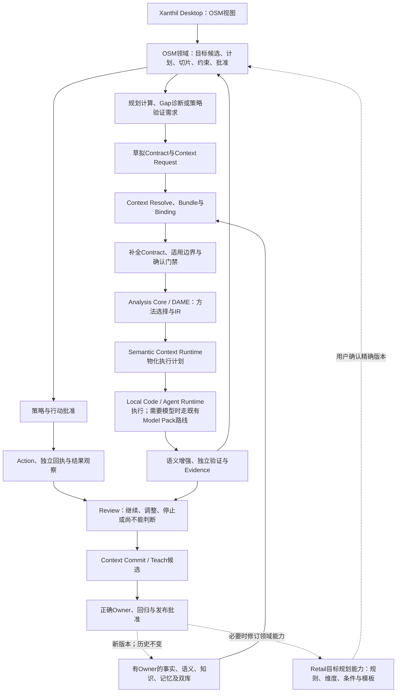

# OSM 零售目标管理升级：白皮书融合评估与建议

日期：2026-09-16  
评估时状态：**融合评估与候选文案，尚未应用到白皮书主稿，未形成实施规格。**  
核对基线：JuanerAI v3.3；白皮书 v3.3.1 / MP-ALIGN-01-R2。

后续决定（2026-09-16）：用户明确“批准融合”，已按本评估边界纳入 R3，随后按用户指定升级为当前白皮书v3.3.2，详见[融合记录](OSM_RETAIL_INTEGRATION_CHANGE_2026-09-16.md)。下文保留改稿前的评估、算术核对与待定实施问题；其中“本轮未应用”描述的是评估阶段，不表示当前仍待融合批准。

用户本轮要求“先看文档，再看如何融入白皮书”。随附 Controller Prompt 中的改稿、架构图、三期排期与十一项交付要求属于待评估材料，不直接成为本轮执行指令。本报告保留既有已批准定位、首期开发顺序与 Model Pack 两期边界。

## 1. 结论：吸收三项实质增量，扩充现有 OSM

**建议将本方案作为 OSM“目标形成—多维计划—策略承接”的增强，采用通用 OSM 领域能力与零售规则分离的方向，融入现有八模块；不另建独立工作台、分析引擎或治理体系。**

现行白皮书已经定义目标制定/拆解、指标驱动、快照/预测/Gap、策略组合、行动和经营复盘，因此附件的大部分后半链路是现有方向的具体化。[现行八模块](/Users/huangbo/Dev/Projects/research/docs/product/whitepaper/revisions/MP-ALIGN-01-R2/JUANERAI_WHITEPAPER.md:360)。真正值得新增的内容为：

| 实质增量 | 相比当前白皮书补了什么 | 建议纳入方式 |
| --- | --- | --- |
| **有依据的目标形成** | 从“目标要有基线、约束、责任与版本”进一步说明目标候选怎样来自经营事实、外部信息、战略要求和人工修正 | 通用层保存候选、依据、约束、版本及批准；零售领域能力提供可配置规则。候选是管理建议，不自动成为预测或正式目标 |
| **同一目标的多维拆解与咬合** | 从目标树/贡献关系扩展到商品、渠道、营销等视图的共同计划、交叉切片、一致性及未分配余额 | 增强6.2，保留一份目标计划权威；先核对口径和重叠，再检查汇总/冲突。Target Cube是逻辑视图，不直接冻结物理数据库方案 |
| **策略对增长要求的明确承接** | 将策略候选的预期贡献显式连接到增长要求，结合结果/驱动/护栏指标判断执行和效果 | 增强6.3、6.6、6.8；分开“计划承接、观察变化、因果增量”，保留未承接差额与未知项，不要求凑齐100% |

这不是把零售变成 JuanerAI 唯一行业，也不是替换已批准的会员增长参考 Pack 或正式 Desktop 的 `member-orders-v2` 场景。“零售目标规划”可建议为首个 **OSM 目标规划参考场景**，此选择仍待确认。

## 2. 来源核对：权重确有出处，产品合同尚未完整

已完整读取两份 Markdown；另在 Downloads 找到其引用的原始资料《零售目标管理模型解读-2.pdf》，共12页，封面日期2024/04。读取全部页文本，并渲染核对第3、4、11页的图和公式。

| 来源事实 | 核对结果 | 对白皮书的处理 |
| --- | --- | --- |
| 原PDF第3页：我情/行情/敌情与产品/渠道/营销三个维度 | 70%/10%/20%在图中明确标为“参考”；下钻到单款、单店、单场 | 可以有来源地介绍为零售参考模板；不称为JuanerAI通用最优权重 |
| 原PDF第4页：目标预估逻辑 | 三情与增长要求各50%；达成率低于80%、80%–120%、高于120%对应-5%、0%、+5%；列出-30%/30%上下限 | 不是附件凭空新增。但修正究竟为增长率百分点相加还是相对变动、边界值归属及上下限如何施加，仍需形成明确产品口径 |
| 原PDF第11页：纵向与交叉咬合 | 确有渠道×品类、产品×渠道、营销×品类×渠道的关系 | 支持引入多维一致性问题；原图没有给出共同粒度、活动重叠分配、约束求解和冲突处理的完整算法 |
| 融合方案第9章的10亿元→11亿元案例 | 算术一致：三情6.4%，混合10.2%，候选11.02亿元；各视图11亿元；策略合计1亿元；预测差额-0.45亿元 | 可作**合成说明案例**，不能称实测经营成果。11.02→11是管理调整，需记录理由和批准；-4500万元“根因桥”没有原始数据和因果证据，只能作为待验证示例 |

来源足以支持方法来源说明，不足以证明其适用于所有品牌、目标可达、预测校准有效或策略具有因果增量。原PDF的参考权重也不等于已经通过 JuanerAI 方法验证。

## 3. 融合前必须校正的定义与边界

| 问题 | 附件表达 | 建议校正 |
| --- | --- | --- |
| **OSM名称** | Objective–Strategy–Measure | 产品全称保持 **Objective & Strategy Management System**；Objective–Strategy–Measure可作为借鉴的管理表达方法。[现行全称](/Users/huangbo/Dev/Projects/research/docs/product/whitepaper/revisions/MP-ALIGN-01-R2/JUANERAI_WHITEPAPER.md:324) |
| **控制层与统一入口** | OSM Control Plane、OSM Workbench及八个页面 | 写作“L1经营控制层＋Xanthil Desktop内OSM视图”。OSM不获得跨资产/模型发布总控权，G治理控制平面保持；页面只是候选交互，不另立工作台 |
| **八模块与七引擎** | 以七引擎描述新架构 | 保留白皮书6.1–6.8；将引擎能力映射进去，不能遗漏跟踪预测、Gap触发和行动执行，也不据此拆成七个服务。附件架构列表与后文七引擎本身也有Evidence/Governance和Learning的差异 |
| **Core/Pack/DAME职责** | Core内有目标形成、规划、约束求解等Engine | Core拥有目标计划、切片、约束、审批与一致性领域规则；Pack声明零售权重、条件、维度与组合；通用分析/预测/优化方法复用DAME，执行由Runtime承担。简单领域完整性检查不必强制包装为分析任务 |
| **Retail OSM的包装粒度** | 一处写独立Pack，一处称Domain Pack的组成部分 | 先明确“零售目标规划领域能力”；独立发布Pack还是现有Pack的子能力待确认。不从目录样例推导嵌套包标准、manifest格式或新部署；沿用精确版本、指纹、用户绑定和历史规则 |
| **Control Graph与IR** | 新称OSM Control Graph，Analysis Request直接编译IR | Control Graph建议作为既有Decision & Management Graph的OSM控制视图，不建立第二套真源；请求必须经过草拟Contract、Context/Binding、确认与IR，不绕过现有接缝。[现行对象链](/Users/huangbo/Dev/Projects/research/docs/product/whitepaper/revisions/MP-ALIGN-01-R2/JUANERAI_WHITEPAPER.md:536) |
| **指标角色与结果对象** | Outcome/Driver/Guardrail都称Measure，且每个目标/策略强制三类 | 明确“结果型指标（Outcome Metric）”是指标的角色，不是行动后的Outcome结果对象。建议先要求角色、适用性和缺失说明；是否三类全部必填应在零售参考范围确认，不能为满足通用规则编造Driver或护栏 |
| **Metric Contract权威** | 同表同时包含Definition/Formula/Source/Baseline/Target/Threshold | 企业Ontology/指标权威负责定义和语义版本，Binding负责物理来源与计算映射，OSM负责具体目标/策略的周期、目标值、阈值和责任绑定；不再存一套可独立修改的指标真源 |
| **经营学习** | 成功和失败都进入双库；权重自校准 | 保存案例与来源；先按资产类型和Owner提出候选，经Commit/Teach/回归/批准再发布。失败记录、未证实假设和真实效果不能统一升级为已验证资产；校准建议不自动覆盖正式目标或旧Pack |
| **Model Pack与A/B** | OSM直接请求模型；A/B返回实验设计和分组 | OSM是业务消费方，技术调用仍经获批方法/IR/Runtime和精确模型身份。区间/特征贡献只在相应模型合同支持时返回，不能强制所有模型都提供；A/B分析已有设计、分组、曝光和结果，不新增在线分流平台 |
| **基础设施与路线** | DuckDB保存目标、Semantica承载多类资产；OSM三期写入总体路线 | 保留Port/Adapter和正式状态持久化责任，不按附件冻结存储选型。三期只能先作OSM局部建议，不能覆盖Desktop七段、Model Pack两期或自动恢复旧90天排期 |

## 4. 数值与业务语义：正文需要明确的六条约束

### 4.1 目标建议不是Forecast

三情、战略要求及人工判断形成的是管理目标候选。若没有模型/情景方法的明确依据，“目标区间”只能称情景范围或管理区间，不能称统计置信区间。预测值必须另列方法、数据、时间和适用范围；没有合格预测时显示未计算/不可用，不填0或伪装正常。

70/10/20和50/50只是一个可版本化模板。需要补齐：三情的统计期间和人口/经营范围、同比可比性、税费/币种和退货口径；缺少外部来源时阻断、降级还是显式改权重；权重是否合法及如何归一；修正单位/顺序/上限；约束不满足时的处置。不能静默补数据、改变权重或裁剪数字后沿用旧批准。

原PDF的“±5%”确有来源，但解释为“±5个百分点”还是“相对±5%”应明确决定，不能在白皮书中含混、在代码中各自猜测。原PDF上下限也不能绕过毛利、资源等独立硬约束。历史达成率受目标难度与外部环境影响，不直接等于预测误差；校准建议仍须方法与场景验证。

### 4.2 同一可加指标、同一版本和互斥完备分区，才可以汇总

应改写“目标切片不能相加”为：**商品、渠道、营销三个全量投影视图不能再相加；同一互斥且完备分区内的切片可以按规则汇总。**

一致性至少固定同一目标/方案/版本、统计周期、语义口径、量纲及组织边界。销售额可在确认范围内加总；复购率、毛利率、转化率不能直接对切片百分比求和，应回到分子/分母及正确聚合规则。库存等存量也不能沿时间任意累加。

商品属性和营销活动可能多标签、跨店、跨品类或时间重叠；必须区分可加分配维度与展示标签，明确归属/分摊权重、日常销售、未知/未分配、跨层汇总、锁定切片及舍入尾差。没有这些条件，三张表都合计11亿元也不能证明交叉切片一致或约束可行。

附件中11.30/10.70/11.50亿元的冲突应标为**不同部门或方案的待协调草案**；同一已冻结权威版本的合法投影不应同时给出这些不一致总额。协调过程生成新候选，批准后形成新版本，历史保持不变；不静默归一成11亿元。

### 4.3 三类差距不能混成一个数

| 差距用途 | 案例中的含义 | 必要约束 |
| --- | --- | --- |
| 目标增长要求 | 11亿元目标减10亿元历史基线＝1亿元 | 是规划需要承接的增长，不自动等于新增策略造成的增量 |
| 实际进度差距 | 同期Actual与同周期已批准进度目标比较 | 年中6.10亿元Actual不能直接与全年11亿元混成可比较进度；缺同期目标应标缺失 |
| 期末预测差距 | 附件按Forecast−Target：10.55−11＝-0.45亿元 | 与实际值分开，保存预测版本与窗口；正式采用时遵守相应冻结合同的正负方向，不统一改写既有Gap枚举或算法 |

### 4.4 策略贡献是计划假设，去重不等于因果识别

商品升级、会员唤醒与营销提效可能作用于同一客户和订单。预期贡献需声明业务范围、基准情景、观察期、重叠/交互规则和不确定性，保留未承接的剩余差额；不能为了满足“合计约等于1亿元”填入没有依据的贡献。

历史同比增长、无新增策略情况下的预期增长、当前Forecast已包含的动作，以及新策略的预期增量，应分别说明，防止把已包含在预测里的贡献再加一次。批准规划贡献并不证明已产生效果；真实观察变化还需合格方法与证据才能支持增量主张。

### 4.5 指标改善不自动证明策略有效

Driver变化只提供诊断线索；同一指标可以在不同目标下承担结果或护栏角色。未成熟观察窗口、执行不完整、护栏越界和缺少增量依据应分别进入Review，保留“尚不能判断”。缺数不能显示为正常，人工批准不能覆盖硬阻断。

### 4.6 自动化只到已有授权范围

Gap触发仍须满足数据有效性、规则版本、幂等和适用门禁，不能每次刷新都新增任务。自动生成Analysis Request、Review草稿或校准候选，不自动批准正式目标、下发业务动作、修改年度目标或发布长期资产。

## 5. 推荐章节改法：保留骨架，局部增补

| 白皮书落点 | 建议增补 | 应保留的现有内容 |
| --- | --- | --- |
| **第5章、5.1** | 说明吸收“目标—策略—度量”方法与零售目标形成经验；明确通用经营领域与行业规则分离 | OSM现名、L1职责、与既有管理系统的Adapter关系 |
| **6.1** | “目标候选形成与依据”：来源→规则/方法→候选→约束检查→人工调整→批准版本 | 目标基线、周期、指标、Owner、约束与状态 |
| **6.2** | “多维目标计划与一致性”：共同粒度、视图、切片、分配/未分配、重叠、草案冲突、冻结与历史重放 | 目标树、贡献关系、依赖、组织冲突；不是只保留Cube |
| **6.3、6.6** | 指标角色；语义定义/物理绑定/目标实例分责；策略预期贡献、基准与未承接差额 | 驱动关系证据、候选比较、预算/资源/风险及适用条件 |
| **6.4、6.5、6.7、6.8** | 目标/实际/预测/差距分型，异常与数据变化触发，计划贡献与实际效果对照 | 原有跟踪、Gap、Initiative/Action/Execution Evidence/Outcome和Review，不能被七引擎覆盖掉 |
| **第7章、附录A/术语** | 候选目标、目标计划/切片、策略预期贡献的产品语义；Control Graph作为既有经营图谱视图 | 现有对象身份与所有权；不在此冻结Schema、API、枚举或数据库表 |
| **第11、13–16章** | Core/Pack/DAME/Context/Runtime分工及完整请求→证据接续；引用指标权威与任务快照 | 6+1架构、统一Desktop、三对象分离、普通无OSM入口、Port/Adapter |
| **第18章、附录C** | 增加“零售目标规划领域能力参考”，列权重/维度/方法条件/案例与治理 | 原会员参考Pack及Pack完整性规则；ModelEvol、MLflow-first、Controller、Consumer、Desktop与Serving Gate |
| **第19、20章** | 目标形成/分配约束映射G0–G4；策略效果映射G5；校准和经验先候选再治理发布 | 生成与验证分离、Owner、Teach、显式新版本采用及历史不变 |
| **第23章/新案例附录、第26章** | 可新增服饰零售“目标形成与咬合”案例；OSM局部能力阶梯与已有建议作对照 | 会员复购案例及正式首发场景；不将局部三期替换全产品或Model Pack路线 |

图的处理建议：更新既有OSM八模块图中的6.1/6.2/6.6细项；补一张“同一目标计划的多维投影”说明图；在现有目标到结果图中补候选形成、批准和完整执行回执链。不以原附件的七引擎树替换整个6+1架构。本轮仅提供下方逻辑图草案，未改主稿图片。

图中路径表达职责，不冻结唯一API调用次序。简单目标完整性检查由OSM领域规则处理；无需为每次汇总校验都创建完整分析任务。图中的批准仍按具体对象和当前授权区分。

## 6. 可用于下一轮改稿的核心文案草案

以下三段可作为已完成边界校正的候选文案，**本轮尚未写入主稿**。

> JuanerAI OSM（Objective & Strategy Management System）是受治理的目标与经营领域。它把战略意图和经营依据转化为可审查的目标候选，在明确口径、周期、责任和资源约束后，通过人工批准形成正式目标与目标计划；目标计划可以从多个业务维度观察和拆解，但各视图引用同一版本化计划，并按适用的聚合与分配规则保持一致。

> 通用OSM能力管理目标、切片、约束、策略、指标绑定、行动和复盘；零售目标规划能力提供三情参考规则、商品/渠道/营销维度、领域条件和案例。通用方法复用DAME，语义及物理映射由Semantic Context Runtime在既有资产权威下解析，执行交由相应Runtime。OSM视图由Xanthil Desktop统一呈现，领域能力不另建工作台或企业语义真源。

> 策略贡献首先是带基准情景、适用范围、时间窗口和不确定性的计划假设。系统分别保存目标增长要求、预期贡献、执行证据、实际观察和经合格方法支持的效果判断，不以贡献加总、指标上涨或任务完成代替因果增量。复盘与校准结果先形成按资产类型归属的候选，经正确Owner、验证及发布治理后，才可被新任务显式采用。

## 7. 现有Demo怎么复用，真正缺什么

以下为2026-09-16读取的记录，不是本轮重跑或新的验收。旧9/13盘点不能作为当前状态。

| 能力 | 可复用Demo | 限制与新增验证缺口 |
| --- | --- | --- |
| 目标有效性、来源与快照 | [PX033](/Users/huangbo/Dev/Projects/research/explorations/PX-2026-033-objective-snapshot-gap/NEXT_ACTION.md)、[PX044](/Users/huangbo/Dev/Projects/research/explorations/PX-2026-044-external-evidence-acquisition/NEXT_ACTION.md) | 033有G0/Binding/历史；044有真实公开来源但不含首个Demo之后的LLM抽取。都未证明三情数据可比、目标规则有效及修正计算完整 |
| 目标拆解、冲突、版本 | [PX048](/Users/huangbo/Dev/Projects/research/explorations/PX-2026-048-goal-tree-conflict/DEMO_BRIEF.md:15) | 已有单组织三节点金额树；**未验证商品×渠道×活动共同空间**、重叠分配、边际约束、锁定切片和舍入尾差 |
| 策略贡献与组合 | [PX049](/Users/huangbo/Dev/Projects/research/explorations/PX-2026-049-strategy-portfolio-optimization/DEMO_BRIEF.md:19) | 有有限策略/约束及同受众组取最大值的合成去重规则；不能证明真实策略增量或新零售贡献桥的统计有效性 |
| Gap、分析、周期计算 | [PX029](/Users/huangbo/Dev/Projects/research/explorations/PX-2026-029-osm-objective-strategy/NEXT_ACTION.md)、[PX050](/Users/huangbo/Dev/Projects/research/explorations/PX-2026-050-same-goal-business-loop/NEXT_ACTION.md)、[PX051](/Users/huangbo/Dev/Projects/research/explorations/PX-2026-051-periodic-report-refresh/NEXT_ACTION.md) | 可复用候选接续与幂等；050仅S1到待审报告，033预测差距与051实际差距的范围不同；不构成完整零售经营链 |
| 执行回执、观察、Review | [PX034](/Users/huangbo/Dev/Projects/research/explorations/PX-2026-034-strategy-action-outcome-review/NEXT_ACTION.md)、[PX059](/Users/huangbo/Dev/Projects/research/explorations/PX-2026-059-action-task-adapter/NEXT_ACTION.md:10) | **059已于9/14获用户接受受限PASS**，有两进程本机HTTP及034来源锚验证，不能再写暂缓未建；仍不证明真实业务系统或经营效果 |
| Pack装配、回流与学习 | [PX016](/Users/huangbo/Dev/Projects/research/explorations/PX-2026-016-domain-pack-reference/NEXT_ACTION.md)、[PX028](/Users/huangbo/Dev/Projects/research/explorations/PX-2026-028-domain-pack-workbench-consumption/NEXT_ACTION.md)、[PX035](/Users/huangbo/Dev/Projects/research/explorations/PX-2026-035-context-commit-routing/NEXT_ACTION.md)、[PX036](/Users/huangbo/Dev/Projects/research/explorations/PX-2026-036-review-teach-pack-adoption/NEXT_ACTION.md) | 可复用版本、三态、Owner、回归及新任务采用规则；附件零售能力不是现成Pack，原有各Demo也不是它的一条同案运行链 |

若后续决定做Demo，建议只考虑三个新问题，不重做OSM总平台；以下尚未登记、冻结或授权：

1. **目标候选是否可复算、可解释、可拒绝？** 一个总销售目标、三类合成来源、一个规则版本和一次人工修正。失败路径：来源口径/缺数；非法权重或未定义修正；证据变化后旧批准不得继续使用。输出止于待批候选。
2. **多维目标是否确实属于同一个计划？** 单周期、两个商品×两个渠道×两个互斥营销类别，明确日常/未分配。失败路径：跨视图重复计数；冲突边际或锁定分配不可满足；修订污染历史。先检查与人工协调，不先做通用Cube或优化平台。
3. **策略承接与指标角色是否保持证据分层？** 两条可能重叠的策略、一项剩余差额及结果/驱动/护栏观察。失败路径：预期贡献被当实绩；观察不足却判有效；护栏失败却显示完成。复用049/034/059/035的实际产物和显式适配，不复制同名预置结果。

## 8. 附件三阶段的建议处理

| 局部能力阶梯（建议） | 范围与验收重点 | 不应声称/自动扩展的内容 |
| --- | --- | --- |
| **A：目标计划可解释且一致** | 候选依据、指标口径、手工/规则拆解、三视图与交叉检查、未分配/冲突、批准与历史；能完成一次有证据的Review | 不是完整经营闭环实证；预测可明确不可用，不能伪造；不先建七引擎或八个独立页面 |
| **B：目标形成和分析接续增强** | 在可比来源上验证三情候选，Gap→现有分析链→证据→Review；需要模型且模型Gate满足时引入Forecast | 不因OSM需求提前启动Model Pack；推荐不得自动成为正式目标或行动；目标差异定位的基本正确性不能拖到此阶段才具备 |
| **C：优化与跨周期学习** | 约束调整建议、受控Review自动化、已有实验数据分析、策略效果评估、校准候选和显式新版本采用 | 不把完整六方法、自动分流、无人批准决策、自动双库晋升或递归自改打包进入一期 |

这只是对附件三期的收窄解释，不是重新批准排期。正式Model Pack仍受 [DA_REQUIRED_COMPLETE与另行授权](/Users/huangbo/JuanerAI/docs/planning/2026-08-27/model-pack-two-phase-product-plan.md:45) 约束；已有Desktop工作及其他OSM探索保持原范围。商业上继续“一个角色、一类任务、一条可信闭环”，多维零售年度规划不替换近期会员分析首场景。

## 9. 改稿前待确认的四组产品决定

| 决策 | 推荐口径 | 尚待确认 |
| --- | --- | --- |
| 总体融合方式 | 保留现名、八模块和统一Desktop；新增目标形成/多维一致性/策略承接 | 是否采用这组增量作为下一白皮书修订内容 |
| 零售能力的交付与定位 | 先作为OSM目标规划参考能力，复用现有Domain Pack规范 | 独立Pack还是已有Pack的子能力；是否确认为首个OSM参考场景，而非替换会员参考Pack |
| 数值与指标角色政策 | 权重是有来源的可配置模板；口径缺失显式阻断/待确认；三角色先按适用性声明 | 修正百分比/百分点、缺数策略、活动重叠/共同粒度；哪些三角色要求在零售场景为硬门禁 |
| 版本与推进方式 | 先形成可审查正文差异，再经确认更新主稿/索引/维护记录；Demo与正式开发另按现行流程 | 修订标识及采用范围由实际改稿决定；不预先宣称v3.4或R3已经生效，不启动附件三期 |

本轮不因这些未决项中止评估：章节落点、定义修正、核心候选文案、现有证据及最小新验证问题均已给出。它们足以供下一轮逐项决定。

## 10. 来源身份与检查范围

| 本轮来源 | SHA-256 |
| --- | --- |
| [融合方案v1.0](/Users/huangbo/Dev/Projects/research/docs/product/whitepaper/sources/2026-09-16-osm-retail-v1.0/JuanerAI_OSM_零售目标管理模型融合方案_v1.0.md) | `c588fd9f5c53ee86d643dc318e4c98d2270b5789b98ed4e1487b5df63d3f71fa` |
| [随附Controller Prompt](/Users/huangbo/Dev/Projects/research/docs/product/whitepaper/sources/2026-09-16-osm-retail-v1.0/JuanerAI白皮书Controller_OSM融合Prompt.md) | `4e9072375750957448ad5cbfc1c66f361f581349d15f7c18d0dcc8f4a166fed7` |
| [原始零售模型PDF](/Users/huangbo/Dev/Projects/research/docs/product/whitepaper/sources/2026-09-16-osm-retail-v1.0/零售目标管理模型解读-2.pdf) | `6db51e3e4beb81f9a99914b69028bfca340bb62eec93f946bf35844438cf8e4e` |
| [评估基线R2冻结快照](/Users/huangbo/Dev/Projects/research/docs/product/whitepaper/revisions/MP-ALIGN-01-R2/JUANERAI_WHITEPAPER.md) | `1a0ab37da206427d1a8354246c5c677a829e14261a593a3bf8e9a41c9a3b63c5` |

已做：原文与章节交叉核对、原PDF公式/图视觉核对、示例算术独立计算、当前Demo记录核对及本地引用检查。未做：真实数据/业务效果验证、Demo测试复跑、模型调用、代码实现或正式开发验收。

**白皮书影响：建议修订已识别，本轮未应用。** 本轮仅新增本融合评估；主稿、共同背景、台账、行动卡、已冻结Brief、代码和正式开发仓库保持原状。既有正式联动文档仍待合适检查点集成。
