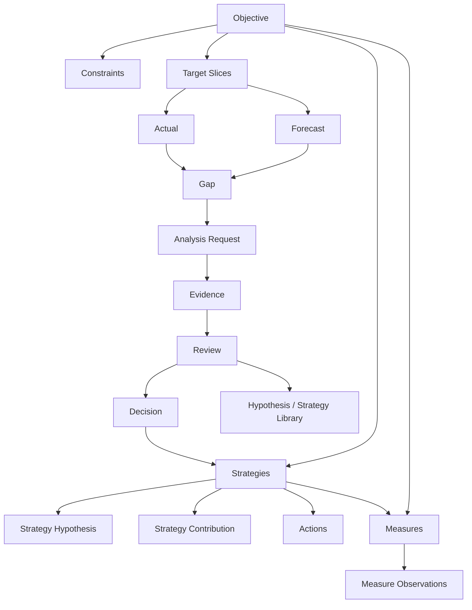

# JuanerAI OSM × 零售目标管理模型融合方案

> **副标题：通用 OSM Control Plane + Retail OSM Domain Pack**  
> 版本：v1.0  
> 日期：2026-09-15  
> 状态：白皮书融合与产品设计建议；不等同于已授权实施规格

---

## 0. 执行摘要

本方案将经典 OSM（Objective–Strategy–Measure，目标—策略—度量/指标）与《零售目标管理模型解读》中的目标形成、目标拆解和多维咬合机制结合，形成 JuanerAI 可落地的经营目标规划与执行闭环。

核心结论如下：

1. **OSM 应成为 JuanerAI 的经营目标与策略控制层**，而不是一个静态的“目标—策略—指标”填写页面。
2. 《零售目标管理模型》适合作为 JuanerAI OSM 的第一套行业参考实现，但不应把零售规则硬编码进通用核心。
3. 产品架构应采用：
   - **通用 OSM Core**
   - **Retail OSM Domain Pack**
4. 整体闭环应覆盖：

```text
经营事实与战略要求
        ↓
Objective Formation
目标形成
        ↓
Target Decomposition
目标拆解
        ↓
Target Reconciliation
目标咬合
        ↓
Strategy Design
策略承接
        ↓
Measure Design
指标设计
        ↓
Actual / Forecast / Gap
执行监控与预测
        ↓
Analysis / Evidence
分析诊断与证据
        ↓
Review / Adjustment
策略复盘与调整
        ↓
Hypothesis & Strategy Learning
假设库与策略库沉淀
```

5. JuanerAI 的差异化不在于“管理 KPI”，而在于：
   - 让目标有计算依据；
   - 让目标能拆解并保持一致；
   - 让策略承接明确的增长缺口；
   - 让指标能够解释策略是否生效；
   - 让经营偏差自动触发分析；
   - 让分析证据反向推动策略调整；
   - 让成功与失败经验沉淀进假设库和策略库。

---

# 1. 背景与问题定义

## 1.1 传统 OSM 的价值与局限

OSM 的基本逻辑是：

\[
Objective \rightarrow Strategy \rightarrow Measure
\]

它分别回答三个问题：

- **Objective：要实现什么经营结果？**
- **Strategy：准备通过什么方式实现？**
- **Measure：如何判断目标和策略是否正在生效？**

但传统 OSM 在企业实践中经常退化为一张静态表：

| Objective | Strategy | Measure |
|---|---|---|
| 销售增长 10% | 加强运营 | 销售额、转化率 |

这种做法存在四个明显问题：

1. Objective 缺少数据依据，容易变成管理层拍数；
2. Objective 无法向商品、渠道、组织和活动等维度拆解；
3. Strategy 没有量化承接目标缺口；
4. Measure 只能描述结果，无法解释策略是否有效。

---

## 1.2 零售目标管理模型解决了什么

《零售目标管理模型解读》提供了 OSM 中非常重要、但传统 OSM 经常缺失的两类能力：

### 第一类：目标形成

以“三情数据”为基础：

- 我情；
- 行情；
- 敌情。

文档提供的默认参考权重为：

\[
我情 70\% + 行情 10\% + 敌情 20\%
\]

并进一步结合：

- 战略增长要求；
- 历史目标达成率修正；
- 人工修正；
- 上下限约束。

形成最终目标建议。

### 第二类：目标拆解与咬合

从三个维度拆解同一个零售目标：

- 产品：最终下钻至单款；
- 渠道：最终下钻至单店；
- 营销：最终下钻至单场活动。

并要求做到：

- 自上而下纵向汇总一致；
- 产品、渠道、营销横向一致；
- 产品 × 渠道；
- 渠道 × 品类；
- 营销 × 品类 × 渠道；
- 各种交叉视图均指向同一个目标事实。

---

## 1.3 两套模型的互补关系

| 能力 | 零售目标管理模型 | OSM |
|---|---|---|
| 目标依据 | 强 | 通常较弱 |
| 目标估算 | 强 | 通常不定义 |
| 目标多维拆解 | 强 | 通常不定义 |
| 多维目标一致性 | 强 | 通常不定义 |
| 策略承接 | 弱 | 强 |
| 指标体系 | 较弱 | 强 |
| 执行反馈 | 不完整 | 需要扩展 |
| 策略学习 | 不完整 | 需要扩展 |

因此，两者融合后的完整逻辑是：

> **零售模型负责回答“目标是多少、分到哪里”；OSM 负责回答“如何做到、如何验证”；JuanerAI 负责回答“为什么偏差、如何调整、哪些经验可以复用”。**

---

# 2. JuanerAI OSM 的产品定位

## 2.1 正式定位

建议在 JuanerAI 白皮书中将 OSM 定义为：

> **OSM 是 JuanerAI 的经营目标与策略控制层。它将企业战略意图转化为可计算、可拆解、可验证的 Objective，将目标缺口转化为可执行的 Strategy，将策略假设转化为 Outcome、Driver 和 Guardrail 三类 Measure，并调用 JuanerAI 的分析、模型、语义和实验能力持续验证执行效果、诊断经营偏差和调整策略。**

---

## 2.2 OSM 不是什么

JuanerAI OSM 不应被实现为：

- OKR/KPI 填写工具；
- 静态指标看板；
- 另一套独立数据分析引擎；
- 只面向零售行业的硬编码模块；
- 自动替代业务负责人做最终经营决策的黑盒系统。

---

## 2.3 OSM 是什么

JuanerAI OSM 应承担：

1. 经营目标对象化；
2. 目标形成与证据记录；
3. 目标多维拆解；
4. 目标一致性校验；
5. 策略假设与目标缺口承接；
6. 指标体系生成与绑定；
7. Target / Actual / Forecast / Gap 持续管理；
8. 偏差触发分析；
9. 分析证据回写；
10. 策略复盘、调整与经验沉淀。

---

# 3. 总体架构：OSM Core + Retail OSM Domain Pack

## 3.1 核心原则

零售逻辑不能直接写进 OSM Core。

应采用：

```text
JuanerAI OSM
│
├── OSM Core
│   ├── Objective Engine
│   ├── Target Planning Engine
│   ├── Reconciliation Engine
│   ├── Strategy Engine
│   ├── Measure Engine
│   ├── Review Engine
│   └── Evidence & Governance
│
└── Domain Packs
    ├── Retail OSM Pack
    ├── E-commerce OSM Pack
    ├── Membership Growth OSM Pack
    ├── Supply Chain OSM Pack
    └── 其他行业包
```

这样既能吸收零售实战模型，又不会破坏 JuanerAI 面向多行业、多经营场景的通用能力。

---

## 3.2 JuanerAI 总体模块关系

```text
用户 / 经营负责人 / Controller
              │
              ▼
        OSM Workbench
              │
   ┌──────────┼───────────┐
   │          │           │
Objective  Strategy    Measure
   │          │           │
   └──────────┼───────────┘
              │
      Target / Actual /
      Forecast / Gap
              │
      发现问题或需验证
              ▼
      Analysis Request
              │
              ▼
       DAME / Analysis IR
              │
   ┌──────────┼────────────┐
   │          │            │
Model Pack  A/B Test   分析工作流
   │          │            │
   └──────────┼────────────┘
              │
           Evidence
              │
              ▼
         OSM Review
              │
      Continue / Adjust /
        Pause / Stop
              │
              ▼
   假设库 / 策略库 / 组织记忆
```

底层由 Semantic Context Runtime 统一解析：

- 业务实体；
- 组织关系；
- 指标口径；
- 商品、渠道、活动、门店之间的语义关系；
- 数据来源与时间有效性。

---

# 4. OSM Core 的核心领域对象

建议 OSM Core 只认识行业无关对象。

| 对象 | 定义 |
|---|---|
| Objective | 希望实现的经营结果 |
| Objective Constraint | 毛利、库存、风险等目标约束 |
| Target Slice | 目标在某组维度上的切片 |
| Dimension | 时间、组织、产品、渠道等维度 |
| Strategy | 实现目标或弥补缺口的策略 |
| Strategy Hypothesis | Strategy 背后的可验证因果假设 |
| Strategy Contribution | Strategy 对目标增量或缺口的预期贡献 |
| Measure | 衡量目标或策略的指标 |
| Measure Observation | 某一时点的指标观测值 |
| Action | 策略对应的具体执行动作 |
| Evidence | 支持目标、诊断或策略判断的证据 |
| Actual | 已发生的经营结果 |
| Forecast | 对周期结束时结果的预测 |
| Gap | Target 与 Actual/Forecast 的差异 |
| Review | 对目标、策略和指标进行的复盘 |
| Decision | Continue、Adjust、Pause、Stop、New Strategy |
| Version | 目标和策略的版本记录 |
| Approval | 人工审批与责任记录 |

---

## 4.1 核心关系图



---

# 5. 七大核心引擎

## 5.1 Objective Formation Engine：目标形成引擎

### 目标

将经营事实、战略要求和管理约束转换为可解释的目标候选。

### 零售 Pack 的默认参考逻辑

\[
G_{three}
=
0.70G_{self}
+
0.10G_{market}
+
0.20G_{competitor}
\]

\[
G_{base}
=
0.50G_{three}
+
0.50G_{strategy}
\]

\[
G_{final}
=
G_{base}
+
Correction_{achievement}
+
Correction_{manual}
\]

最终再进行上下限约束。

### 输入

- 历史经营表现；
- 行业表现；
- 竞品表现；
- 战略增长要求；
- 历史目标达成率；
- 新店、关店、商品、产能等已知变化；
- 人工修正；
- 目标约束；
- 数据新鲜度和置信度。

### 输出

- 建议目标；
- 目标区间；
- 目标依据；
- 各因素贡献；
- 数据缺口；
- 不确定性；
- 人工调整记录；
- 审批状态。

### 产品要求

- 70/10/20、50/50 只能作为 Retail Pack 的默认模板；
- 权重必须可配置、可版本化、可按品牌/区域/品类设置；
- 人工修正必须填写原因、证据、责任人和审批人；
- 不允许只保存最终数字而丢失形成过程。

---

## 5.2 Target Planning Engine：目标规划与拆解引擎

### 核心思想

后台不应维护“商品目标树、渠道目标树、营销目标树”三套相互独立的数据。

应维护同一个多维目标空间：

\[
Target
=
f(Time, Organization, Product, Channel, Marketing)
\]

例如：

```text
2027年11月
× 女装羽绒服
× 上海A类购物中心门店
× 冬季S级战役
= 850万元目标
```

商品、渠道和营销页面只是同一个目标立方体的不同投影视图。

### 拆解方式

- 历史占比分配；
- 驱动因素分配；
- 业务规则分配；
- Model Pack 推荐；
- 人工调整；
- 混合分配。

### 必须支持

- 自上而下拆解；
- 自下而上汇总；
- 多层级维度；
- 版本比较；
- 场景方案比较；
- 拆解理由；
- 未分配余额；
- 超分配检查。

---

## 5.3 Target Reconciliation Engine：目标咬合引擎

### 目标

保证不同视角下看到的是同一个目标事实。

必须满足：

\[
TotalTarget
=
\sum ProductView
=
\sum ChannelView
=
\sum MarketingView
\]

同时保证交叉切片一致：

\[
Product_p
=
\sum_{c,m,t} Target_{p,c,m,t}
\]

\[
Channel_c
=
\sum_{p,m,t} Target_{p,c,m,t}
\]

\[
Marketing_m
=
\sum_{p,c,t} Target_{p,c,m,t}
\]

### MVP 阶段

先实现：

- 汇总一致性检查；
- 差异定位；
- 未分配与重复分配提示；
- 人工协商与批准；
- 版本冻结。

### 后续阶段

增加约束求解：

- 在总目标固定前提下最小化各部门调整量；
- 对重点品类、重点渠道设置优先级；
- 对产能、库存、店数、预算等加入硬约束；
- 对历史结构和战略结构设置软约束；
- 输出推荐调整方案，而非直接自动改数。

---

## 5.4 Strategy Engine：策略承接引擎

### 核心要求

Strategy 必须承接明确的目标缺口。

例如：

```text
2026 销售：10亿元
2027 目标：11亿元
Growth Gap：1亿元
```

策略增量桥：

| Strategy | 预期贡献 |
|---|---:|
| 商品结构升级 | 3000万元 |
| A类门店店效提升 | 2500万元 |
| 新店增长 | 2000万元 |
| 会员复购提升 | 1500万元 |
| 营销效率提升 | 1000万元 |
| 合计 | 1亿元 |

必须满足：

\[
\sum StrategyContribution
\approx
GrowthGap
\]

### Strategy 对象必须包含

- 策略名称；
- 作用范围；
- 目标缺口；
- Strategy Hypothesis；
- 预期贡献；
- Owner；
- 时间周期；
- 关键动作；
- 资源依赖；
- 风险；
- 前置条件；
- 评估方式；
- 当前状态。

### 重要区分

**目标切片不能相加，策略贡献可以在明确归因规则下相加。**

- 商品 11 亿元；
- 渠道 11 亿元；
- 营销 11 亿元；

是同一个 11 亿元的不同观察视角，不能相加为 33 亿元。

而策略贡献是在消除重叠后，对 1 亿元增长缺口的归因桥，可以相加。

---

## 5.5 Measure Engine：指标设计引擎

每个 Objective 和 Strategy 至少绑定三类 Measure。

### Outcome Metric：结果指标

回答：

> 最终结果是否发生？

例如：

- 销售额；
- 毛利额；
- 毛利率；
- 市场份额；
- 库存周转。

### Driver Metric：驱动指标

回答：

> 哪些经营因子正在推动或阻碍结果？

例如：

- 客流；
- 转化率；
- 客单价；
- 连带率；
- 新品成功率；
- 正价售罄率；
- 会员复购率；
- 活动触达率。

### Guardrail Metric：护栏指标

回答：

> 是否为了完成某个结果而损害了整体经营质量？

例如：

- 折扣率；
- 库存金额；
- 退货率；
- 缺货率；
- 获客成本；
- 营销费用率；
- 毛利率下限。

### 每个 Measure 必须有 Metric Contract

| 字段 | 说明 |
|---|---|
| Metric ID | 唯一标识 |
| Name | 指标名称 |
| Definition | 业务定义 |
| Formula | 计算公式 |
| Grain | 颗粒度 |
| Dimensions | 可切分维度 |
| Source | 数据源 |
| Refresh | 更新频率 |
| Direction | 越高越好/越低越好/区间 |
| Baseline | 基线 |
| Target | 目标值 |
| Threshold | 预警阈值 |
| Owner | 责任人 |
| Semantic Version | 口径版本 |

---

## 5.6 Review Engine：经营复盘引擎

每个 Objective 始终保留：

```text
Target
Actual
Forecast
Gap
```

### 触发方式

- 周度 Driver 指标异常；
- 月度 Actual 偏差；
- Forecast 低于目标；
- Guardrail 越界；
- Strategy Hypothesis 证据不足；
- 数据口径或数据源变化；
- 人工发起复盘。

### Review 输出

- 当前状态；
- 主要偏差；
- 偏差范围；
- 证据；
- Strategy 是否生效；
- 是否继续；
- 是否调整；
- 是否暂停；
- 是否停止；
- 是否新增 Strategy；
- 是否更新 Forecast；
- 是否申请调整 Objective。

---

## 5.7 Learning Engine：假设与策略学习

Strategy 不只是任务，而是经营假设：

```text
如果提高高价值会员唤醒率，
那么活跃会员数和复购率将提升，
进而增加会员销售贡献，
同时营销费用率不应超过护栏。
```

执行后应记录：

- 适用场景；
- 使用对象；
- 前置条件；
- 实际动作；
- Outcome；
- Driver；
- Guardrail；
- 是否达到预期贡献；
- 失败原因；
- 证据质量；
- 可复用范围。

最终沉淀为：

```text
OSM Strategy
    ↓
执行结果
    ↓
策略评估
    ↓
策略库
    ↓
相似问题检索
    ↓
下一轮 OSM 推荐
```

---

# 6. OSM 与 JuanerAI 现有主线的关系

## 6.1 与 DAME 的关系

- OSM 负责发现问题和定义分析需求；
- DAME 负责选择分析方法、组织分析过程；
- OSM 不复制 DAME 的分析能力；
- DAME 输出 Evidence 回写 OSM。

示例：

```text
OSM 发现：
华东 A 类店 Forecast Gap = -1500万元

        ↓

发起 Analysis Request：
“为什么华东 A 类店本季度预测低于目标？”

        ↓

DAME：
拆解客流、转化、客单、商品、库存、活动、同店等因素

        ↓

Evidence：
新品可售率和会员复购下降是主要证据

        ↓

OSM Review：
调整商品与会员策略
```

---

## 6.2 与 Analysis IR 的关系

OSM 和 Analysis IR 不应合并为同一个概念。

- **OSM Control Graph**：表达经营目标、策略、指标、约束、状态和复盘；
- **Analysis IR**：表达一次分析任务应该如何被执行。

转换关系：

```text
OSM Gap / Strategy Validation Need
                ↓
         Analysis Request
                ↓
      编译为 Analysis Plan IR
                ↓
        工具、数据、模型执行
                ↓
             Evidence
                ↓
            回写 OSM
```

---

## 6.3 与 Model Pack 的关系

OSM 只消费由 Controller 治理的 Model Pack 能力，不在 OSM 内嵌模型训练逻辑。

典型用途：

- 销售 Forecast；
- 门店潜力预测；
- 商品销量预测；
- 会员流失和复购预测；
- 活动响应预测；
- 目标分配建议；
- 库存与资源约束优化。

边界：

- Model Pack 输出预测或建议；
- OSM 保存其用途、版本、置信度和证据；
- 经营负责人决定是否采纳；
- OSM 不将模型输出自动升级为正式目标。

---

## 6.4 与 A/B Test Analysis 的关系

Strategy Hypothesis 可以进入 A/B Test Analysis。

例如：

```text
Hypothesis：
会员定向券可以提高沉默高价值会员复购，
且毛利率下降不超过 1 个百分点。
```

A/B Test Analysis 返回：

- 实验设计；
- 样本和分组；
- 增量效果；
- 显著性；
- 护栏影响；
- 是否建议规模化。

结果回写 Strategy Review。

---

## 6.5 与 Domain Pack 的关系

Retail OSM Pack 是 Domain Pack 的一个组成部分，主要包含：

- 零售目标形成规则；
- 商品、渠道、营销、组织、时间维度；
- 零售指标树；
- 零售策略模板；
- 目标咬合规则；
- 零售语义映射；
- 示例数据和验收案例。

---

## 6.6 与 Semantic Context Runtime 的关系

Semantic Context Runtime 负责回答：

- “华东”具体包含哪些组织？
- “A类店”使用哪个版本的分类标准？
- “销售额”是否含税？
- 是否包含退款？
- 直营与加盟是否使用同一口径？
- 商品、门店、活动之间是什么关系？
- 该指标在哪些时间段有效？

OSM 只引用统一语义标识，不自行维护重复口径。

---

## 6.7 与 DuckDB、Semantica 和双库闭环的关系

建议逻辑分工：

- **DuckDB**：承载本地结构化经营数据、目标值、实际值和分析中间结果；
- **Semantica**：承载业务本体、指标语义、知识关系、组织记忆和策略经验；
- **假设库**：沉淀 Strategy Hypothesis 及验证结果；
- **策略库**：沉淀 Strategy、适用条件、动作和真实效果。

OSM 是连接经营数据、语义、分析和组织学习的控制入口。

---

# 7. Retail OSM Domain Pack 设计

## 7.1 建议目录

```text
domain-packs/
└── retail-osm/
    ├── manifest.yaml
    ├── README.md
    ├── semantics/
    │   ├── entities.yaml
    │   ├── metrics.yaml
    │   └── relationships.yaml
    ├── dimensions/
    │   ├── product.yaml
    │   ├── channel.yaml
    │   ├── marketing.yaml
    │   ├── organization.yaml
    │   └── time.yaml
    ├── objective-rules/
    │   ├── three-conditions.yaml
    │   ├── achievement-correction.yaml
    │   └── bounds.yaml
    ├── metric-trees/
    │   ├── retail-sales.yaml
    │   ├── store-productivity.yaml
    │   ├── product-efficiency.yaml
    │   ├── membership.yaml
    │   └── campaign.yaml
    ├── strategy-templates/
    │   ├── product-growth.yaml
    │   ├── store-efficiency.yaml
    │   ├── membership-growth.yaml
    │   └── campaign-growth.yaml
    ├── reconciliation/
    │   ├── constraints.yaml
    │   └── allocation-policies.yaml
    ├── cases/
    │   └── fashion-retail-demo/
    └── tests/
        ├── target-sum-check.yaml
        ├── no-double-counting.yaml
        └── metric-contract-check.yaml
```

---

## 7.2 默认规则配置示例

```yaml
objective_formation:
  three_conditions:
    self_growth_weight: 0.70
    market_growth_weight: 0.10
    competitor_growth_weight: 0.20

  blend:
    three_conditions_weight: 0.50
    strategic_growth_weight: 0.50

  achievement_correction:
    - when: achievement_rate < 0.80
      adjustment: -0.05
    - when: 0.80 <= achievement_rate <= 1.20
      adjustment: 0.00
    - when: achievement_rate > 1.20
      adjustment: 0.05

  bounds:
    min_growth: -0.30
    max_growth: 0.30

  governance:
    configurable: true
    versioned: true
    manual_override_requires_reason: true
    approval_required: true
```

说明：

- 上述值是零售参考模板，不是所有企业必须采用的固定公式；
- 企业应基于历史误差、经营机制和行业差异校准；
- JuanerAI 必须保留原始规则版本与调整记录。

---

## 7.3 零售维度

### 产品维度

- 品类；
- 性别；
- 新老品；
- 季节；
- 产品线；
- 货品属性；
- 全域款；
- 价格带；
- SA；
- 爆品；
- 面料；
- 颜色；
- 版型；
- 单款/SKU。

### 渠道维度

- 渠道类型；
- 运营模式；
- 一级/二级渠道；
- 平台；
- 省份；
- 城市；
- KA/代理商；
- 所属商业体；
- 城市级别；
- 门店环级；
- 销售结构；
- 新老店；
- 渠道等级；
- 行政级别；
- 面积分类；
- 单店。

### 营销维度

- 年度营销规划；
- S/A/B/C 战役；
- 活动类型；
- 单场活动；
- 活动目标；
- 活动品类；
- 活动商业体；
- 活动门店；
- 会员人群；
- 资源配置。

---

# 8. 端到端产品流程

## Step 0：数据与语义准备

系统检查：

- 历史销售数据是否完整；
- 商品、门店、活动主数据是否可用；
- 目标口径是否统一；
- 行业、竞品数据是否存在；
- 指标定义是否已绑定；
- 时间周期是否一致；
- 数据新鲜度是否满足要求。

输出：

- Data Readiness；
- Semantic Readiness；
- Missing Evidence；
- 可执行/不可执行状态。

---

## Step 1：生成目标候选

用户输入：

> 为 2027 年制定零售目标。

系统输出：

- 基线；
- 我情、行情、敌情；
- 战略增长要求；
- 目标候选区间；
- 推荐目标；
- 主要依据；
- 风险；
- 数据缺口。

目标先处于 `Draft` 状态。

---

## Step 2：约束与人工批准

经营负责人补充：

- 毛利率下限；
- 库存上限；
- 店数计划；
- 商品供给；
- 预算；
- 重点战略方向。

任何人工修正都形成：

```text
原建议值
调整后值
调整幅度
调整原因
证据
责任人
审批人
时间
```

批准后进入 `Approved` 状态。

---

## Step 3：多维目标拆解

目标进入 Target Cube。

用户可以从以下视图规划：

- 产品视图；
- 渠道视图；
- 营销视图；
- 组织视图；
- 时间视图；
- 交叉视图。

系统显示：

- 已分配；
- 未分配；
- 重复分配；
- 超出约束；
- 历史结构差异；
- 战略结构差异。

---

## Step 4：目标咬合

进入 Reconciliation Center：

```text
商品视角：11.30亿元
渠道视角：10.70亿元
营销视角：11.50亿元
正式目标：11.00亿元
```

系统定位差异：

- 哪个品类；
- 哪个渠道；
- 哪个活动；
- 哪个交叉切片；
- 由哪个版本产生；
- 需要谁协商。

最终生成冻结版本。

---

## Step 5：策略承接

系统计算：

```text
目标增长缺口
= 目标值 - 基线值
```

用户建立策略增量桥，并为每个 Strategy 绑定：

- Strategy Hypothesis；
- 预期贡献；
- 作用范围；
- Owner；
- Action；
- Measure；
- 风险和依赖。

---

## Step 6：指标设计

系统基于 Strategy 自动推荐：

- Outcome；
- Driver；
- Guardrail。

用户必须确认：

- 指标口径；
- 数据来源；
- 更新频率；
- 阈值；
- 责任人。

---

## Step 7：执行监控

OSM 工作台持续更新：

| Target | Actual | Forecast | Gap |
|---:|---:|---:|---:|
| 11.00亿元 | 6.10亿元 | 10.55亿元 | -0.45亿元 |

同时显示：

- Strategy 状态；
- Measure 异常；
- 数据新鲜度；
- Guardrail 越界；
- Forecast 变化。

---

## Step 8：偏差诊断

当 Gap 或 Measure 异常时，OSM 发起 Analysis Request。

JuanerAI：

1. 调用 Semantic Context Runtime；
2. 生成 Analysis Plan IR；
3. 调用 DAME、工具、Model Pack；
4. 输出可追溯 Evidence；
5. 回写 OSM Review。

---

## Step 9：复盘与调整

复盘结果只能进入以下明确状态：

- Continue；
- Adjust；
- Pause；
- Stop；
- New Strategy；
- Reforecast；
- Request Objective Change。

任何正式调整必须保留历史版本和审批链。

---

## Step 10：经验沉淀

周期结束后：

- 目标预测误差进入目标规则校准；
- Strategy 结果进入策略库；
- Strategy Hypothesis 进入假设库；
- Measure 的解释力进入指标治理；
- 失败案例进入反例和限制条件；
- 成功案例进入 Domain Pack 案例资产。

---

# 9. 服装零售实战案例

## 9.1 企业背景

某服装零售品牌 2026 年销售额为：

\[
10亿元
\]

现制定 2027 年经营目标。

三情数据：

| 因素 | 同比 |
|---|---:|
| 我情 | +6% |
| 行情 | +4% |
| 敌情 | +9% |

三情加权：

\[
6\%\times70\%
+
4\%\times10\%
+
9\%\times20\%
=
6.4\%
\]

公司战略增长要求：

\[
14\%
\]

按 50/50 混合：

\[
6.4\%\times50\%
+
14\%\times50\%
=
10.2\%
\]

建议目标：

\[
10亿元\times(1+10.2\%)
=
11.02亿元
\]

经营层批准管理目标：

\[
11亿元
\]

---

## 9.2 Objective

> **2027 年实现 11 亿元零售额，在保持毛利、正价销售和库存健康的条件下，同比增长 10%。**

约束：

| Constraint | 目标 |
|---|---:|
| 毛利率 | ≥58% |
| 正价销售占比 | ≥75% |
| 库存周转 | 不低于 2026 年 |
| 年末库存金额 | 不超过预算 |
| 退货率 | 不恶化 |

---

## 9.3 目标拆解

### 产品视图

| 产品 | 目标 |
|---|---:|
| 羽绒服 | 3.2亿元 |
| T恤 | 1.8亿元 |
| 裤装 | 1.6亿元 |
| 裙装 | 1.4亿元 |
| 鞋类 | 1.0亿元 |
| 其他 | 2.0亿元 |
| 合计 | 11.0亿元 |

### 渠道视图

| 渠道 | 目标 |
|---|---:|
| 购物中心 | 5.0亿元 |
| 百货 | 1.5亿元 |
| 街边店 | 1.0亿元 |
| 奥特莱斯 | 1.5亿元 |
| 线上及其他 | 2.0亿元 |
| 合计 | 11.0亿元 |

### 营销视图

| 营销形态 | 承接销售 |
|---|---:|
| S级战役 | 2.4亿元 |
| A级战役 | 1.8亿元 |
| B级战役 | 1.2亿元 |
| C级活动 | 1.0亿元 |
| 日常销售 | 4.6亿元 |
| 合计 | 11.0亿元 |

三张表不是 33 亿元，而是同一个 11 亿元的三个视图。

---

## 9.4 交叉目标

示例交叉切片：

```text
女装羽绒服
× A类购物中心门店
× 冬季S级战役
= 4500万元
```

该目标继续拆到：

- 重点城市；
- 重点商业体；
- 重点门店；
- 重点 SKU；
- 活动波段；
- 会员人群。

---

## 9.5 Strategy 增量桥

2027 年增长缺口：

\[
11亿元-10亿元=1亿元
\]

| Strategy | Strategy Hypothesis | 预期贡献 |
|---|---|---:|
| S1 商品结构升级 | 聚焦 Hero SKU 可提高新品成功率与正价售罄 | 3000万元 |
| S2 A类店店效提升 | 提高转化与连带可在不扩店情况下增加销售 | 2500万元 |
| S3 新店增长 | 高潜城市优质新店可贡献新增销售 | 2000万元 |
| S4 会员复购提升 | 唤醒高价值会员可提升复购销售 | 1500万元 |
| S5 营销效率提升 | 聚焦核心战役可提高活动增量和 ROI | 1000万元 |
| 合计 |  | 1亿元 |

---

## 9.6 S1 商品结构升级的 OSM 卡片

### Objective

羽绒服销售达到 3.2 亿元。

### Strategy

聚焦 30 个 Hero SKU，提高新品成功率和正价售罄。

### Hypothesis

如果将商品深度、首发资源、陈列和会员触达集中到高潜 SKU，则新品成功率和正价售罄率将提升，并带来 3000 万元增量，同时毛利率和库存风险保持在护栏内。

### Measures

#### Outcome

- 羽绒服销售额；
- 羽绒服同比；
- 正价销售额；
- 毛利额。

#### Driver

- 新品成功率；
- Hero SKU 销售贡献；
- 正价售罄率；
- 可售率；
- 核心尺码满足率；
- 试穿转化率。

#### Guardrail

- 毛利率；
- 折扣率；
- 期末库存；
- 缺货率；
- 长尾 SKU 库存。

### Actions

- 确定 30 个 Hero SKU；
- 提前配置重点门店；
- 按城市和门店类型差异化分货；
- 会员预热；
- 战役陈列；
- 每周监控可售率、转化和售罄。

---

## 9.7 年中偏差案例

年中最新预测：

| 项目 | 数值 |
|---|---:|
| Target | 11.00亿元 |
| Full-Year Forecast | 10.55亿元 |
| Gap | -0.45亿元 |

系统可以从产品、渠道、营销三个视图分别观察问题，但这些视图可能重叠，不能直接把三个视图的差异相加。

经过 JuanerAI 分析和去重归因后，形成互斥原因桥：

| 根因 | 影响 |
|---|---:|
| 重点新品可售率不足 | -1500万元 |
| 新品转化低于计划 | -1200万元 |
| 高价值会员唤醒不足 | -800万元 |
| S级战役有效触达不足 | -600万元 |
| 其他净影响 | -400万元 |
| 合计 | -4500万元 |

Review 决策：

- S1：Adjust；
- S4：Adjust；
- S5：Adjust；
- 增加库存调拨动作；
- 新增会员再激活实验；
- 更新 Forecast；
- 暂不调整年度 Objective。

---

# 10. 产品页面建议

## 10.1 OSM Portfolio

查看：

- 全部 Objective；
- 状态；
- Owner；
- Target / Actual / Forecast / Gap；
- 风险；
- 最近 Review；
- 数据新鲜度。

---

## 10.2 Objective Canvas

展示：

- 目标描述；
- 基线；
- 目标值；
- 约束；
- 形成逻辑；
- 证据；
- 人工调整；
- 审批；
- 版本。

---

## 10.3 Target Cube

支持：

- 产品视图；
- 渠道视图；
- 营销视图；
- 时间视图；
- 组织视图；
- 交叉切片；
- Drill-down；
- Roll-up；
- Scenario 对比。

---

## 10.4 Reconciliation Center

显示：

- 总目标差异；
- 未分配目标；
- 超分配目标；
- 交叉冲突；
- 建议调整；
- 责任人；
- 协商记录；
- 冻结版本。

---

## 10.5 Strategy Map

展示：

```text
Objective
    ↓
Growth Gap
    ↓
Strategy Contributions
    ↓
Strategy Hypotheses
    ↓
Actions
```

---

## 10.6 Measure Monitor

分层展示：

- Outcome；
- Driver；
- Guardrail；
- 当前值；
- 目标值；
- 趋势；
- 状态；
- 数据更新时间；
- 异常原因；
- 对应 Strategy。

---

## 10.7 Review Room

集中呈现：

- Target / Actual / Forecast / Gap；
- 异常 Measure；
- 分析任务；
- Evidence；
- Strategy 状态；
- 决策建议；
- 人工确认；
- 版本更新。

---

## 10.8 Evidence Ledger

记录：

- 目标依据；
- 规则版本；
- 模型版本；
- 数据来源；
- 分析结果；
- 关键图表；
- 人工判断；
- 审批；
- 复盘结论；
- 后续实际结果。

---

# 11. 关键模块契约

## 11.1 OSM → Semantic Context Runtime

请求：

- 业务实体解析；
- 指标口径；
- 维度层级；
- 实体关系；
- 时间有效性。

返回：

- 统一语义 ID；
- 指标定义；
- 数据映射；
- 语义版本；
- 冲突或缺失信息。

---

## 11.2 OSM → DAME / Analysis IR

请求：

- Objective；
- Gap；
- 异常 Measure；
- Strategy Hypothesis；
- 分析范围；
- 时间范围；
- 约束；
- 需要回答的问题。

返回：

- Analysis Plan；
- Evidence；
- 结论状态；
- 不确定性；
- 数据限制；
- 可复现记录。

---

## 11.3 OSM → Model Pack

请求：

- 预测目标；
- 数据范围；
- 特征语义；
- 模型用途；
- 时间窗口；
- 护栏。

返回：

- 预测；
- 置信区间；
- 模型版本；
- 适用范围；
- 主要特征贡献；
- 数据与模型限制。

---

## 11.4 OSM → A/B Test Analysis

请求：

- Strategy Hypothesis；
- 实验对象；
- Outcome；
- Driver；
- Guardrail；
- 最小可检测效果；
- 周期。

返回：

- 实验结论；
- 增量效果；
- 置信区间；
- 护栏影响；
- 推广建议。

---

## 11.5 OSM → 假设库 / 策略库

写入：

- 业务场景；
- 假设；
- 策略；
- 动作；
- 结果；
- 证据；
- 适用条件；
- 失败条件；
- 可迁移范围。

检索：

- 相似 Objective；
- 相似 Gap；
- 相似业务对象；
- 过去有效/无效策略；
- 证据质量；
- 历史实际贡献。

---

# 12. 治理要求

## 12.1 证据可追溯

任何目标和策略建议都必须能够追溯到：

- 数据；
- 规则；
- 模型；
- 人工输入；
- 版本；
- 时间。

---

## 12.2 人工修正治理

人工可以调整，但必须记录：

- 为什么调整；
- 调整前后数值；
- 使用什么证据；
- 谁提出；
- 谁批准；
- 何时生效；
- 后续结果。

---

## 12.3 防止重复计算

必须区分：

1. **目标视图**：产品、渠道、营销是同一目标的不同切片；
2. **策略贡献**：是经过归因和去重后的增量桥；
3. **偏差诊断视图**：不同维度可能重叠；
4. **最终原因归因**：必须使用互斥规则或明确归因方法。

---

## 12.4 不确定性管理

系统必须标注：

- 缺失数据；
- 低置信度；
- 过时数据；
- 未验证假设；
- 模型适用范围；
- 因果与相关的区别。

---

## 12.5 Human-in-the-loop

以下动作不能默认自动完成：

- 正式批准 Objective；
- 冻结目标版本；
- 修改重大 Strategy；
- 调整年度目标；
- 大规模推广未验证策略；
- 覆盖人工责任人的经营判断。

---

# 13. 分阶段建设计划

## Phase 1：可用的 OSM Core + Retail MVP

### 目标

先形成可真实使用的经营闭环，不追求一次完成智能化。

### 范围

- Objective 对象；
- Strategy 对象；
- Measure 对象；
- Target / Actual / Gap；
- 商品、渠道、营销三级目标视图；
- 手工拆解；
- 汇总一致性检查；
- Strategy Contribution；
- Evidence；
- 版本与审批；
- 零售案例演示。

### 验收标准

- 一个总目标可从三种视图一致查看；
- 所有正式目标均有形成依据；
- Strategy Contribution 能承接增长缺口；
- 每个 Strategy 至少绑定 Outcome、Driver、Guardrail；
- 人工修改可追溯；
- 可以完成一次月度 Review。

---

## Phase 2：分析与推荐增强

### 范围

- 三情目标建议；
- 自动指标树；
- 自动 Strategy 模板推荐；
- Gap 触发 DAME；
- Evidence 自动回写；
- Model Pack Forecast；
- 目标差异定位；
- 基础 Reconciliation 建议。

### 验收标准

- 目标建议能解释因素贡献；
- 异常 Measure 能发起分析任务；
- 分析结论可回写 Review；
- Forecast 可与 Target、Actual 同屏比较；
- 系统能提示目标冲突和推荐调整范围。

---

## Phase 3：持续经营闭环

### 范围

- 约束求解；
- 自动 Monthly Review Agent；
- Strategy 效果评估；
- A/B Test 闭环；
- 假设库与策略库学习；
- 多场景 Scenario Planning；
- 目标规则自校准；
- 跨周期组织学习。

### 验收标准

- 能在约束下生成可解释的目标调整建议；
- Strategy 实际贡献可被评估；
- 历史策略可以按相似场景检索；
- 失败策略及限制条件可被复用；
- 下一周期目标权重能基于历史误差进行校准建议。

---

# 14. 白皮书需要新增或修订的内容

建议 JuanerAI 白皮书至少完成以下修改。

## 14.1 产品定位章节

新增：

> OSM 是 JuanerAI 的经营目标与策略控制层。

明确它不是 KPI 工具，也不是独立分析引擎。

---

## 14.2 总体架构章节

在现有架构中加入：

- OSM Workbench；
- OSM Core；
- Domain OSM Pack；
- OSM 与 DAME、Analysis IR、Model Pack、A/B Test Analysis、Semantic Context Runtime 的关系。

---

## 14.3 OSM 功能章节

完整说明：

- Objective Formation；
- Target Planning；
- Reconciliation；
- Strategy；
- Measure；
- Review；
- Evidence；
- Learning。

---

## 14.4 Domain Pack 章节

把 Retail OSM Pack 作为首个参考实现，说明：

- 三情模型；
- 产品/渠道/营销目标拆解；
- 单款/单店/单场；
- 多维目标咬合；
- 零售指标树；
- 零售策略模板；
- 配置化规则。

---

## 14.5 DAME 与 Analysis IR 章节

补充：

- OSM 如何生成 Analysis Request；
- Analysis Request 如何编译为 Analysis Plan IR；
- Evidence 如何回写 OSM；
- 分析与目标管理之间的闭环。

---

## 14.6 Model Pack 章节

保持已批准的：

- MLflow-backed；
- Controller 治理；
- Thin Builder；
- 独立 Consumer。

补充：

- OSM 是 Model Pack 的 Consumer；
- Model Pack 为 Forecast、目标建议和策略评估提供能力；
- OSM 不嵌入模型训练逻辑。

---

## 14.7 双库与组织学习章节

补充：

- Strategy Hypothesis 进入假设库；
- 经验证 Strategy 进入策略库；
- 实际结果和反例同步沉淀；
- 下一轮 OSM 使用历史经验进行推荐。

---

## 14.8 路线图章节

按 Phase 1、Phase 2、Phase 3 写入产品路线，避免白皮书一次承诺完整自动化。

---

# 15. 关键产品原则

1. **通用核心与行业规则分离。**
2. **目标数字必须有 Evidence。**
3. **产品、渠道、营销是同一目标的不同视图。**
4. **策略必须承接目标缺口。**
5. **Measure 必须覆盖 Outcome、Driver、Guardrail。**
6. **偏差必须触发分析，而不是只显示红灯。**
7. **OSM 不复制 DAME 和 Analysis IR。**
8. **Model Pack 只提供受治理的预测和建议。**
9. **人工修正必须可追溯。**
10. **所有自动建议都需要人类批准后进入正式经营版本。**
11. **相关性不能被包装成已证明的因果关系。**
12. **成功和失败都必须进入假设库与策略库。**

---

# 16. 最终结论

将《零售目标管理模型》融入 JuanerAI OSM，不应理解为“给 OSM 增加一套零售公式”。

正确做法是：

> **以通用 OSM Core 承载 Objective、Strategy、Measure、Actual、Forecast、Gap、Evidence 和 Review；以 Retail OSM Domain Pack 承载三情目标形成、商品/渠道/营销维度、单款/单店/单场下钻、零售指标树、策略模板和目标咬合规则；再通过 DAME、Analysis IR、Model Pack、A/B Test Analysis 和 Semantic Context Runtime 构成持续经营闭环。**

这样形成的 JuanerAI OSM，将不再是静态目标管理功能，而是：

> **经营目标规划系统 + 策略执行系统 + 数据分析系统 + 组织学习系统之间的控制枢纽。**

---

# 附录 A：建议的模块内部定义

> **JuanerAI OSM Module**  
> A governed business-control layer that converts strategic intent and operating evidence into computable objectives, reconciled multidimensional targets, testable strategies, measurable drivers and guardrails, continuously updated through actuals, forecasts, analytical evidence and human-reviewed decisions.

中文定义：

> **JuanerAI OSM 模块是一个受治理的经营控制层：它把战略意图与经营证据转化为可计算的目标、经过多维咬合的目标计划、可验证的策略假设以及结果/驱动/护栏指标，并通过实际值、预测值、分析证据和人工复盘持续更新经营决策。**

---

# 附录 B：白皮书 Controller 交付检查表

- [ ] 是否将 OSM 定义为经营目标与策略控制层；
- [ ] 是否明确 OSM Core 与 Retail OSM Pack 分层；
- [ ] 是否避免把零售规则硬编码进通用模块；
- [ ] 是否保留 DAME、A/B Test Analysis、OSM、Domain Pack、Semantic Context Runtime 主线；
- [ ] 是否保持 Model Pack 的既有批准定位；
- [ ] 是否说明 OSM 与 Analysis IR 的边界；
- [ ] 是否加入 Target / Actual / Forecast / Gap；
- [ ] 是否加入目标形成、目标拆解和目标咬合；
- [ ] 是否加入 Strategy Contribution；
- [ ] 是否加入 Outcome、Driver、Guardrail；
- [ ] 是否加入 Evidence 和人工审批；
- [ ] 是否加入假设库与策略库闭环；
- [ ] 是否提供零售实战案例；
- [ ] 是否提供分阶段路线和验收标准；
- [ ] 是否明确未决问题，不擅自假设低层技术细节。
