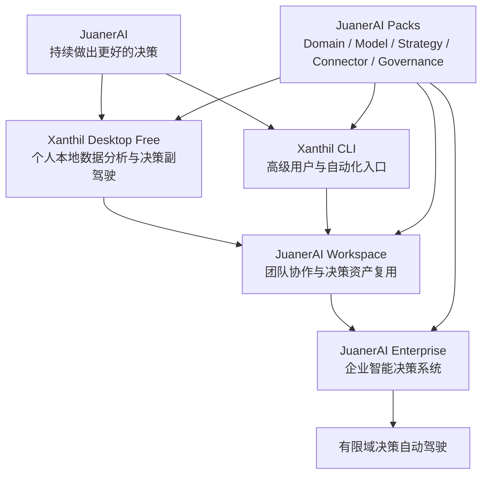
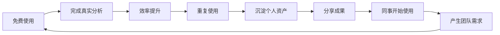
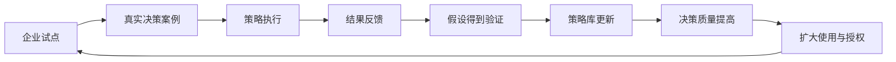

# JuanerAI 产品矩阵与 C 端到 B 端增长战略方案

> 版本：v1.0  
> 日期：2026-09-16  
> 状态：战略基线  
> 适用范围：JuanerAI、Xanthil Desktop、Xanthil CLI、JuanerAI Workspace、JuanerAI Enterprise、JuanerAI Packs

---

## 1. 执行摘要

JuanerAI 不适合在产品早期直接以“企业智能决策系统”的完整形态切入 B 端。企业级决策系统销售周期长、信任门槛高、数据接入复杂，且必须经过真实业务场景验证。更可行的路径是：

> **以免费、好用、本地优先的 Xanthil Desktop 切入专业个人用户，通过数据分析师和业务分析人员进入企业内部；再以团队协作需求为桥梁，升级到 JuanerAI Workspace；最终以企业数据治理、决策闭环、Domain Pack 和有限域自动驾驶能力完成 B 端部署。**

这不是传统消费互联网意义上的“C 端转 B 端”，而是一条典型的专业工具产品驱动增长路径：

```text
个人专业用户
→ 企业内部真实使用
→ 个人分析资产沉淀
→ 同事与团队复用
→ 团队工作区
→ 企业试点
→ JuanerAI Enterprise
→ 决策域扩张与有限域自动驾驶
```

产品矩阵的核心分工是：

- **Xanthil Desktop**：进入企业；
- **Xanthil CLI**：服务高级用户、自动化与扩展开发；
- **JuanerAI Workspace**：扎根企业并承接团队协作；
- **JuanerAI Enterprise**：成为企业智能决策基础设施；
- **JuanerAI Packs**：提供行业、模型、策略、连接器和治理能力。

整套矩阵必须共享统一的分析与决策对象，避免个人产品和企业产品最终演变成两套互不兼容的系统。

---

## 2. 战略判断

### 2.1 为什么不能直接切 B 端

直接销售完整的企业智能决策系统，需要同时解决：

- 企业数据源接入；
- 私有化部署与安全审查；
- 业务语义和 Ontology 建模；
- 权限、审计和责任边界；
- 决策建议可信度；
- 业务部门、数据部门、IT 部门和管理层的多方共识；
- 可量化的投资回报证明；
- 较长的采购、试点和验收周期。

产品早期尚无大量真实案例、行业验证和企业品牌背书，直接切入容易陷入“产品很大、项目很重、成交很慢、定制很多”的困境。

### 2.2 为什么专业个人用户是最好的入口

数据分析师、运营、商品、市场、供应链、财务等业务分析人员虽然以个人身份使用工具，但其工作天然发生在企业内部。他们具有四种关键价值：

1. **真实使用者**：每天都有取数、清洗、分析、复盘和决策支持需求；
2. **内部传播者**：分析结果会被多个业务部门和管理者看到；
3. **企业 Champion**：能够用真实效率和业务结果推动团队试点；
4. **方案共创者**：最清楚企业内部高频分析流程、数据接缝和决策痛点。

因此，Xanthil Desktop 不是独立于 JuanerAI 的免费工具，而应被定义为：

> **JuanerAI 面向个人专业用户的入口产品，也是未来企业智能决策系统在组织内部生长的种子。**

---

## 3. 总体产品定位

### 3.1 JuanerAI 总定位

> **JuanerAI 是一套帮助数据驱动决策者持续做出更好决策的智能决策系统。**

它不以“给用户更多数据”为终点，而是围绕以下闭环组织能力：

```text
目标定义
→ 问题识别
→ 假设生成
→ 证据验证
→ 决策候选
→ 人类选择或授权
→ 执行
→ 结果度量
→ 假设与策略更新
```

### 3.2 产品演进逻辑

JuanerAI 初期是决策副驾驶，长期在特定决策域内演进为有限域自动驾驶：

```text
辅助分析
→ 结构化决策建议
→ 待批执行
→ 有界自治
→ 域内自动驾驶
```

其能力提升不是依靠“模型越来越敢替人做决定”，而是依靠：

- 更多假设被真实证据验证；
- 更多策略经过执行结果检验；
- 更多决策案例被结构化沉淀；
- 系统越来越清楚自己在什么条件下可以行动；
- 企业逐步扩大授权范围。

---

## 4. JuanerAI 产品矩阵



### 4.1 Xanthil Desktop Free

#### 定位

> 面向数据分析师和业务分析人员的本地优先 AI 数据分析与决策副驾驶。

#### 战略任务

- 建立专业用户规模；
- 帮助用户完成真实工作；
- 建立持续使用习惯；
- 沉淀个人分析资产；
- 形成产品口碑；
- 进入企业内部；
- 培养未来企业 Champion。

#### 核心能力

1. 本地文件、DuckDB、SQLite 及常用数据库分析；
2. 自然语言生成和执行 SQL、Python；
3. Local Code Analysis Mode：原始数据留在本地，LLM 负责理解需求和生成代码，本地 Runtime 执行；
4. 数据清洗、探索、可视化、异常识别；
5. Analysis Plan IR；
6. 假设生成、证据支持、证伪与结论状态；
7. 决策候选生成与对比；
8. 个人假设库、策略库和决策案例库；
9. 分析模板、Skill、Package 与工作流复用；
10. 标准化报告和 Decision Case 导出；
11. 本地模型、企业模型网关和用户自有 API Key 接入；
12. 可选的深度研究和联网分析能力。

#### 必须避免

Xanthil Desktop 不能退化为：

- 仅支持聊天的文件分析器；
- SQL/Python 代码生成器；
- 智能问数外壳；
- 自动生成图表的轻量工具；
- 与 JuanerAI 企业版对象模型完全不同的孤立产品。

它必须从第一天就建立以下工作习惯：

```text
业务问题
→ 分析目标
→ Analysis IR
→ 假设
→ 证据
→ 结论
→ 决策候选
→ 验证指标
→ 决策案例
```

### 4.2 Xanthil CLI

#### 定位

> 面向高级数据分析师、数据科学家和开发者的可编程分析 Agent CLI。

#### 主要作用

- 支持脚本化和批量分析；
- 支持持续运行的分析工作流；
- 提供 Skill、Package、Model Pack 的开发和调试入口；
- 支持本地自动化、CI 和企业二次开发；
- 作为 Desktop 与 Enterprise 共用 Runtime 的技术入口；
- 服务具备代码能力的专业用户，而不承担大众获客主入口职责。

### 4.3 JuanerAI Workspace

#### 定位

> 面向分析团队与业务团队的协作式分析和决策工作空间。

Workspace 是个人免费产品与企业系统之间不可缺少的桥梁。若直接从 Desktop 跳转到 Enterprise，产品跨度、组织跨度和采购跨度都过大。

#### 核心能力

- 团队 Workspace；
- Analysis IR、分析模板和工作流共享；
- 团队假设库、策略库和决策案例库；
- 共同编辑、评论、审核和版本管理；
- 结论复核与证据审查；
- 决策候选对比、审批和任务分派；
- 执行结果和反馈记录；
- 基础角色和权限；
- Pack 的团队安装、发布和复用；
- 团队价值报告；
- 从个人 Workspace 到团队 Workspace 的可控迁移。

#### 核心价值

> 把个人分析师的方法、经验和工作流，转化为整个团队可复用、可审查、可持续积累的决策能力。

### 4.4 JuanerAI Enterprise

#### 定位

> 企业级智能决策系统，以及未来有限域决策自动驾驶的运行与治理基础设施。

#### 核心能力

1. 本地化、私有云或受控混合部署；
2. 企业数据源、数据仓库、BI、ERP、CRM、DMP 等系统连接；
3. SSO、RBAC、字段级权限、审计和合规；
4. Semantic Context Runtime；
5. Ontology 企业业务语义控制层；
6. OSM：目标、策略、度量的统一表达；
7. DAME：分析过程、证据链、模型和结论治理；
8. 企业假设库、策略库和决策案例库；
9. Model Pack 与企业模型治理；
10. Domain Pack 与行业业务 Harness；
11. A/B Test Analysis 和因果验证；
12. 决策审批、执行编排和结果回传；
13. HITL、人类接管、回滚和异常升级；
14. 决策自动化授权等级；
15. SLA、可观测性、运行治理和企业支持。

#### 企业版卖点

企业版不应以“更强的 AI 问答”作为主要付费理由，而应以以下价值为核心：

- 共享企业分析和决策资产；
- 统一业务语义；
- 连接企业数据、知识、模型和行动系统；
- 建立可验证、可审计的决策闭环；
- 把个人经验转化为组织能力；
- 让高频、低风险决策逐步实现有界自治。

### 4.5 JuanerAI Packs

Packs 是能力扩展层，也是重要的商业化载体。

| Pack 类型 | 作用 | 典型内容 |
|---|---|---|
| Domain Pack | 提供行业和业务域能力 | 零售会员、商品、库存、门店、营销、供应链 |
| Model Pack | 提供算法与模型能力 | 预测、流失、定价、推荐、优化、实验分析 |
| Strategy Pack | 提供策略模板与执行规则 | 会员召回、库存消化、活动优化、商品调拨 |
| Connector Pack | 连接企业数据和业务系统 | ERP、CRM、DMP、数据仓库、BI、营销平台 |
| Governance Pack | 提供治理与合规能力 | 权限、审计、数据分级、模型治理、风险门禁 |
| OSM Pack | 沉淀目标—策略—度量方法 | 零售经营 OSM、会员增长 OSM、库存健康 OSM |

---

## 5. 品牌架构

建议采用清晰的主品牌与产品品牌关系：

```text
JuanerAI
├── Xanthil Desktop
├── Xanthil CLI
├── JuanerAI Workspace
├── JuanerAI Enterprise
└── JuanerAI Packs
```

推荐对外表达：

- **Xanthil Desktop — by JuanerAI**；
- **Xanthil CLI — by JuanerAI**。

核心原则：

- Xanthil 是 JuanerAI 面向个人和高级专业用户的入口，不是独立于 JuanerAI 的另一个品牌方向；
- 用户使用 Xanthil 时，应逐步理解 JuanerAI“从分析到决策”的理念；
- 个人端品牌强调本地、安全、提效和专业性；
- 企业端品牌强调决策资产、治理、闭环和持续学习。

---

## 6. 目标用户与价值迁移

### 6.1 个人层

核心用户：

- 专职数据分析师；
- 业务分析师；
- 运营、商品、市场、供应链、财务等数据驱动决策者；
- 数据科学家和具备代码能力的分析人员。

核心价值：

- 更快完成真实分析；
- 减少重复取数、清洗、写 SQL 和写报告；
- 获得更完整的假设和分析路径；
- 把个人方法沉淀为可复用资产。

### 6.2 团队层

核心用户：

- 数据分析团队；
- 运营分析团队；
- 商品企划与商品运营团队；
- 会员和营销团队；
- 跨部门专项项目组。

核心价值：

- 复用优秀分析方法；
- 降低团队交付波动；
- 建立统一证据链和审核标准；
- 减少重复分析；
- 沉淀团队决策记忆。

### 6.3 企业层

核心用户与利益相关者：

| 角色 | 关注点 |
|---|---|
| 一线使用者 | 是否真正提效、是否容易使用 |
| 内部 Champion | 是否可复制到团队、能否证明价值 |
| 业务负责人 | 是否改善经营决策和执行效果 |
| 数据负责人 | 数据口径、模型、语义和分析治理 |
| IT / 安全负责人 | 部署、权限、审计、合规和运维 |
| 预算决策者 | 投入产出、风险和规模化价值 |

企业核心价值：

- 把分散在人脑、文档和聊天中的经验变为组织资产；
- 缩短从问题发现到行动执行的周期；
- 提高决策的一致性、可验证性和可追溯性；
- 通过结果反馈持续改善下一次决策。

---

## 7. 统一分析与决策对象模型

产品矩阵能否成立，关键不在于 UI 是否相似，而在于个人、团队和企业版是否共享同一套核心对象。

建议至少统一以下对象：

```text
Workspace
AnalysisProject
BusinessQuestion
Objective
AnalysisPlanIR
DataSourceRef
MetricDefinition
Hypothesis
Evidence
FalsificationTest
Finding
DecisionCandidate
Strategy
ActionPlan
Approval
Execution
Outcome
Feedback
DecisionCase
Pack
```

### 7.1 对象迁移路径

```text
Personal Workspace
→ 可选择资产
→ 脱敏与权限检查
→ Team Workspace
→ 企业治理与语义映射
→ Enterprise Workspace
```

### 7.2 统一对象模型的价值

- 个人分析资产可以迁移；
- 团队可以复用和审查；
- 企业版可以进行权限、审计和治理；
- Domain Pack、Model Pack 和 Strategy Pack 可以复用同一对象；
- 同一个决策案例能够贯穿分析、审批、执行和反馈；
- 避免未来重写个人版或重新设计企业版。

---

## 8. 从个人到企业的转化路径

### 8.1 七步增长漏斗

#### 第一步：首次真实任务

用户通过一个具体需求进入产品，例如：

- 分析 Excel；
- 清洗数据；
- 写 SQL；
- 做经营复盘；
- 分析会员或商品；
- 生成报告。

首要目标：让用户在首次使用中完成一个真实任务，而不是只体验聊天。

#### 第二步：重复使用

用户开始每周使用 Xanthil。产品应帮助其复用数据连接、分析模板、IR 和脚本。

#### 第三步：个人资产沉淀

用户开始保存：

- Analysis IR；
- 假设；
- 证据；
- 策略；
- 决策案例；
- 模板、Skill 和 Pack。

此时开始形成真正的使用粘性。

#### 第四步：协作需求出现

典型信号：

- 想把分析流程分享给同事；
- 同事希望复用同一模板；
- 需要共同审查结论；
- 需要共享假设库或策略库；
- 需要追踪执行结果；
- 需要统一数据口径。

#### 第五步：Workspace 团队试点

以团队、部门或单一业务场景切入，而不是直接部署完整企业系统。

#### 第六步：Enterprise 部署

在试点证明价值后，接入企业数据、身份、语义、权限、模型和执行系统。

#### 第七步：决策域扩张

```text
单一任务
→ 单一场景
→ 单一团队
→ 单一决策域
→ 多团队
→ 多决策域
→ 企业智能决策系统
```

### 8.2 推荐的首批企业切入场景

优先选择：

- 高频；
- 数据相对可得；
- 结果可度量；
- 风险可控；
- 执行反馈周期较短；
- 能体现“从分析到决策候选”的差异。

候选场景：

1. 会员流失分析与召回策略；
2. 商品库存健康诊断与调拨/促销候选；
3. 营销活动复盘与下一轮策略优化；
4. 门店经营诊断；
5. 商品分货与补货辅助；
6. 销售预测与异常归因。

---

## 9. 免费与付费边界

### 9.1 免费版应提供完整个人价值

建议免费提供：

- 本地单人使用；
- 本地文件和数据库分析；
- 基础 SQL、Python 和可视化；
- Local Code Analysis Mode；
- Analysis IR；
- 假设验证；
- 决策候选；
- 个人假设库、策略库和决策案例库；
- 基础 Skill、模板和 Pack；
- 用户自有模型 API；
- 基础导出能力。

免费版不能是残缺试用版。只有用户真正完成工作，才会产生口碑、习惯和企业内传播。

### 9.2 企业付费不以“更多 AI 次数”为核心

建议将付费点放在：

- 团队协作；
- 共享资产与版本管理；
- 企业数据接入；
- 私有部署；
- 身份、权限和审计；
- Ontology 和 Semantic Context Runtime；
- 企业假设库、策略库与决策案例库；
- OSM、DAME 和模型治理；
- Domain Pack 与 Model Pack；
- 自动化执行和授权治理；
- SLA、支持和定制集成。

核心原则：

> **个人为完成分析免费，企业为共享、治理、复用、执行和规模化付费。**

---

## 10. 两个增长飞轮

### 10.1 个人用户增长飞轮



### 10.2 企业决策能力飞轮



第一个飞轮负责获客和进入企业；第二个飞轮负责企业价值、续费和长期壁垒。

---

## 11. 产品核心指标

### 11.1 总体北极星指标

不建议使用“对话次数”作为核心指标。建议采用：

> **每周完成并被用户确认有效的真实分析任务数。**

可命名为：**Weekly Verified Analysis Tasks，WVAT**。

### 11.2 分阶段指标

#### Desktop

- 首次真实分析完成率；
- 首次价值实现时间；
- 周活跃分析用户；
- WVAT；
- Analysis IR 保存率；
- 假设验证完成率；
- 决策案例导出率；
- 4 周和 12 周留存；
- 本地模板、Skill 和 Pack 复用率。

#### Workspace

- 活跃团队数；
- 团队共同完成的 Decision Case 数；
- 资产复用率；
- 审核和协作完成率；
- 从个人 Workspace 迁移到团队 Workspace 的资产数；
- 团队试点转付费率。

#### Enterprise

- 已闭环决策案例数；
- 从问题发现到决策的周期；
- 从决策到执行的周期；
- 建议采纳率；
- 执行反馈回收率；
- 策略复用率；
- 决策自动化授权覆盖率；
- 可量化业务影响；
- 决策域扩张数量。

---

## 12. 产品与技术原则

### 12.1 Local-first

- 原始数据默认留在用户本机或企业环境；
- LLM 只接收完成任务所需的最小信息；
- SQL 和 Python 默认在本地 Runtime 或企业受控环境执行；
- 用户明确知道哪些信息被发送给哪个模型；
- 支持沙箱清理、缓存清理和审计记录。

### 12.2 个人资产默认私有

- 个人数据、假设、策略和决策案例默认仅本地保存；
- 上传到 Team 或 Enterprise 必须由用户主动选择；
- 迁移前支持脱敏、权限检查和内容预览；
- 不以免费产品为入口收集未经授权的企业业务数据。

### 12.3 企业数据严格隔离

- 每家企业独立存储和治理；
- 不将企业专属假设和策略直接混入公共库；
- 跨企业经验必须经过授权、脱敏和抽象；
- 公共能力演进主要来自方法论、通用组件和显式许可的数据。

### 12.4 Human-in-the-loop

- 早期默认生成决策候选，不替用户做最终决定；
- 自动化必须按决策域和风险等级逐步授权；
- 每一项自动行动都应具备边界、审计、停止和回滚机制。

### 12.5 统一核心、分层产品化

- Desktop、CLI、Workspace、Enterprise 共享 Analysis IR 和核心对象；
- 不复制多套分析引擎；
- 产品差异主要体现在协作、治理、连接、执行和运行规模；
- 业务核心与 Infrastructure Adapter 分离，为个人本地版和企业部署共用能力奠定基础。

---

## 13. 阶段路线图

### 阶段 0：统一核心模型

目标：先确保未来产品矩阵不会分裂。

交付重点：

- 统一 Workspace 和核心对象模型；
- Analysis IR 与 Decision Case 结构；
- 本地资产存储和版本机制；
- 可移植 Pack 规范；
- 本地 Runtime、模型和工具 Adapter；
- Desktop 与 CLI 共用核心能力。

### 阶段 1：Xanthil Desktop Free

目标：让个人用户完成一次真实、可信、可复用的数据分析。

首期重点：

- 文件和本地数据库分析；
- Local Code Analysis Mode；
- SQL/Python 执行；
- Analysis IR；
- 假设—证据—证伪；
- 决策候选；
- Decision Case 保存和导出；
- 个人 Workspace；
- 基础 Skill 和模板。

阶段门槛：

- 用户能够在较短时间内完成真实工作；
- 有稳定周留存；
- 用户开始保存和复用资产；
- 有真实企业内部传播案例。

### 阶段 2：JuanerAI Workspace

目标：验证个人资产能否转化为团队能力。

重点：

- 团队 Workspace；
- 分享、评论、审核、版本；
- 团队假设库和策略库；
- 决策案例协作；
- 基础角色权限；
- 团队价值报告；
- 个人资产迁移。

### 阶段 3：企业场景试点

目标：以一个场景证明从分析到决策闭环的业务价值。

重点：

- 选择一个高频、可度量场景；
- 接入有限企业数据；
- 建立业务语义和指标口径；
- 引入 Domain Pack / Model Pack；
- 建立审批、执行和反馈闭环；
- 形成 4—8 周试点模板；
- 输出可量化价值报告。

### 阶段 4：JuanerAI Enterprise

目标：扩展到企业级治理和多决策域。

重点：

- 私有化和多环境部署；
- SSO、RBAC、审计；
- Ontology、OSM、DAME；
- 企业级连接器；
- 决策执行与 HITL；
- 多 Domain Pack；
- 自动化授权等级；
- 可观测性和 SLA。

### 阶段 5：有限域自动驾驶

目标：在高频、低风险、验证充分的决策域内实现有界自治。

进入条件：

- 历史案例足够；
- 假设和策略稳定；
- 业务效果可度量；
- 风险边界明确；
- 停止、回滚和人工接管完整；
- 企业明确授权。

---

## 14. 近期执行建议

### 14.1 当前最优先的工作

1. 锁定产品矩阵与品牌关系；
2. 为 Desktop、CLI、Workspace、Enterprise 统一对象模型；
3. 收窄 Xanthil Desktop 首个真实分析闭环；
4. 建立 Decision Case 标准；
5. 为未来团队迁移预埋 Workspace 和 Pack 能力；
6. 设计本地隐私、模型调用和沙箱安全机制；
7. 建立 WVAT 等个人产品指标；
8. 选择 2—3 个未来企业试点候选场景，但暂不开发完整企业平台。

### 14.2 当前不应优先做的事情

- 一开始建设完整企业 IAM、审批、审计和多租户平台；
- 同时覆盖大量行业和业务场景；
- 先开发复杂自动执行系统，再寻找真实需求；
- 以聊天次数或模型调用量作为核心价值指标；
- 将免费版做成残缺 Demo；
- 让 Desktop 与 Enterprise 使用不同的数据模型；
- 在没有真实结果反馈前宣称全面自动驾驶。

---

## 15. 主要风险与应对

| 风险 | 表现 | 应对原则 |
|---|---|---|
| C 端和 B 端断裂 | Desktop 只是问数工具，企业版另起炉灶 | 从第一天统一对象、IR、Decision Case 和 Pack |
| 免费用户多但无转化 | 下载多、协作少、没有企业 Champion | 设计分享、团队迁移、价值报告和试点触发器 |
| 产品过于通用 | 能做很多事，但没有高频刚需 | 首期聚焦真实数据分析和少量高频业务场景 |
| 企业项目过重 | 每个客户都变成定制开发 | 用 Domain Pack、Connector Pack 和标准试点模板产品化 |
| 数据安全不可信 | 用户不敢上传企业数据 | Local-first、最小数据暴露、清晰模型调用和审计 |
| 决策建议不可验证 | 输出像通用 AI 建议 | 强制保留假设、证据、反证、风险和验证指标 |
| 自动化过早 | 未验证即执行，风险过高 | 按 L1—L5 授权等级逐步升级 |
| 个人资产无法迁移 | 用户积累无法进入团队 | 统一 Workspace、对象模型和可移植 Pack |

---

## 16. 最终战略表达

> **JuanerAI 采用“个人专业用户切入、团队协作承接、企业决策系统变现”的产品驱动增长路径。**
>
> 前期通过免费的 Xanthil Desktop 服务数据分析师和业务分析人员，帮助他们在本地、安全、高效地完成真实分析，并持续沉淀 Analysis IR、假设、证据、策略和决策案例。
>
> 当个人分析资产开始被同事和团队共享时，用户自然升级到 JuanerAI Workspace；当企业需要统一数据接入、业务语义、权限审计、模型能力和决策执行时，再升级到 JuanerAI Enterprise。
>
> 数据分析师既是首批使用者，也是 JuanerAI 进入企业的内部推动者。JuanerAI 不依靠一开始从企业外部强行销售一个宏大平台，而是通过真实使用和可验证价值，从企业内部逐步生长为智能决策系统。

核心口径：

> **Xanthil Desktop 负责进入企业，JuanerAI Workspace 负责扎根企业，JuanerAI Enterprise 负责成为企业的决策基础设施。**

长期口径：

> **JuanerAI 从决策副驾驶开始，通过每一次真实决策持续学习，最终在明确授权边界内成为企业的决策自动驾驶系统。**
